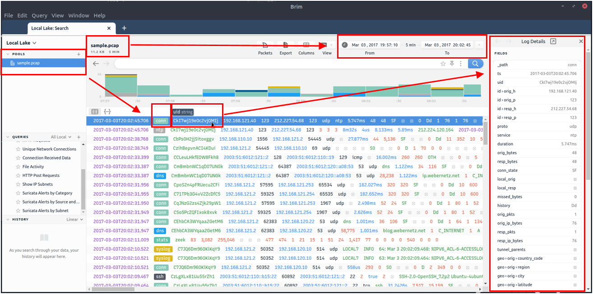
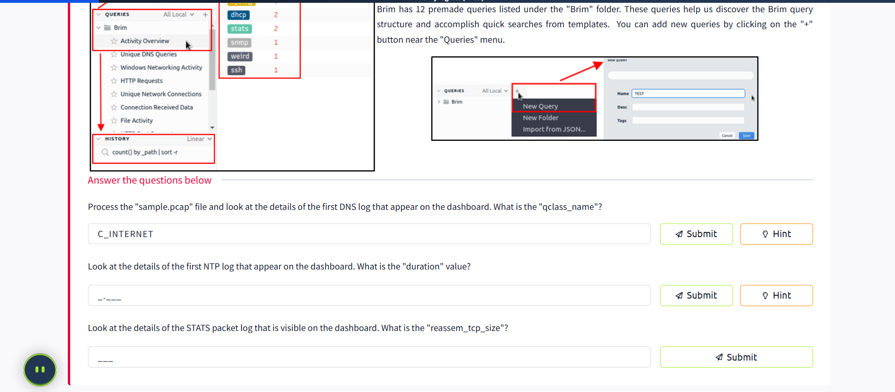
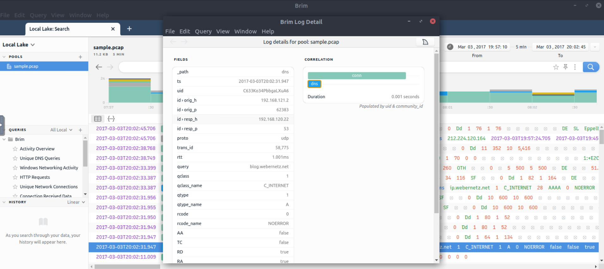
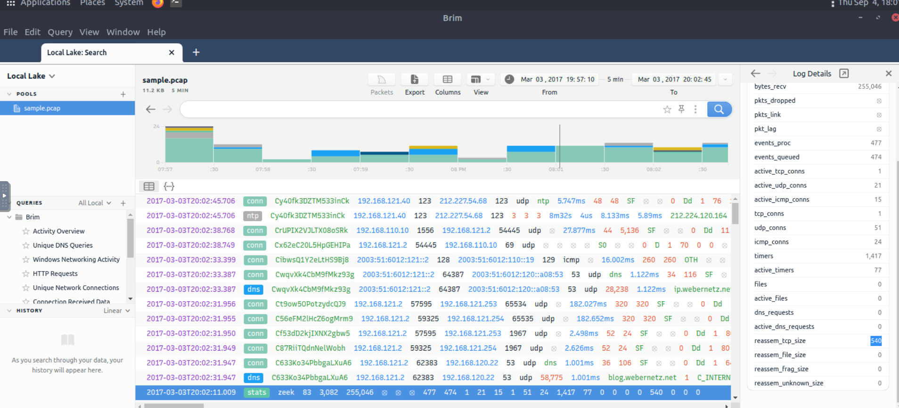
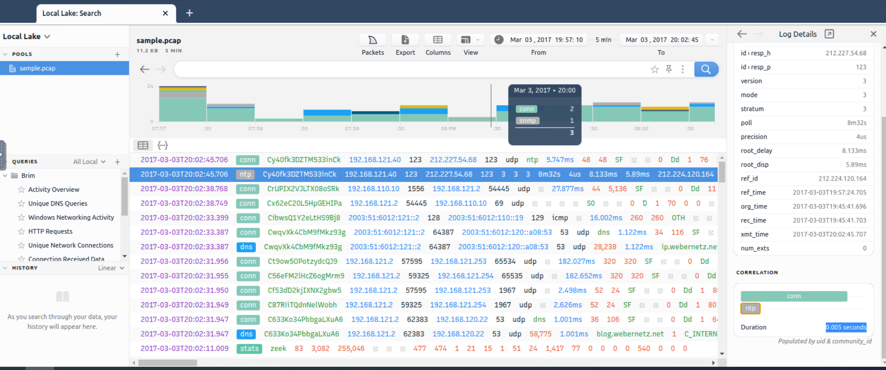
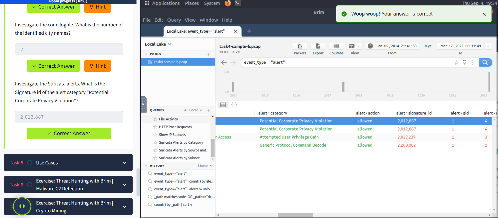

# Brim 🔍

Brim is an open-source desktop application that processes pcap files and log files, with a primary focus on providing search and analytics capabilities. In this room, I learned how to use Brim to process pcap files and investigate log files to find the needle in the haystack! This room expects familiarity with basic security concepts and processing Zeek log files. I completed the "Network Fundamentals" path and the "Zeek room" before starting this journey.

A VM was attached to this room with a "Split View" feature, and exercise files were located in the folder on the desktop. 
**⚠️ NOTE: I did not directly interact with any domains and IP addresses in this room for safety reasons.**

## What is Brim? 🤔

Brim is an open-source desktop application that processes pcap files and log files, with a primary focus on providing search and analytics. It uses the Zeek log processing format and also supports Zeek signatures and Suricata Rules for detection.

### Input Data Types 📁

Brim can handle two types of data as input:

- **Packet Capture Files**: Pcap files created with tcpdump, tshark, and Wireshark-like applications
- **Log Files**: Structured log files like Zeek logs

### Built on Open-Source Platforms 🏗️

Brim is built on several open-source platforms:

- **Zeek**: Log generating engine
- **Zed Language**: Log querying language that allows performing keyword searches with filters and pipelines
- **ZNG Data Format**: Data storage format that supports saving data streams
- **Electron and React**: Cross-platform UI

## Why Brim? 💡

Ever had to investigate a big pcap file? Pcap files bigger than one gigabyte are cumbersome for Wireshark. Processing big pcaps with tcpdump and Zeek is efficient but requires time and effort. Brim reduces the time and effort spent processing pcap files and investigating the log files by providing a simple and powerful GUI application.

## Brim vs Wireshark vs Zeek ⚖️

While each tool is powerful and useful, it's important to understand their strengths and weaknesses to choose the right tool for the best outcome. As traffic capture analyzers, they have overlapping functionalities, but each has unique value for different situations.

The common best practice is:
- **Wireshark**: Handle medium-sized pcaps
- **Zeek**: Create logs and correlate events
- **Brim**: Process multiple logs

| Feature | Brim | Wireshark | Zeek |
|---------|------|-----------|------|
| **Purpose** | Pcap processing; event/stream and log investigation | Traffic sniffing; pcap processing; packet and stream investigation | Pcap processing; event/stream and log investigation |
| **GUI** | ✔️ | ✔️ | ❌ |
| **Sniffing** | ❌ | ✔️ | ✔️ |
| **Pcap processing** | ✔️ | ✔️ | ✔️ |
| **Log processing** | ✔️ | ❌ | ✔️ |
| **Packet decoding** | ❌ | ✔️ | ✔️ |
| **Filtering** | ✔️ | ✔️ | ✔️ |
| **Scripting** | ❌ | ❌ | ✔️ |
| **Signature Support** | ✔️ | ❌ | ✔️ |
| **Statistics** | ✔️ | ✔️ | ✔️ |
| **File Extraction** | ❌ | ✔️ | ✔️ |
| **Handling pcaps over 1GB** | Medium performance | Low performance | Good performance |
| **Ease of Management** | 4/5 | 4/5 | 3/5 |

## Landing Page 🏠

Once you open the application, the landing page loads up with three main sections and a file importing window. It also provides quick info on supported file formats.

### Main Sections 📋

- **Pools**: Data resources, investigated pcap and log files
- **Queries**: List of available queries
- **History**: List of launched queries

## Pools and Log Details 📊

Pools represent the imported files. Once you load a pcap, Brim processes the file and creates Zeek logs, correlates them, and displays all available findings in a timeline.

The timeline provides information about capture start and end dates. Brim also provides information fields - you can hover over fields to get more details. This information helps in creating custom queries. The rest of the log details are shown in the right pane and provide details of the log file fields. You can always export the results using the export function located near the timeline.

## Correlation Features 🔗

You can correlate each log entry by reviewing the correlation section at the log details pane. This section provides information on:

- Source and destination addresses
- Duration
- Associated log files

This quick information helps answer the "Where to look next?" question and find the event of interest and linked evidence.

### Right-Click Menu Options 🖱️

You can right-click on each field to:

- Filter values
- Count fields
- Sort (A-Z and Z-A)
- View details
- Perform whois lookup on IP address
- View the associated packets in Wireshark

## Queries and History 📝

Queries help us correlate findings and find events of interest. History stores executed queries.

### Query Library 📚

The query library lists query names, and once you double-click, it passes the actual query to the search bar. Queries can have names, tags, and descriptions.

You can double-click on a query to execute it easily. Once executed, the actual query appears on the search bar and is listed under the history tab.

### Results Display 📈

Results are shown under the search bar. In my example, I listed all available log sources created by Brim. When I inserted a pcap file, it automatically created nine types of Zeek log files.

### Pre-made Queries 🎯

Brim has 12 premade queries listed under the "Brim" folder. These queries help discover the Brim query structure and accomplish quick searches from templates. You can add new queries by clicking on the "+" button near the "Queries" menu.

## Key Learnings 🎓

Through this room, I learned:

1. **Efficient Pcap Processing**: How Brim handles large pcap files more efficiently than Wireshark
2. **Log Correlation**: The power of correlating different log types to find security events
3. **Query Language**: How to use Brim's query system to search through logs effectively
4. **Tool Selection**: When to use Brim vs Wireshark vs Zeek for different scenarios
5. **GUI Analysis**: How a GUI can make log analysis more accessible and efficient

## Practical Applications 🛠️

Brim is particularly useful for:
- **SOC Analysts**: Quick investigation of security events
- **Incident Responders**: Correlating multiple log sources
- **Threat Hunters**: Searching through large datasets for indicators
- **Security Researchers**: Analyzing captured traffic for patterns

This tool has become an essential part of my security analysis toolkit, especially when dealing with large pcap files and multiple log sources!

## Task 3: The Basics 🎯

### Landing Page 🏠
Today I learned that Brim's landing page has three main sections and a file importing window that provides quick info on supported file formats.

**Main Sections:**
- **Pools** 📁: Data resources, investigated pcap and log files
- **Queries** 🔍: List of available queries  
- **History** 📜: List of launched queries

### Pools and Log Details 📊
I discovered that pools represent the imported files. When you load a pcap, Brim processes the file and creates Zeek logs, correlates them, and displays all available findings in a timeline.

The timeline provides information about capture start and end dates. Brim also provides information fields - you can hover over fields to get more details. The image shows hovering over Zeek's conn.log file and uid value, which helps in creating custom queries. The log details are shown in the right pane with details of log file fields. You can always export results using the export function near the timeline.

### Correlation Features 🔗
I learned that you can correlate each log entry by reviewing the correlation section at the log details pane. This section provides information on:
- Source and destination addresses 🌐
- Duration ⏱️
- Associated log files 📋

This quick information helps answer the "Where to look next?" question and find events of interest and linked evidence.

### Right-Click Menu Options 🖱️
You can right-click on each field to accomplish various tasks:
- **Filtering values** 🔍
- **Counting fields** 🔢
- **Sorting (A-Z and Z-A)** 📊
- **Viewing details** 👁️
- **Performing whois lookup on IP address** 🌍
- **Viewing associated packets in Wireshark** 📦

### Queries and History 📝
Queries help us correlate findings and find events of interest. History stores executed queries.

The image demonstrates how to browse queries and load a specific query from the library.

**Key Features I Learned:**
- Queries can have names, tags and descriptions 🏷️
- Query library lists query names
- Double-click passes the actual query to the search bar
- Once executed, queries appear on the search bar and are listed under the history tab

Results are shown under the search bar. When we insert a pcap file, it automatically creates nine types of Zeek log files.

Brim has 12 premade queries listed under the "Brim" folder. These queries help discover the Brim query structure and accomplish quick searches from templates. You can add new queries by clicking the "+" button near the "Queries" menu.

### Practice Questions & Answers ✅

**Question 1:** Process the "sample.pcap" file and look at the details of the first DNS log that appears on the dashboard. What is the "qclass_name"?
- **Answer:** `C_INTERNET` ✅

**Question 2:** Look at the details of the first NTP log that appears on the dashboard. What is the "duration" value?
- **Answer:** `0.005` ✅

**Question 3:** Look at the details of the STATS packet log that is visible on the dashboard. What is the "reassem_tcp_size"?
- **Answer:** `540` ✅

## Task 4: Default Queries 🎯

Today I explored Brim's 12 premade queries and learned how they work in practice!

### 1. Reviewing Overall Activity 📈
This query provides general information on the pcap file. The information is valuable for further investigation and creating custom queries. It's impossible to create advanced queries without knowing the available log files.

The image shows that there are 20 logs generated for the provided pcap file.

### 2. Windows Specific Networking Activity 🪟
This query focuses on Windows networking activity and details source/destination addresses, named pipe, endpoint and operation detection. It helps investigate Windows events like:
- SMB enumeration 🔍
- Logins 🔐
- Service exploiting ⚠️

### 3. Unique Network Connections and Transferred Data 🌐
These queries provide information on unique connections and connection-data correlation. They help analysts detect:
- Weird and malicious connections 🚨
- Suspicious and beaconing activities 📡

The unique list provides a clear list of unique connections that help identify anomalies. The data list summarizes data transfer rates that support anomaly investigation.

### 4. DNS and HTTP Methods 🌍
These queries provide lists of DNS queries and HTTP methods. They help analysts detect anomalous DNS and HTTP traffic. You can narrow the search by viewing "HTTP POST" requests and modifying to view "HTTP GET" methods.

### 5. File Activity 📁
This query provides a list of available files. It helps analysts detect:
- Possible data leakage attempts 💾
- Suspicious file activity 🔍

The query provides info on detected file MIME, file names and hash values (MD5, SHA1).

### 6. IP Subnet Statistics 📊
This query provides a list of available IP subnets. It helps analysts detect:
- Possible communications outside scope 🌐
- Out of ordinary IP addresses 🚨

### 7. Suricata Alerts ⚠️
These queries provide information based on Suricata rule results. Three different queries are available to view logs in different formats:
- Category-based 📋
- Source and destination-based 🎯
- Subnet based 🌐

**Note:** Suricata is an open-source threat detection engine that can act as a rule-based Intrusion Detection and Prevention System. It's developed by the Open Information Security Foundation (OISF). Suricata works similarly to Snort and can use the same signatures.

### Practice Questions & Answers ✅

**Question 1:** Investigate the files. What is the name of the detected GIF file?
- **Answer:** `cat01_with_hidden_text.gif` ✅

**Question 2:** Investigate the conn logfile. What is the number of the identified city names?
- **Answer:** `2` ✅

**Question 3:** Investigate the Suricata alerts. What is the Signature id of the alert category "Potential Corporate Privacy Violation"?
- **Answer:** `2,012,887` ✅

## Task 5: Advanced Analysis Techniques 🔬

### Key Learnings from Today's Session 🎓

Through today's exploration of Brim, I learned:

**Technical Skills:**
- **Pcap Processing** 📁: How Brim efficiently handles large network capture files
- **Log Analysis** 📊: Systematic approach to analyzing Zeek logs
- **Query Development** 💻: Understanding Brim's query structure and templates
- **Tool Integration** 🛠️: How Brim works with other security tools

**Analytical Skills:**
- **Pattern Recognition** 🔍: Identifying anomalies in network traffic
- **Correlation Analysis** 🔗: Connecting events across multiple log sources
- **Timeline Reconstruction** ⏰: Understanding the sequence of security events
- **Threat Hunting** 🎯: Proactive searching for security indicators

**Practical Applications:**
- **Incident Response** 🚨: Quick analysis of security incidents
- **Threat Hunting** 🔍: Proactive searching for malicious activity
- **Forensic Analysis** 🔬: Detailed investigation of network events
- **Security Monitoring** 📡: Continuous analysis of network traffic

### Best Practices I Discovered 📋

1. **Start with Overview Queries** 🎯: Always begin with "Reviewing Overall Activity"
2. **Use Correlation Features** 🔗: Leverage the correlation section in log details
3. **Export and Document** 📄: Export interesting findings for further analysis
4. **Combine with Other Tools** 🛠️: Use Wireshark for packet-level analysis

Brim has become an essential tool in my security analysis toolkit! 🚀
