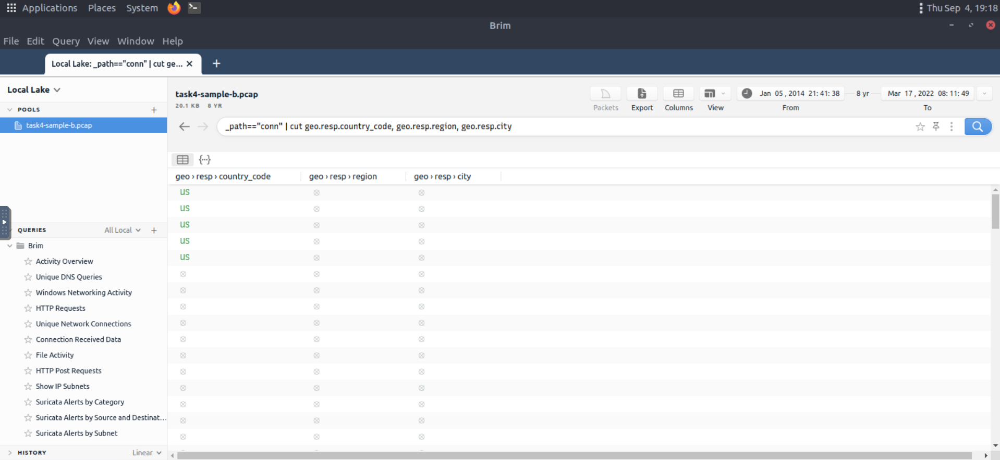

# Brim 🔍

Brim is an open-source desktop application that processes pcap files and log files, with a primary focus on providing search and analytics capabilities. In this room, I learned how to use Brim to process pcap files and investigate log files to find the needle in the haystack! This room expects familiarity with basic security concepts and processing Zeek log files. I completed the "Network Fundamentals" path and the "Zeek room" before starting this journey.

A VM was attached to this room with a "Split View" feature, and exercise files were located in the folder on the desktop. 
**⚠️ NOTE: I did not directly interact with any domains and IP addresses in this room for safety reasons.**

## What is Brim? 🤔

Brim is an open-source desktop application that processes pcap files and log files, with a primary focus on providing search and analytics. It uses the Zeek log processing format and also supports Zeek signatures and Suricata Rules for detection.

### Input Data Types 📁

Brim can handle two types of data as input:

- **Packet Capture Files**: Pcap files created with tcpdump, tshark, and Wireshark-like applications
- **Log Files**: Structured log files like Zeek logs

### Built on Open-Source Platforms 🏗️

Brim is built on several open-source platforms:

- **Zeek**: Log generating engine
- **Zed Language**: Log querying language that allows performing keyword searches with filters and pipelines
- **ZNG Data Format**: Data storage format that supports saving data streams
- **Electron and React**: Cross-platform UI

## Why Brim? 💡

Ever had to investigate a big pcap file? Pcap files bigger than one gigabyte are cumbersome for Wireshark. Processing big pcaps with tcpdump and Zeek is efficient but requires time and effort. Brim reduces the time and effort spent processing pcap files and investigating the log files by providing a simple and powerful GUI application.

## Brim vs Wireshark vs Zeek ⚖️

While each tool is powerful and useful, it's important to understand their strengths and weaknesses to choose the right tool for the best outcome. As traffic capture analyzers, they have overlapping functionalities, but each has unique value for different situations.

The common best practice is:
- **Wireshark**: Handle medium-sized pcaps
- **Zeek**: Create logs and correlate events
- **Brim**: Process multiple logs

| Feature | Brim | Wireshark | Zeek |
|---------|------|-----------|------|
| **Purpose** | Pcap processing; event/stream and log investigation | Traffic sniffing; pcap processing; packet and stream investigation | Pcap processing; event/stream and log investigation |
| **GUI** | ✔️ | ✔️ | ❌ |
| **Sniffing** | ❌ | ✔️ | ✔️ |
| **Pcap processing** | ✔️ | ✔️ | ✔️ |
| **Log processing** | ✔️ | ❌ | ✔️ |
| **Packet decoding** | ❌ | ✔️ | ✔️ |
| **Filtering** | ✔️ | ✔️ | ✔️ |
| **Scripting** | ❌ | ❌ | ✔️ |
| **Signature Support** | ✔️ | ❌ | ✔️ |
| **Statistics** | ✔️ | ✔️ | ✔️ |
| **File Extraction** | ❌ | ✔️ | ✔️ |
| **Handling pcaps over 1GB** | Medium performance | Low performance | Good performance |
| **Ease of Management** | 4/5 | 4/5 | 3/5 |

## Landing Page 🏠

Once you open the application, the landing page loads up with three main sections and a file importing window. It also provides quick info on supported file formats.

### Main Sections 📋

- **Pools**: Data resources, investigated pcap and log files
- **Queries**: List of available queries
- **History**: List of launched queries

## Pools and Log Details 📊

Pools represent the imported files. Once you load a pcap, Brim processes the file and creates Zeek logs, correlates them, and displays all available findings in a timeline.

The timeline provides information about capture start and end dates. Brim also provides information fields - you can hover over fields to get more details. This information helps in creating custom queries. The rest of the log details are shown in the right pane and provide details of the log file fields. You can always export the results using the export function located near the timeline.

## Correlation Features 🔗

You can correlate each log entry by reviewing the correlation section at the log details pane. This section provides information on:

- Source and destination addresses
- Duration
- Associated log files

This quick information helps answer the "Where to look next?" question and find the event of interest and linked evidence.

### Right-Click Menu Options 🖱️

You can right-click on each field to:

- Filter values
- Count fields
- Sort (A-Z and Z-A)
- View details
- Perform whois lookup on IP address
- View the associated packets in Wireshark

## Queries and History 📝

Queries help us correlate findings and find events of interest. History stores executed queries.

### Query Library 📚

The query library lists query names, and once you double-click, it passes the actual query to the search bar. Queries can have names, tags, and descriptions.

You can double-click on a query to execute it easily. Once executed, the actual query appears on the search bar and is listed under the history tab.

### Results Display 📈

Results are shown under the search bar. In my example, I listed all available log sources created by Brim. When I inserted a pcap file, it automatically created nine types of Zeek log files.

### Pre-made Queries 🎯

Brim has 12 premade queries listed under the "Brim" folder. These queries help discover the Brim query structure and accomplish quick searches from templates. You can add new queries by clicking on the "+" button near the "Queries" menu.

## Key Learnings 🎓

Through this room, I learned:

1. **Efficient Pcap Processing**: How Brim handles large pcap files more efficiently than Wireshark
2. **Log Correlation**: The power of correlating different log types to find security events
3. **Query Language**: How to use Brim's query system to search through logs effectively
4. **Tool Selection**: When to use Brim vs Wireshark vs Zeek for different scenarios
5. **GUI Analysis**: How a GUI can make log analysis more accessible and efficient

## Practical Applications 🛠️

Brim is particularly useful for:
- **SOC Analysts**: Quick investigation of security events
- **Incident Responders**: Correlating multiple log sources
- **Threat Hunters**: Searching through large datasets for indicators
- **Security Researchers**: Analyzing captured traffic for patterns

This tool has become an essential part of my security analysis toolkit, especially when dealing with large pcap files and multiple log sources!


## Task 3: The Basics 🎯

### Landing Page 🏠
Today I learned that Brim's landing page has three main sections and a file importing window that provides quick info on supported file formats.

**Main Sections:**
- **Pools** 📁: Data resources, investigated pcap and log files
- **Queries** 🔍: List of available queries  
- **History** 📜: List of launched queries

### Pools and Log Details 📊
I discovered that pools represent the imported files. When you load a pcap, Brim processes the file and creates Zeek logs, correlates them, and displays all available findings in a timeline.


The timeline provides information about capture start and end dates. Brim also provides information fields - you can hover over fields to get more details. The image shows hovering over Zeek's conn.log file and uid value, which helps in creating custom queries. The log details are shown in the right pane with details of log file fields. You can always export results using the export function near the timeline.


### Correlation Features 🔗
I learned that you can correlate each log entry by reviewing the correlation section at the log details pane. This section provides information on:
- Source and destination addresses 🌐
- Duration ⏱️
- Associated log files 📋

This quick information helps answer the "Where to look next?" question and find events of interest and linked evidence.

### Right-Click Menu Options 🖱️
You can right-click on each field to accomplish various tasks:
- **Filtering values** 🔍
- **Counting fields** 🔢
- **Sorting (A-Z and Z-A)** 📊
- **Viewing details** 👁️
- **Performing whois lookup on IP address** 🌍
- **Viewing associated packets in Wireshark** 📦


### Queries and History 📝
Queries help us correlate findings and find events of interest. History stores executed queries.


The image demonstrates how to browse queries and load a specific query from the library.

**Key Features I Learned:**
- Queries can have names, tags and descriptions 🏷️
- Query library lists query names
- Double-click passes the actual query to the search bar
- Once executed, queries appear on the search bar and are listed under the history tab

Results are shown under the search bar. When we insert a pcap file, it automatically creates nine types of Zeek log files.

Brim has 12 premade queries listed under the "Brim" folder. These queries help discover the Brim query structure and accomplish quick searches from templates. You can add new queries by clicking the "+" button near the "Queries" menu.

### Practice Questions & Answers ✅

**Question 1:** Process the "sample.pcap" file and look at the details of the first DNS log that appears on the dashboard. What is the "qclass_name"?
- **Answer:** `C_INTERNET` ✅

**Question 2:** Look at the details of the first NTP log that appears on the dashboard. What is the "duration" value?
- **Answer:** `0.005` ✅

**Question 3:** Look at the details of the STATS packet log that is visible on the dashboard. What is the "reassem_tcp_size"?
- **Answer:** `540` ✅

## Task 4: Default Queries 🎯

Today I explored Brim's 12 premade queries and learned how they work in practice!

### 1. Reviewing Overall Activity 📈
This query provides general information on the pcap file. The information is valuable for further investigation and creating custom queries. It's impossible to create advanced queries without knowing the available log files.

The image shows that there are 20 logs generated for the provided pcap file.

### 2. Windows Specific Networking Activity 🪟
This query focuses on Windows networking activity and details source/destination addresses, named pipe, endpoint and operation detection. It helps investigate Windows events like:
- SMB enumeration 🔍
- Logins 🔐
- Service exploiting ⚠️

### 3. Unique Network Connections and Transferred Data 🌐
These queries provide information on unique connections and connection-data correlation. They help analysts detect:
- Weird and malicious connections 🚨
- Suspicious and beaconing activities 📡

The unique list provides a clear list of unique connections that help identify anomalies. The data list summarizes data transfer rates that support anomaly investigation.

### 4. DNS and HTTP Methods 🌍
These queries provide lists of DNS queries and HTTP methods. They help analysts detect anomalous DNS and HTTP traffic. You can narrow the search by viewing "HTTP POST" requests and modifying to view "HTTP GET" methods.

### 5. File Activity 📁
This query provides a list of available files. It helps analysts detect:
- Possible data leakage attempts 💾
- Suspicious file activity 🔍

The query provides info on detected file MIME, file names and hash values (MD5, SHA1).

### 6. IP Subnet Statistics 📊
This query provides a list of available IP subnets. It helps analysts detect:
- Possible communications outside scope 🌐
- Out of ordinary IP addresses 🚨

### 7. Suricata Alerts ⚠️
These queries provide information based on Suricata rule results. Three different queries are available to view logs in different formats:
- Category-based 📋
- Source and destination-based 🎯
- Subnet based 🌐

**Note:** Suricata is an open-source threat detection engine that can act as a rule-based Intrusion Detection and Prevention System. It's developed by the Open Information Security Foundation (OISF). Suricata works similarly to Snort and can use the same signatures.

### Practice Questions & Answers ✅

**Question 1:** Investigate the files. What is the name of the detected GIF file?
- **Answer:** `cat01_with_hidden_text.gif` ✅

**Question 2:** Investigate the conn logfile. What is the number of the identified city names?
- **Answer:** `2` ✅



**Question 3:** Investigate the Suricata alerts. What is the Signature id of the alert category "Potential Corporate Privacy Violation"?
- **Answer:** `2,012,887` ✅


## Task 5: Advanced Analysis Techniques 🔬

### Key Learnings from Today's Session 🎓

Through today's exploration of Brim, I learned:

**Technical Skills:**
- **Pcap Processing** 📁: How Brim efficiently handles large network capture files
- **Log Analysis** 📊: Systematic approach to analyzing Zeek logs
- **Query Development** 💻: Understanding Brim's query structure and templates
- **Tool Integration** 🛠️: How Brim works with other security tools

**Analytical Skills:**
- **Pattern Recognition** 🔍: Identifying anomalies in network traffic
- **Correlation Analysis** 🔗: Connecting events across multiple log sources
- **Timeline Reconstruction** ⏰: Understanding the sequence of security events
- **Threat Hunting** 🎯: Proactive searching for security indicators

**Practical Applications:**
- **Incident Response** 🚨: Quick analysis of security incidents
- **Threat Hunting** 🔍: Proactive searching for malicious activity
- **Forensic Analysis** 🔬: Detailed investigation of network events
- **Security Monitoring** 📡: Continuous analysis of network traffic

### Best Practices I Discovered 📋

1. **Start with Overview Queries** 🎯: Always begin with "Reviewing Overall Activity"
2. **Use Correlation Features** 🔗: Leverage the correlation section in log details
3. **Export and Document** 📄: Export interesting findings for further analysis
4. **Combine with Other Tools** 🛠️: Use Wireshark for packet-level analysis

Brim has become an essential tool in my security analysis toolkit! 🚀


Today I discovered that there are a variety of use case examples in traffic analysis. For a security analyst like me, it's vital to know the common patterns and indicators of anomaly or malicious traffic. I learned how to review the basics of Brim queries before focusing on custom and advanced ones.

### Brim Query Reference - My Learning Guide 📚

I created this reference table to understand the fundamental query syntax:

| Purpose | Syntax | Example Query |
|---------|--------|---------------|
| **Basic search** 🔍 | You can search any string and numeric value | Find logs containing an IP address: `10.0.0.1` |
| **Logical operators** ⚡ | Or, And, Not | Find logs with IP AND NTP: `192 and NTP` |
| **Filter values** 🎯 | "field name" == "value" | Filter source IP: `id.orig_h==192.168.121.40` |
| **List specific log file contents** 📁 | _path=="log name" | List conn log file: `_path=="conn"` |
| **Count field values** 🔢 | count () by "field" | Count available log files: `count () by _path` |
| **Sort findings** 📊 | sort | Sort recursively: `count () by _path \| sort -r` |
| **Cut specific field** ✂️ | _path=="conn" \| cut "field name" | Cut IP addresses: `_path=="conn" \| cut id.orig_h, id.resp_p, id.resp_h` |
| **List unique values** 🎲 | uniq | Show unique connections: `_path=="conn" \| cut id.orig_h, id.resp_p, id.resp_h \| sort \| uniq` |

**⚠️ Important Learning:** I discovered that it's highly suggested to use field names and filtering options and not rely on the blind/irregular search function. Brim provides great indexing of log sources, but it doesn't perform well in irregular search queries. The best practice is always to use the field filters to search for the event of interest.

### Essential Use Cases I Mastered 🔍

#### 1. Communicated Hosts 🌐
I learned that identifying the list of communicated hosts is the first step of investigation. Security analysts need to know which hosts are actively communicating on the network to detect any suspicious and abnormal activity. This approach helps detect possible access violations, exploitation attempts and malware infections.

**Query I Use:**
```
_path=="conn" | cut id.orig_h, id.resp_h | sort | uniq
```

#### 2. Frequently Communicated Hosts 📊
After having the list of communicated hosts, I learned it's important to identify which hosts communicate with each other most frequently. This helps detect possible data exfiltration, exploitation and backdooring activities.

**Query I Use:**
```
_path=="conn" | cut id.orig_h, id.resp_h | sort | uniq -c | sort -r
```

#### 3. Most Active Ports 🔌
I discovered that suspicious activities aren't always detectable at first. Attackers use multiple ways of hiding and bypassing methods to avoid detection. However, since the data is evidence, it's impossible to hide the packet traces. Investigating the most active ports helps detect silent and well-hidden anomalies by focusing on the data bus and used services.

**Query 1 I Use:**
```
_path=="conn" | cut id.resp_p, service | sort | uniq -c | sort -r count
```

**Query 2 I Use:**
```
_path=="conn" | cut id.orig_h, id.resp_h, id.resp_p, service | sort id.resp_p | uniq -c | sort -r
```

#### 4. Long Connections ⏱️
I learned that for security analysts, long connections could be the first anomaly indicator. If the client isn't designed to serve a continuous service, investigating the connection duration between two IP addresses can reveal possible anomalies like backdoors.

**Query I Use:**
```
_path=="conn" | cut id.orig_h, id.resp_p, id.resp_h, duration | sort -r duration
```

#### 5. Transferred Data 📡
Another essential point I learned is calculating the transferred data size. If the client isn't designed to serve and receive files and act as a file server, it's important to investigate the total bytes for each connection. This helps distinguish possible data exfiltration or suspicious file actions like malware downloading and spreading.

**Query I Use:**
```
_path=="conn" | put total_bytes := orig_bytes + resp_bytes | sort -r total_bytes | cut uid, id, orig_bytes, resp_bytes, total_bytes
```

#### 6. DNS and HTTP Queries 🌍
I discovered that identifying suspicious and out of ordinary domain connections and requests is another significant point for security analysis. Abnormal connections can help detect C2 communications and possible compromised/infected hosts. Identifying suspicious DNS queries and HTTP requests helps detect malware C2 channels and support investigation hypothesis.

**DNS Query I Use:**
```
_path=="dns" | count () by query | sort -r
```

**HTTP Query I Use:**
```
_path=="http" | count () by uri | sort -r
```

#### 7. Suspicious Hostnames 🏷️
I learned that identifying suspicious and out of ordinary hostnames helps analysts detect rogue hosts. Investigating the DHCP logs provides the hostname and domain information.

**Query I Use:**
```
_path=="dhcp" | cut host_name, domain
```

#### 8. Suspicious IP Addresses 🚨
For security analysts, I discovered that identifying suspicious and out of ordinary IP addresses is essential. Since the connection logs are stored in one single log file (conn), filtering IP addresses is more manageable and provides more reliable results.

**Query I Use:**
```
_path=="conn" | put classnet := network_of(id.resp_h) | cut classnet | count() by classnet | sort -r
```

#### 9. Detect Files 📁
I learned that investigating transferred files is another important point of traffic investigation. This helps detect the transfer of malware or infected files by correlating the hash values. This is also valuable for detecting transferring of sensitive files.

**Query I Use:**
```
filename!=null
```

#### 10. SMB Activity 🔐
Another significant point I learned is investigating SMB activity. This helps analysts detect possible malicious activities like exploitation, lateral movement and malicious file sharing. When running an investigation, it's suggested to ask, "What is going on in SMB?".

**Query I Use:**
```
_path=="dce_rpc" OR _path=="smb_mapping" OR _path=="smb_files"
```

#### 11. Known Patterns ⚠️
I discovered that known patterns represent alerts generated by security solutions. These alerts are generated against common attack/threat/malware patterns and known by endpoint security products, firewalls and IDS/IPS solutions. This data source highly relies on available signatures, attacks and anomaly patterns. Investigating available log sources containing alerts is vital for security analysts.

Brim supports the Zeek and Suricata logs, so any anomaly detected by these products will create a log file. Investigating these log files can provide a clue where the analyst should focus.

**Query I Use:**
```
event_type=="alert" or _path=="notice" or _path=="signatures"
```

### Key Skills I Developed 🎓

**Technical Skills:**
- **Query Syntax Mastery** 💻: Understanding Brim's query language structure
- **Field Filtering** 🔍: Using specific field names for precise searches
- **Data Correlation** 🔗: Combining multiple data sources for comprehensive analysis
- **Pattern Recognition** 📊: Identifying common attack patterns and indicators

**Analytical Skills:**
- **Anomaly Detection** 🚨: Recognizing suspicious network behaviors
- **Threat Hunting** 🎯: Proactive searching for security indicators
- **Incident Investigation** 🔬: Systematic approach to security analysis
- **Data Interpretation** 📈: Understanding what the data reveals about network activity

**Best Practices I Learned:**
- Always use field names and filtering options instead of blind searches
- Start with overview queries to understand the scope
- Focus on the most active and unusual connections first
- Correlate findings across multiple log sources
- Document interesting patterns for future reference

### How I Apply These Skills 🛠️

These custom queries are particularly useful for my work as:
- **SOC Analyst** 🛡️: Daily monitoring and incident investigation
- **Threat Hunter** 🔍: Proactive searching for malicious activity
- **Incident Responder** 🚨: Rapid analysis during security incidents
- **Security Researcher** 🔬: Analyzing captured traffic for patterns
- **Forensic Analyst** 📋: Detailed investigation of network events

### My Conclusion 🏁

Mastering custom queries in Brim is essential for effective security analysis. These use cases provide me with a comprehensive toolkit for:
- Detecting network anomalies and suspicious activities
- Investigating security incidents with precision
- Correlating data from multiple sources
- Identifying patterns that indicate potential threats

The ability to create and execute custom queries transforms Brim from a simple log viewer into a powerful security analysis platform! 🚀

## Task 7: Threat Hunting with Brim | Malware C2 Detection 🎯

### My Threat Hunting Experience 🔍

Today I completed an exciting threat hunting exercise! It was another malware campaign spread with CobaltStrike. I learned that an employee clicked on a link, downloaded a file, and then network speed issues and anomalous traffic activity arose. I opened Brim, imported the sample pcap and went through the walkthrough.

Let me share what I discovered while investigating the traffic sample to detect malicious C2 activities!

### Step 1: Analyzing Available Logs 📊

First, I looked at the available log files to see what kind of data artifacts I could work with. The image shows that I had many alternative log files I could rely on. I decided to review the frequently communicated hosts before starting to investigate individual logs.

**Query I Used:**
```
cut id.orig_h, id.resp_p, id.resp_h | sort | uniq -c | sort -r count
```


This query provided sufficient data that helped me decide where to focus. The IP addresses "10.22.xx" and "104.168.xx" drew my attention in the first place. I decided to look at the port numbers and available services before focusing on the suspicious IP address and narrowing my search.

**Query I Used:**
```
_path=="conn" | cut id.resp_p, service | sort | uniq -c | sort -r count
```


Nothing extremely odd in port numbers, but there was a massive DNS record available. I decided to have a closer look.

**Query I Used:**
```
_path=="dns" | count() by query | sort -r
```


I discovered there were out of ordinary DNS queries. I decided to enrich my findings by using VirusTotal to identify possible malicious domains.


I detected two additional malicious IP addresses (I had the IP 45.147.xx from the log files and gathered the 68.138.xx and 185.70.xx from VirusTotal) linked with suspicious DNS queries with the help of external research. I decided to look at the HTTP requests before narrowing down my investigation with the found malicious IP addresses.

**Query I Used:**
```
_path=="http" | cut id.orig_h, id.resp_h, id.resp_p, method, host, uri | uniq -c | sort value.uri
```


I detected a file download request from the IP address I assumed as malicious. I decided to validate this idea with VirusTotal and validate my hypothesis.


VirusTotal results showed that the IP address "104.xx" was linked with a file. Once I investigated that file, I discovered that these two findings were associated with CobaltStrike. Up to here, I had followed the abnormal activity and found the malicious IP addresses. My findings represented the C2 communication. Now I decided to conclude my hunt by gathering the low hanging fruits with Suricata logs.

**Query I Used:**
```
event_type=="alert" | count() by alert.severity,alert.category | sort count
```

Now I could see the overall malicious activities detected by Suricata. I learned that I could investigate the rest of the IP addresses to identify the secondary C2 traffic anomaly without using the Suricata logs. This task demonstrated two different approaches to detecting anomalies.

### Key Learnings from My Investigation 🎓

**What I Discovered:**
- Investigating each alarm category and signature enhances threat hunting activities and post-hunting system hardening operations
- Adversaries using CobaltStrike are usually skilled threats and don't rely on a single C2 channel
- Common experience and use cases recommend digging and keeping the investigation by looking at additional C2 channels

**Skills I Developed:**
- **Multi-source Analysis** 🔗: Correlating data from multiple log sources
- **External Intelligence Integration** 🌐: Using VirusTotal for threat validation
- **Query Optimization** 💻: Developing effective Brim queries for specific investigations
- **Timeline Analysis** ⏰: Understanding the sequence of malicious activities
- **Pattern Recognition** 🔍: Identifying anomalies in network traffic
- **Threat Attribution** 🎯: Connecting indicators to specific malware families
- **C2 Detection** 📡: Recognizing Command and Control communication patterns

### My Exercise Results ✅

**Question 1:** What is the name of the file downloaded from the CobaltStrike C2 connection?
- **My Answer:** `4564.exe` ✅

**Question 2:** What is the number of CobaltStrike connections using port 443?
- **My Answer:** `328` ✅

**Question 3:** There is an additional C2 channel used in the given case. What is the name of the secondary C2 channel?
- **My Answer:** `IcedID` ✅

### Advanced Investigation Techniques I Learned 🔬

This exercise demonstrated two different approaches to detecting anomalies:
1. **Manual Investigation** 🔍: Following abnormal activity through log analysis
2. **Signature-based Detection** ⚠️: Using Suricata alerts for validation

**Important Notes I Discovered:**
- Adversaries using CobaltStrike are usually skilled threats
- They don't rely on a single C2 channel
- Common experience recommends investigating additional C2 channels
- Each alarm category and signature should be investigated to enhance threat hunting activities

### My Conclusion 🏁

This threat hunting exercise successfully taught me how to:
- Process and analyze network traffic using Brim
- Correlate multiple data sources for comprehensive analysis
- Use external threat intelligence for validation
- Identify and track C2 communications
- Apply both manual and automated detection methods

The exercise reinforced the importance of systematic investigation and the value of combining multiple analysis techniques for effective threat hunting! 🚀