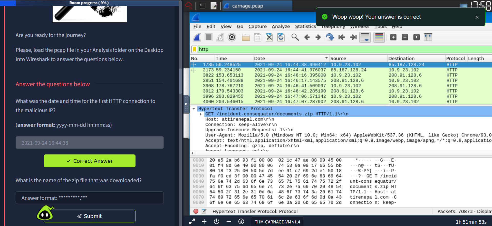

# Carnage Exercise — Malicious Network Traffic Analysis 🕵️‍♂️

---

## Scenario 🧩

Eric Fischer from the Purchasing Department at Bartell Ltd received an email from a known contact with a Word document attachment. Upon opening the document, he accidentally clicked on **"Enable Content"**. The SOC Department immediately received an alert from the endpoint agent that Eric's workstation was making suspicious outbound connections. The pcap was retrieved from the network sensor and handed to you for analysis.

**Task:** Investigate the packet capture and uncover the malicious activities.  

*Credit goes to Brad Duncan for capturing the traffic and sharing the pcap packet capture with the InfoSec community.*

---

## Questions & Answers 📌

**Q1: What was the date and time for the first HTTP connection to the malicious IP?**  
✅ **Answer:** `2021-09-24 16:44:38`  

**Q2: What is the name of the zip file that was downloaded?**  
✅ **Answer:** `documents.zip`  

**Q3: What was the domain hosting the malicious zip file?**  
✅ **Answer:** `attirenepal.com`  

**Q4: Without downloading the file, what is the name of the file in the zip file?**  
✅ **Answer:** `chart-1530076591.xls`  

**Q5: What is the name of the webserver of the malicious IP from which the zip file was downloaded?**  
✅ **Answer:** `LiteSpeed`  

**Q6: What is the version of the webserver from the previous question?**  
✅ **Answer:** `PHP/7.2.34`  

**Q7: Malicious files were downloaded to the victim host from multiple domains. What were the three domains involved with this activity?**  
✅ **Answer:** `finejewels.com.au, thietbiagt.com, new.americold.com`  

**Hint:** Which certificate authority issued the SSL certificate to the first domain from the previous question?  
✅ **Answer:** `GoDaddy`  

**Q8: What are the two IP addresses of the Cobalt Strike servers? Use VirusTotal (Community tab) to confirm if IPs are identified as Cobalt Strike C2 servers.**  
✅ **Answer:** `185.106.96.158, 185.125.204.174`  

**Q9: What is the Host header for the first Cobalt Strike IP address from the previous question?**  
✅ **Answer:** `ocsp.verisign.com`  

**Q10: What is the domain name for the first IP address of the Cobalt Strike server? You may use VirusTotal to confirm if it's the Cobalt Strike server (Community tab).**  
✅ **Answer:** `survmeter.live`  

**Q11: What is the domain name of the second Cobalt Strike server IP?**  
✅ **Answer:** `securitybusinpuff.com`  
  

**Q12: What is the domain name of the post-infection traffic?**  
✅ **Answer:** `maldivehost.net`  
  

**Q13: What are the first eleven characters that the victim host sends out to the malicious domain involved in the post-infection traffic?**  
✅ **Answer:** `zLIisQRWZI9`  
  

**Q14: What was the length for the first packet sent out to the C2 server?**  
✅ **Answer:** `281`  
  

**Q15: What was the Server header for the malicious domain from the previous question?**  
✅ **Answer:** `Apache/2.4.49 (cPanel) OpenSSL/1.1.1l mod_bwlimited/1.4`  
  

**Q16: The malware used an API to check for the IP address of the victim’s machine. What was the date and time when the DNS query for the IP check domain occurred? (format: yyyy-mm-dd hh:mm:ss UTC)**  
✅ **Answer:** `2021-09-24 17:00:04`  
  

**Q17: What was the domain in the DNS query from the previous question?**  
✅ **Answer:** `api.ipify.org`  
  

**Q18: Looks like there was some malicious spam (malspam) activity going on. What was the first MAIL FROM address observed in the traffic?**  
✅ **Answer:** `farshin@mailfa.com`  
  

**Q19: How many packets were observed for the SMTP traffic?**  
✅ **Answer:** `1439`  

💡 **Lessons Learned from Post-Infection Analysis:**

- Monitoring **C2 domains** helps track malware post-infection behavior.  
- Observing **packet headers** (like Server headers) can reveal the technology stack of the malicious servers.  
- DNS queries for external IPs (via API) indicate malware attempting to detect network environment.  
- SMTP traffic analysis can uncover malspam campaigns and infrastructure.  
- Characterizing the **first bytes** sent to C2 servers can help create network signatures for detection.  
