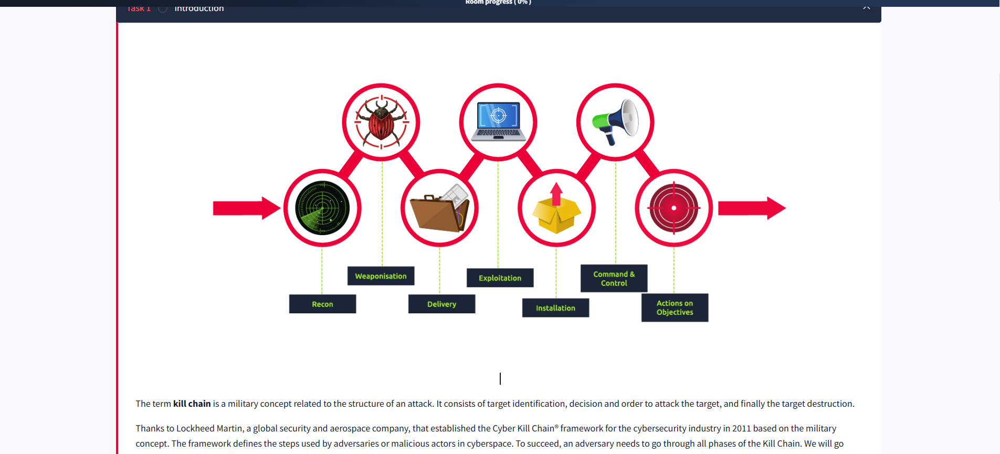
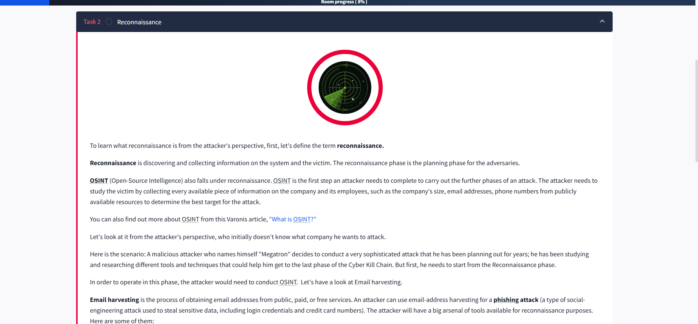
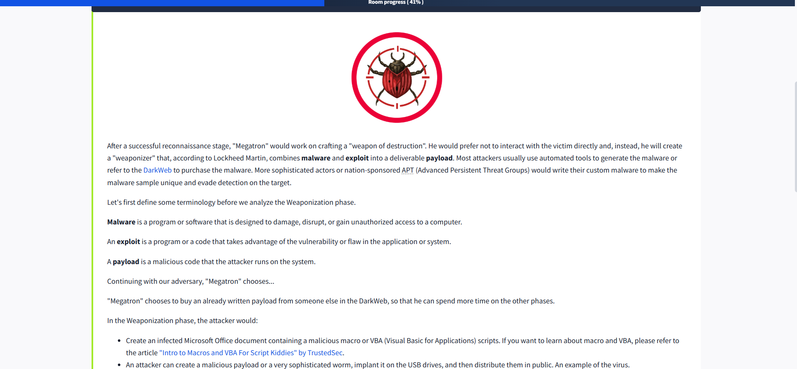
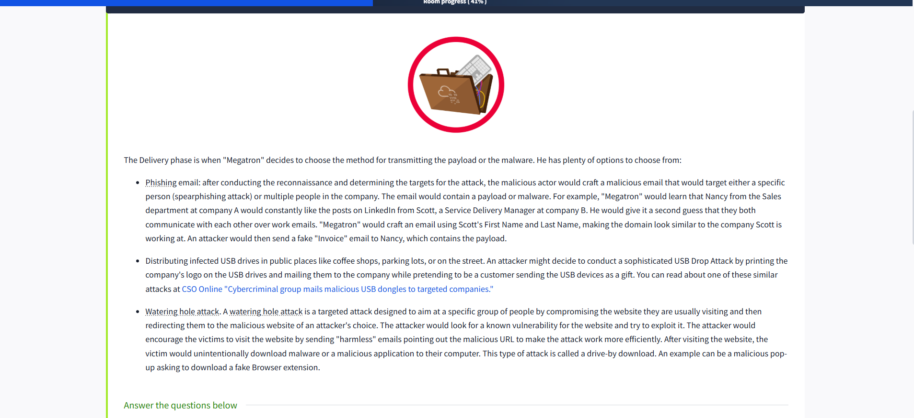
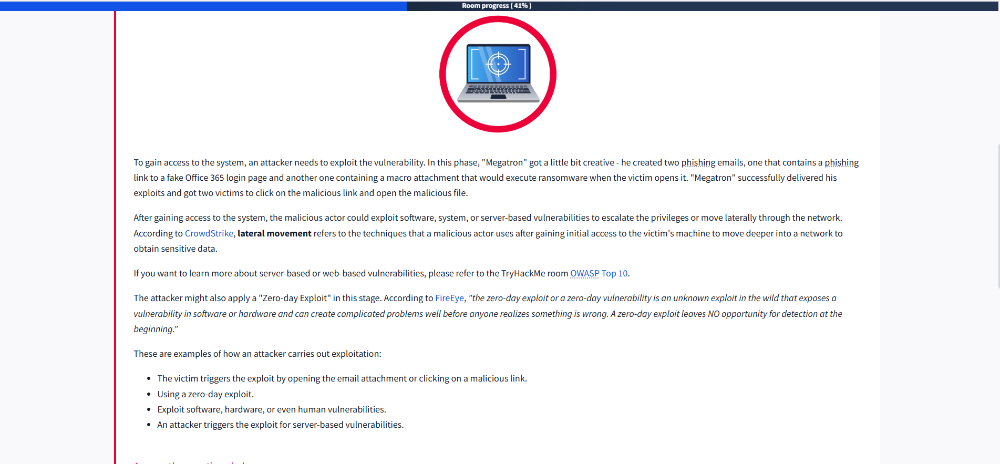
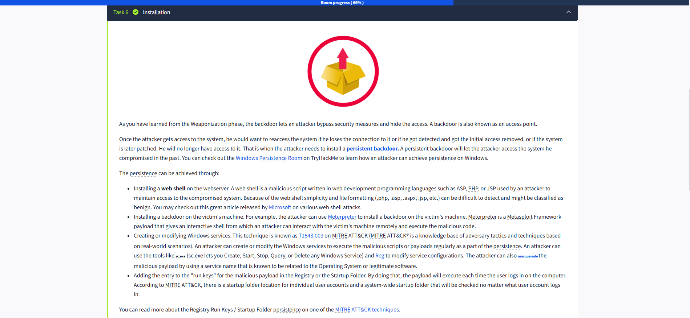
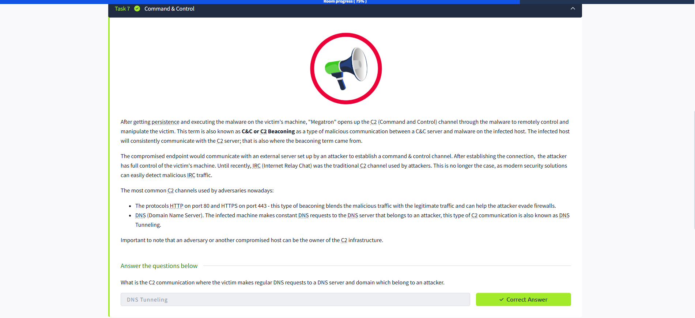
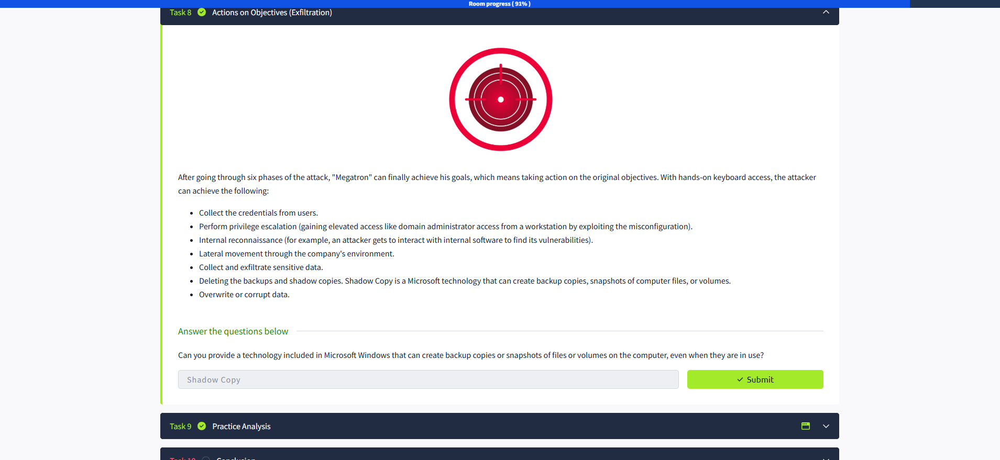

# Cyber Kill Chain 🚀

The **Cyber Kill Chain** is a concept adapted from military strategy, describing the stages of a cyber attack. Developed by Lockheed Martin in 2011, this framework helps cybersecurity professionals understand and defend against threats by breaking down an attack into distinct phases.

Understanding the Cyber Kill Chain is crucial for anyone in cybersecurity, including SOC Analysts, Security Researchers, Threat Hunters, and Incident Responders. By recognizing each phase, you can spot intrusion attempts early and disrupt the attack before it causes damage. 🛡️

## Why Learn the Cyber Kill Chain? 🤔

- **Identify Security Gaps:** Assess your network and systems to find and fix vulnerabilities.
- **Defend Against Attacks:** Protect against ransomware, data breaches, and Advanced Persistent Threats (APTs).
- **Understand Adversaries:** Learn how attackers think and operate to better defend your organization.

## The 7 Phases of the Cyber Kill Chain

1. **Reconnaissance**
2. **Weaponization**
3. **Delivery**
4. **Exploitation**
5. **Installation**
6. **Command & Control**
7. **Actions on Objectives**

In this room, you'll learn about each phase, the pros and cons of the traditional Cyber Kill Chain, and how to break the chain to stop attackers in their tracks. 🛑

---

## Phase 1: Reconnaissance 🔍

To defend against attacks, it's important to understand how attackers gather information. **Reconnaissance** is the planning phase, where adversaries collect data about their target.

### What is OSINT? 🌐

**OSINT (Open-Source Intelligence)** is a key part of reconnaissance. Attackers use publicly available information—like company size, employee emails, and phone numbers—to identify potential targets.

> Learn more about OSINT in the Varonis article: ["What is OSINT?"](https://www.varonis.com/blog/what-is-osint)

### Attacker's Perspective

Imagine an attacker named "Megatron" planning a sophisticated attack. His first step is reconnaissance, using OSINT to gather as much information as possible.

#### Example: Email Harvesting 📧

Email harvesting involves collecting email addresses from public sources. Attackers use these for phishing—tricking victims into revealing sensitive information.

**Popular Reconnaissance Tools:**
- `theHarvester`: Gathers emails, names, subdomains, IPs, and URLs from public sources.
- `Hunter.io`: Finds contact information linked to a domain.
- `OSINT Framework`: A collection of OSINT tools organized by category.

Attackers also use social media platforms like LinkedIn, Facebook, Twitter, and Instagram to gather information about companies and individuals. This data can be used to craft convincing phishing attacks. 🕵️‍♂️

---

**Learning Outcome:**  
By the end of this room, you'll be able to recognize each phase of the Cyber Kill Chain and know how to disrupt an attack before it succeeds. Let's continue exploring the next phases! 🚦

## Phase 3: Weaponization 🔍

## What I Learned Today 💡

Today I dove into **Task 3: Weaponization** and discovered how attackers craft and deliver their "weapons" after a successful recon phase. Here's a summary of what I learned and reflected on:

### 🔍 Key Concepts

- **Malware** – Malicious software meant to disrupt, damage, or gain unauthorized access.  
- **Exploit** – Code that takes advantage of a vulnerability.  
- **Payload** – The part of the attack that actually executes malicious actions.

### 🎯 The Attacker’s Strategy

Our fictional attacker **"Megatron"** prefers not to get his hands dirty and instead:

- Buys a **ready-made payload** from the Dark Web 🕵️‍♂️
- Uses Microsoft Office files with **malicious macros** to trick users 📄
- Might also plant USB drives loaded with malware 🖲️
- Chooses **C2 (Command & Control)** techniques for persistence 🔄
- Installs **backdoors** to regain access whenever he wants 🔓

### 🧠 Personal Reflection

Understanding this phase helped me see how important **prevention** is — not just detection. It made me appreciate how even simple tools like Office documents 📎 can become dangerous if misused.

Also, it reinforced how **automation (macros/VBA)** can be powerful — both for good and for evil. It's up to us to know the difference and stay one step ahead! 👣

### ❓Knowledge Check

> This term is referred to as a group of commands that perform a specific task. You can think of them as subroutines or functions that contain the code that most users use to automate routine tasks. But malicious actors tend to use them for malicious purposes and include them in Microsoft Office documents.  
> **Answer:** `Macros` ✅

---

🔐 On to the next phase in the cyber kill chain! Stay curious & stay safe! 🌐

## Phase 4: Delivery 🚚

The **Delivery** phase is when "Megatron" selects how to transmit the payload or malware to the target. Attackers have several creative options at their disposal:

- **Phishing Email 🎣:** After reconnaissance, the attacker crafts a malicious email targeting either a specific person (**spearphishing**) or multiple people in the company. The email contains the payload or malware. For example, "Megatron" notices that Nancy from Sales at Company A often likes LinkedIn posts from Scott, a Service Delivery Manager at Company B. Guessing they communicate via work email, "Megatron" creates a convincing email using Scott’s name and a lookalike domain, then sends Nancy a fake "Invoice" containing the payload.

- **Infected USB Drives 💾:** Attackers may distribute USB drives in public places like coffee shops, parking lots, or even mail them directly to companies. Sometimes, they print the company’s logo on the drives and pretend to be a customer sending a "gift." If someone plugs in the USB, malware is delivered. [Read about a real attack like this on CSO Online.](https://www.csoonline.com/article/3642217/cybercriminal-group-mails-malicious-usb-dongles-to-targeted-companies.html)

- **Watering Hole Attack 🕳️:** Here, attackers compromise a website frequently visited by the target group. Victims are lured (often via "harmless" emails) to visit the site, which secretly redirects them to a malicious page. Visiting the site can trigger a **drive-by download**—malware is installed without the victim’s knowledge. For example, a fake browser extension pop-up may appear, tricking users into downloading malware.

---

**Key Takeaway:**  
Attackers use social engineering, technical tricks, and creativity to deliver their payloads. Recognizing these delivery methods is crucial for defending your organization! 🛡️

## Phase 5: Exploitation 💥

Today I studied **Phase 5: Exploitation** and understood how attackers exploit vulnerabilities to gain access to the victim's systems. This is the stage where the attack becomes active, and the attacker uses exploits to execute malicious code or escalate privileges.

### 🔑 What I Learned

- **Exploitation** involves using a vulnerability (software, hardware, or human) to compromise the system.
- Attackers may use:
       - **Phishing links** to fake login pages (e.g., Office 365)
       - **Attachments with macros** that run ransomware or other types of malware
       - **Zero-day exploits** – vulnerabilities unknown to vendors or antivirus solutions
- After exploitation, the attacker can gain initial access, escalate privileges, or move laterally within the network.

### 🧠 Personal Reflection

I realized how important it is to keep systems updated and be cautious of suspicious emails. Even a simple click on a link or opening an attachment can lead to the compromise of the entire organization. The term **zero-day** seemed particularly dangerous because there are no protections yet for such vulnerabilities.

### ❓ Knowledge Check

> What is the name of a cyber attack that targets a software vulnerability unknown to vendors or antivirus solutions?  
> **Answer:** `Zero-day exploit` ✅

---

**Conclusion:**  
The exploitation phase is the critical moment when the attacker moves from planning to action. Understanding this stage helps me stay vigilant and apply effective preventive measures.

## Phase 6: Installation 🛠️

Today I learned about the **Installation** phase in the Cyber Kill Chain, which is all about how attackers establish persistence after gaining access to a system. This phase really opened my eyes to how creative and persistent attackers can be! Here’s what stood out to me:

### 🔑 Key Concepts

- **Backdoors** are secret access points that let attackers bypass security and return to a compromised system, even if their initial access is removed.
- **Persistence** is crucial for attackers—they want to make sure they can get back in, even if the system is patched or rebooted.

### 🕵️‍♂️ Attacker Techniques

- **Web Shells:** Attackers upload malicious scripts (like `.php`, `.asp`, `.jsp`) to web servers. These are hard to detect and can look like normal files.
- **Backdoor Payloads:** Tools like Meterpreter (from Metasploit) give attackers remote control over a victim’s machine.
- **Windows Services:** Attackers can create or modify Windows services (MITRE ATT&CK T1543.003) to run their code automatically. They might use tools like `sc.exe` or `reg.exe` and disguise their malicious service with a legit-sounding name.
- **Registry Run Keys & Startup Folder:** By adding their payload to these locations, attackers ensure their malware runs every time the user logs in—super sneaky!
- **Timestomping:** This technique lets attackers change file timestamps to make their malware look like it’s part of a legitimate program, helping them avoid detection by forensic investigators.

### 🧠 Personal Reflection

Learning about this phase made me realize how important it is to monitor for unusual changes in services, registry keys, and file timestamps. Attackers are always looking for ways to stay hidden and maintain access, so defenders need to be just as vigilant! 🔍

### 📚 Want to Learn More?

- Check out the [Windows Persistence Room on TryHackMe](https://tryhackme.com/room/windows-persistence) for hands-on labs.
- Read about [web shell attacks from Microsoft](https://www.microsoft.com/security/blog/2020/02/04/web-shell-attacks-continue-to-rise/) and [MITRE ATT&CK techniques](https://attack.mitre.org/techniques/T1547/001/).

---

**Conclusion:**  
The Installation phase is all about persistence. Understanding these techniques helps me spot the signs of compromise and respond quickly. Stay alert and keep learning! 🚨

## Phase 7: Command & Control 🛰️

Today I learned about the **Command & Control (C2)** phase in the Cyber Kill Chain, where attackers establish remote communication with compromised systems. This phase really showed me how attackers can maintain control and issue commands to infected machines from anywhere in the world! 🌍

### 🔑 Key Concepts

- **Command & Control (C2):** This is the communication channel that allows attackers to remotely control compromised devices. It’s also called C&C or C2 beaconing.
- **Persistence:** After gaining access and installing malware, attackers use C2 channels to keep their connection alive and manage their attack.

### 🕵️‍♂️ Attacker Techniques

- **HTTP/HTTPS Beaconing:** Attackers use common web protocols (HTTP on port 80, HTTPS on port 443) to blend malicious traffic with normal web activity, making it harder to detect. 🌐
- **DNS Tunneling:** The infected machine sends regular DNS requests to an attacker-controlled server, hiding C2 traffic inside what looks like normal DNS activity. 🕳️
- **Other Protocols:** While IRC (Internet Relay Chat) was once popular for C2, it’s now less common due to improved detection by security tools.

### 🧠 Personal Reflection

Learning about this phase made me realize how important it is to monitor network traffic for unusual patterns, like frequent connections to unknown servers or odd DNS requests. Attackers are always looking for stealthy ways to communicate with their malware, so defenders need to be proactive and vigilant! 👀

### 📚 Want to Learn More?

- Read about [C2 techniques on MITRE ATT&CK](https://attack.mitre.org/tactics/TA0011/).
- Explore [DNS tunneling explained by Cloudflare](https://www.cloudflare.com/learning/ddos/glossary/dns-tunneling/).

---

**Conclusion:**  
The Command & Control phase is all about remote management and stealthy communication. Understanding these techniques helps me spot the signs of ongoing attacks and respond quickly. Stay alert and keep learning! 🚨

## Phase 8: Actions on Objectives (Exfiltration) 🎯

After progressing through all the previous phases, "Megatron" finally reaches the **Actions on Objectives** stage. This is where the attacker achieves their ultimate goals—whether it’s stealing data, causing disruption, or gaining further access. This phase really helped me understand the real impact of a cyber attack and why every step in the kill chain matters! 🚨

### 🔑 Key Activities

- **Credential Theft:** Attackers collect usernames and passwords from compromised systems to access more resources. 🗝️
- **Privilege Escalation:** Gaining higher-level access, like becoming a domain administrator, often by exploiting misconfigurations. 🛡️
- **Internal Reconnaissance:** Exploring internal systems and software to find more vulnerabilities or valuable data. 🕵️‍♂️
- **Lateral Movement:** Moving through the network to compromise additional systems and expand their reach. 🔄
- **Data Exfiltration:** Stealing sensitive data and sending it outside the organization. 📤
- **Destruction:** Deleting backups and shadow copies (like Microsoft’s Shadow Copy technology), corrupting, or overwriting data to make recovery difficult. 💣

### 🧠 Personal Reflection

Learning about this phase made me realize how devastating a successful attack can be. It’s not just about getting in—the attacker’s real power comes from what they do after gaining access. Monitoring for unusual data transfers, privilege changes, and backup deletions is critical for defense! 👀

### 📚 Want to Learn More?

- Read about [Data Exfiltration techniques on MITRE ATT&CK](https://attack.mitre.org/tactics/TA0010/).
- Learn more about [Shadow Copy technology from Microsoft](https://learn.microsoft.com/en-us/windows/win32/vss/shadow-copies).

---

**Conclusion:**  
The Actions on Objectives phase is where the attacker’s true intentions are revealed. Understanding these activities helps me recognize the signs of a breach and respond quickly to minimize damage. Stay vigilant and keep learning! 🛡️