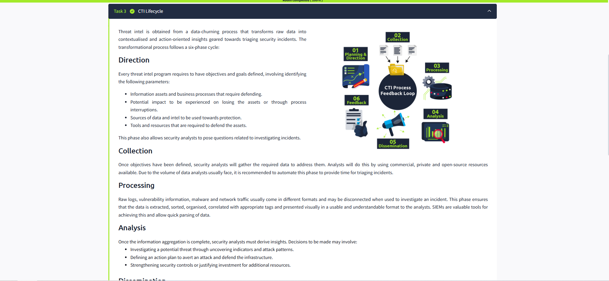

# Cyber Threat Intelligence (CTI) Overview 🚀

Welcome! Today, I learned about **Cyber Threat Intelligence (CTI)** and the essential frameworks and processes that help security analysts defend organizations from cyber threats. Here’s a summary of the key concepts and takeaways from my learning journey:

---

## 🌟 What is CTI?

**Cyber Threat Intelligence (CTI)** is evidence-based knowledge about adversaries, including their indicators, tactics, motivations, and actionable advice. CTI helps protect critical assets and informs both security teams and business leaders.

---

## 🧩 Data, Information, and Intelligence

- **Data:** Discrete indicators (e.g., IP addresses, URLs, hashes).
- **Information:** Multiple data points combined to answer specific questions.
- **Intelligence:** Correlated data and information, analyzed for patterns and context.

---

## 🎯 CTI Goals

- Understand the relationship between your environment and adversaries.
- Defend against attacks by answering:
       - Who is attacking?
       - What are their motivations?
       - What are their capabilities?
       - What indicators should you monitor?

---

## 📚 Sources of Threat Intelligence

- **Internal:** Security events, incident reports, system logs.
- **Community:** Open forums, dark web communities.
- **External:** Threat intel feeds, public sources, government data.

---

## 🏷️ Threat Intelligence Classifications

- **Strategic Intel:** High-level, trend-focused, supports business decisions.
- **Technical Intel:** Evidence and artifacts (e.g., IPs, hashes).
- **Tactical Intel:** Tactics, techniques, and procedures (TTPs).
- **Operational Intel:** Adversary motives and targeted assets.

---

## 🔄 The CTI Lifecycle

1. **Direction:** Define objectives and questions.
2. **Collection:** Gather data from various sources.
3. **Processing:** Sort, organize, and correlate data into usable formats.
4. **Analysis:** Derive insights, investigate threats, and plan actions.
5. **Dissemination:** Share intelligence with stakeholders in appropriate formats.
6. **Feedback:** Use stakeholder responses to improve the process.

---

## 🛠️ Key Frameworks & Standards

### MITRE ATT&CK

A knowledge base of adversary behaviors, tactics, and indicators.

### TAXII

A protocol for secure, automated sharing of threat intelligence.
- **Collection Model:** Users request intel from a producer.
- **Channel Model:** Intel is pushed to users via publish-subscribe.

### STIX

A standardized language for describing cyber threat information.

### Cyber Kill Chain

Breaks down an attack into seven phases:
- Reconnaissance
- Weaponisation
- Delivery
- Exploitation
- Installation
- Command & Control
- Actions on Objectives

### The Diamond Model

Focuses on four aspects: Adversary, Victim, Infrastructure, Capabilities. Helps analysts map and correlate attack details.

---

## 📝 Practical Application

- **Threat reports** from companies like Mandiant, Recorded Future, and Palo Alto Unit42 are valuable for sharing CTI.
- Mapping adversary activity using frameworks and models helps build a complete threat profile.

---

## 🏆 Key Questions & Answers

- **What does CTI stand for?**  
       *Cyber Threat Intelligence*

- **Where do IP addresses and hashes fit?**  
       *Technical Intel*

- **Which lifecycle phase processes data into usable formats?**  
       *Processing*

- **When do analysts define investigation questions?**  
       *Direction*

- **TAXII sharing models?**  
       *Collection and Channel*

- **Kill chain phase for data exfiltration?**  
       *Actions on Objectives*

---

## 🎉 Final Exercise

- **Source email address:** `vipivillain@badbank.com`
- **Downloaded file:** `flbpfuh.exe`
- **Completion message:**  
         
         
         
       `THM{NOW_I_CAN_CTI}`

---

> **Summary:**  
> Today’s learning gave me a solid foundation in CTI, its lifecycle, and the frameworks that guide threat intelligence work. I now understand how to collect, process, and use threat intel to protect organizations! 🛡️✨

