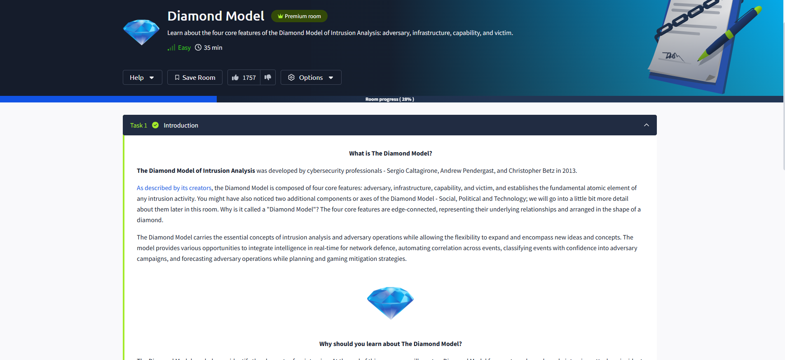
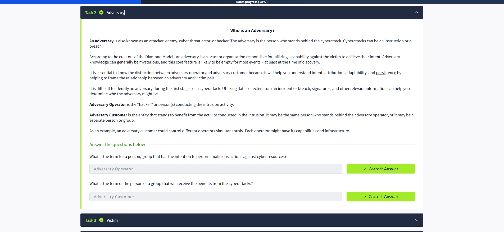

## What I Learned About The Diamond Model ✨

The Diamond Model of Intrusion Analysis was created by Sergio Caltagirone, Andrew Pendergast, and Christopher Betz in 2013. It focuses on four main features: **adversary**, **infrastructure**, **capability**, and **victim**. These are connected like the edges of a diamond 💎, showing how they relate to each other in any cyber intrusion.

I learned that the Diamond Model helps break down and understand intrusion events by looking at these four elements. There are also extra axes—**Social, Political, and Technology**—which add more context to the analysis.

The model is flexible and can be expanded with new ideas. It helps integrate intelligence in real time, automate event correlation, classify incidents, and even predict adversary actions so we can plan better defenses 🛡️.

### Why is The Diamond Model Useful? 🤔

- It helps identify the key parts of an intrusion.
- It makes it easier to explain incidents to non-technical people.
- By the end of this lesson, I’ll be able to create a Diamond Model for different security events and analyze threats like Advanced Persistent Threats (APTs).

Overall, the Diamond Model is a powerful tool for understanding and communicating about cybersecurity incidents! 🚀

---

### Who is an Adversary? 👤

An **adversary** is the person or group behind a cyberattack—sometimes called a hacker, threat actor, or enemy. According to the Diamond Model, the adversary is the one using their capabilities against a victim to achieve their goals.

I learned that there are two important roles:
- **Adversary Operator**: The person or team actually carrying out the attack.
- **Adversary Customer**: The one who benefits from the attack, which could be the same as the operator or a separate entity.

It’s often hard to identify the adversary right away, but by analyzing evidence and patterns, we can get closer to understanding who is behind an attack and what their intentions are.

**Key terms:**
- The person/group intending to perform malicious actions: **Adversary Operator** ✅
- The person/group who benefits from the attack: **Adversary Customer** ✅
