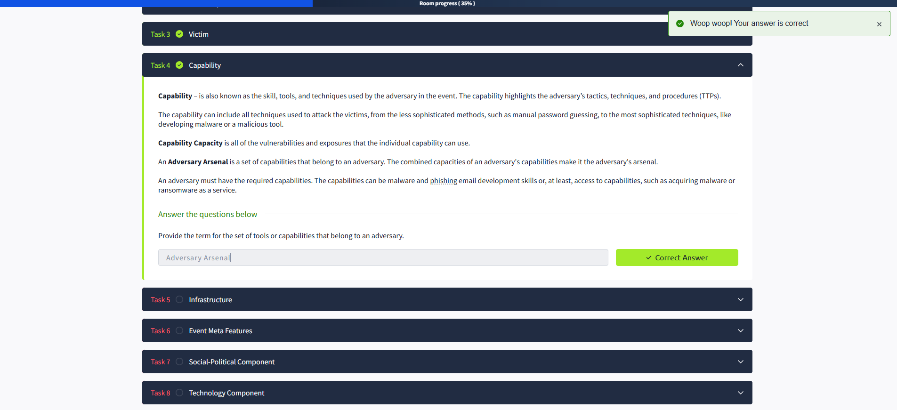

## What I Learned About The Diamond Model ✨

The Diamond Model of Intrusion Analysis was created by Sergio Caltagirone, Andrew Pendergast, and Christopher Betz in 2013. It focuses on four main features: **adversary**, **infrastructure**, **capability**, and **victim**. These are connected like the edges of a diamond 💎, showing how they relate to each other in any cyber intrusion.

I learned that the Diamond Model helps break down and understand intrusion events by looking at these four elements. There are also extra axes—**Social, Political, and Technology**—which add more context to the analysis.

The model is flexible and can be expanded with new ideas. It helps integrate intelligence in real time, automate event correlation, classify incidents, and even predict adversary actions so we can plan better defenses 🛡️.

### Why is The Diamond Model Useful? 🤔

- It helps identify the key parts of an intrusion.
- It makes it easier to explain incidents to non-technical people.
- By the end of this lesson, I’ll be able to create a Diamond Model for different security events and analyze threats like Advanced Persistent Threats (APTs).

Overall, the Diamond Model is a powerful tool for understanding and communicating about cybersecurity incidents! 🚀

---

### Who is an Adversary? 👤

An **adversary** is the person or group behind a cyberattack—sometimes called a hacker, threat actor, or enemy. According to the Diamond Model, the adversary is the one using their capabilities against a victim to achieve their goals.

I learned that there are two important roles:
- **Adversary Operator**: The person or team actually carrying out the attack.
- **Adversary Customer**: The one who benefits from the attack, which could be the same as the operator or a separate entity.

It’s often hard to identify the adversary right away, but by analyzing evidence and patterns, we can get closer to understanding who is behind an attack and what their intentions are.

**Key terms:**
- The person/group intending to perform malicious actions: **Adversary Operator** ✅
- The person/group who benefits from the attack: **Adversary Customer** ✅

---
### What I Learned About Victims 🎯

A **victim** is the target chosen by the adversary in a cyberattack. This can be an organization, a person, an email address, an IP, or a domain. I learned that in the Diamond Model, it's important to separate:

- **Victim Personae**: The people or organizations being targeted (like company names, individuals, industries, job roles, etc.).
- **Victim Assets**: The actual systems, networks, email addresses, IPs, or social media accounts that are attacked.

Attackers always need a victim to achieve their goals. For example, if a spear-phishing email is sent and someone clicks the link, that person is the victim.  
Victim Personae are the people or organizations being targeted, while Victim Assets are the technical resources being attacked.

**Key term:**  
- The term for organizations or people being targeted in the Diamond Model: **Victim Personae** 🎯

---

### What I Learned About Capability 🛠️

**Capability** is all about the skills, tools, and techniques the adversary uses during an attack. This includes everything from simple password guessing to advanced malware development.  
The Diamond Model highlights:

- **Capability Capacity**: All the vulnerabilities and exposures a capability can use.
- **Adversary Arsenal**: The full set of capabilities (tools, malware, exploits, etc.) that an adversary has.

Adversaries must have or access the right capabilities to carry out attacks, like developing malware or buying ransomware as a service.  
The more advanced the capability, the more dangerous the adversary.

**Key term:**  
- The set of tools or capabilities that belong to an adversary: **Adversary Arsenal** 🧰

---

### What I Learned About Infrastructure 🏗️

**Infrastructure** is the software or hardware the adversary uses to deliver their capabilities or maintain control. This can include:

- Command and control servers (C2)
- IP addresses, domains, email accounts
- Even physical devices like malicious USB sticks

There are two main types of infrastructure in the Diamond Model:
- **Type 1 Infrastructure**: Owned or controlled directly by the adversary (like their own servers or domains).
- **Type 2 Infrastructure**: Controlled by an intermediary (sometimes unknowingly), used to hide the adversary’s identity (like malware staging servers, malicious domains, or compromised email accounts).

**Service Providers** (like ISPs or domain registrars) are also important for the availability of both types of infrastructure.

**Key terms:**  
- Malicious domains and compromised email accounts belong to: **Type 2 Infrastructure** 🕵️‍♂️  
- Infrastructure most likely owned by an adversary: **Type 1 Infrastructure** 🏠