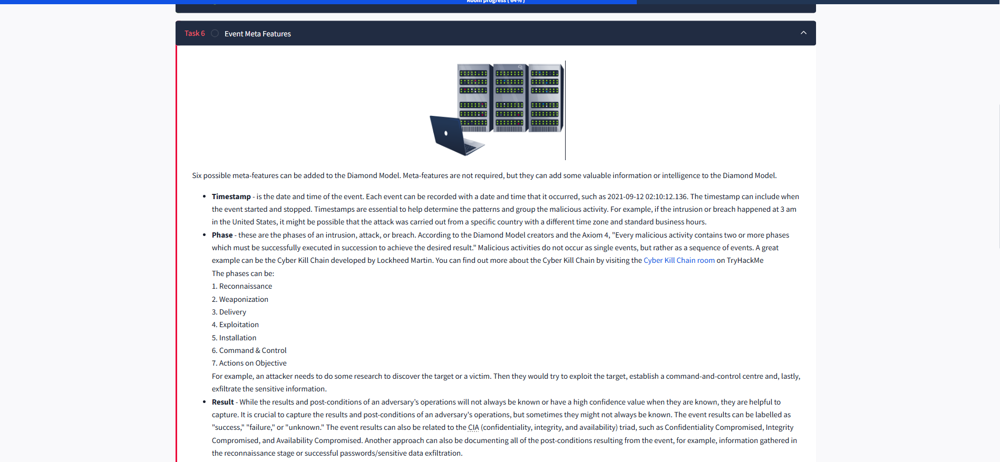
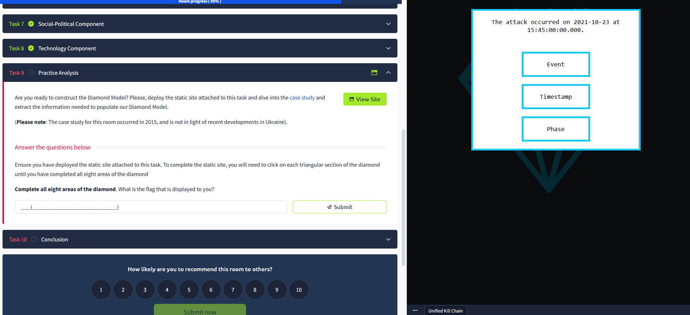

## What I Learned About The Diamond Model ✨

The Diamond Model of Intrusion Analysis was created by Sergio Caltagirone, Andrew Pendergast, and Christopher Betz in 2013. It focuses on four main features: **adversary**, **infrastructure**, **capability**, and **victim**. These are connected like the edges of a diamond 💎, showing how they relate to each other in any cyber intrusion.

I learned that the Diamond Model helps break down and understand intrusion events by looking at these four elements. There are also extra axes—**Social, Political, and Technology**—which add more context to the analysis.

The model is flexible and can be expanded with new ideas. It helps integrate intelligence in real time, automate event correlation, classify incidents, and even predict adversary actions so we can plan better defenses 🛡️.

### Why is The Diamond Model Useful? 🤔

- It helps identify the key parts of an intrusion.
- It makes it easier to explain incidents to non-technical people.
- By the end of this lesson, I’ll be able to create a Diamond Model for different security events and analyze threats like Advanced Persistent Threats (APTs).

Overall, the Diamond Model is a powerful tool for understanding and communicating about cybersecurity incidents! 🚀

---

### Who is an Adversary? 👤

An **adversary** is the person or group behind a cyberattack—sometimes called a hacker, threat actor, or enemy. According to the Diamond Model, the adversary is the one using their capabilities against a victim to achieve their goals.

I learned that there are two important roles:
- **Adversary Operator**: The person or team actually carrying out the attack.
- **Adversary Customer**: The one who benefits from the attack, which could be the same as the operator or a separate entity.

It’s often hard to identify the adversary right away, but by analyzing evidence and patterns, we can get closer to understanding who is behind an attack and what their intentions are.

**Key terms:**
- The person/group intending to perform malicious actions: **Adversary Operator** ✅
- The person/group who benefits from the attack: **Adversary Customer** ✅

---
### What I Learned About Victims 🎯

A **victim** is the target chosen by the adversary in a cyberattack. This can be an organization, a person, an email address, an IP, or a domain. I learned that in the Diamond Model, it's important to separate:

- **Victim Personae**: The people or organizations being targeted (like company names, individuals, industries, job roles, etc.).
- **Victim Assets**: The actual systems, networks, email addresses, IPs, or social media accounts that are attacked.

Attackers always need a victim to achieve their goals. For example, if a spear-phishing email is sent and someone clicks the link, that person is the victim.  
Victim Personae are the people or organizations being targeted, while Victim Assets are the technical resources being attacked.

**Key term:**  
- The term for organizations or people being targeted in the Diamond Model: **Victim Personae** 🎯

---

### What I Learned About Capability 🛠️

**Capability** is all about the skills, tools, and techniques the adversary uses during an attack. This includes everything from simple password guessing to advanced malware development.  
The Diamond Model highlights:

- **Capability Capacity**: All the vulnerabilities and exposures a capability can use.
- **Adversary Arsenal**: The full set of capabilities (tools, malware, exploits, etc.) that an adversary has.

Adversaries must have or access the right capabilities to carry out attacks, like developing malware or buying ransomware as a service.  
The more advanced the capability, the more dangerous the adversary.

**Key term:**  
- The set of tools or capabilities that belong to an adversary: **Adversary Arsenal** 🧰

---

### What I Learned About Infrastructure 🏗️

**Infrastructure** is the software or hardware the adversary uses to deliver their capabilities or maintain control. This can include:

- Command and control servers (C2)
- IP addresses, domains, email accounts
- Even physical devices like malicious USB sticks

There are two main types of infrastructure in the Diamond Model:
- **Type 1 Infrastructure**: Owned or controlled directly by the adversary (like their own servers or domains).
- **Type 2 Infrastructure**: Controlled by an intermediary (sometimes unknowingly), used to hide the adversary’s identity (like malware staging servers, malicious domains, or compromised email accounts).

**Service Providers** (like ISPs or domain registrars) are also important for the availability of both types of infrastructure.

**Key terms:**  
- Malicious domains and compromised email accounts belong to: **Type 2 Infrastructure** 🕵️‍♂️  
- Infrastructure most likely owned by an adversary: **Type 1 Infrastructure** 🏠

---
### What I Learned About the Phase Meta-Feature 🔄

The **Phase** meta-feature in the Diamond Model shows that every cyberattack is a process made up of several steps, not just a single action. I learned that attackers must complete multiple phases in sequence to reach their goal. This helps analysts break down complex attacks and understand how each stage connects to the next.

The typical phases are:
1. **Reconnaissance** – The attacker gathers information about the target.
2. **Weaponization** – They create or select a tool or exploit.
3. **Delivery** – The tool or exploit is delivered to the victim (like via email or a malicious website).
4. **Exploitation** – The attacker uses the tool to exploit a vulnerability.
5. **Installation** – Malware or backdoors are installed on the victim’s system.
6. **Command & Control** – The attacker establishes communication to control the compromised system.
7. **Actions on Objective** – The attacker achieves their goal, such as stealing data or disrupting operations.

Understanding these phases helps me recognize where an attack is in its lifecycle and how defenders can intervene at different points. It also shows that attacks are rarely random—they are planned and executed step by step. 🔄

---

### What I Learned About the Result Meta-Feature 🏁

The **Result** meta-feature is about capturing the outcome of an adversary’s actions. I learned that it’s important to record whether an attack was a **success**, **failure**, or if the result is **unknown**. This helps measure the effectiveness of both attacks and defenses.

Results can also be linked to the **CIA triad**:
- **Confidentiality Compromised** – Sensitive data was accessed or stolen.
- **Integrity Compromised** – Data was altered or tampered with.
- **Availability Compromised** – Systems or services were disrupted or taken offline.

Documenting results and post-conditions (like what data was exfiltrated or what systems were affected) gives a clearer picture of the impact of an incident. Even if the result is unknown, tracking it helps with future investigations and threat intelligence. I learned that this meta-feature is crucial for understanding not just what happened, but how serious the consequences are. 🏁

---

### What I Learned About the Technology Meta-Feature 💻

The **Technology** meta-feature highlights how the adversary’s **capability** (their tools, malware, exploits) connects with their **infrastructure** (servers, domains, email accounts, etc.). I learned that this relationship is key to understanding how attackers operate and communicate.

For example, in a **watering-hole attack**, the adversary compromises a legitimate website that their target is likely to visit. The technology component here includes both the exploit (capability) and the compromised website (infrastructure). By analyzing the technology used, defenders can spot patterns, predict future attacks, and improve detection.

This meta-feature also helps analysts understand the technical sophistication of the adversary and the methods they use to stay hidden or bypass defenses. It’s not just about the tools themselves, but how they are deployed and connected to the attacker’s broader strategy. 💻

---
### Diamond Model Case Study Exercise 💎

For this exercise, I was asked to deploy a static site and interact with a Diamond Model diagram by clicking on each triangular section. The goal was to explore all eight areas of the diamond, each representing a different aspect of a real-world cyber incident from 2015.

By carefully examining each section, I learned how to extract and organize information about the adversary, victim, capability, infrastructure, and the related meta-features. This hands-on activity helped reinforce my understanding of how the Diamond Model is used in real investigations to break down and analyze cyberattacks.

After completing all eight areas, I was presented with the flag:

**THM{DIAMOND_MODEL_ATTACK_CHAIN}** 🏁

This exercise showed me how practical and interactive the Diamond Model can be for analyzing incidents and building a complete picture of an attack chain.

---

### Conclusion 📝

This was the final test room and exercise for the Diamond Model. By working through the tasks and the interactive case study, I learned how to apply the Diamond Model to real-world scenarios, identify key features and meta-features, and understand the relationships between adversaries, victims, capabilities, and infrastructure.

I now feel more confident in using the Diamond Model to analyze and communicate about cybersecurity incidents! 🚀
---