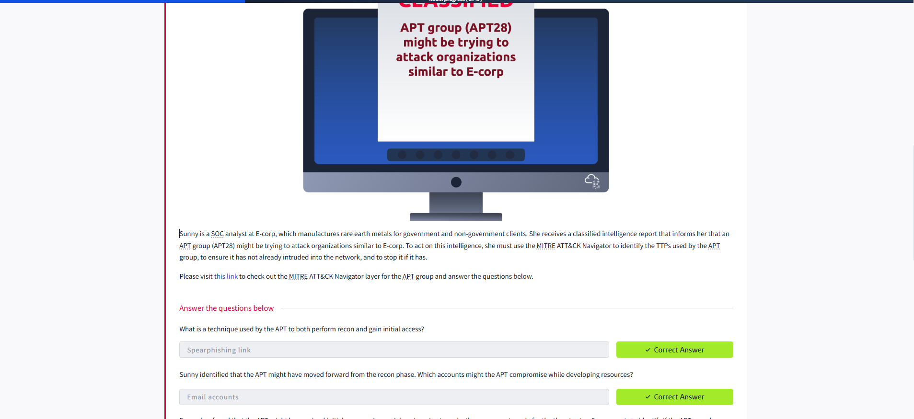

# Eviction (Premium Room)

## Task 1: Understand the Adversary

Sunny is a SOC analyst at E-corp, a company that manufactures rare earth metals for government and non-government clients. She receives a classified intelligence report indicating that an APT group (APT28) may be targeting organizations similar to E-corp. To act on this intelligence, she must use the MITRE ATT&CK Navigator to identify the TTPs used by the APT group, ensure the network has not already been compromised, and stop any ongoing intrusion.

> Please visit the MITRE ATT&CK Navigator layer for the APT group and answer the questions below.

### Questions and Answers

**1. What is a technique used by the APT to both perform recon and gain initial access?**  
*Answer:* Spearphishing link

**2. Which accounts might the APT compromise while developing resources?**  
*Answer:* Email accounts

**3. What two techniques of user execution should Sunny look out for?**  
*Answer:* Malicious file

**4. If the above technique was successful, which scripting interpreters should Sunny search for to identify successful execution?**  
*Answer:* Powershell and Windows Command shell

**5. While looking at the scripting interpreters identified in Q4, Sunny found some obfuscated scripts that changed the registry. Assuming these changes are for maintaining persistence, which registry keys should Sunny observe to track these changes?**  
*Answer:* Registry run keys

**6. Sunny identified that the APT executes system binaries to evade defenses. Which system binary's execution should Sunny scrutinize for proxy execution?**  
*Answer:* Rundll32

**7. Sunny identified tcpdump on one of the compromised hosts. Assuming this was placed there by the threat actor, which technique might the APT be using here for discovery?**  
*Answer:* Network sniffing

**8. It looks like the APT achieved lateral movement by exploiting remote services. Which remote services should Sunny observe to identify APT activity traces?**  
*Answer:* SMB/Windows Admin shares

**9. It looked like the primary goal of the APT was to steal intellectual property from E-corp's information repositories. Which information repository can be the likely target of the APT?**  
*Answer:* Sharepoint

