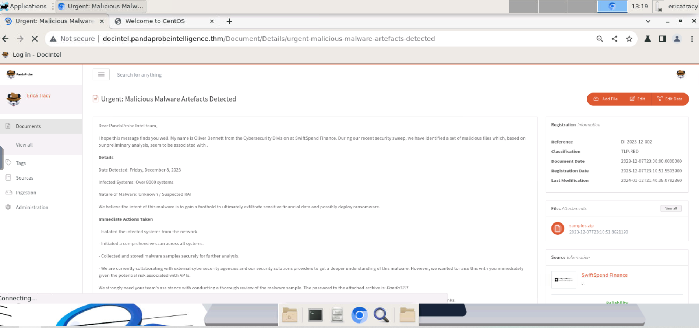
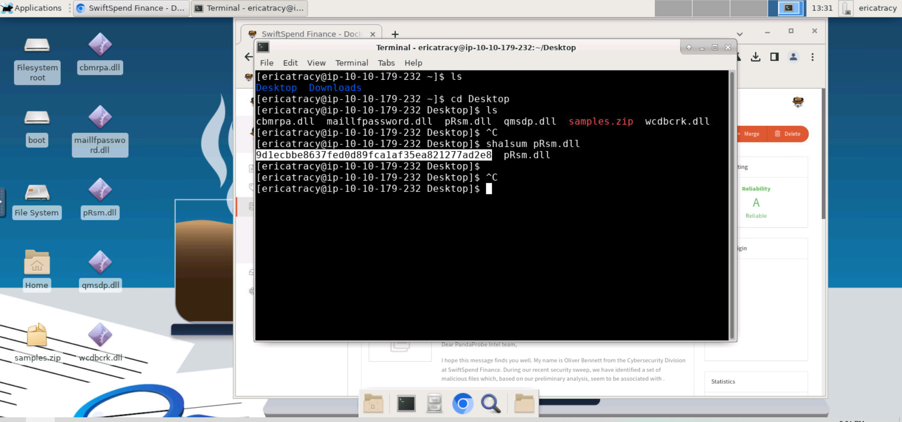
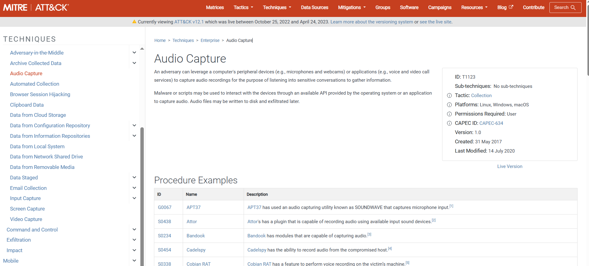
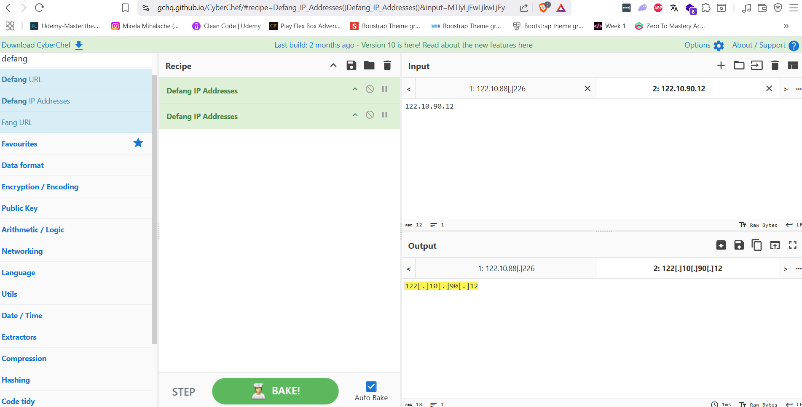
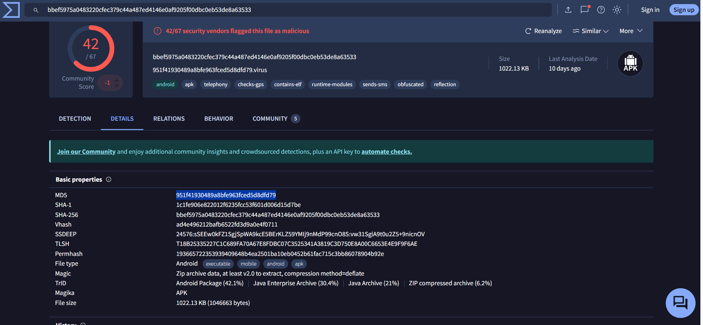

# 🧠 Threat Intelligence Challenge – SwiftSpend Finance Incident

## ⚠️ Disclaimer  
Please note: The artefacts used in this scenario were retrieved from a real-world cyber-attack. Hence, it is advised that interaction with the artefacts be done only inside the attached VM, as it is an isolated environment.

---

## 🕵️‍♂️ Incident Overview

On a Friday evening at **PandaProbe Intelligence**, a new ticket was raised by **SwiftSpend Finance**, reporting suspicious files potentially linked to malware. As the active CTI analyst, the following steps were taken:

1. 📥 Downloaded the malware samples inside a secure, isolated VM.
2. ⚙️ Performed initial automated analysis.
3. 🔍 Conducted manual behavioral analysis of the malware.
4. 🌐 Correlated findings with global threat intelligence sources.
5. 📝 Compiled findings into a structured report with IOCs and MITRE mappings.

---

## 📌 Findings

### 📁 Who shared the malware samples?

**Answer:** Oliver Bennett  

---

### 🔐 SHA1 hash of `pRsm.dll` inside `samples.zip`

**Answer:** `9d1ecbbe8637fed0d89fca1af35ea821277ad2e8`  

---

### 🧰 Malware Framework

**Answer:** `MgBot`  
> This framework uses modular DLLs, including `pRsm.dll`, for extended functionality such as audio surveillance.

---

### 🎯 MITRE ATT&CK Technique

**Technique ID:** `T1123` – *Audio Capture*  
> `pRsm.dll` is associated with this technique within the MgBot framework.  

---

### 🌐 Malicious Download URL (CyberChef Defanged)

**Answer:**  
`hxxp[://]update[.]browser[.]qq[.]com/qmbs/QQ/QQUrlMgr_QQ88_4296[.]exe`

---

### 📡 C2 IP Address (CyberChef Defanged)

**Answer:**  
`122[.]10[.]90[.]12`  

---

### 📱 SpyAgent Android Sample – MD5 Hash

**Answer:**  
`951F41930489A8BFE963FCED5D8DFD79`  

---

## ✅ Summary of Indicators of Compromise (IOCs)

| Type                | Value                                                                 |
|---------------------|------------------------------------------------------------------------|
| SHA1 Hash           | `9d1ecbbe8637fed0d89fca1af35ea821277ad2e8`                             |
| MD5 Hash            | `951F41930489A8BFE963FCED5D8DFD79`                                     |
| Malware Framework   | `MgBot`                                                                |
| MITRE Technique     | `T1123 - Audio Capture`                                                |
| C2 IP (defanged)    | `122[.]10[.]90[.]12`                                                    |
| Download URL        | `hxxp[://]update[.]browser[.]qq[.]com/qmbs/QQ/QQUrlMgr_QQ88_4296[.]exe`|

---

## 🧾 Tools Used

- 🖥️ Virtual Machine (Isolated Analysis Environment)  
- 🧠 DocIntel Platform  
- 🧪 CyberChef  
- 📖 MITRE ATT&CK Framework  
- 🧵 Hash analysis and PE metadata review  

---

> Challenge completed on TryHackMe  
