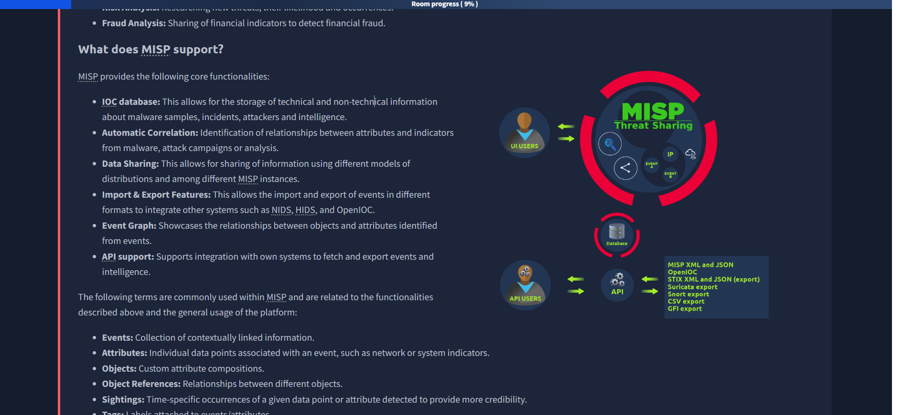
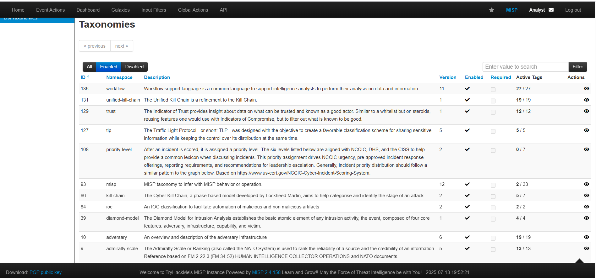
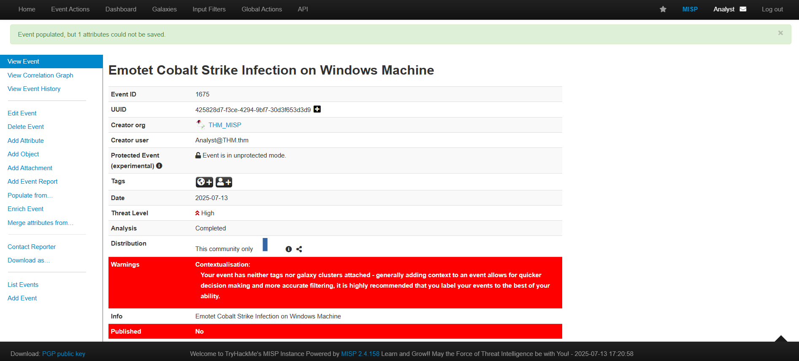
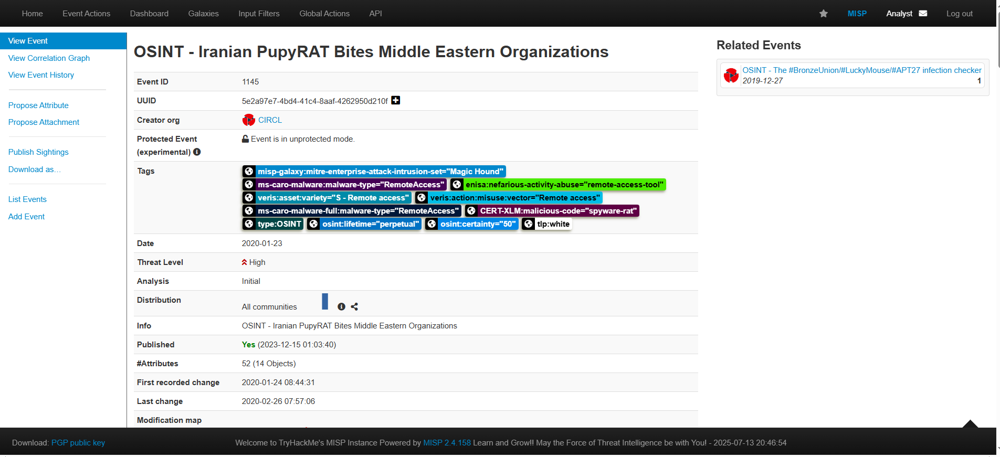

# MISP - MALWARE INFORMATION SHARING PLATFORM 🐛🔗

This room explores the MISP Malware & Threat Sharing Platform through its core objective to foster sharing of structured threat information among security analysts, malware researchers and IT professionals.

---

## Room Objectives 🎯

We will be covering the following areas within the room:  
- Introduction to MISP and why it was developed.  
- Use cases MISP can be applied to  
- Core features and terminologies.  
- Dashboard Navigation.  
- Event Creation and Management.  
- Feeds and Taxonomies.

---

## Room Prerequisites ✅

General familiarity with security concepts is recommended: check out the Pre-Security path and the Jr. Security Analyst room.

---

## Exercise Task 📝

At the end of the room, we will have an exercise task to test your knowledge of using MISP.

---

  
*A team of THM Security Analysts.*

---

## What is MISP? 🤔

MISP (Malware Information Sharing Platform) is an open-source threat information platform that facilitates the collection, storage and distribution of threat intelligence and Indicators of Compromise (IOCs) related to malware, cyber attacks, financial fraud or any intelligence within a community of trusted members.

Information sharing follows a distributed model, with supported closed, semi-private, and open communities (public). Additionally, the threat information can be distributed and consumed by Network Intrusion Detection Systems (NIDS), log analysis tools and Security Information and Event Management Systems (SIEM).

---

## Use Cases 💡

MISP is effectively useful for the following use cases:

- Malware Reverse Engineering: Sharing of malware indicators to understand how different malware families function.  
- Security Investigations: Searching, validating and using indicators in investigating security breaches.  
- Intelligence Analysis: Gathering information about adversary groups and their capabilities.  
- Law Enforcement: Using Indicators to support forensic investigations.  
- Risk Analysis: Researching new threats, their likelihood and occurrences.  
- Fraud Analysis: Sharing of financial indicators to detect financial fraud.

---

## What does MISP support? ⚙️

MISP provides the following core functionalities:

- **IOC database:** Storage of technical and non-technical information about malware samples, incidents, attackers and intelligence.  
- **Automatic Correlation:** Identification of relationships between attributes and indicators from malware, attack campaigns or analysis.  
- **Data Sharing:** Sharing information using different distribution models among different MISP instances.  
- **Import & Export Features:** Import and export of events in various formats for integration with NIDS, HIDS, OpenIOC.  
- **Event Graph:** Visualizing relationships between objects and attributes from events.  
- **API Support:** Integration with external systems to fetch and export events and intelligence.

---

## Common Terms in MISP 📚

- **Events:** Collection of contextually linked information.  
- **Attributes:** Individual data points associated with an event, such as network or system indicators.  
- **Objects:** Custom attribute compositions.  
- **Object References:** Relationships between different objects.  
- **Sightings:** Time-specific occurrences of a given data point or attribute to provide credibility.  
- **Tags:** Labels attached to events/attributes.  
- **Taxonomies:** Classification libraries used to tag, classify and organise information.  
- **Galaxies:** Knowledge base items used to label events/attributes.  
- **Indicators:** Pieces of information that can detect suspicious or malicious cyber activity.

---

## Dashboard 🖥️

The analyst's view of MISP provides functionalities to track, share and correlate events and IOCs identified during your investigation. The dashboard menu contains:

- **Home button:** Returns you to the start screen, event index, or custom home page.  
- **Event Actions:** Access creation, modification, deletion, publishing, searching and listing of events and attributes.  
- **Dashboard:** Create a custom dashboard using widgets.  
- **Galaxies:** Shortcut to the list of MISP Galaxies on the instance (see Feeds & Taxonomies Task).  
- **Input Filters:** Defines how users enter data, with validation, replacements, and blocklists.  
- **Global Actions:** View/edit profile, manual, news, terms of use, active organisations, and contribution histograms.  
- **MISP:** Link to your base URL.  
- **Name:** Logged in user's auto-generated name.  
- **Envelope:** User Dashboard for notifications and proposals.  
- **Log out:** End your session immediately.

# Event Management 🎯

The **Event Actions** tab is where you, as an analyst, create all malware investigation correlations by providing descriptions and attributes associated with your investigation. The process can be divided into **three main phases**:

1. **Event Creation** 📝  
2. **Populating Events with Attributes and Attachments** 📎  
3. **Publishing** 🚀  

---

## Event Creation 📝

At first, events act as a container for general information about an incident or investigation. You add:

- A description  
- The time of occurrence  
- The risk level appropriate for the incident  

This is done by clicking the **Add Event** button. You also select the **distribution level** you want for your event across the MISP network and community.

### MISP Distribution Options 🌍

| Option                | Description                                                                                      |
|-----------------------|------------------------------------------------------------------------------------------------|
| **Your organisation only** | Only members of your organisation can see the event.                                          |
| **This Community-only**    | Members of your MISP community can see the event, including your organisation and synced ones. |
| **Connected communities**  | Includes your community plus organisations two hops away (servers synchronised with servers). |
| **All communities**        | The event is shared with all MISP communities globally.                                       |

You can also add a **sharing group** to specify exactly which organisations have access to the event.

---

Event details can also be filled by using **predefined templates** — for example, using an email template to add phishing email details.

---

## Attributes & Attachments 📎

Attributes can be:

- Added **manually**  
- **Imported** via formats like OpenIOC or ThreatConnect  

To add manually, click **Add Attribute** and fill the fields.

### Important attribute options to note:

- **For Intrusion Detection System (IDS):**  
  Allows the attribute to be used as an IDS signature when exporting NIDS data.  
  If not checked, it is only contextual info, not used for automated detection.

- **Batch import:**  
  Enter multiple attributes of the same type separated by new lines — MISP will create individual entries for each.

In the example below, we add an **Emotet Epoch 4 C2 IP address** obtained from an IOC file.

---

You can also attach **files** to the event, such as:

- Malware samples  
- Reports from external analysis  
- Artifacts dropped by malware  

Mark the file as **Malware** by checking the malware box. This ensures the file is zipped and password-protected, preventing accidental execution.

---

## Publish Event 🚀

Once analysts create events, the **organisation admin** reviews and publishes them. Publishing:

- Adds events to the shared pool  
- Distributes events according to the distribution level set earlier  

---

# Quick Quiz 📝

1. **How many distribution options does MISP provide to share threat information?**  
   - **Answer:** 4  

2. **Which user role is responsible for publishing events?**  
   - **Answer:** Organisation Admin  

---

# Practical Example: CIRCL PupyRAT Event 🔍

CIRCL published an event for a **PupyRAT infection**. Your organisation is on alert for remote access trojans (RATs) and malware, and your task is to investigate and correlate this event with your SIEM.

---

### Questions and Answers:

| Question                                           | Answer       |
|---------------------------------------------------|--------------|
| What event ID has been assigned to the PupyRAT event? | 1145         |
| The event is associated with the adversary gaining ______ into organisations. | Remote Access |
| What IP address is mapped as the PupyRAT C2 Server? | 89.107.62.39 |
| From the Intrusion Set Galaxy, what attack group is known to use this form of attack? | Magic Hound  |
| There is a taxonomy tag set with a Certainty level of 50. Which one is it? | OSINT        |

