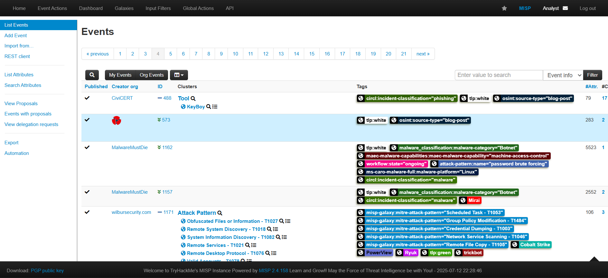
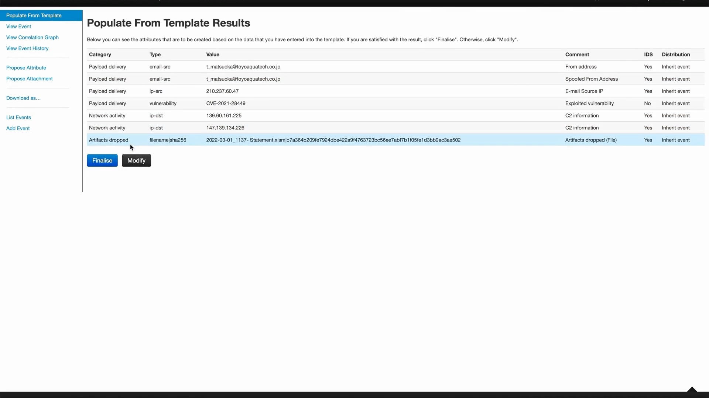

# MISP - MALWARE INFORMATION SHARING PLATFORM 🐛🔗

This room explores the MISP Malware & Threat Sharing Platform through its core objective to foster sharing of structured threat information among security analysts, malware researchers and IT professionals.

---

## Room Objectives 🎯

We will be covering the following areas within the room:  
- Introduction to MISP and why it was developed.  
- Use cases MISP can be applied to  
- Core features and terminologies.  
- Dashboard Navigation.  
- Event Creation and Management.  
- Feeds and Taxonomies.

---

## Room Prerequisites ✅

General familiarity with security concepts is recommended: check out the Pre-Security path and the Jr. Security Analyst room.

---

## Exercise Task 📝

At the end of the room, we will have an exercise task to test your knowledge of using MISP.

---

  
*A team of THM Security Analysts.*

---

## What is MISP? 🤔

MISP (Malware Information Sharing Platform) is an open-source threat information platform that facilitates the collection, storage and distribution of threat intelligence and Indicators of Compromise (IOCs) related to malware, cyber attacks, financial fraud or any intelligence within a community of trusted members.

Information sharing follows a distributed model, with supported closed, semi-private, and open communities (public). Additionally, the threat information can be distributed and consumed by Network Intrusion Detection Systems (NIDS), log analysis tools and Security Information and Event Management Systems (SIEM).

---

## Use Cases 💡

MISP is effectively useful for the following use cases:

- Malware Reverse Engineering: Sharing of malware indicators to understand how different malware families function.  
- Security Investigations: Searching, validating and using indicators in investigating security breaches.  
- Intelligence Analysis: Gathering information about adversary groups and their capabilities.  
- Law Enforcement: Using Indicators to support forensic investigations.  
- Risk Analysis: Researching new threats, their likelihood and occurrences.  
- Fraud Analysis: Sharing of financial indicators to detect financial fraud.

---

## What does MISP support? ⚙️

  
_Image showing the MISP flow of functionalities._

MISP provides the following core functionalities:

- **IOC database:** Storage of technical and non-technical information about malware samples, incidents, attackers and intelligence.  
- **Automatic Correlation:** Identification of relationships between attributes and indicators from malware, attack campaigns or analysis.  
- **Data Sharing:** Sharing information using different distribution models among different MISP instances.  
- **Import & Export Features:** Import and export of events in various formats for integration with NIDS, HIDS, OpenIOC.  
- **Event Graph:** Visualizing relationships between objects and attributes from events.  
- **API Support:** Integration with external systems to fetch and export events and intelligence.

---

## Common Terms in MISP 📚

- **Events:** Collection of contextually linked information.  
- **Attributes:** Individual data points associated with an event, such as network or system indicators.  
- **Objects:** Custom attribute compositions.  
- **Object References:** Relationships between different objects.  
- **Sightings:** Time-specific occurrences of a given data point or attribute to provide credibility.  
- **Tags:** Labels attached to events/attributes.  
- **Taxonomies:** Classification libraries used to tag, classify and organise information.  
- **Galaxies:** Knowledge base items used to label events/attributes.  
- **Indicators:** Pieces of information that can detect suspicious or malicious cyber activity.

---

## Dashboard 🖥️

The analyst's view of MISP provides functionalities to track, share and correlate events and IOCs identified during your investigation. The dashboard menu contains:

- **Home button:** Returns you to the start screen, event index, or custom home page.  
- **Event Actions:** Access creation, modification, deletion, publishing, searching and listing of events and attributes.  
- **Dashboard:** Create a custom dashboard using widgets.  
- **Galaxies:** Shortcut to the list of MISP Galaxies on the instance (see Feeds & Taxonomies Task).  
- **Input Filters:** Defines how users enter data, with validation, replacements, and blocklists.  
- **Global Actions:** View/edit profile, manual, news, terms of use, active organisations, and contribution histograms.  
- **MISP:** Link to your base URL.  
- **Name:** Logged in user's auto-generated name.  
- **Envelope:** User Dashboard for notifications and proposals.  
- **Log out:** End your session immediately.

