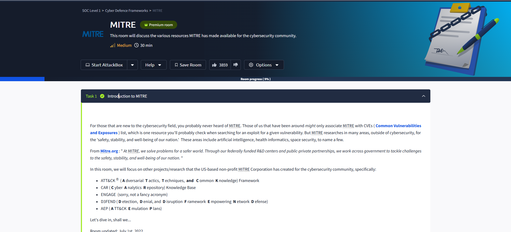
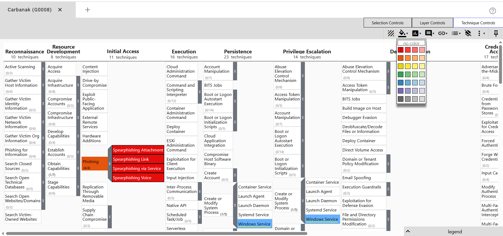
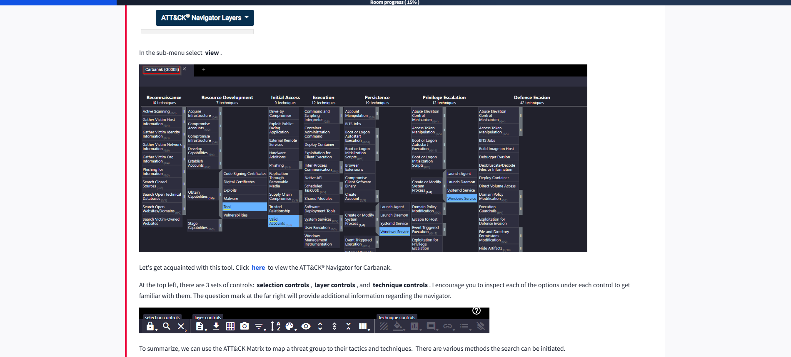

# Introduction to MITRE in Cybersecurity 🚀

If you're new to cybersecurity, you might not have heard of **MITRE**. Many seasoned professionals associate MITRE primarily with the [CVE (Common Vulnerabilities and Exposures)](https://cve.mitre.org/) list—a go-to resource for researching vulnerabilities and exploits. However, MITRE's impact extends far beyond CVEs. As a US-based non-profit, MITRE conducts research across diverse fields such as artificial intelligence 🤖, health informatics 🏥, and space security 🛰️, all with the mission to enhance the safety, stability, and well-being of our nation.

> **From [mitre.org](https://www.mitre.org/):**  
> “At MITRE, we solve problems for a safer world. Through our federally funded R&D centers and public-private partnerships, we work across government to tackle challenges to the safety, stability, and well-being of our nation.”

## Key MITRE Cybersecurity Projects 🔐

In this guide, we'll focus on several MITRE initiatives that are essential for cybersecurity professionals:

- **ATT&CK®** (Adversarial Tactics, Techniques, and Common Knowledge) Framework 🛡️  
       A globally accessible knowledge base of adversary tactics and techniques based on real-world observations.

- **CAR** (Cyber Analytics Repository) Knowledge Base 📊  
       A collection of analytics to detect adversary behaviors in network and endpoint data.

- **ENGAGE** 🤝  
       A framework for planning and executing adversary engagement operations (not an acronym, but a powerful tool!).

- **D3FEND** (Detection, Denial, and Disruption Framework Empowering Network Defense) 🧩  
       A knowledge graph of cybersecurity countermeasures mapped to ATT&CK techniques.

- **AEP** (ATT&CK Emulation Plans) 📝  
       Structured plans to emulate adversary behaviors for testing and improving defenses.

---

---
### What I Learned About Basic Terminology and MITRE ATT&CK® Framework 🛡️

Before starting with the MITRE ATT&CK® framework, I learned some important terms that are used a lot in threat intelligence:

- **APT (Advanced Persistent Threat) 🕵️‍♂️**: This stands for a group, team, or even a nation-state that carries out long-term, targeted cyberattacks against organizations or countries. The word "advanced" can be misleading—these groups don’t always use super-advanced tools or zero-day exploits. Many of their techniques are common and can be detected if you have the right security in place.

- **TTP (Tactics, Techniques, and Procedures) 🎯**:  
  - **Tactic**: The adversary’s main goal or objective (what they want to achieve).
  - **Technique**: The method or approach used to achieve that goal.
  - **Procedure**: The specific way the technique is carried out in real attacks.

At first, these terms seemed confusing, but as I worked through examples, I saw how TTPs help break down and understand attacker behavior.

---

### What I Learned About the MITRE ATT&CK® Framework 🗂️

- **MITRE ATT&CK®** is a globally-accessible knowledge base that documents real-world adversary tactics and techniques. It started in 2013 as an internal project to record how APT groups attacked Windows networks, but now covers macOS, Linux, and more.

- The **ATT&CK Matrix** is organized into 14 categories (tactics) across the top, each representing a stage in the attack lifecycle (like Initial Access, Execution, Persistence, etc.). Under each tactic, there are techniques and sometimes sub-techniques. For example, under **Initial Access**, you’ll find techniques like Phishing, which has its own sub-techniques.

- By clicking on a technique (like Phishing), I can see a dedicated page with a description, real-world procedure examples, and suggested mitigations. This helps me understand not just what the technique is, but how it’s used and how to defend against it.

- The **ATT&CK Navigator** is a tool that lets you visualize and annotate the matrix. You can use it to map out your defensive coverage, plan red/blue team exercises, or analyze how a threat group like Carbanak operates. The Navigator is simple to use and helps make sense of a lot of information quickly.

- I learned that you can search for techniques, sub-techniques, or groups directly, making it easy to find detailed information. The Navigator also lets you view and manage different layers, which is helpful for tracking multiple threats or defensive strategies.

---

### Summary 📝

The MITRE ATT&CK® framework is a powerful resource for understanding how attackers operate. By learning the basic terminology (APT, TTP) and exploring the matrix and navigator, I can map out how threat groups work, see which techniques they use, and find ways to defend against them. This framework is useful for both defenders and attackers, and it’s a key tool for anyone working in cybersecurity! 🚀
---