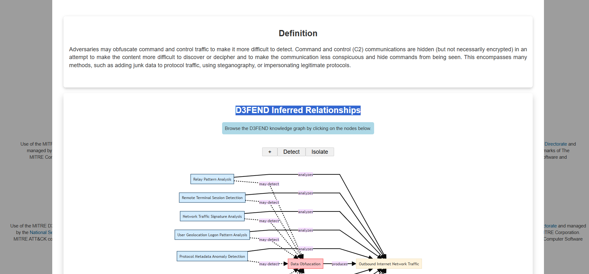

# Introduction to MITRE in Cybersecurity 🚀

If you're new to cybersecurity, you might not have heard of **MITRE**. Many seasoned professionals associate MITRE primarily with the [CVE (Common Vulnerabilities and Exposures)](https://cve.mitre.org/) list—a go-to resource for researching vulnerabilities and exploits. However, MITRE's impact extends far beyond CVEs. As a US-based non-profit, MITRE conducts research across diverse fields such as artificial intelligence 🤖, health informatics 🏥, and space security 🛰️, all with the mission to enhance the safety, stability, and well-being of our nation.

> **From [mitre.org](https://www.mitre.org/):**  
> “At MITRE, we solve problems for a safer world. Through our federally funded R&D centers and public-private partnerships, we work across government to tackle challenges to the safety, stability, and well-being of our nation.”

## Key MITRE Cybersecurity Projects 🔐

In this guide, we'll focus on several MITRE initiatives that are essential for cybersecurity professionals:

- **ATT&CK®** (Adversarial Tactics, Techniques, and Common Knowledge) Framework 🛡️  
       A globally accessible knowledge base of adversary tactics and techniques based on real-world observations.

- **CAR** (Cyber Analytics Repository) Knowledge Base 📊  
       A collection of analytics to detect adversary behaviors in network and endpoint data.

- **ENGAGE** 🤝 
       A framework for planning and executing adversary engagement operations (not an acronym, but a powerful tool!).

- **D3FEND** (Detection, Denial, and Disruption Framework Empowering Network Defense) 🧩  
       A knowledge graph of cybersecurity countermeasures mapped to ATT&CK techniques.

- **AEP** (ATT&CK Emulation Plans) 📝 
       Structured plans to emulate adversary behaviors for testing and improving defenses.

---

---
### What I Learned About Basic Terminology and MITRE ATT&CK® Framework 🛡️

Before starting with the MITRE ATT&CK® framework, I learned some important terms that are used a lot in threat intelligence:

- **APT (Advanced Persistent Threat) 🕵️‍♂️**: This stands for a group, team, or even a nation-state that carries out long-term, targeted cyberattacks against organizations or countries. The word "advanced" can be misleading—these groups don’t always use super-advanced tools or zero-day exploits. Many of their techniques are common and can be detected if you have the right security in place.

- **TTP (Tactics, Techniques, and Procedures) 🎯**:  
  - **Tactic**: The adversary’s main goal or objective (what they want to achieve).
  - **Technique**: The method or approach used to achieve that goal.
  - **Procedure**: The specific way the technique is carried out in real attacks.

At first, these terms seemed confusing, but as I worked through examples, I saw how TTPs help break down and understand attacker behavior.

---

### What I Learned About the MITRE ATT&CK® Framework 🗂️

- **MITRE ATT&CK®** is a globally-accessible knowledge base that documents real-world adversary tactics and techniques. It started in 2013 as an internal project to record how APT groups attacked Windows networks, but now covers macOS, Linux, and more.

- The **ATT&CK Matrix** is organized into 14 categories (tactics) across the top, each representing a stage in the attack lifecycle (like Initial Access, Execution, Persistence, etc.). Under each tactic, there are techniques and sometimes sub-techniques. For example, under **Initial Access**, you’ll find techniques like Phishing, which has its own sub-techniques.

- By clicking on a technique (like Phishing), I can see a dedicated page with a description, real-world procedure examples, and suggested mitigations. This helps me understand not just what the technique is, but how it’s used and how to defend against it.

- The **ATT&CK Navigator** is a tool that lets you visualize and annotate the matrix. You can use it to map out your defensive coverage, plan red/blue team exercises, or analyze how a threat group like Carbanak operates. The Navigator is simple to use and helps make sense of a lot of information quickly.

- I learned that you can search for techniques, sub-techniques, or groups directly, making it easy to find detailed information. The Navigator also lets you view and manage different layers, which is helpful for tracking multiple threats or defensive strategies.

---
---
### MITRE ATT&CK® Matrix Questions & Answers 📝

**Q: Besides Blue teamers, who else will use the ATT&CK Matrix?**  
A: **Red Teamers** 🕵️‍♂️  
The ATT&CK Matrix is not just for defenders (Blue Teamers), but also for Red Teamers who use it to plan and simulate real-world attacks.

---

**Q: What is the ID for this technique?**  
A: **T1566**  
This is the technique ID for Phishing in the ATT&CK Matrix.

---

**Q: Based on this technique, what mitigation covers identifying social engineering techniques?**  
A: **User Training** 🎓  
User training is a key mitigation to help users recognize and avoid social engineering attacks like phishing.

---

**Q: What are the data sources for Detection?**  
A: **Application Log,File,Network Traffic**  
These are the main data sources used to detect phishing and related activities.

---

**Q: Which are the first two groups to have used spear-phishing in their campaigns?**  
A: **Axiom,Gold SOUTHFIELD**  
These groups were among the first to use spear-phishing as part of their attack campaigns.

---

**Q: Based on the information for the first group, what are their associated groups?**  
A: **Group 72**  
Axiom is associated with Group 72.

---

**Q: What software is associated with this group that lists phishing as a technique?**  
A: **Hikit**  
Hikit is malware used by Axiom.

---

**Q: What is the description for this software?**  
A: **Hikit is malware that has been used by Axiom for late-stage persistence and exfiltration after the initial compromise.**

---

**Q: This group overlaps (slightly) with which other group?**  
A: **Winnti Group**  
Axiom has some overlap with the Winnti Group.

---

**Q: How many techniques are attributed to this group?**  
A: **15**  
There are 15 techniques attributed to Axiom.

---

### Next Task: CAR Knowledge Base 📚
(Continue answering the next set of questions here as you progress through the CAR Knowledge Base section.)

### What I Learned About the Cyber Analytics Repository (CAR) 📊

Cyber Analytics Repository

---
The **MITRE Cyber Analytics Repository (CAR)** is a knowledge base of analytics created by MITRE, built on top of the MITRE ATT&CK® adversary model. CAR provides a collection of validated and well-explained analytics that help detect adversary behaviors in real environments.

- **CAR Analytics** are mapped to ATT&CK techniques, sub-techniques, and tactics, making it easier to connect detection logic with real-world adversary actions.
- Each analytic includes a description, references to ATT&CK, and practical examples like pseudocode and queries for tools such as Splunk or EQL.
- **Pseudocode** in CAR is a human-readable way to describe how to detect a specific behavior, making it accessible even if you’re not an expert in a particular tool.
- Some analytics reference **Sysmon**, a Windows system monitoring tool that provides detailed event logs useful for detection.

I learned that CAR is focused on providing high-quality, validated analytics with clear explanations of how and why they work. This helps defenders understand the theory behind each analytic and how to implement it in their own environments.

You can explore the **Full Analytic List** or use the **CAR ATT&CK® Navigator layer** to see how analytics map to different ATT&CK techniques and tactics. This makes it easier to identify detection gaps and improve your security coverage! 🚀

---

### What I Learned About the CAR Data Model 🧩

Today I took a deep dive into the **MITRE CAR Data Model**, which is a structured way to organize and understand the types of data that can be collected and analyzed for cyber defense. The data model is inspired by CybOX and is designed to help security teams describe, collect, and analyze security-relevant events from both host-based and network-based perspectives.

- **Objects 🗂️**: These are the main entities or "nouns" in the data model, such as files, processes, users, network flows, emails, registry keys, and more. Each object represents something that can be monitored or acted upon in a system. For example, a "process" object could represent any running application, while a "file" object could be any file on disk.
- **Actions 🔄**: These are the "verbs"—the events or state changes that happen to objects. Examples include creating, deleting, modifying, reading, or accessing an object. Actions help describe what is happening in the environment and are crucial for detecting suspicious behavior. For instance, a "create" action on a "file" object could indicate a new file being dropped by malware.
- **Fields 🏷️**: These are the "adjectives"—the properties or attributes of objects, such as file names, hashes, user IDs, IP addresses, timestamps, and more. Fields provide the details that make analytics precise and actionable. For example, the "file_path" field tells us where a file is located, and the "md5_hash" field helps verify its integrity.

By combining objects, actions, and fields, we can create powerful queries and analytics to detect suspicious or malicious activity. For example, we can monitor when a process (object) is created (action) with a suspicious command line (field), or when a file is modified in a sensitive directory.

The data model also helps map what sensors (like Sysmon, EDRs, or network taps) can collect, and shows where there might be gaps in visibility or detection coverage. This is important for understanding the strengths and weaknesses of your security monitoring. If a sensor can't collect certain fields for an object, you might miss important events.

I also learned that the data model is used to organize analytics in a way that makes them reusable and adaptable across different environments and tools. This standardization is key for scaling detection and response capabilities in large organizations.

---

### What I Learned About CAR Analytics 📊

I also reviewed the **CAR Analytics** section, which is a curated collection of detection analytics mapped to MITRE ATT&CK® techniques and tactics. These analytics are designed to help defenders detect real-world adversary behaviors in their environments.

- Each analytic includes a clear description, references to relevant ATT&CK techniques, and practical examples like pseudocode or queries for tools such as Splunk, Logpoint, or EQL. This makes it easy to understand not just what the analytic does, but also how to implement it in your own SIEM or detection platform.
- **Pseudocode** is especially helpful because it provides a human-readable explanation of the detection logic, making it easier to understand and adapt to different tools or environments. Even if you don't use Splunk or Logpoint, you can still follow the logic and translate it to your own tools.
- Many analytics reference **Sysmon** logs, which are very useful for endpoint detection and provide detailed event data for things like process creation, file changes, and network connections. This shows how important it is to have the right logging and monitoring in place.
- The analytics cover a wide range of behaviors, from process creation and registry changes to network connections, user logins, and suspicious command executions. This variety helps ensure that defenders can detect many different types of attacks, from initial access to lateral movement and exfiltration.

I learned that CAR analytics are designed to be well-explained, validated, and actionable. They help defenders understand not just what to look for, but why it matters and how to implement it. The **Full Analytic List** and the **CAR ATT&CK® Navigator layer** make it easy to explore and identify detection opportunities or gaps in your security coverage.

Another important takeaway is that CAR analytics are mapped to ATT&CK, so you can see which adversary techniques you are able to detect and where you might need to improve. This mapping is very useful for building a detection strategy and for reporting to management or auditors.

---

### Summary of Today’s Learning 📝

- The **CAR Data Model** helps structure and organize security data for effective monitoring and detection, making it easier to describe and analyze security events. By understanding objects, actions, and fields, I can create more precise and effective analytics.
- **CAR Analytics** provide real-world, validated detection logic mapped to ATT&CK, with clear explanations and practical examples for implementation. This helps me understand how to detect a wide range of adversary behaviors.
- Using these resources, I can better understand how to build and implement analytics that detect adversary behaviors, identify gaps in my monitoring, and improve my organization’s security posture. The combination of a strong data model and actionable analytics is key to effective

---

### More About CAR Analytics and Practical Use 🟣

While exploring the CAR Knowledge Base, I noticed that the techniques highlighted in purple in the ATT&CK Navigator represent analytics that are currently available in CAR. This visual mapping makes it easy to see which adversary behaviors have validated analytics and where there might still be detection gaps.

I also looked at **CAR-2014-11-004: Remote PowerShell Sessions**. This analytic provides both pseudocode and an EQL (Event Query Language) implementation. EQL is a powerful language for querying and organizing Sysmon event data, making it easier to detect suspicious PowerShell activity across endpoints.

CAR stands out because it goes beyond the Mitigation and Detection summaries found in ATT&CK®. It offers practical, ready-to-use analytics, including code samples and even **unit tests** for some analytics (like CAR-2013-05-004), which help analysts validate their detection logic.

I also learned about other resources:
- **BZAR**: A library of Zeek (BRO) scripts for network detection.
- **Masquerading**: The technique of running executables with the same hash but different names, which is a common evasion tactic.
- **TA0003**: The ATT&CK tactic ID for **Persistence**, which covers techniques adversaries use to maintain access to systems.

### CAR Knowledge Check ✅

- **What tactic has an ID of TA0003?**  
  **Persistence** 🔄

- **What is the name of the library that is a collection of Zeek (BRO) scripts?**  
  **BZAR** 📚

- **What is the name of the technique for running executables with the same hash and different names?**  
  **Masquerading** 🎭

- **Examine CAR-2013-05-004, besides Implementations, what additional information is provided to analysts to ensure coverage for this technique?**  
  **Unit Tests** 🧪

---

**Summary:**  
CAR is a valuable resource

---

### MITRE ENGAGE 🤝

Today I explored **MITRE ENGAGE**, a framework designed to help organizations plan and execute adversary engagement operations. Unlike traditional defensive strategies, ENGAGE encourages defenders to interact with adversaries, gather intelligence, and shape attacker behavior.

#### Key Concepts

- **Adversary Engagement Approach**: ENGAGE is all about actively engaging with adversaries using two main strategies:
  - **Cyber Denial 🚫**: Preventing adversaries from achieving their objectives by blocking or disrupting their operations.
  - **Cyber Deception 🎭**: Planting fake artifacts or information to mislead, confuse, or study adversaries.

- **Starter Kit 📦**: The ENGAGE website offers a starter kit with whitepapers, checklists, and methodologies to help organizations begin implementing adversary engagement strategies.

#### The ENGAGE Matrix

Just like ATT&CK, ENGAGE has its own matrix that organizes engagement activities into categories:

- **Prepare 🛠️**: Planning and setting up operational actions to achieve your desired outcome (input).  
  - Example: **Persona Creation** (ID SAC0002), with the **Persona Profile Worksheet** as a resource.
- **Expose 🔍**: Revealing adversaries when they interact with your deception activities.
- **Affect ⚡**: Taking actions that negatively impact adversary operations.
- **Elicit 🧠**: Gathering information by observing adversary behavior and learning about their TTPs.
- **Understand 📊**: Analyzing and understanding the outcomes of your engagement activities (output).

You can interact with the **Engage Matrix Explorer** online, filtering by MITRE ATT&CK information and focusing on different parts of the engagement lifecycle. By default, the matrix focuses on **Operate** (Expose, Affect, Elicit), but you can also explore **Prepare** and **Understand**.

#### Practical Examples

- **Lures 🎣**: Engagement activities designed to bait a specific response from the adversary.
- **Threat Model 🛡️**: Defined as a risk assessment that models organizational strengths and weaknesses.

---

**Summary:**  
MITRE ENGAGE adds a proactive and interactive layer to cybersecurity by encouraging defenders to engage with and learn from adversaries, not just block them. By combining denial and deception, organizations can gather intelligence, disrupt attacks, and better understand their threats. The framework is supported by practical resources and a structured matrix, making it easier to plan and execute effective engagement operations!

---

### MITRE D3FEND 🧩

Today I explored **MITRE D3FEND**, a resource described as "a knowledge graph of cybersecurity countermeasures." D3FEND is still in beta and is funded by the NSA's Cybersecurity Directorate, but it already offers a unique way to map and understand defensive techniques in cybersecurity.

#### Key Concepts

- **D3FEND** stands for **Detection, Denial, and Disruption Framework Empowering Network Defense**.  
  It focuses on cataloging and organizing defensive techniques, much like how ATT&CK catalogs adversary techniques.

- The **D3FEND Matrix** currently contains hundreds of artifacts (408 at the time of my learning), each representing a specific defensive technique or countermeasure.

- Each artifact, such as **Decoy File**, includes:
  - **Definition 📖**: What the technique is.
  - **How it Works ⚙️**: An explanation of the technique's operation.
  - **Considerations 💡**: Things to keep in mind when implementing the technique.
  - **Example 📝**: Practical ways to use the technique.

- D3FEND allows filtering and mapping based on the ATT&CK matrix, making it easy to see which defensive techniques counter specific adversary behaviors.

#### Practical Insights

- The first MITRE ATT&CK technique listed in the ATT&CK Lookup dropdown is **Data Obfuscation** 🕵️‍♂️.
- In D3FEND Inferred Relationships, the ATT&CK technique **Data Obfuscation** produces **Outbound Internet Network Traffic** 🌐.

#### Summary

D3FEND is a promising and evolving resource that helps defenders understand, select, and implement cybersecurity countermeasures. It complements ATT&CK by focusing on the "blue team" side—how to defend against the techniques adversaries use. Even though it's still in beta, D3FEND is already a valuable tool for planning and improving network defense strategies. I’ll definitely keep an eye on it as it matures!

If these tools provided to us by MITRE are not enough, under  MITRE ENGENUITY , we have  Adversary Emulation Library , and ATT&CK ®  Emulation Plans .

---

### What I Learned About MITRE ENGENUITY, CTID, and ATT&CK® Emulation Plans 📝

MITRE has gone even further by creating **MITRE Engenuity** and the **Center for Threat-Informed Defense (CTID)**. CTID is a collaborative organization made up of companies and vendors from around the world, including AttackIQ, Verizon, Microsoft, Red Canary, and Splunk. Their mission is to research cyber threats and TTPs, and to share this research to improve cyber defense for everyone.

> Per the website:  
> "Together with Participant organizations, we cultivate solutions for a safer world and advance threat-informed defense with open-source software, methodologies, and frameworks. By expanding upon the MITRE ATT&CK knowledge base, our work expands the global understanding of cyber adversaries and their tradecraft with the public release of data sets critical to better understanding adversarial behavior and their movements."

---

#### ATT&CK® Emulation Plans

The **Adversary Emulation Library** is a public resource that provides free adversary emulation plans for blue and red teamers. These emulation plans are contributed by CTID and are designed to help organizations test their defenses against real-world threat groups.

There are several ATT&CK® Emulation Plans available, such as **APT3**, **APT29**, and **FIN6**. Each plan is a step-by-step guide on how to mimic the specific threat group’s behaviors. This is especially useful for answering questions like, "How would we fare if APT29 attacked us?"—you can refer to the results of running the emulation plan.

---

#### Practical Examples and Knowledge Check

Reviewing the emulation plans, I learned how detailed and actionable these resources are:

- **In Phase 1 for the APT3 Emulation Plan, what is listed first?**  
  **C2 Setup**  
  

- **Under Persistence, what binary was replaced with cmd.exe?**  
  **sethc.exe**  
  

- **Examining APT29, what C2 frameworks are listed in Scenario 1 Infrastructure?**  
  **Pupy,Metasploit Framework**  
  

- **What C2 framework is listed in Scenario 2 Infrastructure?**  
  **PoshC2**  
  

- **Examine the emulation plan for Sandworm. What webshell is used for Scenario 1? What is the id?**  
  **P.A.S.,S0598**

---

These emulation plans are a fantastic way to test and improve your organization’s detection and response capabilities using real adversary behaviors. They are open-source, detailed, and mapped directly to MITRE ATT&CK®, making them a valuable resource for both blue and red