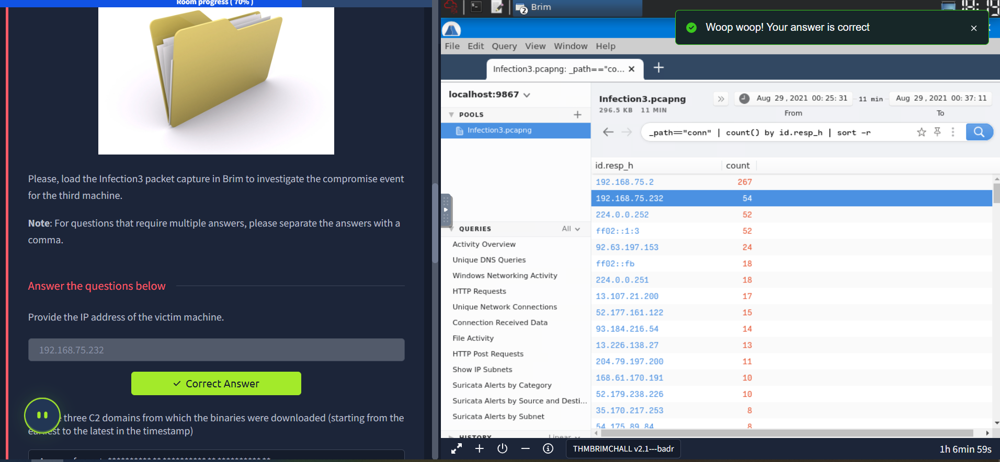
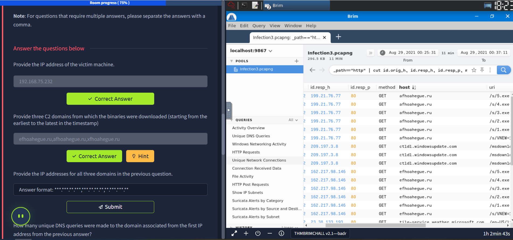
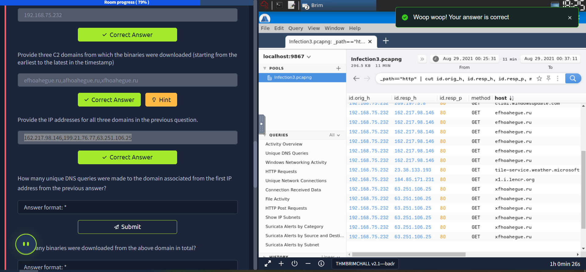
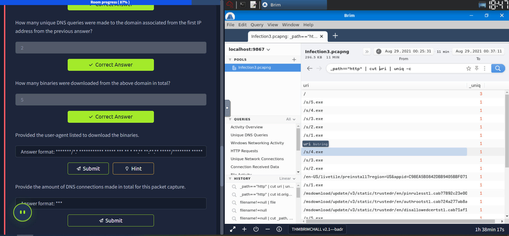
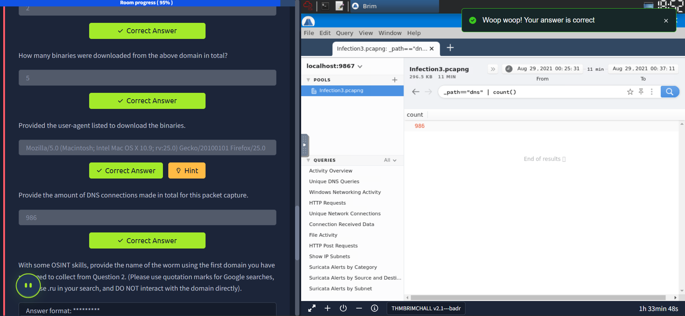
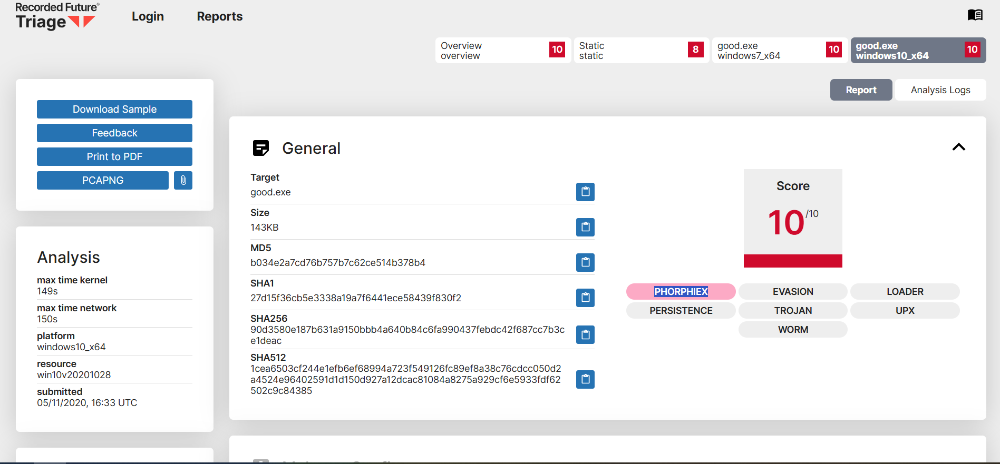

# 🕵️ Masterminds Challenge - Network Forensics Investigation

## 📋 Scenario Overview
Three machines in the Finance department at Pfeffer PLC were compromised. We suspect the initial source of the compromise happened through a phishing attempt and by an infected USB drive. The Incident Response team managed to pull the network traffic logs from the endpoints. Use Brim to investigate the network traffic for any indicators of an attack and determine who stands behind the attacks.

⚠️ **IMPORTANT NOTE**: DO NOT directly interact with any domains and IP addresses in this challenge.

## 🖥️ Setup Instructions
Deploy the machine attached to this task; it will be visible in the split-screen view once it is ready.

If you don't see a virtual machine load then click the Show Split View button.

## 🎯 Investigation Objectives
Start by loading the Infection1 packet capture in Brim to investigate the compromise event for the first machine. All the PCAPs can be found here: `/home/ubuntu/Desktop/PCAPs`

📝 **Note**: For questions that require multiple answers, please separate the answers with a comma.

---

## 🔍 Investigation Results

### 1️⃣ Victim Identification
**Question**: Provide the victim's IP address.

**Answer**: `192.168.75.249`

✅ **Correct Answer**

### 2️⃣ Suspicious Domain Analysis
**Question**: The victim attempted to make HTTP connections to two suspicious domains with the status '404 Not Found'. Provide the hosts/domains requested.

**Answer**: `cambiasuhistoria.growlab.es,www.letscompareonline.com`

✅ **Correct Answer**

### 3️⃣ Successful HTTP Connection
**Question**: The victim made a successful HTTP connection to one of the domains and received the response_body_len of 1,309 (uncompressed content size of the data transferred from the server). Provide the domain and the destination IP address.

**Answer**: `ww25.gocphongthe.com,199.59.242.153`
.png)
.png)
✅ **Correct Answer**

### 4️⃣ DNS Request Analysis
**Question**: How many unique DNS requests were made to cab[.]myfkn[.]com domain (including the capitalized domain)?

**Answer**: `7`

✅ **Correct Answer**

### 5️⃣ Malicious URI Discovery
**Question**: Provide the URI of the domain bhaktivrind[.]com that the victim reached out over HTTP.

**Answer**: `/cgi-bin/JBbb8/`

✅ **Correct Answer**

### 6️⃣ Malware Download Identification
**Question**: Provide the IP address of the malicious server and the executable that the victim downloaded from the server.

**Answer**: `185.239.243.112,catzx.exe`

✅ **Correct Answer**

### 7️⃣ Malware Classification
**Question**: Based on the information gathered from the second question, provide the name of the malware using VirusTotal.

**Answer**: `Emotet`

✅ **Correct Answer**

---

## 🎓 Key Learning Points

### 🔧 Tools Used
- **Brim**: Network traffic analysis and packet capture investigation
- **VirusTotal**: Malware identification and classification

### 🚨 Attack Indicators Identified
- Suspicious domain connections with 404 responses
- Successful HTTP connections to malicious domains
- Multiple DNS requests to suspicious domains
- Malicious URI patterns (`/cgi-bin/` directories)
- Executable file downloads from suspicious IPs

### 🦠 Malware Analysis
- **Emotet**: A notorious banking trojan and malware-as-a-service (MaaS) platform
- Known for its modular architecture and ability to deliver additional payloads
- Commonly spread through phishing emails and malicious attachments

### 🛡️ Security Implications
This investigation demonstrates the importance of:
- Network traffic monitoring and analysis
- DNS query analysis for threat detection
- File download monitoring from external sources
- Correlation of multiple indicators of compromise (IoCs)

-------------------------------------------------------------------------------------------------

## 🦠 Infection 2 - Advanced Malware Analysis

### 📋 Investigation Overview
Please, navigate to the Infection2 packet capture in Brim to investigate the compromise event for the second machine.

📝 **Note**: For questions that require multiple answers, please separate the answers with a comma.

---

## 🔍 Investigation Results - Second Machine

### 1️⃣ Victim Machine Identification
**Question**: Provide the IP address of the victim machine.

**Answer**: `192.168.75.146`

✅ **Correct Answer**

### 2️⃣ POST Connection Analysis
**Question**: Provide the IP address the victim made the POST connections to.

**Answer**: `5.181.156.252`

✅ **Correct Answer**

### 3️⃣ POST Connection Frequency
**Question**: How many POST connections were made to the IP address in the previous question?

**Answer**: `3`

✅ **Correct Answer**

### 4️⃣ Malicious Domain Discovery
**Question**: Provide the domain where the binary was downloaded from.

**Answer**: `hypercustom.top`

✅ **Correct Answer**

### 5️⃣ Malicious Binary Identification
**Question**: Provide the name of the binary including the full URI.

**Answer**: `/jollion/apines.exe`

✅ **Correct Answer**

### 6️⃣ Malicious Server IP
**Question**: Provide the IP address of the domain that hosts the binary.

**Answer**: `45.95.203.28`

✅ **Correct Answer**

### 7️⃣ Suricata Alert Analysis
**Question**: There were 2 Suricata "A Network Trojan was detected" alerts. What were the source and destination IP addresses?

**Answer**: `192.168.75.146,45.95.203.28`

✅ **Correct Answer**

### 8️⃣ Stealer Malware Classification
**Question**: Taking a look at .top domain in HTTP requests, provide the name of the stealer (Trojan that gathers information from a system) involved in this packet capture using URLhaus Database.

**Answer**: `Redline Stealer`

✅ **Correct Answer**

---

## 🎓 Key Learning Points - Infection 2

### 🔧 Advanced Tools Used
- **Brim**: Advanced packet capture analysis
- **Suricata**: Network intrusion detection system (NIDS)
- **URLhaus Database**: Malware domain and URL intelligence

### 🚨 Advanced Attack Indicators
- **POST connections** to suspicious IP addresses
- **Multiple connection attempts** (3 POST requests)
- **Malicious domain patterns** (.top domains)
- **Binary downloads** from suspicious servers
- **Suricata alerts** for network trojans
- **Information stealer** malware activity

### 🦠 Redline Stealer Analysis
- **Redline Stealer**: A sophisticated information stealer malware
- **Capabilities**: 
  - Browser credential harvesting
  - Cryptocurrency wallet theft
  - System information gathering
  - File exfiltration
  - Keylogging functionality
- **Distribution**: Often distributed through malicious downloads and phishing campaigns

### 🛡️ Security Implications
This investigation demonstrates:
- **Network monitoring** effectiveness with Suricata
- **POST request analysis** for data exfiltration detection
- **Domain reputation** checking (.top domains often used for malicious purposes)
- **Binary analysis** and malware classification
- **Multi-layered defense** with both network analysis and threat intelligence

-------------------------------------------------------------------------------------------------

## 🐛 Infection 3 - Command & Control Infrastructure Analysis

### 📋 Investigation Overview
Please, load the Infection3 packet capture in Brim to investigate the compromise event for the third machine.

📝 **Note**: For questions that require multiple answers, please separate the answers with a comma.

---

## 🔍 Investigation Results - Third Machine

### 1️⃣ Victim Machine Identification
**Question**: Provide the IP address of the victim machine.

**Answer**: `192.168.75.232`

✅ **Correct Answer**

### 2️⃣ C2 Domain Discovery
**Question**: Provide three C2 domains from which the binaries were downloaded (starting from the earliest to the latest in the timestamp)

**Answer**: `efhoahegue.ru,afhoahegue.ru,xfhoahegue.ru`

✅ **Correct Answer**

### 3️⃣ C2 Infrastructure Mapping
**Question**: Provide the IP addresses for all three domains in the previous question.

**Answer**: `162.217.98.146,199.21.76.77,63.251.106.25`

✅ **Correct Answer**

### 4️⃣ DNS Query Analysis
**Question**: How many unique DNS queries were made to the domain associated from the first IP address from the previous answer?

**Answer**: `2`
✅ **Correct Answer**

### 5️⃣ Binary Download Volume
**Question**: How many binaries were downloaded from the above domain in total?

**Answer**: `5`

✅ **Correct Answer**

### 6️⃣ User-Agent Spoofing Detection
**Question**: Provided the user-agent listed to download the binaries.

**Answer**: `Mozilla/5.0 (Macintosh; Intel Mac OS X 10.9; rv:25.0) Gecko/20100101 Firefox/25.0`

✅ **Correct Answer**

### 7️⃣ Total DNS Activity
**Question**: Provide the amount of DNS connections made in total for this packet capture.

**Answer**: `986`

✅ **Correct Answer**

### 8️⃣ OSINT Malware Identification
**Question**: With some OSINT skills, provide the name of the worm using the first domain you have managed to collect from Question 2. (Please use quotation marks for Google searches, don't use .ru in your search, and DO NOT interact with the domain directly).

**Answer**: `Phorphiex`

✅ **Correct Answer**

---

## 🎓 Key Learning Points - Infection 3

### 🔧 Advanced Analysis Tools
- **Brim**: Command & Control infrastructure analysis
- **OSINT Techniques**: Open source intelligence gathering
- **DNS Analysis**: Domain resolution and query patterns
- **User-Agent Analysis**: Browser fingerprinting and spoofing detection

### 🚨 C2 Infrastructure Indicators
- **Multiple C2 domains** with similar naming patterns (.ru domains)
- **Distributed infrastructure** across different IP addresses
- **High-volume binary downloads** (5 binaries from single domain)
- **DNS query patterns** indicating C2 communication
- **User-Agent spoofing** to evade detection
- **Massive DNS activity** (986 total connections)

### 🐛 Phorphiex Worm Analysis
- **Phorphiex**: A sophisticated worm malware family
- **Capabilities**:
  - Self-replication across networks
  - Command & Control communication
  - Data exfiltration capabilities
  - Network propagation mechanisms
- **Infrastructure**: Uses multiple C2 servers for redundancy
- **Evasion**: Employs user-agent spoofing and domain rotation

### 🛡️ Security Implications
This investigation demonstrates:
- **C2 infrastructure mapping** for threat hunting
- **DNS analysis** for detecting malicious communication
- **OSINT techniques** for malware identification
- **User-Agent analysis** for detecting spoofing attempts
- **Volume analysis** for identifying high-risk activities
- **Multi-domain C2** detection and correlation

---

## 🏆 Masterminds Challenge - Complete Analysis Summary

### 📊 Overall Investigation Results
- **3 Compromised Machines** analyzed across Finance department
- **Multiple Malware Families** identified: Emotet, Redline Stealer, Phorphiex
- **Various Attack Vectors**: Phishing, USB drives, malicious downloads
- **Sophisticated C2 Infrastructure** with domain rotation and evasion techniques

### 🎯 Key Skills Demonstrated
- **Network Forensics** with Brim
- **Malware Analysis** and classification
- **Threat Intelligence** integration
- **OSINT Research** techniques
- **Multi-layered Investigation** approach
- **Incident Response** procedures

### 🚀 Professional Development
This challenge provided hands-on experience with:
- Real-world network forensics scenarios
- Advanced malware analysis techniques
- Threat intelligence correlation
- Incident response workflows
- Security tool proficiency