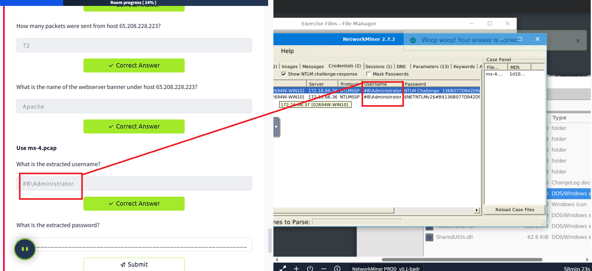

🔍 NetworkMiner

NetworkMiner is an open-source traffic sniffer, PCAP manipulator, and protocol analyzer. Developed and continuously maintained by Netresec.

## 📋 Official Description

"NetworkMiner is an open source Network Forensic Analysis Tool (NFAT) for Windows (but also works in Linux/Mac OS X/FreeBSD). NetworkMiner can be used as a passive network sniffer/packet capture tool to detect operating systems, sessions, hostnames, open ports etc. without putting any traffic on the network. NetworkMiner can also parse PCAP files for off-line analysis and to regenerate/reassemble transmitted files and certificates from PCAP files.

NetworkMiner has become, since the first release in 2007, a popular tool among incident response teams, as well as law enforcement. NetworkMiner is today used by companies and organizations worldwide."

## 🎯 Prerequisites

For this room, you will be expected to have basic Linux familiarity and network fundamentals (ports, protocols, and traffic data). We suggest completing the "Network Fundamentals" path before starting work in this room. The room aims to provide a general overview of network forensics and work with NetworkMiner to investigate captured traffic.

## 📝 Notes
- VMs are attached to this challenge. You don't need SSH or RDP; the room provides a "Split View" feature.
- Exercise files are located in the folder on the VM's Desktop
- There are two different versions of NetworkMiner available in the attached VM. Use the required version depending on tasks. Open the tool folder and double-click the .exe file

## 🕵️ Network Miner in Forensics

The ultimate goal of network forensics is to provide sufficient information to detect malicious activities, security breaches, and network anomalies based on network traffic. And NetworkMiner is an excellent tool to help, as it provides quick and useful clues about where to start, especially:

- Context of captured hosts, such as their IP and MAC, hostnames or OS information
- List of potential attack indicators or anomalies, such as traffic spikes or port scans
- Tools or toolkits used to perform potential attacks such as Nmap

## 📊 Types of Data Accepted

There are three main types of data investigated in Network Forensics:

- **Live Traffic**
- **Traffic Captures**
- **Log Files**

NetworkMiner is capable of processing and managing both packet captures (PCAP) and live traffic. Therefore, we will focus on live and captured traffic in this room.

## 🎯 NetworkMiner in a Nutshell

| Capability | Description |
|------------|-------------|
| **Traffic sniffing** | It can intercept the traffic, sniff it, and collect and log packets that pass through the network. |
| **Parsing PCAP files** | It can parse pcap files and show the content of the packets in detail. |
| **Protocol analysis** | It can identify the used protocols from the parsed pcap file. |
| **OS fingerprinting** | It can identify the used OS by reading the pcap file. This feature strongly relies on Satori and p0f. |
| **File Extraction** | It can extract images, HTML files and emails from the parsed pcap file. |
| **Credential grabbing** | It can extract credentials from the parsed pcap file. |
| **Clear text keyword parsing** | It can extract cleartext keywords and strings from the parsed pcap file. |

We are using NetworkMiner free edition in this room, but a Professional edition has much more features. You can see the differences between free and professional versions here.

## 🔧 Operating Modes

There are two main operating modes:

### 🎣 Sniffer Mode
Although it has a sniffing feature, it is not intended to use as a sniffer. The sniffing feature is available only on Windows. However, the rest of the features are available in Windows and Linux OS. Based on experience, the sniffing feature is not as reliable as other features. Therefore we suggest not using this tool as a primary sniffer. Even the official description of the tool mentions that this tool is a "Network Forensics Analysis Tool", but it can be used as a "sniffer". In other words, it is a Network Forensic Analysis Tool with but has a sniffer feature, but it is not a dedicated sniffer like Wireshark and tcpdump.

### 📦 Packet Parsing/Processing
NetworkMiner can parse traffic captures to have a quick overview and information on the investigated capture. This operation mode is mainly suggested to grab the "low hanging fruit" before diving into a deeper investigation.

## ✅❌ Pros and Cons

As mentioned in the previous task, NetworkMiner is mainly used to gain an overview of the network. Before starting to investigate traffic data, let's look at the pros and cons of the NetworkMiner.

### ✅ Pros
- OS fingerprinting
- Easy file extraction
- Credential grabbing
- Clear text keyword parsing
- Overall overview

### ❌ Cons
- Not useful in active sniffing
- Not useful for large pcap investigation
- Limited filtering
- Not built for manual traffic investigation

## 🔄 Differences Between Wireshark and NetworkMiner

NetworkMiner and Wireshark have similar base features, but they separate in use purpose. Although main functions are identical, some of the features are much stronger for specific use cases.

The best practice is to record the traffic for offline analysis, quickly overview the pcap with NetworkMiner and go deep with Wireshark for further investigation.

| Feature | NetworkMiner | Wireshark |
|---------|--------------|-----------|
| **Purpose** | Quick overview, traffic mapping, and data extraction | In-Depth analysis |
| **GUI** | ✅ | ✅ |
| **Sniffing** | ✅ | ✅ |
| **Handling PCAPS** | ✅ | ✅ |
| **OS Fingerprinting** | ✅ | ❌ |
| **Parameter/Keyword Discovery** | ✅ | Manual |
| **Credential Discovery** | ✅ | ✅ |
| **File Extraction** | ✅ | ✅ |
| **Filtering Options** | Limited | ✅ |
| **Packet Decoding** | Limited | ✅ |
| **Protocol Analysis** | ❌ | ✅ |
| **Payload Analysis** | ❌ | ✅ |
| **Statistical Analysis** | ❌ | ✅ |
| **Cross-Platform Support** | ✅ | ✅ |
| **Host Categorisation** | ✅ | ❌ |
| **Ease of Management** | ✅ | ✅ |

## 🏠 Landing Page

This is the landing page of the NetworkMiner. Once you open the application, this screen loads up.

## 📁 File Menu

The file menu helps you load a Pcap file or receive Pcap over IP. You can also drag and drop pcap files as well.

NetworkMiner also can receive Pcaps over IP. This room suggests using NetworkMiner as an initial investigation tool for low hanging fruit grabbing and traffic overview. Therefore, we will skip receiving Pcaps over IP in this room. You can read on receiving Pcap over IP from here and here.

## 🛠️ Tools Menu

The tools menu helps you clear the dashboard and remove the captured data.

## ❓ Help Menu

The help menu provides information on updates and the current version.

## 📋 Case Panel

The case panel shows the list of the investigated pcap files. You can reload/refresh, view metadata details and remove loaded files from this panel.

Viewing metadata of loaded files:

## 🖥️ Hosts

The "hosts" menu shows the identified hosts in the pcap file. This section provides information on:

- IP address
- MAC address
- OS type
- Open ports
- Sent/Received packets
- Incoming/Outgoing sessions
- Host details

OS fingerprinting uses the Satori GitHub repo and p0f, and the MAC address database uses the mac-ages GitHub repo.

You can sort the identified hosts by using the sort menu. You can change the colour of the hosts as well. Some of the features (OSINT lookup) are available only in premium mode. The right-click menu also helps you to copy the selected value.

## 🔗 Sessions

The session menu shows detected sessions in the pcap file. This section provides information on:

- Frame number
- Client and server address
- Source and destination port
- Protocol
- Start time

You can search for keywords inside frames with the help of the filtering bar. It is possible to filter specific columns of the session menu as well. This menu accepts four types of inputs:

- "ExactPhrase"
- "AllWords"
- "AnyWord"
- "RegExe"

## 🌐 DNS

The DNS menu shows DNS queries with details. This section provides information on:

- Frame number
- Timestamp
- Client and server
- Source and destination port
- IP TTL
- DNS time
- Transaction ID and type
- DNS query and answer
- Alexa Top 1M

Some of the features (Alexa Top 1M) are available only in premium mode. The search bar is available here as well.

## 🔐 Credentials

The credentials menu shows extracted credentials and password hashes from investigated pcaps. You can use Hashcat (GitHub) and John the Ripper (GitHub) to decrypt extracted credentials. NetworkMiner can extract credentials including:

- Kerberos hashes
- NTLM hashes
- RDP cookies
- HTTP cookies
- HTTP requests
- IMAP
- FTP
- SMTP
- MS SQL

The right-click menu is helpful in this part as well. You can easily copy the username and password values.

## 🎯 Answer the questions below

### Use mx-3.pcap

**What is the total number of frames?**

460

**How many IP addresses use the same MAC address with host 145.253.2.203?**

2

**How many packets were sent from host 65.208.228.223?**

72

**What is the name of the webserver banner under host 65.208.228.223?**

Apache

### Use mx-4.pcap

**What is the extracted username?**

#B\Administrator

**What is the extracted password?**

$NETNTLMv2$#B$136B077D942D9A63$FBFF3C253926907AAAAD670A9037F2A5$01010000000000000094D71AE38CD60170A8D571127AE49E00000000020004003300420001001E003000310035003600360053002D00570049004E00310036002D004900520004001E0074006800720065006500620065006500730063006F002E0063006F006D0003003E003000310035003600360073002D00770069006E00310036002D00690072002E0074006800720065006500620065006500730063006F002E0063006F006D0005001E0074006800720065006500620065006500730063006F002E0063006F006D00070008000094D71AE38CD601060004000200000008003000300000000000000000000000003000009050B30CECBEBD73F501D6A2B88286851A6E84DDFAE1211D512A6A5A72594D340A001000000000000000000000000000000000000900220063006900660073002F003100370032002E00310036002E00360036002E0033003600000000000000000000000000

## 🛠️ Tool Overview 2 - What We Learned Today

### 📁 Files

The file menu shows extracted files from investigated pcaps. This section provides information on:

- Frame number
- Filename
- Extension
- Size
- Source and destination address
- Source and destination port
- Protocol
- Timestamp
- Reconstructed path
- Details

Some features (OSINT hash lookup and sample submission) are available only in premium mode. The search bar is available here as well. The right-click menu is helpful in this part as well. You can easily open files and folders and view the file details in-depth.

### 🖼️ Images

The file menu shows extracted images from investigated pcaps. The right-click menu is helpful in this part as well. You can open files and zoom in & out easily.

Once you hover over the image, it shows the file's detailed information (source & destination address and file path).

### ⚙️ Parameters

The file menu shows extracted parameters from investigated pcaps. This section provides information on:

- Parameter name
- Parameter value
- Frame number
- Source and destination host
- Source and destination port
- Timestamp
- Details

The right-click menu is helpful in this part as well. You can copy the parameters and values easily.

### 🔍 Keywords

The file menu shows extracted keywords from investigated pcaps. This section provides information on:

- Frame number
- Timestamp
- Keyword
- Context
- Source and destination host
- Source and destination port

**How to filter keywords:**

- Add keywords
- Reload case files!

**Note:** You can filter multiple keywords in this section; however, you must reload the case files after updating the search keywords. Keyword search investigates all possible data in the processed pcaps.

### 💬 Messages

The messages menu shows extracted emails, chats and messages from investigated pcaps. This section provides information on:

- Frame number
- Source and destination host 
- Protocol
- Sender (From)
- Receiver (To)
- Timestamp
- Size

Once you filter the traffic and get a hit, you will discover additional details like attachments and attributes on the selected message. Note that the search bar is available here as well. The right-click menu is available here. You can use the built-in viewer to investigate overall information and the "open file" option to explore attachments.

### ⚠️ Anomalies

The anomalies menu shows detected anomalies in the processed pcap. Note that NetworkMiner isn't designated as an IDS. However, developers added some detections for EternalBlue exploit and spoofing attempts.

## 🎯 Answer the questions below

### Use mx-7 pcap

**What is the name of the Linux distro mentioned in the file associated with frame 63075?**

CentOS

**What is the header of the page associated with frame 75942?**

Password-Ned AB

**What is the source address of the image "ads.bmp.2E5F0FD9.bmp"?**

80.239.178.187

**What is the frame number of the possible TLS anomaly?**

36255

### Use mx-9 file

**Look at the messages. Which platform sent a password reset email?**

Facebook

**What is the email address of Branson Matheson?**

branson@sandsite.org

