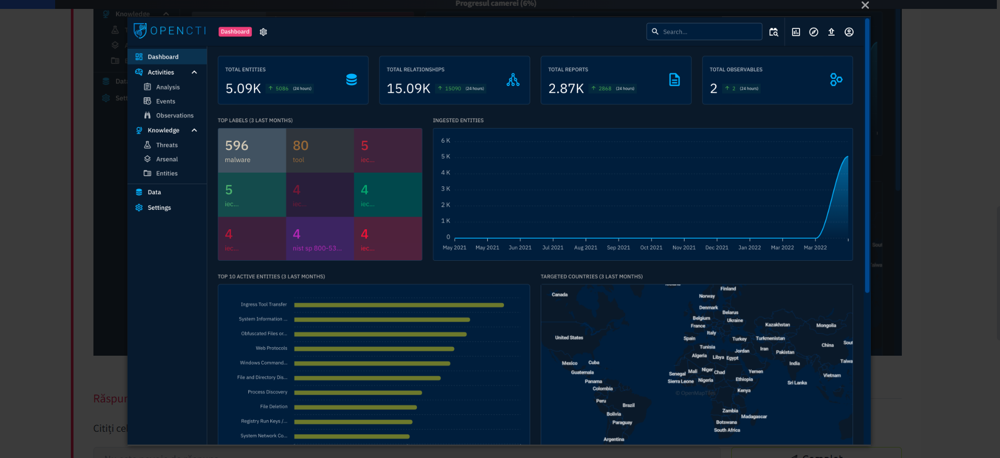
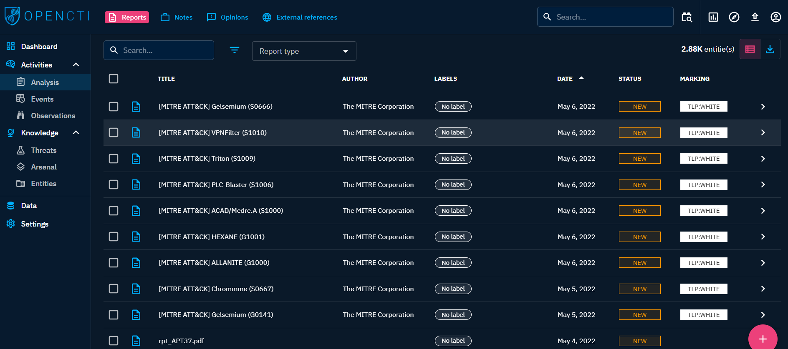
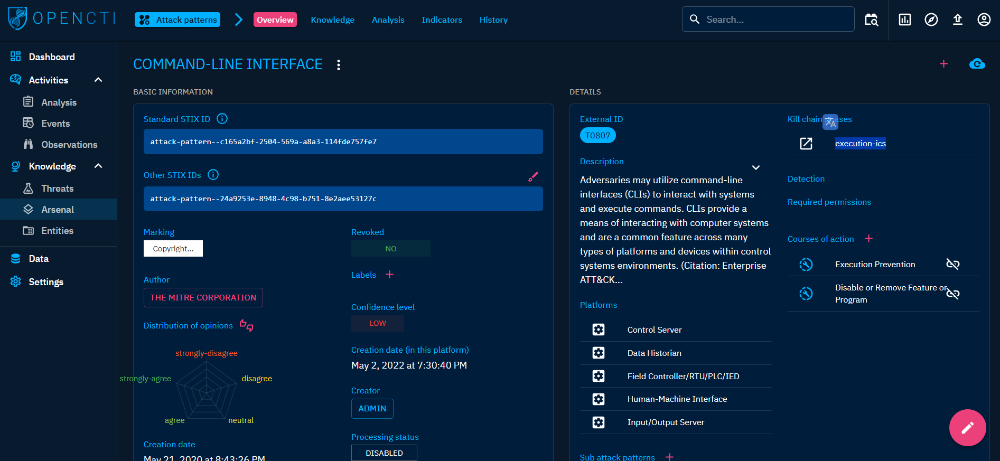

# What I Learned Today: OpenCTI 🚀

Today, I deepened my understanding of **OpenCTI**, an open-source threat intelligence platform that empowers organizations to manage, analyze, and visualize cyber threat data. Here’s what I learned:

## 🚀 What is OpenCTI?

OpenCTI is a collaborative platform developed by the French National Cybersecurity Agency (ANSSI). Its main purpose is to provide a robust tool for managing Cyber Threat Intelligence (CTI), enabling users to:

- Store, analyze, and visualize threat campaigns, malware, and IOCs.
- Build relationships between technical and non-technical information.
- Integrate with other tools like **MITRE ATT&CK**, **MISP**, and **TheHive**.

## 🗺️ Platform Navigation

- OpenCTI uses the **STIX2** standard for structuring data, making it easier to exchange and trace threat intelligence.
- Entities and relationships are at the core, helping map out the origins and connections of threat data.

## 🏗️ OpenCTI Architecture

- **GraphQL API**: Connects clients to the database and messaging system.
- **Write Workers**: Handle asynchronous queries via RabbitMQ.
- **Connectors**: Python processes for ingesting, enriching, and exporting data.

### 🔌 Types of Connectors

| Class                        | Description                                   | Examples                        |
|------------------------------|-----------------------------------------------|---------------------------------|
| External Input Connector     | Ingests info from external sources            | CVE, MISP, TheHive, MITRE       |
| Stream Connector             | Consumes platform data stream                 | History, Tanium                 |
| Internal Enrichment Connector| Enriches new entities from user requests      | Observables enrichment          |
| Internal Import File Connector| Extracts info from uploaded reports           | PDFs, STIX2 Import              |
| Internal Export File Connector| Exports info into different file formats      | CSV, STIX2 export, PDF          |

## 🔍 Key Features for Threat Analysis

- Centralized threat data management
- Visualization of relationships between threats
- Integration with other intelligence tools
- Flexible data import/export options

## 📚 My Learning Experience

Exploring OpenCTI showed me how organizations can better manage and leverage threat intelligence. The platform’s modular architecture and support for industry standards make it a powerful tool for security analysts.

---

> **Tip:** Check out the documentation for more details on configuring connectors and working with the data model!

---

## 🖥️ Hands-On with OpenCTI Dashboard

After logging in to the OpenCTI Dashboard, I noticed several visual widgets summarizing the threat data ingested into the platform. The dashboard displays the total number of entities, relationships, reports, and observables, as well as recent changes.

## 📂 Activities & Knowledge

OpenCTI organizes entities under Activities and Knowledge on the left panel:
- **Activities:** Covers security incidents ingested as reports, making it easy for analysts to investigate.
- **Knowledge:** Provides linked data about adversary tools, victims, threat actors, and campaigns.

## 📝 Analysis

The Analysis tab contains reports and associated external references. Reports are central to OpenCTI, allowing analysts to extract and process knowledge on threats and events, add investigation notes, and enrich knowledge with external resources.

## ⚡ Events

Security analysts use the Events tab to record findings and enrich threat intel by associating incidents. This helps in tracking and correlating suspicious or malicious activities.

## 👀 Observations

This tab lists technical elements, detection rules, and artifacts identified during cyber attacks. These indicators help analysts map out threat events and correlate observations with threat intelligence feeds.

## ☠️ Threats

All information classified as threatening is grouped here:
- **Threat Actors:** Individuals or groups conducting malicious actions.
- **Intrusion Sets:** Collections of TTPs, tools, and malware used by threat actors.
- **Campaigns:** Series of attacks with specific objectives, often by advanced persistent threat actors.

## 🛠️ Arsenal

Lists all items related to attacks and legitimate tools:
- **Malware:** Known malware and trojans, with details and associations.
- **Attack Patterns:** Techniques used by adversaries, such as Command-Line Interface.
- **Courses of Action:** Defensive measures mapped by MITRE.
- **Tools:** Legitimate tools that can be abused by attackers.
- **Vulnerabilities:** Software bugs and exposures, often imported via CVE connectors.

## 🌍 Entities

Entities are categorized by sectors, countries, organizations, and individuals, enriching knowledge about attacks and intrusion sets.

---

### 📝 Answers to Key Questions

- **Group using 4H RAT malware:** Putter Panda
- **Kill-chain phase for Command-Line Interface Attack Pattern:** Execution-ics 
- **Tab housing Indicators in Activities:** Observations

---

Overall, this lesson helped me understand how OpenCTI structures, analyzes, and visualizes threat intelligence, making it easier for security teams to respond to cyber threats! 🌐🔒
