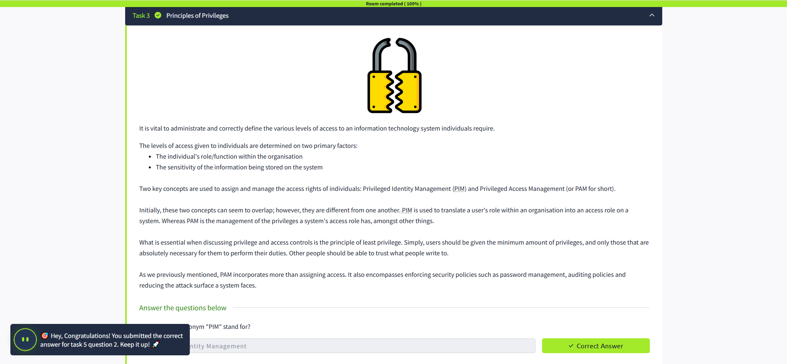
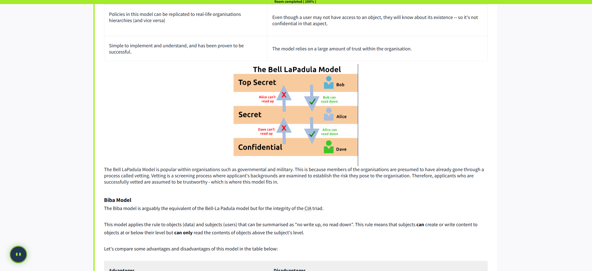
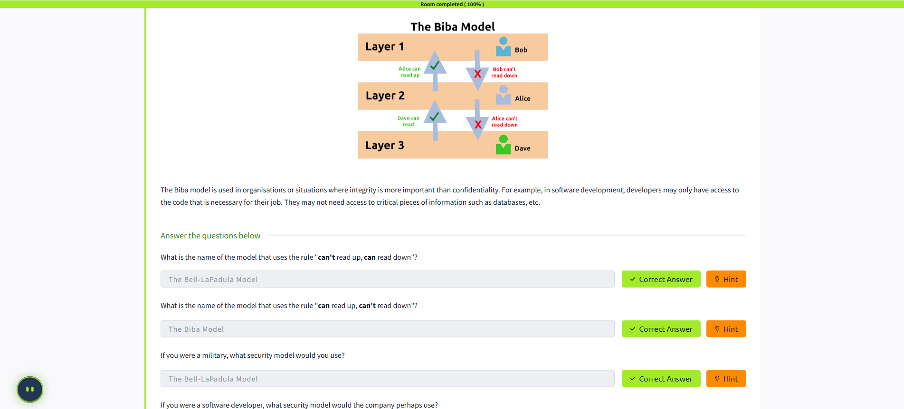

# Principles of Security 🌐🔒

This lesson outlines some of the fundamental principles of information security, including the frameworks, measures, and protocols used to protect data and systems. These elements contribute to the concept of **"Defence in Depth"** 🛡️.

## Defence in Depth 🏰
"Defence in Depth" refers to the use of multiple, varied layers of security to protect an organisation's systems and data. The idea is that multiple layers provide redundancy, strengthening the organisation's security perimeter.

---

## The CIA Triad 🔺
The **CIA Triad** is a foundational model in information security, consisting of three key principles: **Confidentiality**, **Integrity**, and **Availability**. This model helps organisations assess the value of their data and determine the level of protection required.

> ⚠️ If even one element of the CIA Triad is compromised, the other two are rendered ineffective—similar to the fire triangle. A security policy must address all three elements to be effective.

---

### 1. Confidentiality 🔐
**Confidentiality** ensures that data is protected from unauthorized access and misuse. Organisations often store sensitive data, such as employee records or financial documents, which must be safeguarded.

**Examples:**
- Employee records are accessible only to HR administrators with strict access controls.
- Governments use classification systems (e.g., top-secret, classified, unclassified) to manage sensitive information.

**Key Measures:**
- Access controls and vetting processes.
- Encryption to protect data during transmission and storage.

---

### 2. Integrity 🛡️
**Integrity** ensures that information remains accurate and consistent unless authorized changes are made. It prevents unauthorized modifications, whether accidental or malicious.

**Examples:**
- Ensuring files are not altered during storage or transmission.
- Verifying transactions with digital signatures.

**Key Measures:**
- Access control and rigorous authentication.
- Hash verifications to detect unauthorized changes.

---

### 3. Availability 📈
**Availability** ensures that data is accessible to authorized users when needed. Without availability, even the most secure data is useless.

**Examples:**
- Organisations aim for 99.99% uptime in their systems, as outlined in Service Level Agreements (SLAs).
- Downtime can harm an organisation's reputation and finances.

**Key Measures:**
- Reliable and well-tested hardware.
- Redundant systems to handle failures.
- Robust security protocols to prevent attacks.

---

By understanding and implementing the CIA Triad, organisations can build a strong foundation for their information security policies. 🌟

## Privileged Identity and Access Management 🔑

Managing access to information systems is a critical component of maintaining security. Properly defining and administrating access levels ensures that individuals have the appropriate permissions based on their roles and the sensitivity of the data they interact with.

### Key Factors in Access Management
Access levels are determined by two primary factors:
1. **The individual's role/function within the organisation.**
2. **The sensitivity of the information being stored on the system.**

### Core Concepts: PIM and PAM
Two essential methodologies are used to assign and manage access rights:
- **Privileged Identity Management (PIM):** Translates a user's role within an organisation into an access role on a system.
- **Privileged Access Management (PAM):** Manages the privileges associated with a system's access role and enforces security policies.

While these concepts may seem similar, they serve distinct purposes:
- **PIM** focuses on aligning access roles with organisational roles.
- **PAM** ensures that the privileges granted to those roles are managed securely.

### Principle of Least Privilege
A fundamental principle in access control is the **Principle of Least Privilege (PoLP)**. This principle dictates that users should only be granted the minimum privileges necessary to perform their duties. This reduces the risk of misuse or accidental damage.

### Beyond Access Assignment
PAM encompasses more than just assigning access. It also includes:
- Enforcing security policies, such as password management.
- Auditing access and usage.
- Reducing the system's attack surface.

By implementing PIM and PAM effectively, organisations can ensure robust access control and maintain trust in their systems.

---

### Quick Review Questions
1. **What does the acronym "PIM" stand for?**
       - **Answer:** Privileged Identity Management

2. **What does the acronym "PAM" stand for?**
       - **Answer:** Privileged Access Management

3. **If you wanted to manage the privileges a system access role had, what methodology would you use?**
       - **Answer:** PAM

4. **If you wanted to create a system role based on a user's role/responsibilities within an organisation, what methodology would you use?**
       - **Answer:** PIM

---

## Security Models in Practice 🏛️

Learning about security models helped me understand how organizations formally enforce the principles of the CIA triad. Here’s what stood out to me:

### 🔒 Bell-La Padula Model (Confidentiality Focused)

- **Purpose:** Protects confidentiality by ensuring users only access information they need to know.
- **Rule:** "No write down, no read up" (users can’t write to lower levels or read higher levels).
- **Where Used:** Common in government and military environments where information classification is critical.
- **Key Takeaway:** Trust is essential—users are assumed to be vetted and trustworthy.

**Advantages:**
- Easy to implement and mirrors real-world hierarchies. 🏢
- Proven to work in environments with strict confidentiality needs.

**Disadvantages:**
- Users may know about the existence of data they can’t access. 👀
- Relies heavily on trust within the organization.

---

### 🛡️ Biba Model (Integrity Focused)

- **Purpose:** Protects integrity by controlling how data can be modified or accessed.
- **Rule:** "No write up, no read down" (users can’t write to higher levels or read lower levels).
- **Where Used:** Ideal for environments where data accuracy is more important than secrecy, like software development or healthcare.

**Advantages:**
- Simple to implement and addresses both confidentiality and integrity. ✔️
- Solves some limitations of Bell-La Padula by focusing on data accuracy.

**Disadvantages:**
- Can create many access levels, making management complex. 🗂️
- May slow down business processes (e.g., a doctor can’t read a nurse’s notes).

---

### 🧠 Personal Reflection

Understanding these models made me realize that security isn’t just about technology—it’s also about policies, trust, and how people interact with information. Choosing the right model depends on what’s most important for the organization: keeping secrets safe or ensuring data is accurate and trustworthy.

---

**Conclusion:**  
Security models like Bell-La Padula and Biba provide structured ways to enforce the CIA triad. By applying the right model, organizations can better protect their data and systems. Stay curious and keep learning! 🚀🔐