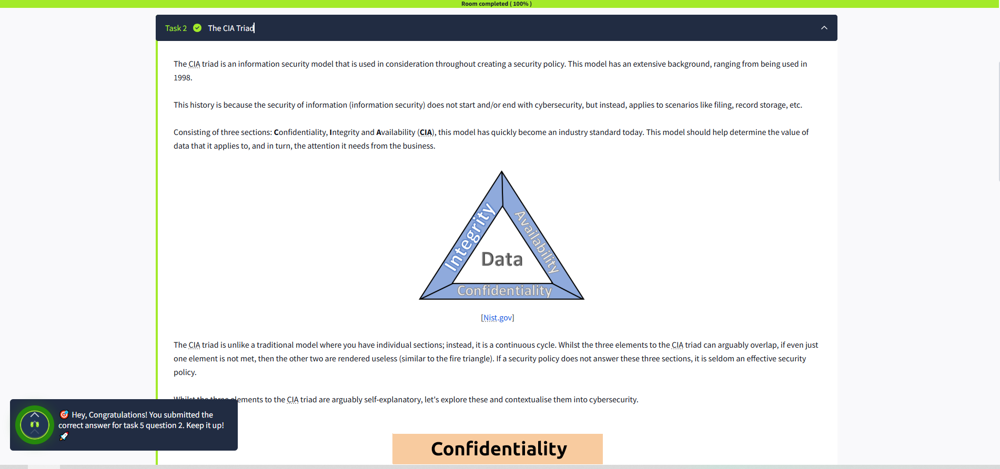

# Principles of Security 🌐🔒

This lesson outlines some of the fundamental principles of information security, including the frameworks, measures, and protocols used to protect data and systems. These elements contribute to the concept of **"Defence in Depth"** 🛡️.

## Defence in Depth 🏰
"Defence in Depth" refers to the use of multiple, varied layers of security to protect an organisation's systems and data. The idea is that multiple layers provide redundancy, strengthening the organisation's security perimeter.

---

## The CIA Triad 🔺
The **CIA Triad** is a foundational model in information security, consisting of three key principles: **Confidentiality**, **Integrity**, and **Availability**. This model helps organisations assess the value of their data and determine the level of protection required.

> ⚠️ If even one element of the CIA Triad is compromised, the other two are rendered ineffective—similar to the fire triangle. A security policy must address all three elements to be effective.

---

### 1. Confidentiality 🔐
**Confidentiality** ensures that data is protected from unauthorized access and misuse. Organisations often store sensitive data, such as employee records or financial documents, which must be safeguarded.

**Examples:**
- Employee records are accessible only to HR administrators with strict access controls.
- Governments use classification systems (e.g., top-secret, classified, unclassified) to manage sensitive information.

**Key Measures:**
- Access controls and vetting processes.
- Encryption to protect data during transmission and storage.

---

### 2. Integrity 🛡️
**Integrity** ensures that information remains accurate and consistent unless authorized changes are made. It prevents unauthorized modifications, whether accidental or malicious.

**Examples:**
- Ensuring files are not altered during storage or transmission.
- Verifying transactions with digital signatures.

**Key Measures:**
- Access control and rigorous authentication.
- Hash verifications to detect unauthorized changes.

---

### 3. Availability 📈
**Availability** ensures that data is accessible to authorized users when needed. Without availability, even the most secure data is useless.

**Examples:**
- Organisations aim for 99.99% uptime in their systems, as outlined in Service Level Agreements (SLAs).
- Downtime can harm an organisation's reputation and finances.

**Key Measures:**
- Reliable and well-tested hardware.
- Redundant systems to handle failures.
- Robust security protocols to prevent attacks.

---

By understanding and implementing the CIA Triad, organisations can build a strong foundation for their information security policies. 🌟

