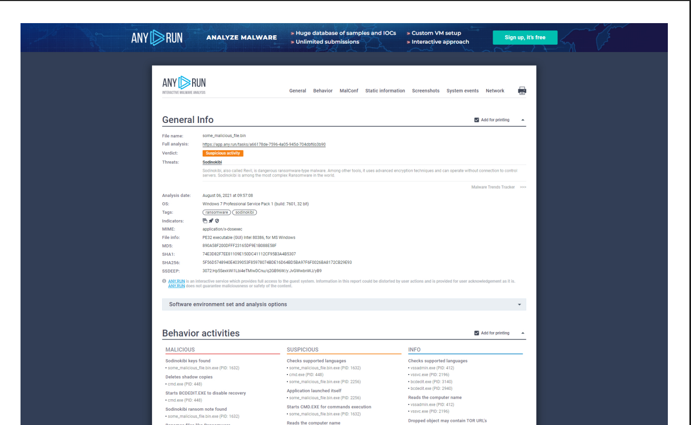
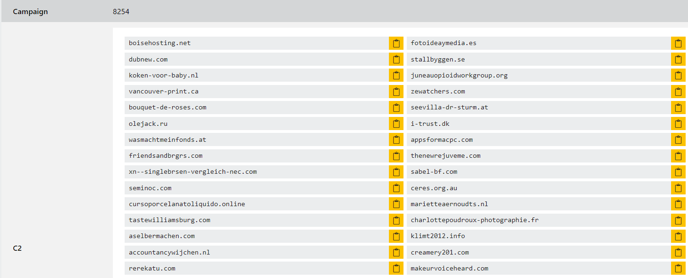
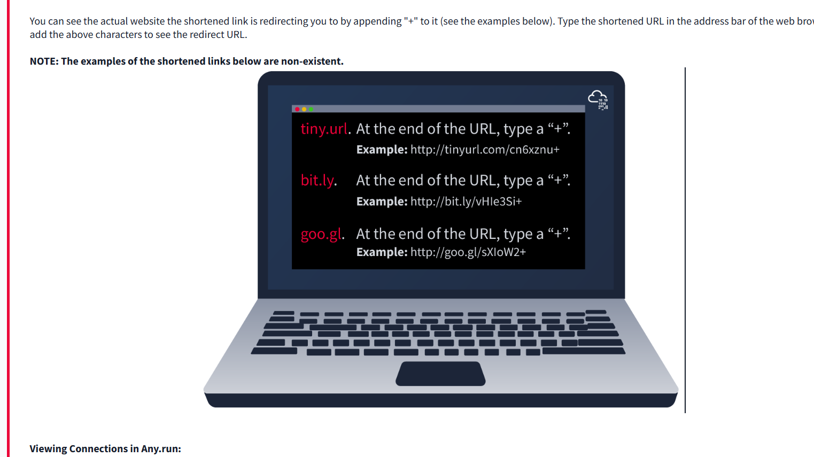
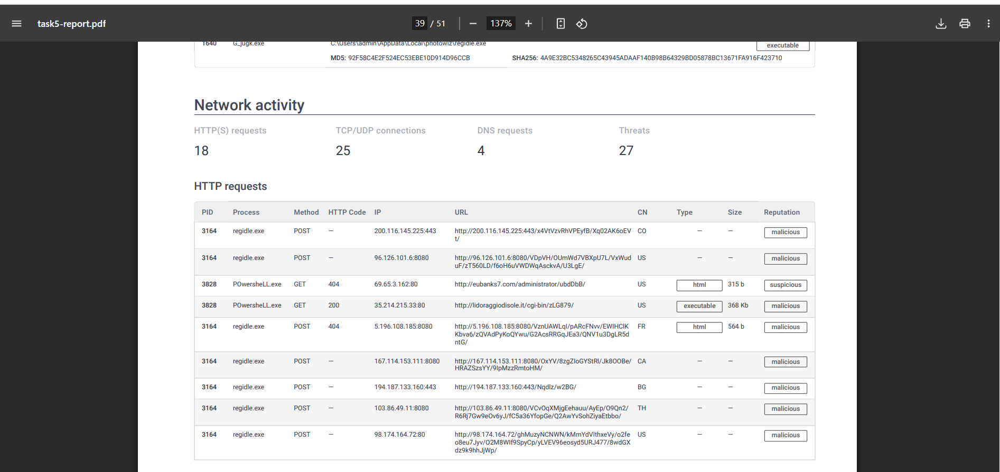
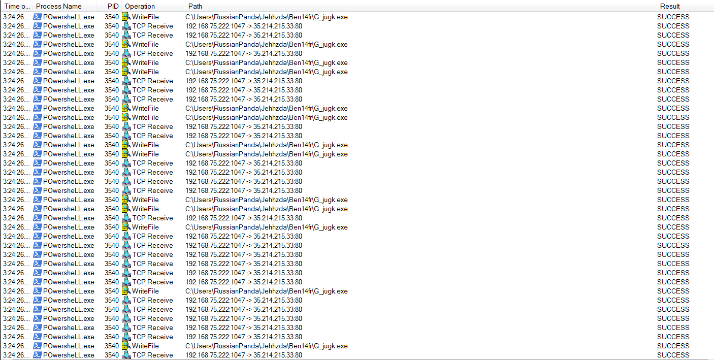
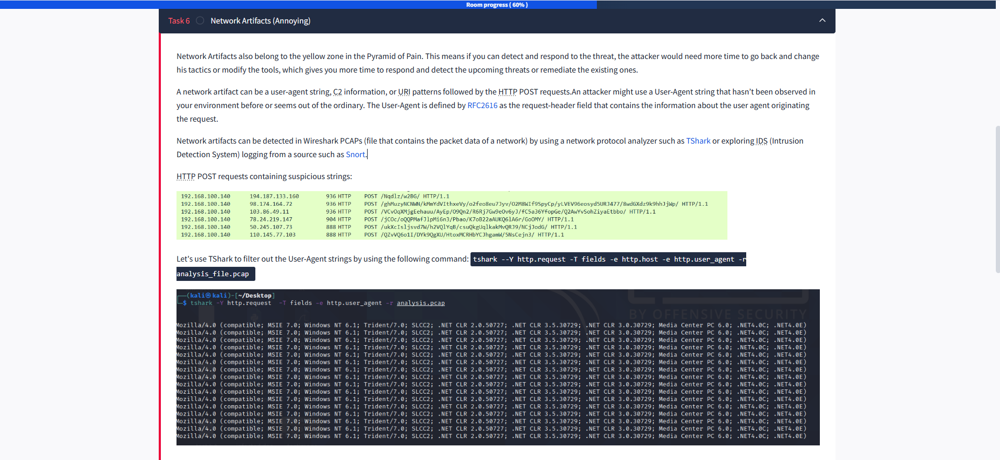
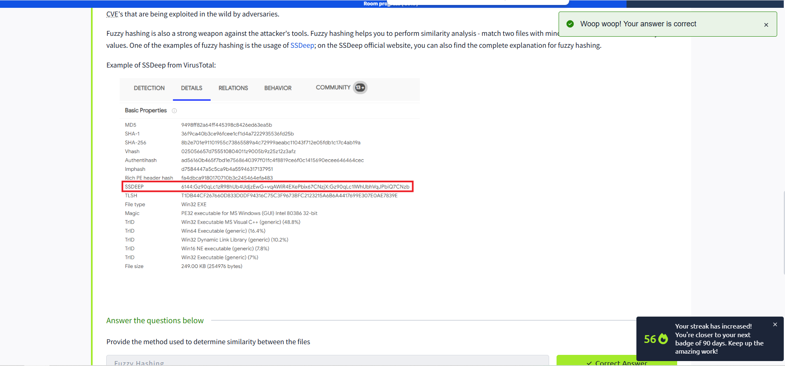

# 🛡️ Pyramid of Pain: Cybersecurity Insights


The **Pyramid of Pain** is a renowned concept applied in cybersecurity solutions like **Cisco Security**, **SentinelOne**, and **SOCRadar** to boost the effectiveness of:

- 🕵️‍♂️ **Cyber Threat Intelligence (CTI)**
- 🔍 **Threat Hunting**
- 🚨 **Incident Response**

Understanding the Pyramid of Pain is crucial for **Threat Hunters**, **Incident Responders**, and **SOC Analysts**.

---

## 🔎 What is the Pyramid of Pain?

Are you ready to explore what hides inside the Pyramid of Pain? Let’s dive in!

---


## 🧩 Hash Values: The Basics

> **Hash Value:**  
> A numeric value of fixed length that uniquely identifies data, generated by a hashing algorithm.

### Common Hashing Algorithms

| Algorithm | Description | Security Status |
|-----------|-------------|----------------|
| **MD5**   | 128-bit hash, defined by RFC 1321, designed by Ron Rivest (1992). | ❌ Not secure (collisions possible) |
| **SHA-1** | 160-bit hash, defined by RFC 3174, invented by NSA (1995). | ❌ Deprecated (brute-force attacks) |
| **SHA-2** | Multiple variants (e.g., SHA-256), designed by NIST & NSA (2001). | ✅ Secure (recommended) |

> **Note:**  
> A hash is **not secure** if two files can have the same hash (collision).

---

## 🦠 Hashes in Malware Analysis

Security professionals use hash values to:

- Identify malware samples
- Reference suspicious files
- Share IOCs (Indicators of Compromise)

You’ll often see hashes in ransomware reports (e.g., [The DFIR Report](https://thedfirreport.com/), [Trellix Threat Research Blogs](https://www.trellix.com/en-us/about/newsroom/stories/threat-labs.html)).

---

## 🛠️ Online Hash Lookup Tools

### 🦠 VirusTotal

Below the hash, you’ll see the filename (e.g., `m_croetian.wnry`).

### ☁️ MetaDefender Cloud - OPSWAT

---

## ⚡ How Easy Is It to Change a Hash?

Even a single bit change in a file creates a new hash!  
**Example:**

```powershell
# Before modification
Get-FileHash .\OpenVPN_2.5.1_I601_amd64.msi -Algorithm MD5
# Output: D1A008E3A606F24590A02B853E955CF7

# Modify the file
echo "AppendTheHash" >> .\OpenVPN_2.5.1_I601_amd64.msi

# After modification
Get-FileHash .\OpenVPN_2.5.1_I601_amd64.msi -Algorithm MD5
# Output: 9D52B46F5DE41B73418F8E0DACEC5E9F
```

---

## ❓ Questions

1. **Analyse the report associated with the hash `b8ef959a9176aef07fdca8705254a163b50b49a17217a4ff0107487f59d4a35d` [here](https://www.virustotal.com/gui/file/b8ef959a9176aef07fdca8705254a163b50b49a17217a4ff0107487f59d4a35d/details). What is the filename of the sample?**

---

## 🌐 IP Addresses in the Pyramid of Pain

An **IP address** identifies any device on a network (PCs, servers, cameras, etc.).

- In the Pyramid of Pain, IP addresses are marked **green** 🟩.
- Blocking malicious IPs is a common defense, but attackers can easily switch IPs.

### Example: Malicious IP Connections


> **Note:**  
> _Do not interact with the IP addresses shown above!_

---

## 🌀 Fast Flux: Evasion Technique

**Fast Flux** is a DNS technique used by botnets to hide malicious activities behind constantly changing IP addresses.

- Multiple IPs are associated with a single domain.
- Makes it hard for defenders to block or track.

> For a detailed scenario, see:  
> [Fast Flux 101 by Palo Alto](https://unit42.paloaltonetworks.com/fast-flux-101/)

---

## 📑 Further Reading

- [The DFIR Report](https://thedfirreport.com/)
- [Trellix Threat Research Blogs](https://www.trellix.com/en-us/about/newsroom/stories/threat-labs.html)
- [VirusTotal](https://www.virustotal.com/)
- [MetaDefender Cloud](https://metadefender.opswat.com/)

---

> **Ready to level up your threat hunting skills?** 🚀


# 🛡️ Fast Flux: Techniques for Cyber Resilience and Evasion

> ⚠️ **NOTE!** Do not interact with the IP addresses shown above.

## 📌 What is Fast Flux?

Fast Flux is a DNS technique used by **botnets** to hide malicious activities such as:
- 🧪 malware delivery
- 🕵️ phishing
- 🌐 malicious web proxies
- 🧬 communication with command and control (C&C) servers

🎯 **Goal:** To make it harder for security analysts to detect and block malicious infrastructure.

---

## 🔄 How Does Fast Flux Work?

- Associates **multiple IP addresses** with a single domain name that **constantly changes**.
- The botnet uses **compromised hosts** as proxies to relay traffic to the real servers.
- IPs are **rapidly rotated** via DNS, making takedowns and denylisting extremely difficult.

📚 Example: Palo Alto Networks explains this well in their fictional scenario:  
**"Fast Flux 101: How Cybercriminals Improve the Resilience of Their Infrastructure"**

---

## 📊 Executive Summary

Fast Flux helps attackers:
- 🔐 protect their malicious infrastructure
- ⏫ maintain uptime of illegal operations
- 💸 avoid revenue loss from phishing, scams, botnet rentals, and gambling sites

🆚 While similar to legal practices like RRDNS or CDNs, the **purpose is malicious**.

🔁 Rapid IP rotation via DNS → makes takedowns and denylisting harder

---

## 🧠 Advanced Techniques

### 1️⃣ Single Fast Flux  
- Only the frontend IP addresses change frequently.

### 2️⃣ Double Flux  
- 🔀 DNS resolution (NS records) is also part of the fast flux network → even harder to eliminate.

### 3️⃣ DGA (Domain Generation Algorithms)  
- 🧮 Automatically generates new domain names daily/periodically → nearly impossible to block without the algorithm.

---

## 🕵️‍♂️ Real-World Use Cases

1. 🎭 **Scam campaigns** – social engineering pages in various languages  
2. 🐍 **Smoke Loader malware** – fast flux domains used for C2 infrastructure  
3. 🎰 **Illegal sites (adult content / gambling)** – hosted on resilient, fast-fluxed infrastructures

---

## 🔒 Protection Measures

🛡️ Palo Alto Networks protects against fast flux and DGA-based threats using:
- 🔍 Advanced classifiers
- 📦 Services like URL Filtering and DNS Security

---

> ✍️ Written by:  
**Janos Szurdi, Rebekah Houser, Daiping Liu**  
📅 Published: March 2, 2021  
🏷️ Tags: Botnet, DGA, Double Flux, Phishing, Scam, Malware


## 🟦 Domain Names: Next Level in the Pyramid of Pain

Let's climb higher on the Pyramid of Pain and talk about **Domain Names**! Notice how the color shifts from green (IP addresses) to teal, showing increased difficulty for attackers.

---

### 🌐 What is a Domain Name?

A **domain name** maps an IP address to a human-readable string (like `evilcorp.com`).  
- **Format:**  
       - Domain + Top-Level Domain: `evilcorp.com`
       - Subdomain + Domain + TLD: `tryhackme.evilcorp.com`

We won't dive deep into DNS here, but if you're curious, check out the ["DNS in Detail" Room](#).



---

### 🛡️ Why Are Domains Harder to Change?

Attackers need to:
- Purchase/register a domain
- Set up DNS records

But, many DNS providers have loose standards and APIs, making it easier for attackers to swap domains quickly.

---

### 🚩 Malicious Domains in Action

**Example:** Sodinokibi C2 (Command & Control) domains



Can you spot anything suspicious? Compare it to a legitimate website below.

---

### 🕵️‍♂️ Punycode Attacks

Attackers use **Punycode** to create domains that look legitimate but are malicious.

> **What is Punycode?**  
> "Punycode is a way of converting words that cannot be written in ASCII, into a Unicode ASCII encoding." — *Jamf*

**Example:**  
- Looks like: `adıdas.de`  
- Real Punycode: `http://xn--addas-o4a.de/`

Modern browsers (Chrome, Edge, Safari, etc.) now display the true Punycode to help users spot fakes.

---

### 🔎 Detecting Malicious Domains

- Analyze **proxy logs** or **web server logs** for suspicious domains.
- Attackers often use **URL shorteners** to hide malicious links.

**Common URL Shorteners:**
- `bit.ly`
- `goo.gl`
- `ow.ly`
- `s.id`
- `smarturl.it`
- `tiny.pl`
- `tinyurl.com`
- `x.co`

> **Tip:**  
> Add a `+` at the end of a shortened URL (e.g., `tinyurl.com/example+`) to preview the destination.

*Note: The examples above are non-existent and safe.*

---

### 🧪 Analyzing Connections in Any.run

**Any.run** is a sandbox that detonates malware samples and shows their network activity.

#### 🕸️ Tabs to Explore:
- **HTTP Requests:** See what files/resources are fetched (e.g., droppers, callbacks).
- **Connections:** View all communications (e.g., C2 traffic, FTP uploads).
- **DNS Requests:** Check which domains the malware tries to resolve.

> ⚠️ **Caution:**  
> Never visit IPs or URLs from malware reports—they are likely dangerous!

---

### 📝 Quick Quiz

1. **First suspicious domain in the Any.run report:**  
        `craftingalegacy.com`

2. **What term refers to an address used to access websites?**  
        🏷️ **Domain Name**

3. **What type of attack uses Unicode characters in the domain name to imitate a known domain?**  
        🕵️ **Punycode attack**

4. **Preview the redirected website for:**  
        `https://tinyurl.com/bw7t8p4u+`  
        ➡️ `https://tryhackme.com/`

---

Ready to keep climbing the Pyramid of Pain? 🚀




## 🟨 Host Artifacts: Climbing Higher on the Pyramid

Let's take another step up to the **yellow zone** of the Pyramid of Pain.

At this level, defenders focus on **host artifacts**—the traces attackers leave on compromised systems. Detecting these artifacts forces attackers to change their tools and techniques, which is time-consuming and resource-intensive for them.



### 🖥️ What Are Host Artifacts?

Host artifacts include:
- Registry changes
- Suspicious process executions
- Unique attack patterns or IOCs (Indicators of Compromise)
- Files dropped or modified by malware
- Any evidence specific to the current threat

#### Examples:

- **Suspicious process execution from Word:**  
        Attackers may use Microsoft Word to launch malicious processes.

- **Events after opening a malicious application:**  
        Unusual system events or new processes may appear.

- **Files dropped by malware:**  
        Malicious executables or scripts are often left behind.

---

## 📝 Knowledge Check

A security vendor analyzed a malicious sample. Here’s what I learned from reviewing the report:

1. **A process named `regidle.exe` makes a POST request to an IP address in the US on port 8080. What is the IP address?**  
         **Answer:** `96.126.101.6`

2. **The actor drops a malicious executable (EXE). What is the name of this executable?**  
         **Answer:** `G_jugk.exe`

3. **According to the VirusTotal report, how many vendors determine this host to be malicious?**  
         *(Check the report for the exact number.)*

---

## 🟨 Network Artifacts: Deepening Detection in the Yellow Zone

Network artifacts are also part of the **yellow zone** in the Pyramid of Pain. Detecting these artifacts means attackers must invest more effort to change their tactics or tools, giving defenders a valuable time advantage for response and remediation.



### 🌐 What Are Network Artifacts?

A **network artifact** can include:
- User-Agent strings
- Command and Control (C2) information
- URI patterns in HTTP requests

For example, attackers may use a **User-Agent** string that is unusual or never seen before in your environment. According to [RFC2616](https://datatracker.ietf.org/doc/html/rfc2616), the User-Agent header identifies the client software making the request.

### 🕵️ Detecting Network Artifacts

Network artifacts can be found by:
- Analyzing **PCAP files** (packet captures) in tools like **Wireshark** or **TShark**
- Reviewing **IDS logs** from systems like **Snort**

#### Example: Filtering User-Agent Strings with TShark

```sh
tshark --Y http.request -T fields -e http.host -e http.user_agent -r analysis_file.pcap
```

This command extracts HTTP host and User-Agent fields from a PCAP file.

### 🦠 Emotet Downloader Trojan: User-Agent Patterns

Certain malware, like the **Emotet Downloader Trojan**, often uses distinctive User-Agent strings. Detecting these custom strings can help you block malicious traffic and disrupt attacker operations.

> **Tip:** Monitoring for rare or suspicious User-Agent strings can reveal attacker activity and provide opportunities for proactive defense.

---

## 📝 Knowledge Check

1. **What browser uses the User-Agent string shown in the screenshot above?**  
        *(Refer to the screenshot for the answer.)*

---

## 🟧 Tools: The Orange Zone of the Pyramid of Pain

At this stage, we've advanced our detection capabilities to focus on **tools** used by attackers. When defenders can reliably detect and block these tools, adversaries face a much higher barrier—they may abandon their efforts, invest resources to develop or acquire new tools, or adapt their tactics.

Attackers often leverage utilities to create malicious macro documents (maldocs) for spearphishing, deploy backdoors to establish command and control (C2), or use custom `.exe` and `.dll` files, payload droppers, and password crackers.

**Example:**  
A Trojan drops a suspicious file named `stealer.exe` in the Temp directory:

*Execution of the suspicious binary:*



At this level, defenders can use **antivirus signatures**, **detection rules**, and **YARA rules** as powerful weapons against attacker tools.

- **MalwareBazaar** and **Malshare** are valuable resources for accessing malware samples, threat intelligence feeds, and YARA results—useful for threat hunting and incident response.
- For detection rules, the **SOC Prime Threat Detection Marketplace** is an excellent platform where security professionals share rules for various threats, including those exploiting the latest CVEs.

### 🔎 Fuzzy Hashing: Detecting Similar Tools

**Fuzzy hashing** is a technique that helps analysts identify files with similar content, even if they are not identical. This is especially useful when attackers make small changes to evade traditional hash-based detection.

- **SSDEEP** is a popular fuzzy hashing tool. The [official SSDEEP website](https://ssdeep-project.github.io/ssdeep/) provides a detailed explanation of fuzzy hashing.

**Example of SSDEEP output from VirusTotal:**

*(Insert relevant screenshot or output here)*

---

### 📝 Knowledge Check

1. **What method is used to determine the similarity between files?**  
        **Answer:** Fuzzy Hashing

2. **What is the alternate name for fuzzy hashes (without abbreviation)?**  
        **Answer:** Context Triggered Piecewise Hashes

---


## 🟥 TTPs: The Tip of the Pyramid of Pain

It's not over yet—good news, we've reached the final stage: the tip of the Pyramid of Pain! Here, we focus on **TTPs**: Tactics, Techniques, and Procedures. These represent the *how* behind an attack—everything adversaries do, from initial access (like phishing) to persistence, lateral movement, and data exfiltration.

Detecting and responding to TTPs is the most effective way to disrupt attackers. If you can spot behaviors such as a **Pass-the-Hash (PtH) attack** using Windows Event Log monitoring and respond quickly, you can identify compromised hosts and stop lateral movement before significant damage occurs. At this stage, attackers are forced to either:

- Go back, retrain, and retool (which is costly and time-consuming)
- Give up and move on to an easier target

**Option 2 is often the path of least resistance for adversaries.**

---

### 📝 Knowledge Check

1. **Navigate to the ATT&CK Matrix web page. How many techniques fall into the exfiltration category?**  
        **Answer:** 9

2. **Chimera is a China-based hacking group active since 2018. What remote access tool do they use for C2 beacons and data exfiltration?**  
        **Answer:** Cobalt Strike

3. **What is a Pass-the-Hash (PtH) Attack?**  
        A PtH attack is when an attacker captures a password hash (not the actual password) and uses it to authenticate and move laterally within a network. The attacker doesn't need to decrypt the hash—just pass it along. This is most common on Windows systems, exploiting protocols like NTLM and Kerberos. Hashes can be obtained from memory, the SAM database, LSASS process, or Active Directory.

        - **Pass-the-Ticket** is a similar attack, but it uses stolen Kerberos tickets instead of password hashes.

---

### 🛡️ How to Prevent Pass-the-Hash Attacks

- **Least Privilege:** Limit admin rights to reduce the attack surface.
- **Password Management:** Rotate passwords frequently, especially after compromise. Use one-time passwords (OTPs) where possible.
- **Separation of Privileges:** Use separate accounts for admin and non-admin tasks to limit lateral movement.

By focusing on detecting and disrupting TTPs, defenders force attackers to invest significant time and resources, making your environment a much harder target.

---

**Congratulations! You've reached the top of the Pyramid of Pain and learned how to defend against even the most advanced adversary behaviors.** 🚀

