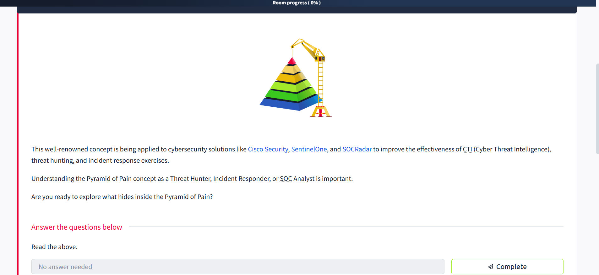
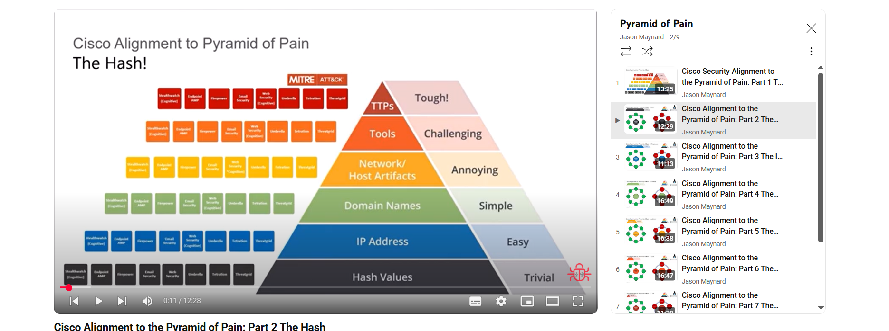
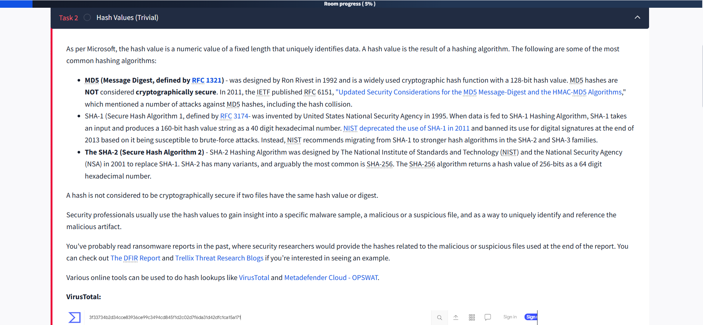
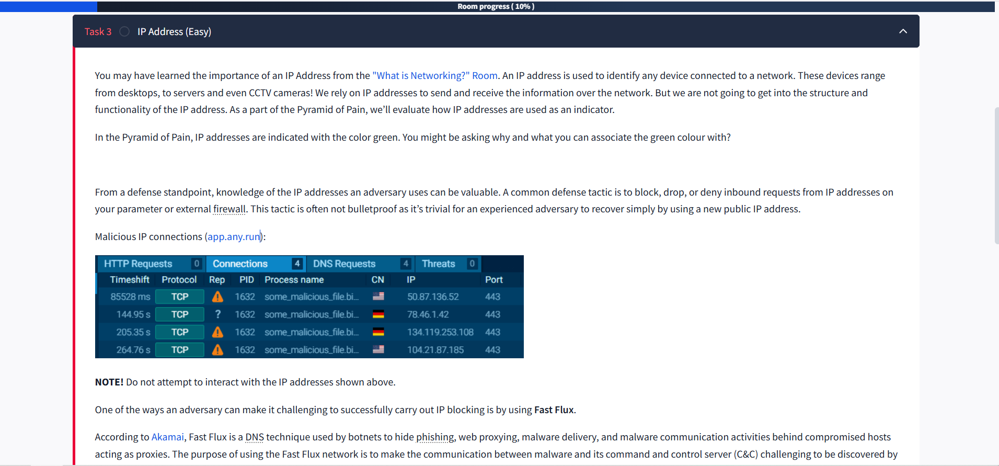
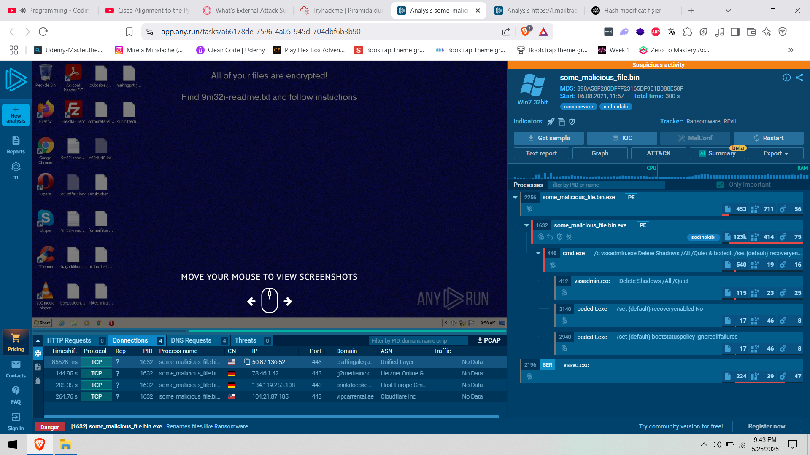

# 🛡️ Pyramid of Pain: Cybersecurity Insights


The **Pyramid of Pain** is a renowned concept applied in cybersecurity solutions like **Cisco Security**, **SentinelOne**, and **SOCRadar** to boost the effectiveness of:

- 🕵️‍♂️ **Cyber Threat Intelligence (CTI)**
- 🔍 **Threat Hunting**
- 🚨 **Incident Response**

Understanding the Pyramid of Pain is crucial for **Threat Hunters**, **Incident Responders**, and **SOC Analysts**.

---

## 🔎 What is the Pyramid of Pain?

Are you ready to explore what hides inside the Pyramid of Pain? Let’s dive in!

---


## 🧩 Hash Values: The Basics

> **Hash Value:**  
> A numeric value of fixed length that uniquely identifies data, generated by a hashing algorithm.

### Common Hashing Algorithms

| Algorithm | Description | Security Status |
|-----------|-------------|----------------|
| **MD5**   | 128-bit hash, defined by RFC 1321, designed by Ron Rivest (1992). | ❌ Not secure (collisions possible) |
| **SHA-1** | 160-bit hash, defined by RFC 3174, invented by NSA (1995). | ❌ Deprecated (brute-force attacks) |
| **SHA-2** | Multiple variants (e.g., SHA-256), designed by NIST & NSA (2001). | ✅ Secure (recommended) |

> **Note:**  
> A hash is **not secure** if two files can have the same hash (collision).

---

## 🦠 Hashes in Malware Analysis

Security professionals use hash values to:

- Identify malware samples
- Reference suspicious files
- Share IOCs (Indicators of Compromise)

You’ll often see hashes in ransomware reports (e.g., [The DFIR Report](https://thedfirreport.com/), [Trellix Threat Research Blogs](https://www.trellix.com/en-us/about/newsroom/stories/threat-labs.html)).

---

## 🛠️ Online Hash Lookup Tools

### 🦠 VirusTotal

Below the hash, you’ll see the filename (e.g., `m_croetian.wnry`).

### ☁️ MetaDefender Cloud - OPSWAT

---

## ⚡ How Easy Is It to Change a Hash?

Even a single bit change in a file creates a new hash!  
**Example:**

```powershell
# Before modification
Get-FileHash .\OpenVPN_2.5.1_I601_amd64.msi -Algorithm MD5
# Output: D1A008E3A606F24590A02B853E955CF7

# Modify the file
echo "AppendTheHash" >> .\OpenVPN_2.5.1_I601_amd64.msi

# After modification
Get-FileHash .\OpenVPN_2.5.1_I601_amd64.msi -Algorithm MD5
# Output: 9D52B46F5DE41B73418F8E0DACEC5E9F
```

---

## ❓ Questions

1. **Analyse the report associated with the hash `b8ef959a9176aef07fdca8705254a163b50b49a17217a4ff0107487f59d4a35d` [here](https://www.virustotal.com/gui/file/b8ef959a9176aef07fdca8705254a163b50b49a17217a4ff0107487f59d4a35d/details). What is the filename of the sample?**

---

## 🌐 IP Addresses in the Pyramid of Pain

An **IP address** identifies any device on a network (PCs, servers, cameras, etc.).

- In the Pyramid of Pain, IP addresses are marked **green** 🟩.
- Blocking malicious IPs is a common defense, but attackers can easily switch IPs.

### Example: Malicious IP Connections



> **Note:**  
> _Do not interact with the IP addresses shown above!_

---

## 🌀 Fast Flux: Evasion Technique

**Fast Flux** is a DNS technique used by botnets to hide malicious activities behind constantly changing IP addresses.

- Multiple IPs are associated with a single domain.
- Makes it hard for defenders to block or track.

> For a detailed scenario, see:  
> [Fast Flux 101 by Palo Alto](https://unit42.paloaltonetworks.com/fast-flux-101/)

---

## 📑 Further Reading

- [The DFIR Report](https://thedfirreport.com/)
- [Trellix Threat Research Blogs](https://www.trellix.com/en-us/about/newsroom/stories/threat-labs.html)
- [VirusTotal](https://www.virustotal.com/)
- [MetaDefender Cloud](https://metadefender.opswat.com/)

---

> **Ready to level up your threat hunting skills?** 🚀

