# 🚨 Snort Exercise - Network Traffic Analysis Challenge

The room invites you to a challenge to investigate a series of traffic data and stop malicious activity under two different scenarios. Let's start working with Snort to analyze live and captured traffic.

> **💡 Recommendation**: Complete the Snort room first, which will teach you how to use the tool in depth.

## 📁 Exercise Files

Exercise files for each task are located on the desktop as follows:

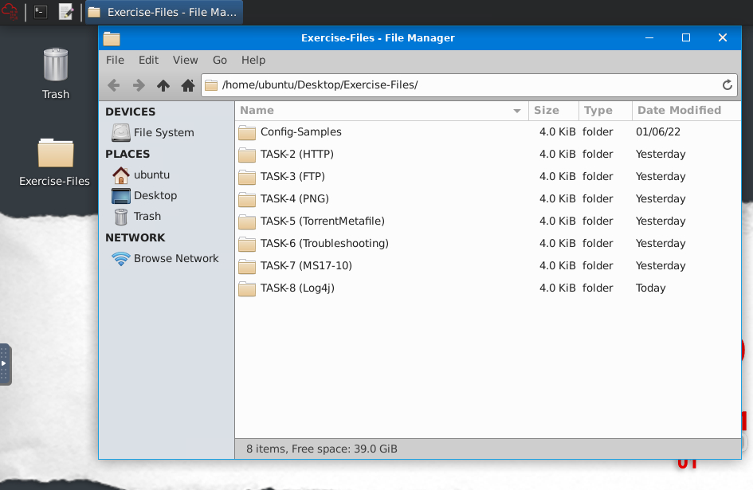

---

## 🔍 Task 1: Writing IDS Rules (HTTP)

### Commands Used:
```bash
sudo snort -r snort.log.1753562780 -n 65  
sudo snort -c local.rules -A full -l . -r mx-3.pcap
```

### Local Rules Configuration:
```bash
# ----------------
# LOCAL RULES
# ----------------
# This file intentionally does not come with signatures. Put your local
# additions here.

alert tcp any 80 <> any any (msg:"TCP port 80 found"; sid:100001; rev:1;)
```

---

## 🎯 Challenge: Create IDS Rules for HTTP Traffic!

**Instructions**: Navigate to the task folder and use the given pcap file. Write a rule to detect all TCP packets from or to port 80.

### 📊 Questions & Answers

#### 1️⃣ **What is the number of detected packets you got?**

> **Note**: You must answer this question correctly before answering the rest of the questions.

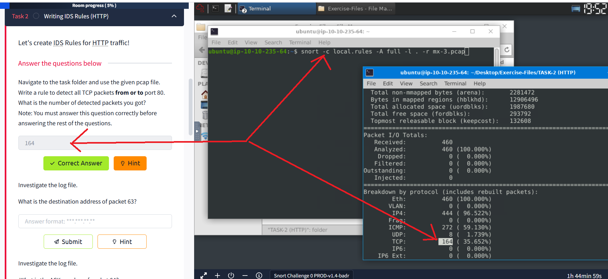

**Answer**: `164`

✅ **Correct Answer**

💡 **Hint**: Investigate the log file.

---

#### 2️⃣ **What is the destination address of packet 63?**

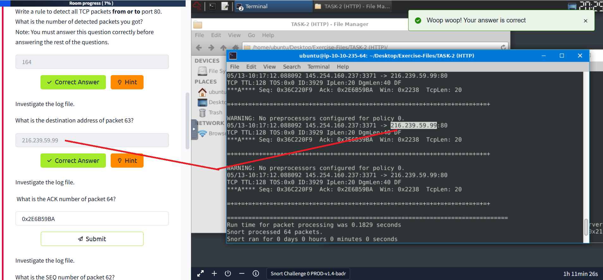

**Answer**: `216.239.59.99`

✅ **Correct Answer**

💡 **Hint**: Investigate the log file.

---

#### 3️⃣ **What is the ACK number of packet 64?**

**Answer**: `0x2E6B5384`

✅ **Correct Answer**

💡 **Hint**: Investigate the log file.

---

#### 4️⃣ **What is the SEQ number of packet 62?**

**Answer**: `0x36C21E28`

✅ **Correct Answer**

💡 **Hint**: Investigate the log file.

---

#### 5️⃣ **What is the TTL of packet 65?**

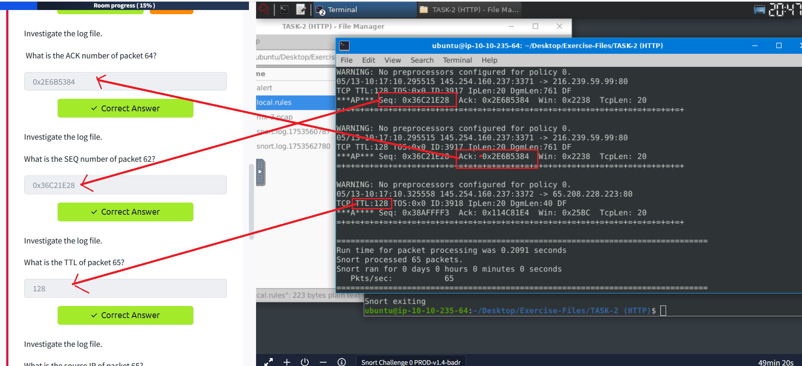

**Answer**: `128`

✅ **Correct Answer**

💡 **Hint**: Investigate the log file.

---

#### 6️⃣ **What is the source IP of packet 65?**

**Answer**: `145.254.160.237`

✅ **Correct Answer**

💡 **Hint**: Investigate the log file.

---

#### 7️⃣ **What is the source port of packet 65?**

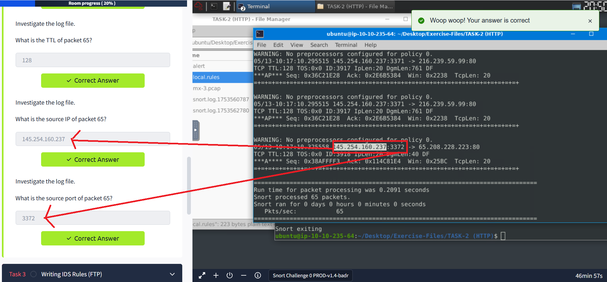

**Answer**: `3372`

✅ **Correct Answer**

---

## 🎉 Exercise Complete!


---

## 🛡️ Exercise 2: Writing IDS Rules (FTP)

Let's create IDS Rules for FTP traffic! 🚦

**Instructions:**
- Navigate to the task folder.
- Use the given pcap file for analysis.

---

### 1️⃣ Write a rule to detect all TCP port 21 traffic in the given pcap

**What is the number of detected packets?**

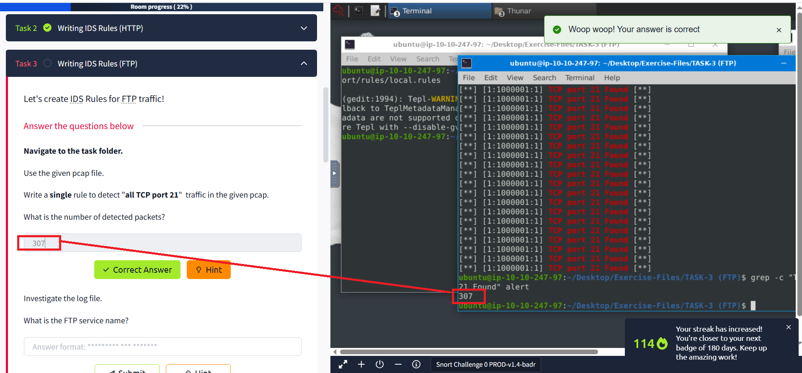
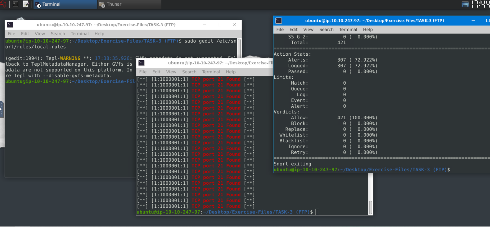

**Answer:** `307`

✅ **Correct Answer**

💡 **Hint:** Investigate the log file.

---

### 2️⃣ What is the FTP service name?

**Answer:** `Microsoft FTP Service`

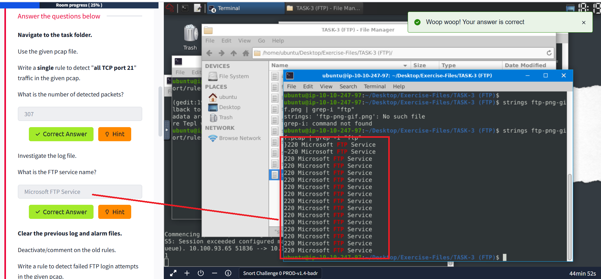

✅ **Correct Answer**

💡 **Hint:** Clear the previous log and alarm files.

📝 *Tip: Deactivate or comment out the old rules before proceeding!*

---

### 3️⃣ Write a rule to detect failed FTP login attempts in the given pcap

**What is the number of detected packets?**

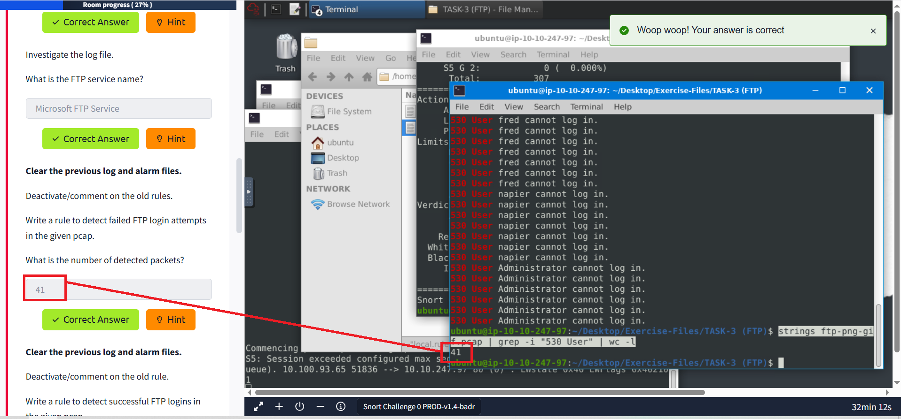

**Answer:** `41`

✅ **Correct Answer**

💡 **Hint:** Clear the previous log and alarm files.

📝 *Tip: Deactivate or comment out the old rule before proceeding!*

---

### 4️⃣ Write a rule to detect successful FTP logins in the given pcap

**What is the number of detected packets?**

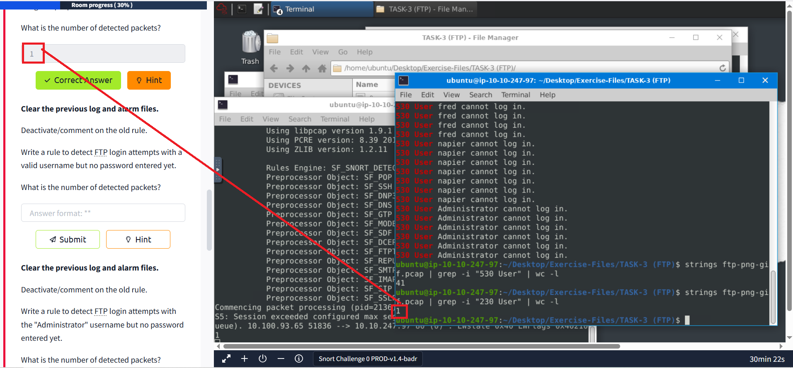

**Answer:** `1`

✅ **Correct Answer**

💡 **Hint:** Clear the previous log and alarm files.

📝 *Tip: Deactivate or comment out the old rule before proceeding!*

---

### 5️⃣ Write a rule to detect FTP login attempts with a valid username but no password entered yet

**What is the number of detected packets?**

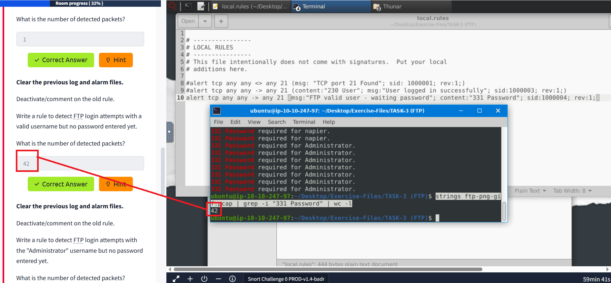

**Answer:** `42`

✅ **Correct Answer**

💡 **Hint:** Clear the previous log and alarm files.

📝 *Tip: Deactivate or comment out the old rule before proceeding!*

---

### 6️⃣ Write a rule to detect FTP login attempts with the "Administrator" username but no password entered yet

**What is the number of detected packets?**

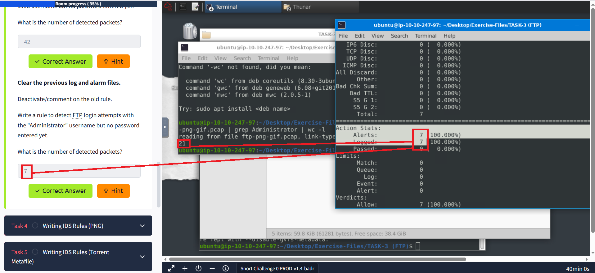

**Answer:** `7`

✅ **Correct Answer**

💡 **Hint:** Clear the previous log and alarm files.

📝 *Tip: Deactivate or comment out the old rule before proceeding!*

---

## 📝 Useful Commands & Rule Examples

```bash
# Navigate to the exercise folder
cd /home/ubuntu/Desktop/Exercise-Files/TASK-3\ (FTP)/
ls -l

# Run Snort with your rules
sudo snort -c local.rules -r ftp-png-gif.pcap -A console

# Example rule to detect all TCP port 21 traffic
alert tcp any any <> any 21 (msg: "TCP port 21 Found"; sid: 1000001; rev:1;)

grep "TCP port 21 Found" alert
grep -c "TCP port 21 Found" alert

# Find Administrator logins
strings ftp-png-gif.pcap | grep -i "Administrator" | wc -l

# Rule for valid user, waiting for password
alert tcp any any -> any 21 (msg:"FTP valid user - waiting password"; content:"331 Password"; sid:1000004; rev:1;)

# Rule for Administrator login, waiting for password
alert tcp any any -> any 21 (msg:"FTP login Administrator waiting password"; content:"Administrator"; content:"331 Password"; sid:1000006; rev:1;)

grep "FTP login Administrator waiting password" alert | wc -l
tcpdump -nn -r ftp-png-gif.pcap | grep Administrator

# Output files
> alert
> snort.log.*
```
## 🎉 Exercise Complete!

---

## 🖼️ Exercise 3: Writing IDS Rules (PNG)

Let's create IDS Rules for PNG files in the traffic! 📸

**Instructions:**
- Navigate to the task folder.
- Use the given pcap file for analysis.

---

### 1️⃣ Write a rule to detect the PNG file in the given pcap

**Investigate the logs and identify the software name embedded in the packet.**

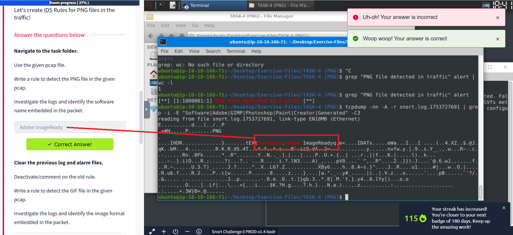

**Answer:** `Adobe ImageReady`

✅ **Correct Answer**

💡 **Hint:** Clear the previous log and alarm files.

📝 *Tip: Deactivate or comment out the old rule before proceeding!*

---

### 2️⃣ Write a rule to detect the GIF file in the given pcap

**Investigate the logs and identify the image format embedded in the packet.**

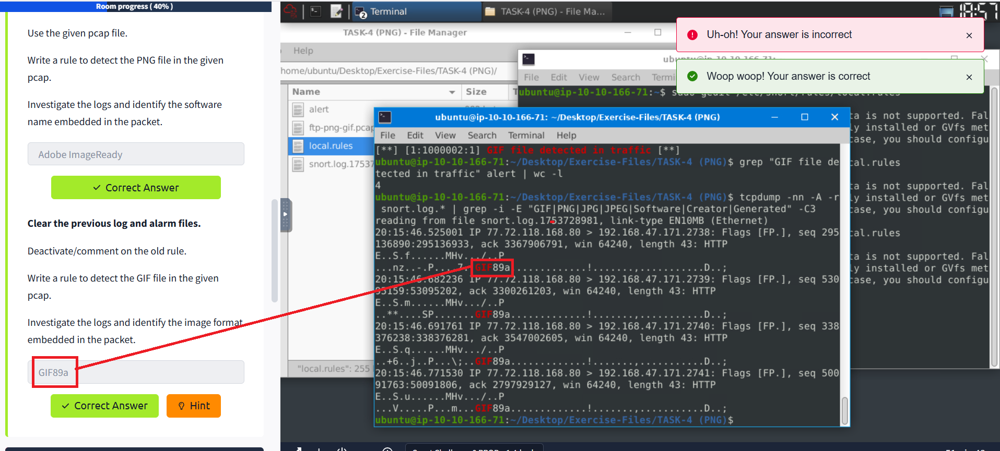

**Answer:** `GIF89a`

✅ **Correct Answer**

---

## 🎉 Exercise Complete!


## 🌊 Exercise 4: Writing IDS Rules (Torrent Metafile)

Let's create IDS Rules for torrent metafiles in the traffic! ⚡

**Instructions:**
- Navigate to the task folder.
- Use the given pcap file for analysis.

---

### 1️⃣ Write a rule to detect the torrent metafile in the given pcap

**What is the number of detected packets?**

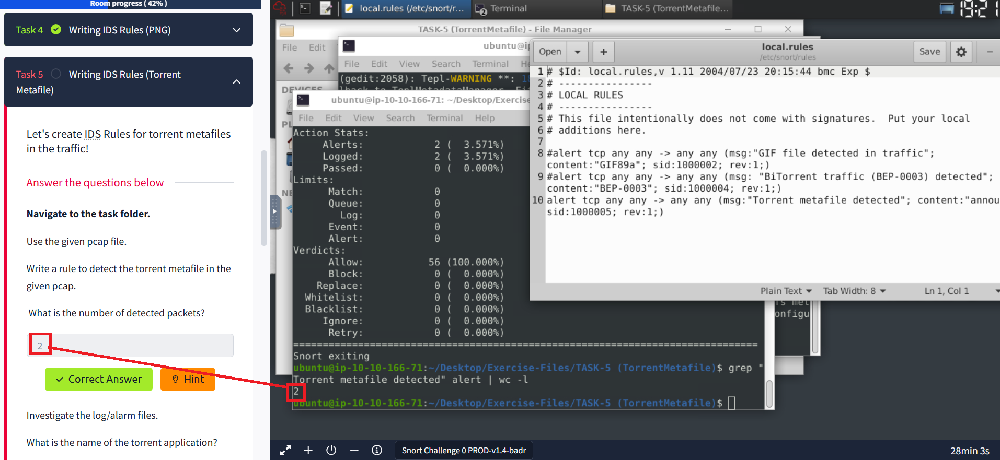

**Answer:** `2`

✅ **Correct Answer**

💡 **Hint:** Investigate the log/alarm files.

---

### 2️⃣ What is the name of the torrent application?

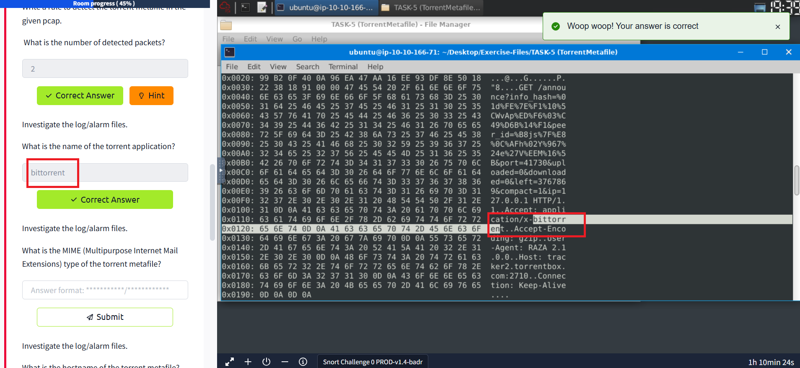

**Answer:** `bittorrent`

✅ **Correct Answer**

💡 **Hint:** Investigate the log/alarm files.

---

### 3️⃣ What is the MIME (Multipurpose Internet Mail Extensions) type of the torrent metafile?

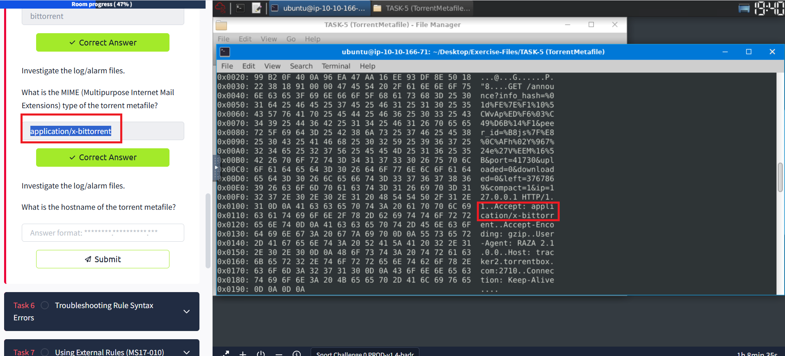

**Answer:** `application/x-bittorrent`

✅ **Correct Answer**

💡 **Hint:** Investigate the log/alarm files.

---

### 4️⃣ What is the hostname of the torrent metafile?

**Answer:** `tracker2.torrentbox.com`

✅ **Correct Answer**

## 🎉 Exercise Complete!


## 🔧 Exercise 6: Troubleshooting Rule Syntax Errors

Let's troubleshoot rule syntax errors! 🛠️

**Instructions:**
- In this section, you need to fix the syntax errors in the given rule files.
- You can test each ruleset with the following command structure:

```bash
sudo snort -c local-X.rules -r mx-1.pcap -A console
```

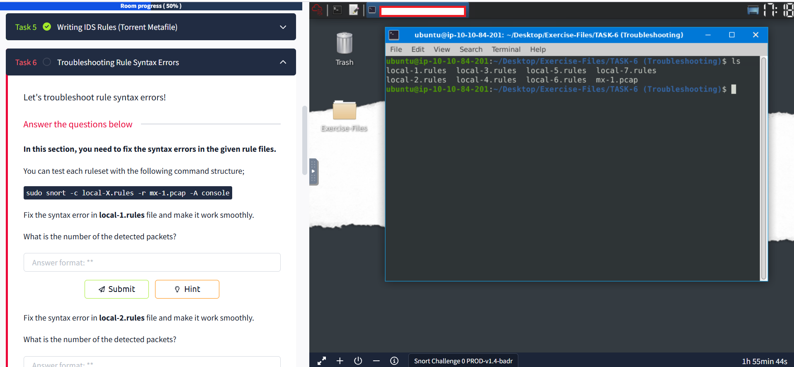

---

### 1️⃣ Fix the syntax error in local-1.rules file and make it work smoothly

**What is the number of the detected packets?**

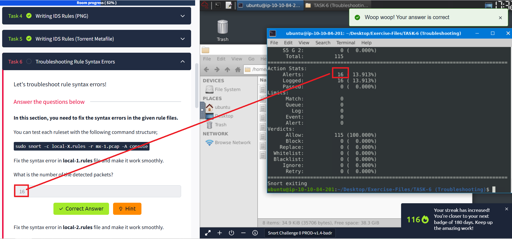

**Answer:** `16`

✅ **Correct Answer**

💡 **Hint:** Check for missing semicolons and proper syntax.

---

### 2️⃣ Fix the syntax error in local-2.rules file and make it work smoothly

**What is the number of the detected packets?**

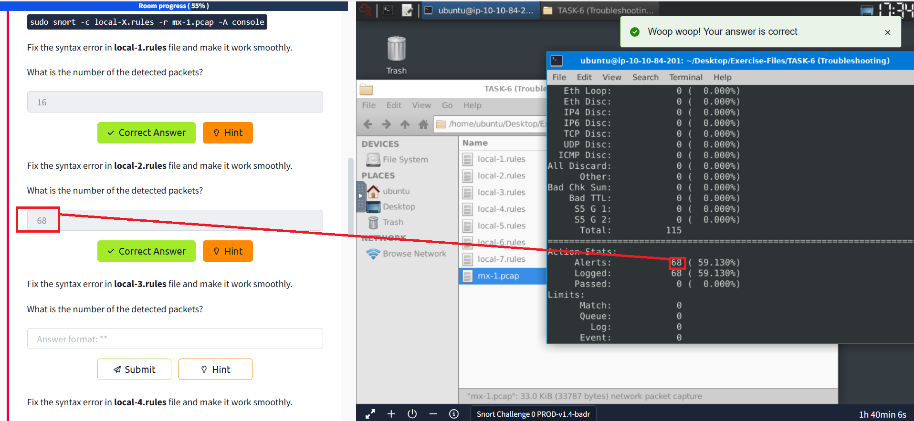

**Answer:** `68`

✅ **Correct Answer**

💡 **Hint:** Verify rule structure and content matching.

---

### 3️⃣ Fix the syntax error in local-3.rules file and make it work smoothly

**What is the number of the detected packets?**

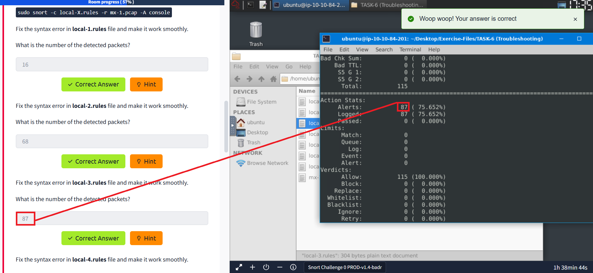

**Answer:** `87`

✅ **Correct Answer**

💡 **Hint:** Check for proper rule formatting and options.

---

### 4️⃣ Fix the syntax error in local-4.rules file and make it work smoothly

**What is the number of the detected packets?**

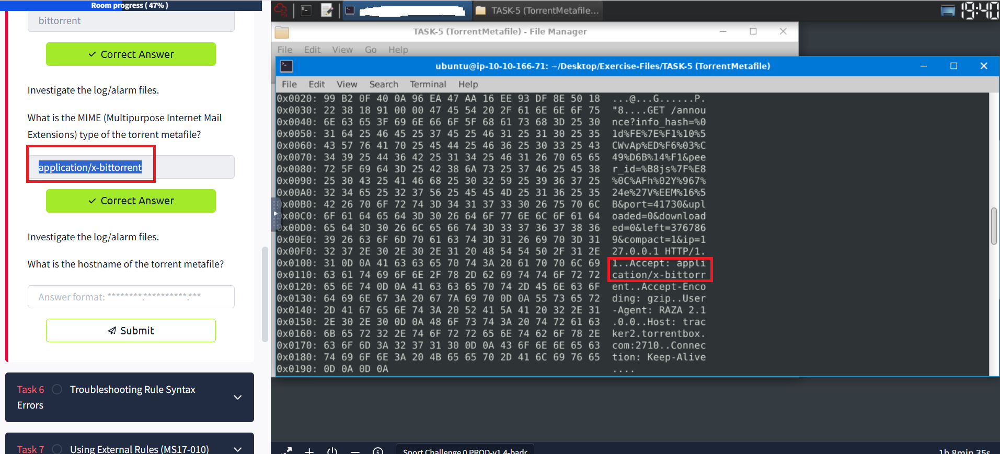

**Answer:** `90`

✅ **Correct Answer**

💡 **Hint:** Ensure all rule components are properly defined.

---

### 5️⃣ Fix the syntax error in local-5.rules file and make it work smoothly

**What is the number of the detected packets?**

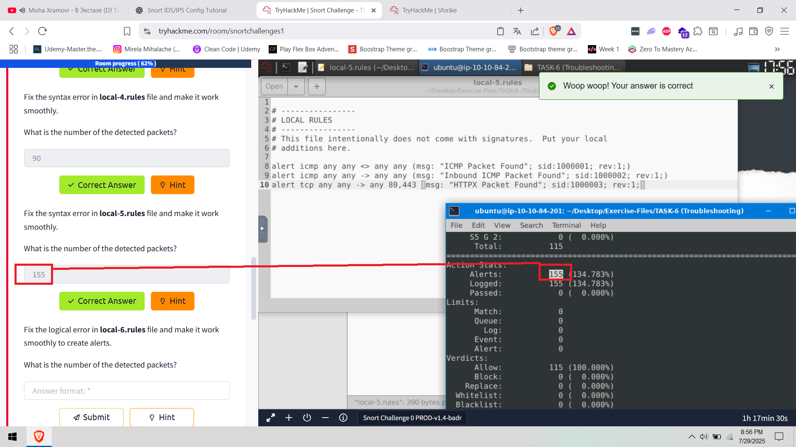

**Answer:** `155`

✅ **Correct Answer**

💡 **Hint:** Review rule logic and content patterns.

---

### 6️⃣ Fix the logical error in local-6.rules file and make it work smoothly to create alerts

**What is the number of the detected packets?**

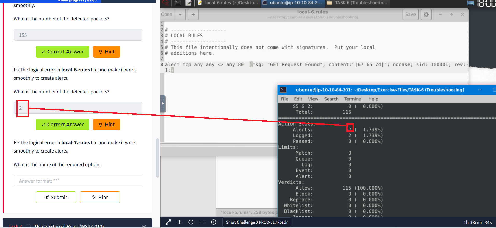

**Answer:** `2`

✅ **Correct Answer**

💡 **Hint:** Focus on logical operators and rule conditions.

---

### 7️⃣ Fix the logical error in local-7.rules file and make it work smoothly to create alerts

**What is the name of the required option:**

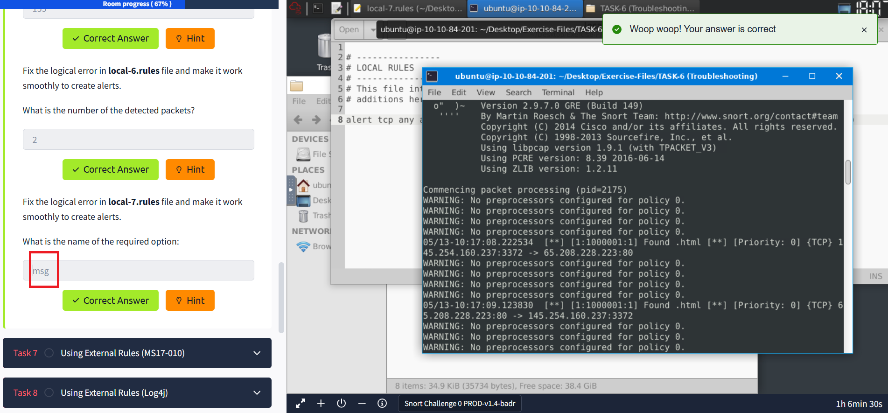

**Answer:** `msg`

✅ **Correct Answer**

💡 **Hint:** Check for missing required rule options.

---

## 🎉 Exercise Complete!


---

## 🚨 Exercise 7: Using External Rules (MS17-010)

Let's use external rules to fight against the latest threats! ⚔️

**Instructions:**
- Navigate to the task folder.
- Use the given pcap file for analysis.

---

### 1️⃣ Use the given rule file (local.rules) to investigate the ms1710 exploitation

**What is the number of detected packets?**

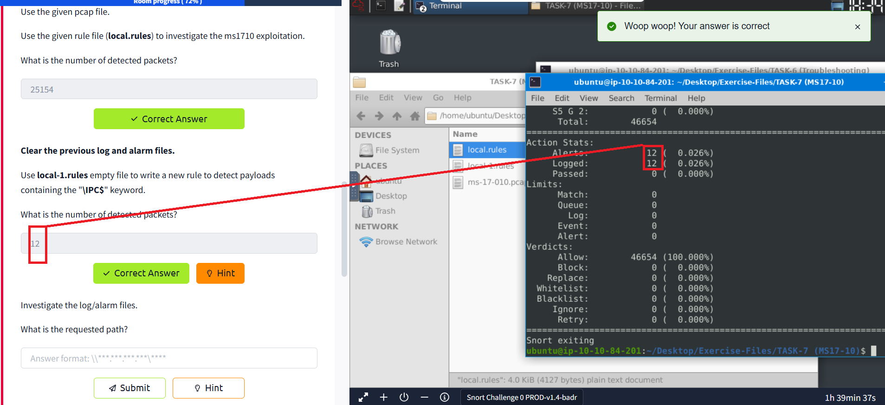

**Answer:** `25154`

✅ **Correct Answer**

💡 **Hint:** Clear the previous log and alarm files.

---

### 2️⃣ Use local-1.rules empty file to write a new rule to detect payloads containing the "\IPC$" keyword

**What is the number of detected packets?**


**Answer:** `12`

✅ **Correct Answer**

💡 **Hint:** Investigate the log/alarm files.

---

### 3️⃣ What is the requested path?

**Answer:** `\\192.168.116.138\IPC$`

✅ **Correct Answer**

💡 **Hint:** Look for network path information in the logs.

---

### 4️⃣ What is the CVSS v2 score of the MS17-010 vulnerability?

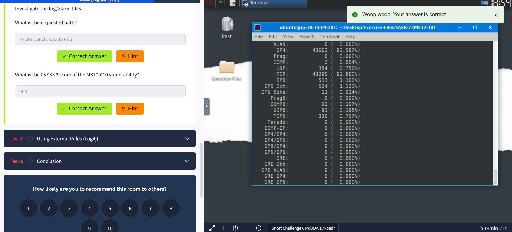

**Answer:** `9.3`

✅ **Correct Answer**

💡 **Hint:** Check vulnerability databases for MS17-010 details.

---

## 🎉 Exercise Complete!


