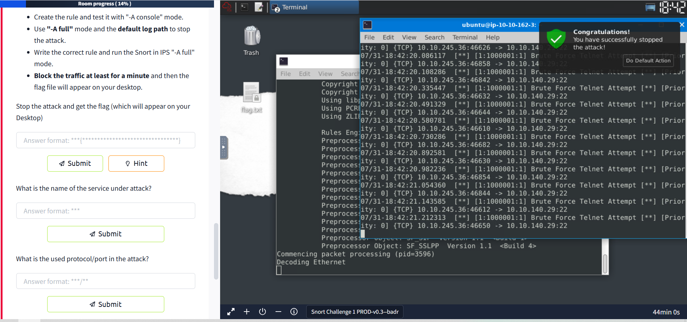
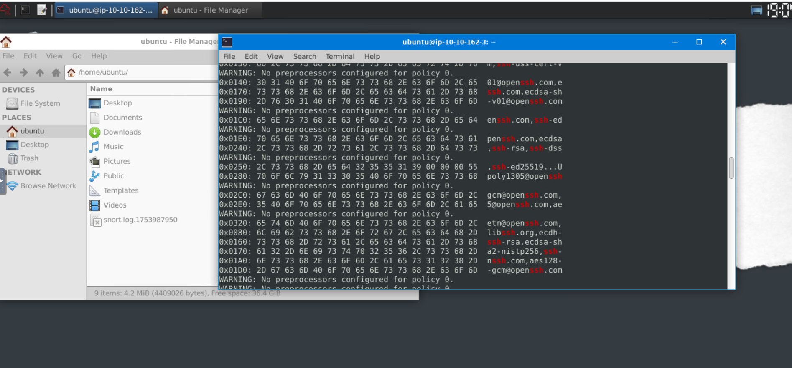
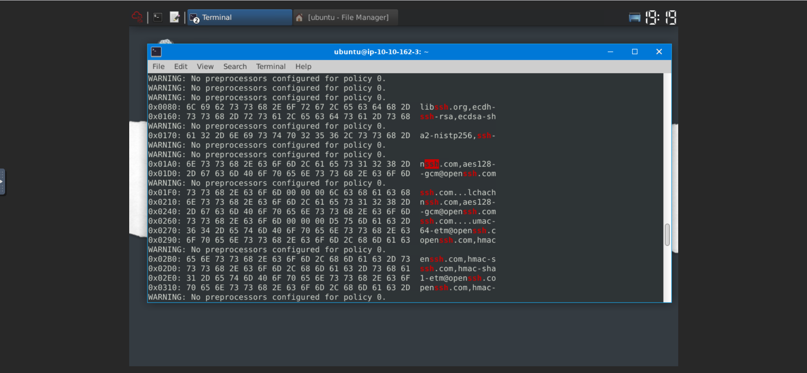
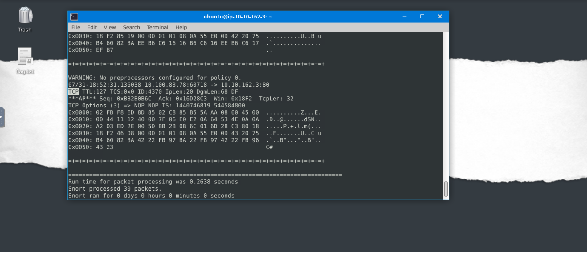
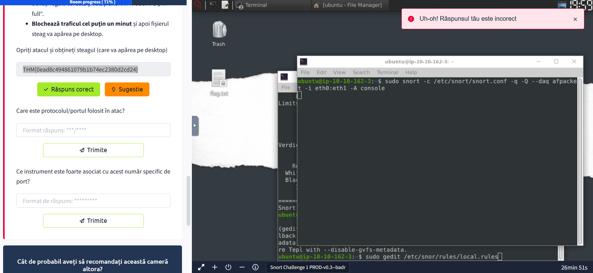
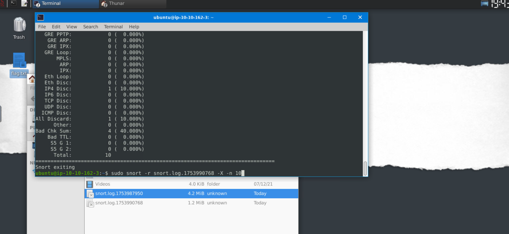
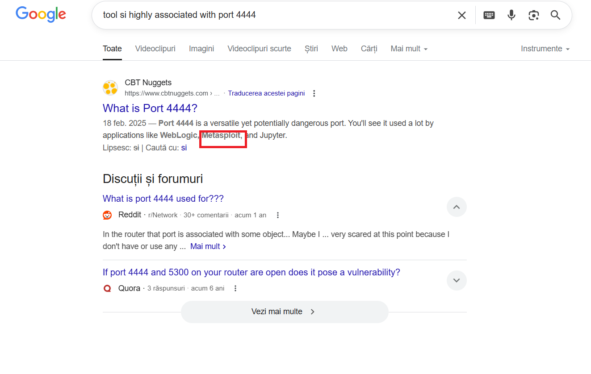

# Snort Live Attack 🚨

Use the attached VM to finish this task.

## Scenario 1: Brute Force Attack 🔓

### The Story 📖

**J&Y Enterprise** is one of the top coffee retailers in the world. They are known as tech-coffee shops and serve millions of coffee-loving tech geeks and IT specialists every day.

They are famous for specific coffee recipes for the IT community and unique names for these products. Their top five recipe names are:
- **WannaWhite** ☕
- **ZeroSleep** 🌙
- **MacDown** 🍎
- **BerryKeep** 🫐
- **CryptoY** 🔐

J&Y's latest recipe, **"Shot4J"**, attracted great attention at the global coffee festival. J&Y officials promised that the product will hit the stores in the coming months.

The super-secret of this recipe is hidden in a digital safe. Attackers are after this recipe, and J&Y enterprises are having difficulties protecting their digital assets.

Last week, they received multiple attacks and decided to work with you to help them improve their security level and protect their recipe secrets.

### Meet J.A.V.A. 🤖

This is your assistant **J.A.V.A.** (Just Another Virtual Assistant). She is an AI-driven virtual assistant and will help you notice possible anomalies.

> **J.A.V.A.:** Welcome, sir. I am sorry for the interruption. It is an emergency. Somebody is knocking on the door!
> 
> **You:** Knocking on the door? What do you mean by "knocking on the door"?
> 
> **J.A.V.A.:** We have a brute-force attack, sir.
> 
> **The Narrator:** This is not a comic book! Would you mind going and checking what's going on! Please...
> 
> **J.A.V.A.:** Sir, you need to observe the traffic with Snort and identify the anomaly first. Then you can create a rule to stop the brute-force attack. GOOD LUCK!

### Your Mission 🎯

First of all, start Snort in sniffer mode and try to figure out the attack source, service and port.

Then, write an IPS rule and run Snort in IPS mode to stop the brute-force attack. Once you stop the attack properly, you will have the flag on the desktop!

**Important Points to Remember:**
- Create the rule and test it with `-A console` mode
- Use `-A full` mode and the default log path to stop the attack
- Write the correct rule and run Snort in IPS `-A full` mode
- Block the traffic at least for a minute and then the flag file will appear on your desktop
- Stop the attack and get the flag (which will appear on your Desktop)

### Questions & Answers 📝

**Q: What is the name of the service under attack?**  
A: **SSH** 🔐

**Q: What is the used protocol/port in the attack?**  
A: **TCP/22** 🌐

---

## Scenario 2: Reverse Shell 🔄

### The Story Continues 📖

> **The Narrator:** Good Job! Glad to have you in the team!
> 
> **J.A.V.A.:** Congratulations sir. It is inspiring watching you work.
> 
> **You:** Thanks team. J.A.V.A. can you do a quick scan for me? We haven't investigated the outbound traffic yet.
> 
> **J.A.V.A.:** Yes, sir. Outbound traffic investigation has begun.
> 
> **The Narrator:** The outbound traffic? Why?
> 
> **You:** We have stopped some inbound access attempts, so we didn't let the bad guys get in. How about the bad guys who are already inside? Also, no need to mention the insider risks, huh? The dwell time is still around 1-3 months, and I am quite new here, so it is worth checking the outgoing traffic as well.
> 
> **J.A.V.A.:** Sir, persistent outbound traffic is detected. Possibly a reverse shell...
> 
> **You:** You got it!
> 
> **J.A.V.A.:** Sir, you need to observe the traffic with Snort and identify the anomaly first. Then you can create a rule to stop the reverse shell. GOOD LUCK!

### Your Mission Continues 🎯

First of all, start Snort in sniffer mode and try to figure out the attack source, service and port.

Then, write an IPS rule and run Snort in IPS mode to stop the reverse shell attack. Once you stop the attack properly, you will have the flag on the desktop!

**Important Points to Remember:**
- Create the rule and test it with `-A console` mode
- Use `-A full` mode and the default log path to stop the attack
- Write the correct rule and run Snort in IPS `-A full` mode
- Block the traffic at least for a minute and then the flag file will appear on your desktop
- Stop the attack and get the flag (which will appear on your Desktop)

### Questions & Answers 📝

**Q: What is the used protocol/port in the attack?**  
A: **TCP/4444** 🌐

**Q: Which tool is highly associated with this specific port number?**  
A: **Metasploit** 🛠️

---

## What I Learned Today 💡

Today I explored **Snort Live Attack** scenarios and learned how to:

- **Detect brute force attacks** using Snort in sniffer mode 🔍
- **Create custom IPS rules** to block malicious traffic 🛡️
- **Identify reverse shell connections** through traffic analysis 🔄
- **Use Snort in different modes** (`-A console` for testing, `-A full` for production) ⚙️
- **Understand the importance of outbound traffic monitoring** for detecting compromised systems 🚨

### Key Takeaways 🎯

- **Brute force attacks** often target SSH services on port 22
- **Reverse shells** commonly use port 4444 (Metasploit default)
- **Snort rules** must be carefully crafted to block malicious traffic without affecting legitimate services
- **Traffic analysis** is crucial for identifying both inbound and outbound threats

### Tools Used 🛠️

- **Snort** - Network intrusion detection and prevention system
- **Wireshark** - Network protocol analyzer (for traffic inspection)
- **Custom IPS rules** - Tailored rules for specific attack patterns

---

🔐 **Flags Obtained:**
- `THM{81b7fef657f8aaa6e4e200d616738254}` (Brute Force Scenario)
- `THM{0ead8c494861079b1b74ec2380d2cd24}` (Reverse Shell Scenario)