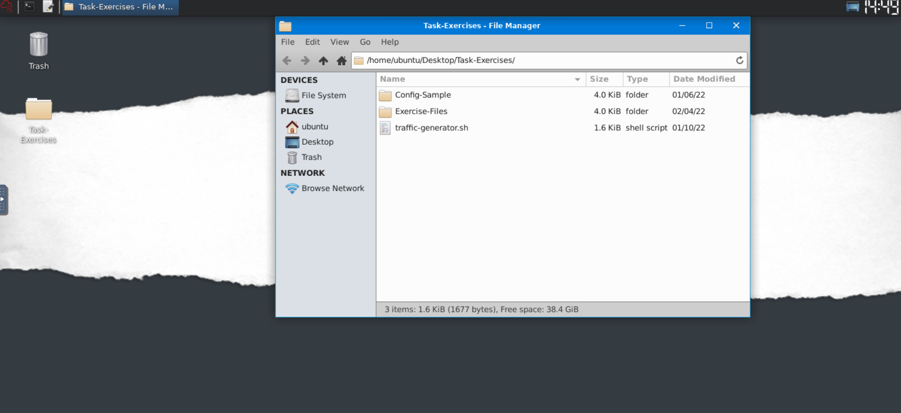
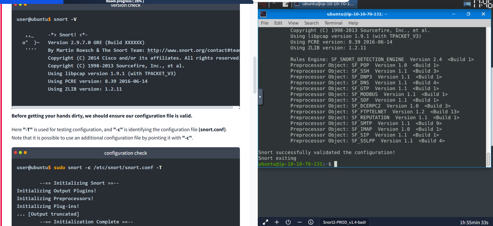
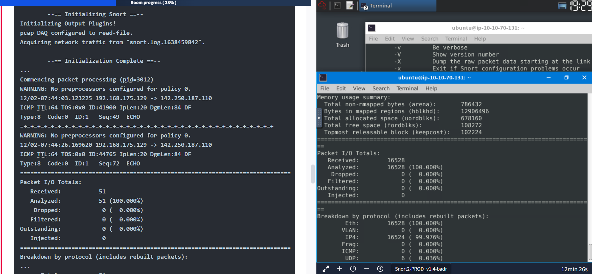
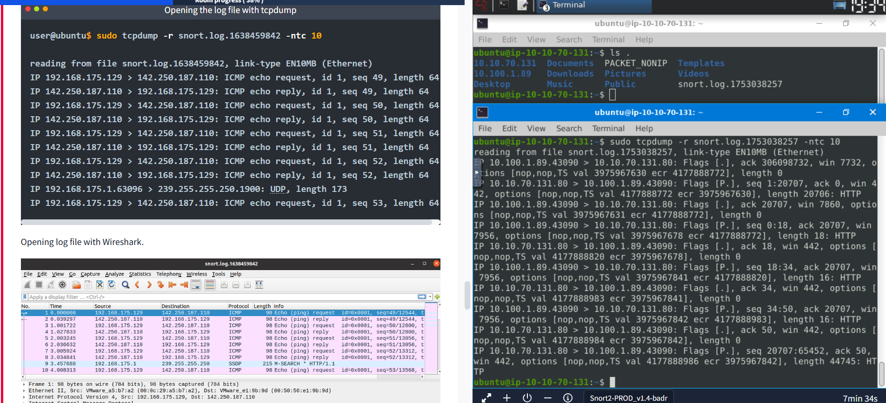

# Snort

## 🚀 What is Snort?
Snort is an open-source, rule-based Network Intrusion Detection and Prevention System (NIDS/NIPS) developed by Martin Roesch and maintained by Cisco Talos. It analyzes live and captured network traffic using rules to detect malicious activity and generate alerts. 

---

## 🖥️ Lab Setup & Navigation
- All exercises are in the **Task-Exercises** folder on the Desktop.
- Two subfolders:
  - **Config-Sample:** Example config and rule files (for practice, not used by Snort directly)
  - **Exercise-Files:** Folders for each task, with pcap, log, and rule files ready to use

---

## ⚡ Traffic Generator
- The VM is offline, but you can generate traffic using `traffic-generator.sh`.
- Run it with `sudo ./traffic-generator.sh`.
- Choose the exercise type and watch the output in a new terminal window.
- Each traffic type is designed for a specific exercise—make sure Snort is running before starting!

---

## 📝 Quick Exercise: Easy Mode
Navigate to the **Task-Exercises** folder and run:
```bash
./.easy.sh
```
Check the output for results! (See image below)



---

## 🎯 What I Learned
- How to navigate Linux and use the terminal for network analysis
- The basics of Snort and its role as an IDS/IPS
- How to generate and analyze network traffic in a safe lab environment
- How to run scripts and interpret their output

---

> **Snort is a powerful tool for learning network security and intrusion detection!** 🛡️ 


# 📝 Reflection: What I Learned from the Snort Lesson

## Checking Snort Version and Configuration ⚙️
I practiced verifying the installed Snort version using `snort -V`, which displays detailed version and build information. I also learned how to validate the Snort configuration file with `sudo snort -c /etc/snort/snort.conf -T`, ensuring that the setup is correct before running Snort in production or lab environments. Understanding the meaning of key parameters like `-V`, `-c`, `-T`, and `-q` is essential for proper configuration and troubleshooting.

## Running Snort in Different Modes 🖥️
### Sniffer Mode
- I explored Sniffer Mode, which allows real-time packet inspection similar to tcpdump.
- I learned the use of parameters:
  - `-v`: Verbose output (shows TCP/IP info)
  - `-d`: Displays packet data (payload)
  - `-e`: Shows link-layer headers
  - `-X`: Full packet details in HEX
  - `-i`: Specify network interface
- I practiced combining these flags (e.g., `-v -d -e`) to get different levels of detail.

### Logger Mode
- I learned how to use Logger Mode to save captured packets to disk for later analysis.
- The `-l` parameter sets the log output directory (default is `/var/log/snort`).
- By default, logs are in binary (tcpdump) format, but using `-K ASCII` creates human-readable, categorized logs in folders named after IP addresses.
- I saw how to navigate and interpret these logs, and the difference between binary and ASCII formats.


### Reader Mode
- I practiced reading and analyzing previously captured logs with `-r` (e.g., `sudo snort -r snort.log.1638459842`).
- I learned that Snort can process binary logs, and that tools like tcpdump and Wireshark can also be used for deeper analysis.
- I discovered how to use BPF (Berkeley Packet Filter) expressions to filter traffic by protocol or port, and how to limit the number of packets processed with `-n` (e.g., `snort -dvr logname.log -n 10`).

## Traffic Generation and Analysis 🚦
- I used a traffic generator script to simulate different types of network traffic for Snort to analyze.
- This hands-on approach helped me understand how Snort captures, logs, and displays real network events.

## Log File Ownership and Permissions 🔒
- I learned that log files created by Snort (when run with `sudo`) are owned by root, so elevated privileges are needed to view or analyze them.
- I practiced using `sudo` or changing ownership with `chown` to access these files as a regular user.

## Using Additional Tools 🧑‍💻
- I discovered that tcpdump can read Snort's binary log files for quick command-line analysis.
- I also learned that Wireshark can open these logs for advanced, graphical packet inspection.

## Practical Skills and Takeaways 🚀
- I now understand the core concepts of intrusion detection and prevention with Snort.
- I can confidently run Snort in different modes, interpret its output, and analyze network traffic.
- I know how to handle log files, manage permissions, and use additional tools for deeper analysis.
- This lesson gave me practical, hands-on experience that is directly applicable to real-world network security monitoring and incident response.
