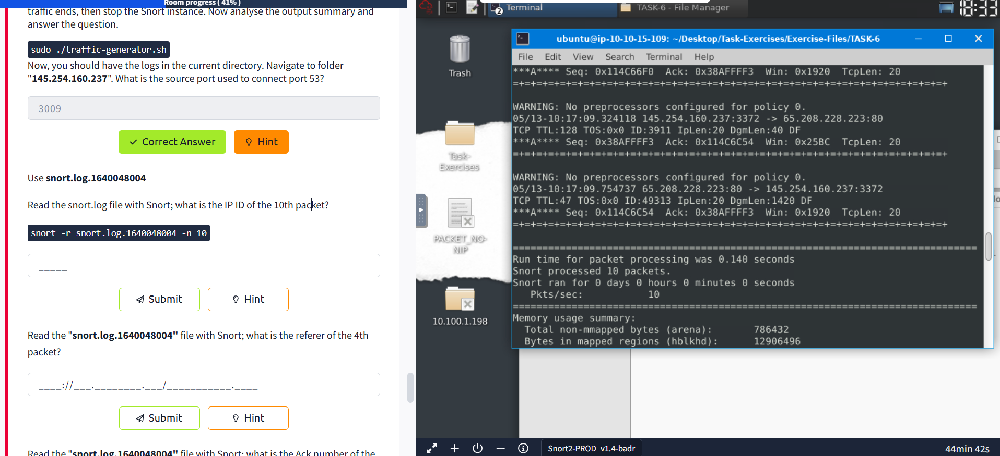
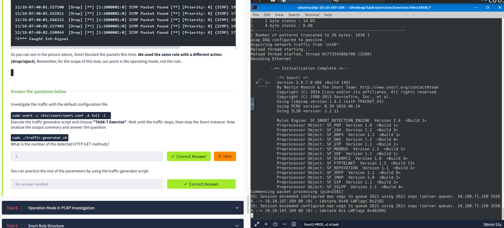
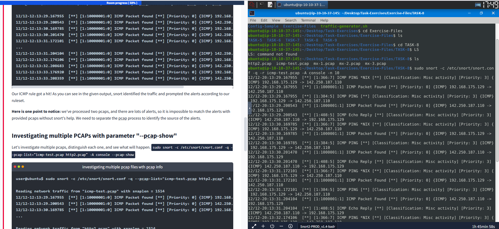
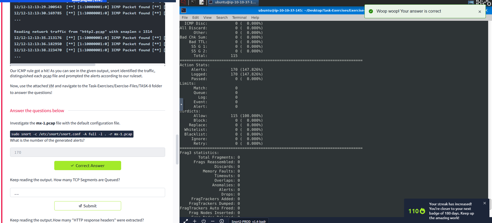
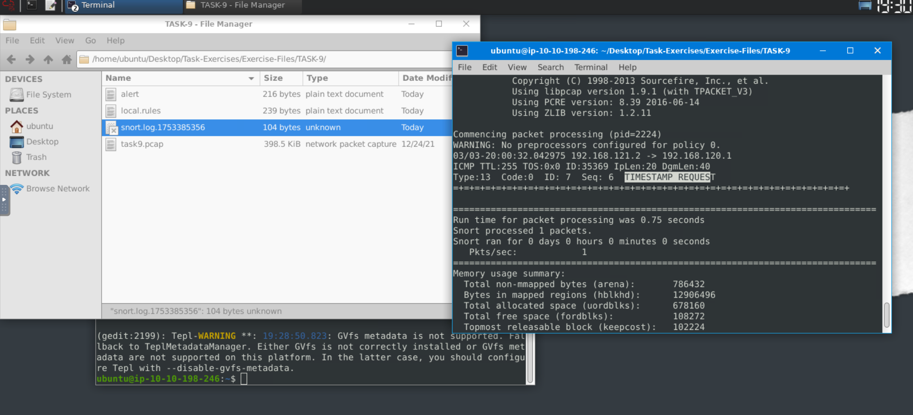
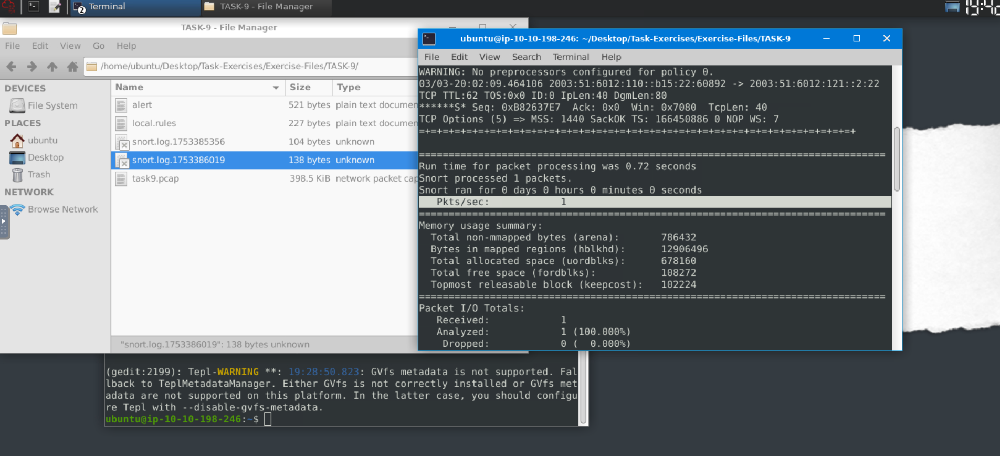

# Snort

## 🚀 What is Snort?
Snort is an open-source, rule-based Network Intrusion Detection and Prevention System (NIDS/NIPS) developed by Martin Roesch and maintained by Cisco Talos. It analyzes live and captured network traffic using rules to detect malicious activity and generate alerts. 

---

## 🖥️ Lab Setup & Navigation
- All exercises are in the **Task-Exercises** folder on the Desktop.
- Two subfolders:
  - **Config-Sample:** Example config and rule files (for practice, not used by Snort directly)
  - **Exercise-Files:** Folders for each task, with pcap, log, and rule files ready to use

---

## ⚡ Traffic Generator
- The VM is offline, but you can generate traffic using `traffic-generator.sh`.
- Run it with `sudo ./traffic-generator.sh`.
- Choose the exercise type and watch the output in a new terminal window.
- Each traffic type is designed for a specific exercise—make sure Snort is running before starting!

---

## 📝 Quick Exercise: Easy Mode
Navigate to the **Task-Exercises** folder and run:
```bash
./.easy.sh
```
Check the output for results! (See image below)


---

## 🎯 What I Learned
- How to navigate Linux and use the terminal for network analysis
- The basics of Snort and its role as an IDS/IPS
- How to generate and analyze network traffic in a safe lab environment
- How to run scripts and interpret their output

---

> **Snort is a powerful tool for learning network security and intrusion detection!** 🛡️ 


# 📝 Reflection: What I Learned from the Snort Lesson

## Checking Snort Version and Configuration ⚙️
I practiced verifying the installed Snort version using `snort -V`, which displays detailed version and build information. I also learned how to validate the Snort configuration file with `sudo snort -c /etc/snort/snort.conf -T`, ensuring that the setup is correct before running Snort in production or lab environments. Understanding the meaning of key parameters like `-V`, `-c`, `-T`, and `-q` is essential for proper configuration and troubleshooting.

## Running Snort in Different Modes 🖥️
### Sniffer Mode
- I explored Sniffer Mode, which allows real-time packet inspection similar to tcpdump.
- I learned the use of parameters:
  - `-v`: Verbose output (shows TCP/IP info)
  - `-d`: Displays packet data (payload)
  - `-e`: Shows link-layer headers
  - `-X`: Full packet details in HEX
  - `-i`: Specify network interface
- I practiced combining these flags (e.g., `-v -d -e`) to get different levels of detail.

### Logger Mode
- I learned how to use Logger Mode to save captured packets to disk for later analysis.
- The `-l` parameter sets the log output directory (default is `/var/log/snort`).
- By default, logs are in binary (tcpdump) format, but using `-K ASCII` creates human-readable, categorized logs in folders named after IP addresses.
- I saw how to navigate and interpret these logs, and the difference between binary and ASCII formats.


### Reader Mode
- I practiced reading and analyzing previously captured logs with `-r` (e.g., `sudo snort -r snort.log.1638459842`).
- I learned that Snort can process binary logs, and that tools like tcpdump and Wireshark can also be used for deeper analysis.
- I discovered how to use BPF (Berkeley Packet Filter) expressions to filter traffic by protocol or port, and how to limit the number of packets processed with `-n` (e.g., `snort -dvr logname.log -n 10`).

## Traffic Generation and Analysis 🚦
- I used a traffic generator script to simulate different types of network traffic for Snort to analyze.
- This hands-on approach helped me understand how Snort captures, logs, and displays real network events.

## Log File Ownership and Permissions 🔒
- I learned that log files created by Snort (when run with `sudo`) are owned by root, so elevated privileges are needed to view or analyze them.
- I practiced using `sudo` or changing ownership with `chown` to access these files as a regular user.

## Using Additional Tools 🧑‍💻
- I discovered that tcpdump can read Snort's binary log files for quick command-line analysis.
- I also learned that Wireshark can open these logs for advanced, graphical packet inspection.

## Practical Skills and Takeaways 🚀
- I now understand the core concepts of intrusion detection and prevention with Snort.
- I can confidently run Snort in different modes, interpret its output, and analyze network traffic.
- I know how to handle log files, manage permissions, and use additional tools for deeper analysis.
- This lesson gave me practical, hands-on experience that is directly applicable to real-world network security monitoring and incident response.

## 🧪 Practical Snort Traffic Analysis (ASCII Mode)

Let's investigate network traffic using Snort's default configuration in ASCII mode! This hands-on exercise will help you understand how Snort logs and analyzes packets step by step.

1. **Start Snort in ASCII Logging Mode:**
   ```bash
   sudo snort -dev -K ASCII -l .
   ```
   - `-d` : Show packet data (payload)
   - `-e` : Show link-layer headers
   - `-v` : Verbose output
   - `-K ASCII` : Log in human-readable format
   - `-l .` : Log to the current directory

2. **Generate Traffic:**
   Run the traffic generator script and select the "TASK-6 Exercise":
   ```bash
   sudo ./traffic-generator.sh
   ```
   Wait for the traffic to finish, then stop Snort (Ctrl+C).

3. **Analyze the Output:**
   After running the exercise, you will see new log folders in your current directory. For example, navigate to the folder named after the IP address (e.g., `145.254.160.237`).

   - Here, you can inspect the log files to find details such as the source port used to connect to port 53 (DNS), the IP ID of specific packets, HTTP referers, ACK numbers, and more.

4. **Read the Log File with Snort:**
   You can use Snort to read and analyze the generated log file. For example, to view the first 10 packets:
   ```bash
   snort -r snort.log.1640048004 -n 10
   ```
   
   - This command helps you inspect packet details, such as IP IDs, HTTP referers, and ACK numbers.

5. **Count TCP Port 80 Packets:**
   By analyzing the log, you can determine how many packets were sent to TCP port 80 (HTTP). This is a great way to practice filtering and counting specific types of traffic.

---

# 🚦 IDS/IPS Mode: Exploring Alert Parameters

## 🔍 Testing Configuration with -c and -T
I learned how to start Snort in IDS/IPS mode and test the configuration file using:
```bash
sudo snort -c /etc/snort/snort.conf -T
```
- `-c` : Specifies the configuration file
- `-T` : Tests the configuration for errors

This step is crucial to ensure that Snort is set up correctly before monitoring real traffic. If there are any issues in the configuration, Snort will notify you, helping you avoid problems during live analysis.

---

## 🛑 Disabling Logging with -N
I discovered that you can run Snort without logging by using the `-N` parameter:
```bash
sudo snort -c /etc/snort/snort.conf -N
```
- `-N` : Disables logging

Even with logging disabled, you can still see output in the console if you use verbose or packet dump options (like `-v` or `-X`). This is useful for quick tests or when you don't want to fill up your disk with logs.

---

## 🧑‍💻 Running in Background with -D
I practiced running Snort as a background process (daemon mode) using:
```bash
sudo snort -c /etc/snort/snort.conf -D
```
- `-D` : Runs Snort in the background

This is helpful for continuous monitoring. I also learned how to check if Snort is running:
```bash
ps -ef | grep snort
```
And how to stop it:
```bash
sudo kill -9 <PID>
```
> ⚠️ Daemon mode is powerful but should be used with caution and a stable configuration!

---

## 🚨 Exploring Alert Modes with -A
Snort offers several alert modes, each with different output styles:
- **console**: Fast-style alerts in the console
- **cmg**: Detailed header and payload in hex/text
- **full**: All possible alert info (in logs)
- **fast**: Summary alerts (in logs)
- **none**: Disables alerting

### 🖥️ Console Mode
```bash
sudo snort -c /etc/snort/snort.conf -A console
```
- Shows alerts directly in the terminal, great for real-time monitoring.

### 🧾 CMG Mode
```bash
sudo snort -c /etc/snort/snort.conf -A cmg
```
- Displays detailed packet info, including payload in hex and ASCII.

### ⚡ Fast & Full Modes
```bash
sudo snort -c /etc/snort/snort.conf -A fast
sudo snort -c /etc/snort/snort.conf -A full
```
- Both write alerts to log files, but `full` includes more details.

### 🚫 None Mode
```bash
sudo snort -c /etc/snort/snort.conf -A none
```
- No alerts are generated, but traffic is still logged in binary format.

---

## 📝 What I Observed
- Console and cmg modes are best for immediate feedback in the terminal.
- Fast and full modes are useful for later analysis, as they store alerts in files.
- None mode is good for silent logging without alerts.

---

## 🛠️ Using Rule Files Directly
I learned that you can run Snort with just a rule file (without a full config):
```bash
sudo snort -c /etc/snort/rules/local.rules -A console
```
- This is handy for testing custom rules quickly, but not recommended for production due to limited performance and features.

---

## 🛡️ IPS Mode and Packet Dropping
I explored Snort's IPS (Intrusion Prevention System) mode, which can actively block malicious traffic. To enable IPS mode, I used:
```bash
sudo snort -c /etc/snort/snort.conf -q -Q --daq afpacket -i eth0:eth1 -A console
```
- `-Q` and `--daq afpacket` : Enable IPS mode
- `-i eth0:eth1` : Specify two interfaces for inline inspection
- `-q` : Quiet mode (less console output)

In this mode, Snort can drop or reject packets based on rules, providing active network defense!

---

## 🎓 Key Takeaways
- I can confidently use Snort in various IDS/IPS modes and understand the impact of each parameter.
- I know how to test configurations, run in the background, and choose the right alert mode for my needs.
- I understand the difference between detection (IDS) and prevention (IPS) and how Snort can be used for both.
- Hands-on practice with real traffic and rules helped me see how alerts are generated and how traffic can be blocked in IPS mode.

> **Snort is not just a tool—it's a learning platform for mastering network security!** 🚀


# 🧩 Task 9: Snort Rule Structure

Snort rules are the heart of detection! I learned that each rule has two main parts: the header and the options. The header defines what to look for (protocol, IPs, ports, direction), and the options specify how to match and what to do.

**General structure:**
```
action protocol src_ip src_port -> dest_ip dest_port (options)
```

**Example:**
```
alert tcp any any -> 192.168.1.0/24 80 (msg:"HTTP traffic detected"; sid:1000001; rev:1;)
```
- `alert` – action (can also be log, pass, drop, etc.)
- `tcp` – protocol
- `any any` – any source IP and port
- `->` – direction
- `192.168.1.0/24 80` – destination network and port
- `msg`, `sid`, `rev` – options for alert message, rule ID, and revision

✨ **Options make rules powerful!** For example, `content:"USER";` matches packets containing "USER" (useful for FTP detection). You can use `nocase` for case-insensitive, `offset` and `depth` for precise matching, and many more.

---

# ⚙️ Task 10: Snort2 Operation Logic – Key Points

- Snort processes packets in order and checks them against all loaded rules.
- **Rule order matters!** More specific rules should come before general ones to avoid missing important alerts.
- Every rule needs a unique `sid` (Snort ID) and a `rev` (revision) for versioning.
- Always test new rules with PCAP files before deploying them in production.
- Use `-T` to test your configuration and rule syntax:
  ```bash
  sudo snort -c /etc/snort/snort.conf -T
  ```
- Place your custom rules in `local.rules` and make sure it's included in your main config.

> 📝 **Tip:** Use clear messages and keep your rules organized for easier troubleshooting!

---

# 🏁 Task 11: Conclusion

Snort is more than just a tool—it's a learning platform for network defenders! 🚀

- I now understand how to write and test custom rules to detect specific threats.
- I can confidently run Snort in different modes and analyze alerts.
- I know how to combine parameters and rules for flexible, powerful detection.
- Hands-on practice with real traffic and PCAPs helped me see how theory meets reality.

> **Snort empowers you to see, understand, and defend your network. Keep experimenting, keep learning!** 🛡️✨


# 🌟Snort Rules

Today I spent time learning and practicing Snort rules, and here’s what I took away from the experience:

## 🧠 Key Concepts I Understood
- **Snort rule structure**: Every rule has a header (action, protocol, IPs, ports, direction) and options (like msg, sid, rev, content, etc.).
- **Actions**: I learned the difference between `alert`, `log`, `drop`, and `reject` and when to use each one.
- **Filtering**: I practiced filtering by IP, subnet, port, port ranges, and even using the negation operator `!` to exclude certain addresses or ports.
- **Direction**: I now understand the difference between `->` (one-way) and `<>` (bidirectional) in rules.
- **Rule options**: I used options like `msg` for messages, `sid` for unique rule IDs, `rev` for revisions, and `reference` for extra info.
- **Payload and non-payload options**: I tried out `content`, `nocase`, `fast_pattern` for payload, and `id`, `flags`, `dsize`, `sameip` for non-payload matching.

## 🛠️ What I Practiced
- Writing rules to detect specific traffic, like filtering packets with a certain IP ID or SYN flag.
- Testing rules with PCAP files and using Snort commands to analyze the results.
- Commenting out old rules and keeping my rule file organized.

## 💡 What Was Challenging or Interesting
- It was tricky at first to get the syntax right, especially with port ranges and negation.
- Understanding the importance of unique SIDs and clear messages for each rule.
- Realizing how powerful the content and flag options are for detecting very specific network events.

## 📝 My Tips for Future Practice
- Always test new rules with sample traffic before using them in real scenarios.
- Use clear, descriptive messages and keep rules well-commented.
- Don’t forget to use unique SIDs for every rule!
- Start simple, then add more options as you get comfortable.

## 🚀 My Favorite Exercise
- I enjoyed creating a rule to filter packets with a specific IP ID and seeing how Snort detected it in the PCAP file.
- Filtering SYN flag packets and counting the results was a great way to see how precise rules can be.

---


TIMESTAMP REQUEST

Correct Answer


1

Correct Answer