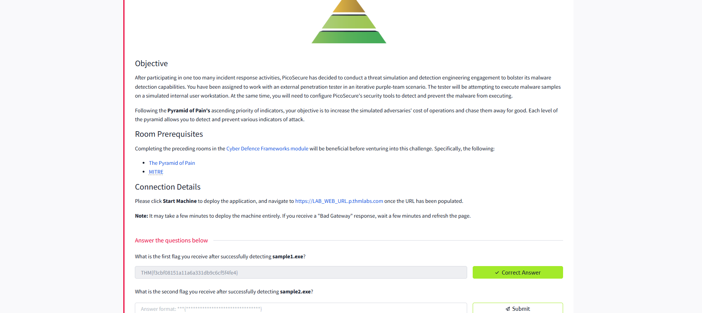
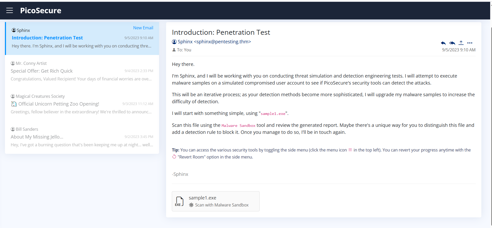
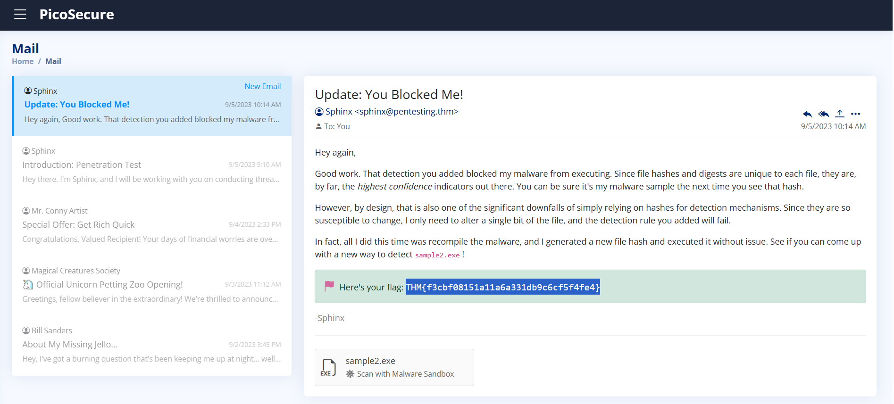
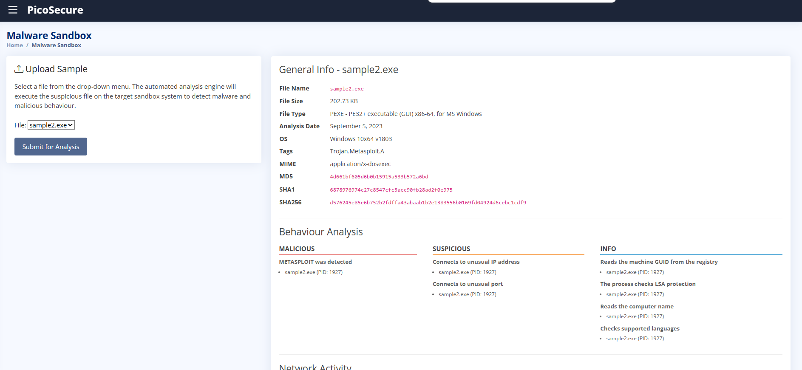
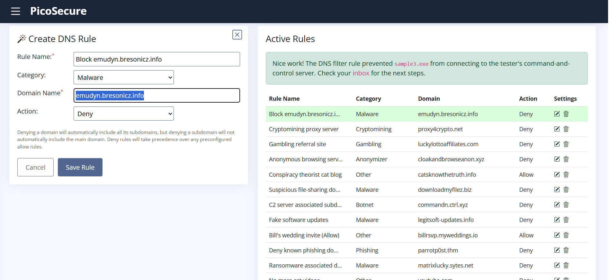

# TryHackMe Summit Room 🏔️

## Challenge Overview

In this premium TryHackMe room, I participated in a **threat simulation and detection engineering challenge** based on the Pyramid of Pain. The goal was to chase a simulated adversary up the pyramid by detecting and blocking their malware samples, increasing the cost of their operations until they gave up.

### Scenario

PicoSecure, after several incident response activities, decided to run a threat simulation. I worked alongside an external penetration tester in a purple-team scenario. The tester tried to execute malware samples on a simulated internal workstation, while I had to configure security tools to detect and prevent the malware from running.

The challenge followed the **Pyramid of Pain**—each level required me to detect and block different indicators of attack, starting from the easiest (hashes) and moving up to more complex indicators.

---

## Task 1: Detecting sample1.exe

- **File:** sample1.exe  
- **Tags:** Trojan.Metasploit.A  
- **MD5:** cbda8ae000aa9cbe7c8b982bae006c2a  
- **SHA256:** 9c550591a25c6228cb7d74d970d133d75c961ffed2ef7180144859cc09efca8c  
- **Behavior:** Detected as malicious (Metasploit), connects to unusual port, reads machine GUID, checks LSA protection, etc.

After configuring the detection tools to block this sample by its hash, I received the first flag:

**Flag 1:**  
`THM{f3cbf08151a11a6a331db9c6cf5f4fe4}`

---

## Task 2: Detecting sample2.exe

- **File:** sample2.exe  
- **Tags:** Trojan.Metasploit.A  
- **MD5:** 4d661bf605d6b0b15915a533b572a6bd  
- **SHA256:** d576245e85e6b752b2fdffa43abaab1b2e1383556b0169fd04924d6cebc1cdf9  
- **Behavior:** Also detected as malicious, but with a new hash. Connects to unusual IP and port, reads machine GUID, checks LSA protection, etc.
- **Network Activity:**  
  - HTTP GET to `http://154.35.10.113:4444/uvLk8YI32`
  - TCP connections to `154.35.10.113:4444` and Microsoft IPs

The adversary simply recompiled the malware to bypass hash-based detection, demonstrating the weakness of relying solely on hashes. I needed to use a new detection method for this sample.

---

## Key Takeaways 📝

- **Hash-based detection** is high-confidence but easy to bypass with minor changes to the file.
- **Adversaries adapt quickly**—detection strategies must evolve beyond simple indicators like hashes.
- The Pyramid of Pain framework helps structure detection efforts, pushing defenders to use more resilient and costly-to-evade indicators.

---

## Task 3: Detecting sample3.exe

For the third test, I analyzed **sample3.exe**:

- **File:** sample3.exe  
- **Tags:** Trojan.Metasploit.A  
- **MD5:** e31f0c62927d9d5a897b4c45e3c64dbc  
- **SHA256:** acb9b1260bcd08a465f9f300ac463b9b1215c097ebe44610359bb80881fe6a05  
- **Behavior:**  
  - Detected as malicious (Metasploit)
  - Downloads executable files from the Internet (e.g., backdoor.exe)
  - Connects to unusual IP addresses and ports
  - Reads machine GUID, checks LSA protection, reads computer name, checks supported languages
  - Multiple HTTP(S) requests, TCP/UDP connections, and DNS requests

After blocking the domain used by the malware, I received the third flag:

**Flag 3:**  
`THM{4eca9e2f61a19ecd5df34c788e7dce16}`

---

### Key Takeaway 📝

Blocking domains and IPs increased the attacker's cost, forcing them to register new domains and update DNS records. However, the adversary warned that for the next sample, blocking hashes, IPs, or domains won't be enough. I will need to focus on detecting artifacts or changes left by the malware on the host system—moving further up the Pyramid of Pain!

------

## Task 3: Detecting sample3.exe

For the third test, I analyzed **sample3.exe**:

- **File:** sample3.exe  
- **Tags:** Trojan.Metasploit.A  
- **MD5:** e31f0c62927d9d5a897b4c45e3c64dbc  
- **SHA256:** acb9b1260bcd08a465f9f300ac463b9b1215c097ebe44610359bb80881fe6a05  
- **Behavior:**  
  - Detected as malicious (Metasploit)
  - Downloads executable files from the Internet (e.g., backdoor.exe)
  - Connects to unusual IP addresses and ports
  - Reads machine GUID, checks LSA protection, reads computer name, checks supported languages
  - Multiple HTTP(S) requests, TCP/UDP connections, and DNS requests

After blocking the domain used by the malware, I received the third flag:

**Flag 3:**  
`THM{4eca9e2f61a19ecd5df34c788e7dce16}`

---

### Key Takeaway 📝

Blocking domains and IPs increased the attacker's cost, forcing them to register new domains and update DNS records. However, the adversary warned that for the next sample, blocking hashes, IPs, or domains won't be enough. I will need to focus on detecting artifacts or changes left by the malware on the host system—moving further up the