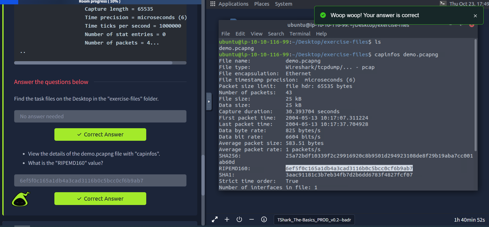
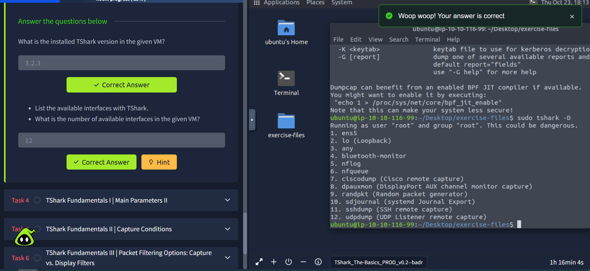
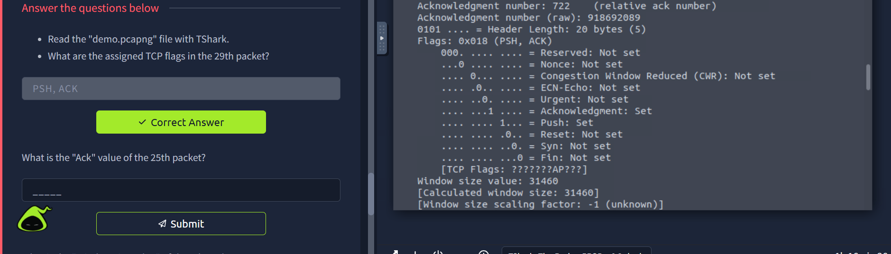
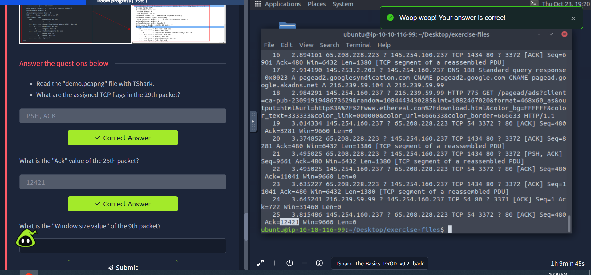
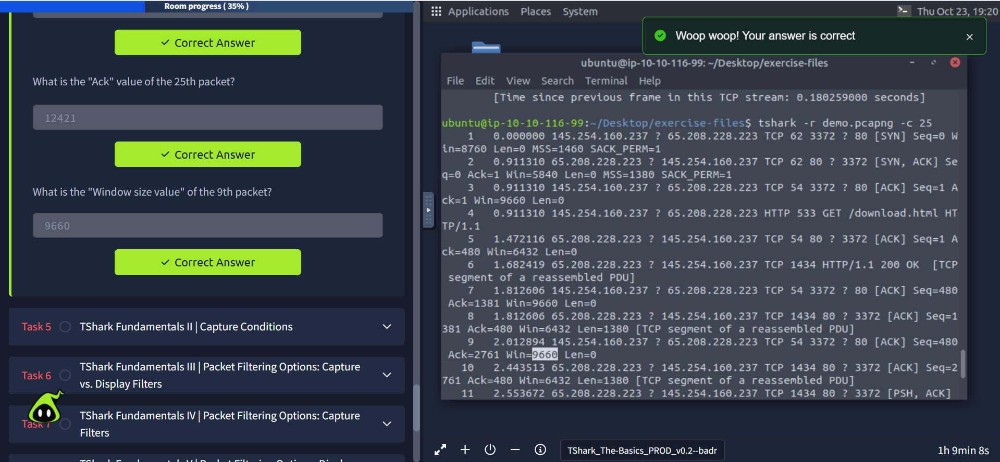
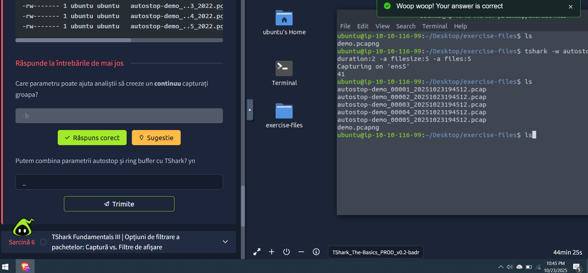
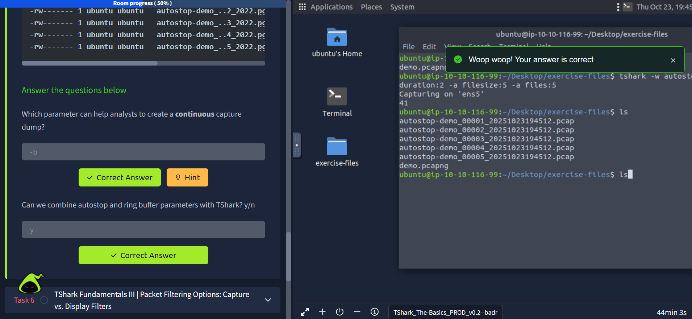

# 🦈 TShark Fundamentals Study Notes

## 📘 Overview

TShark is an open-source command-line network traffic analyser.  
It is created by the Wireshark developers and includes most of Wireshark’s features.  
It is commonly used as a command-line version of Wireshark, but it can also behave like tcpdump.  
This makes it preferred for comprehensive packet assessments and automation.

---

## 🧩 Task 2  
### Command-Line Packet Analysis Hints | TShark and Supplemental CLI Tools

TShark is a text-based tool suitable for data carving, in-depth packet analysis, and automation with scripts.  
Its flexibility comes from its ability to pipeline data into other CLI tools.  

**Tools and their purpose:**

- **capinfos** – Provides details of a specified capture file. Helps to view summary before investigation.  
- **grep** – Searches plain-text data.  
- **cut** – Cuts parts of lines from data sources.  
- **uniq** – Filters repeated lines/values.  
- **nl** – Displays line numbers.  
- **sed** – Stream editor.  
- **awk** – Pattern searching and processing scripting language.  

> 💡 Sample usage of these tools is covered in the Zeek room.

**Capinfos demo result example:**  
RIPEMD160 value: `6ef5f0c165a1db4a3cad3116b0c5bcc0cf6b9ab7`  

---

## 🧠 Task 3  
### TShark Fundamentals I | Main Parameters I

TShark is CLI-based, allowing in-depth, consecutive analysis.  
It has many built-in options and parameters that help control the output.

**Common parameters and purpose:**

- **-h** – Display help page.  
- **-v** – Show version info.  
- **-D** – List available interfaces.  
- **-i** – Select an interface to capture live traffic.  
- No parameter – Sniff traffic using default interface.

**Installed TShark version:** 3.2.3  
**Number of available interfaces in the VM:** 12  

---

## 🔍 Task 4  
### TShark Fundamentals I | Main Parameters II

**Additional common parameters:**

- **-r** – Read a capture file.  
- **-c** – Stop after N packets.  
- **-w** – Write sniffed traffic to a file.  
- **-V** – Verbose output (full packet details).  
- **-q** – Quiet mode (no packet output).  
- **-x** – Show packet bytes in hex and ASCII.

**Read, write, and view data:**  
TShark can read capture files and limit displayed packets. It can also write specific packets to new files and show packet bytes for in-depth analysis.

**Verbosity:**  
- Provides full packet details, similar to Wireshark’s "Packet Details Pane".  
- Best used after filtering packets to avoid overwhelming output.

**Task answers:**

- TCP flags in the 29th packet: **PSH, ACK**  
  

- Ack value of the 25th packet: **12421**  
  

- Window size value of the 9th packet: **9660**  
  

---

## ⚡ Task 5  
### TShark Fundamentals II | Capture Conditions

TShark can be configured to stop after specific conditions or run continuously.  

**Capture condition parameters:**

- **-a** – Autostop. Defines capture stop condition by duration, file size, or number of files.  
- **-b** – Ring buffer. Defines continuous capture, creating new files based on duration, file size, or file count.  

**Examples:**

- Continuous capture parameter: **-b**  
  

- Can autostop and ring buffer be combined? **Yes (y)**  
  

## 🧠 Task 6  
### Packet Filtering Parameters | Capture and Display Filters

There are two dimensions of **packet filtering** in TShark:  
**live filtering (capture)** and **post-capture filtering (display)**.  

These two dimensions can be applied using **two different approaches**:  
either a **predefined syntax** or **Berkeley Packet Filters (BPF)**.  
TShark supports both — meaning you can use **Wireshark filters** and **BPF syntax** to filter network traffic.

As mentioned earlier, TShark is the **command-line version of Wireshark**, so we need to use **different filters** for **capturing** and **displaying** packets.

---

### 🎯 Quick Recap from Wireshark: Packet Operations

| 🧩 Filter Type | 🧠 Purpose |
|----------------|------------|
| **Capture Filters** | Used for live filtering. The goal is to capture and save only specific traffic. Set **before** capture starts and **cannot** be changed during live capture. |
| **Display Filters** | Used for post-capture filtering. The goal is to investigate packets by **reducing visible packets**. Can be changed anytime during analysis. |

---

### 🕸️ Capture Filters

Capture filters are used to **save only specific types of traffic** in the capture file, instead of collecting all network data.  
They have **limited filtering capabilities** and are mainly designed to define the **scope** of the capture through **range**, **protocol**, and **directional** filtering.  

This may sound like bulk filtering, but it helps maintain **organized capture files** with **reasonable file sizes**.

---

### 🔍 Display Filters

Display filters are applied **after** the capture to investigate packet contents **in depth** — without modifying the actual packets.  
These filters are extremely powerful and flexible, making them ideal for detailed analysis.

---

### ⚙️ Parameters and Their Purpose

| 🧠 Parameter | 🔧 Purpose |
|--------------|------------|
| **-f** | Capture filters. Uses **BPF syntax** and works like Wireshark’s capture filters. |
| **-Y** | Display filters. Works like Wireshark’s display filters. |

> 📚 Reference: Review “Wireshark Packet Operations” (Tasks 4 & 5) to revisit packet filtering principles.

---

✅ **Answers:**

- Parameter used to set **Capture Filters** → `-f`  
- Parameter used to set **Display Filters** → `-Y`
 

---

## 🎓 Summary So Far

You’ve now learned:
- How TShark performs **packet capture and display filtering**
- The difference between **live filters (capture)** and **post-capture filters (display)**
- How to use **BPF syntax** and **Wireshark-style filters**
- The roles of `-f` and `-Y` parameters in filtering traffic  