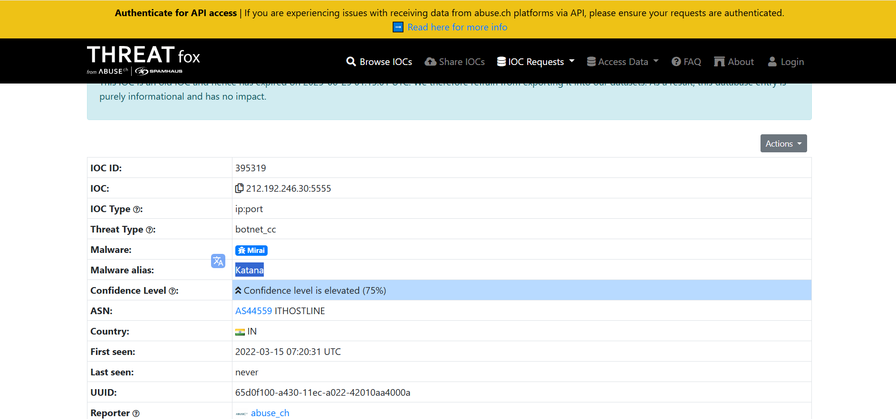
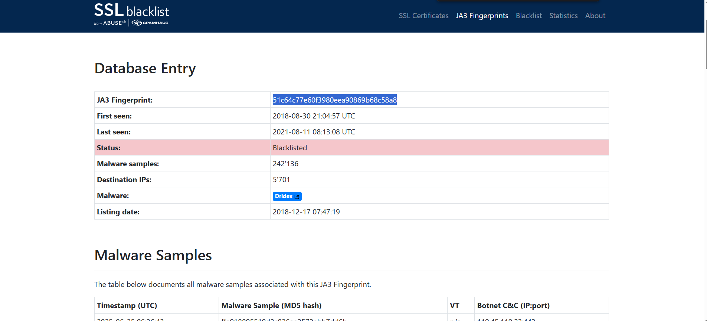
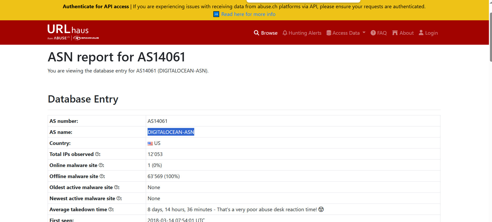
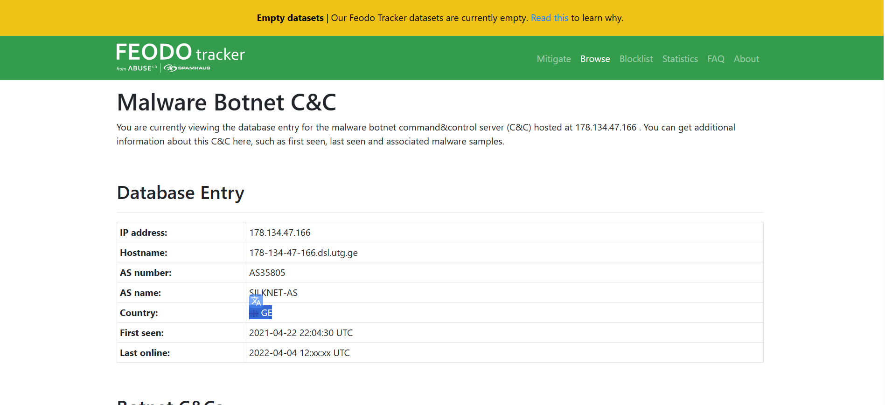
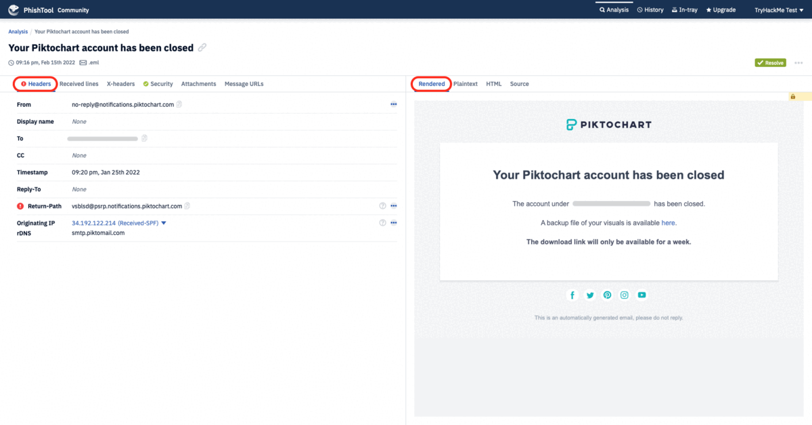
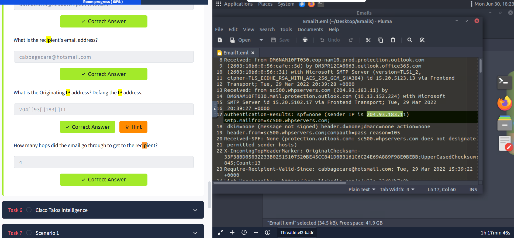
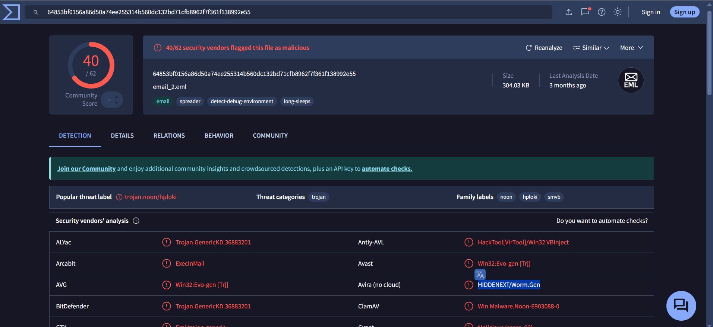
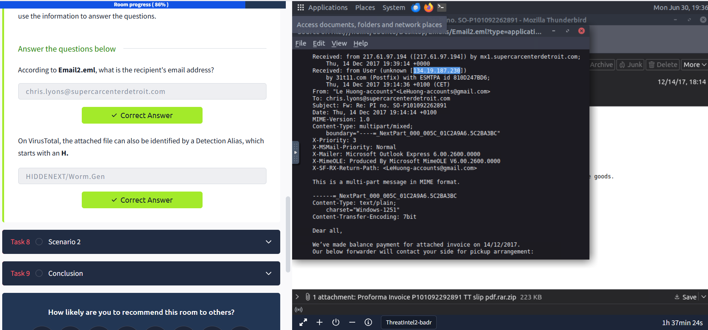
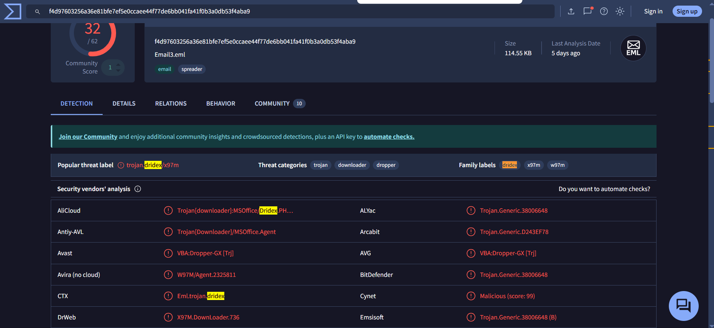
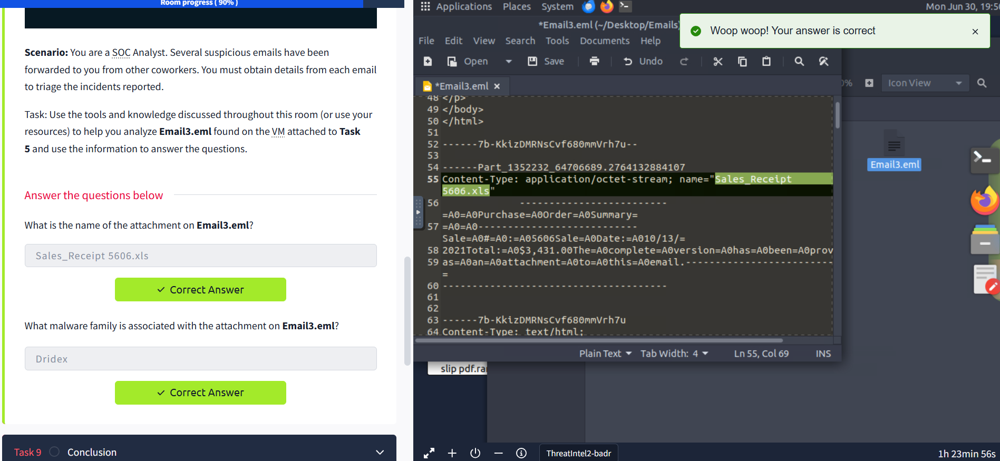

# 🌐 Threat Intelligence Tools: What I've Learned

This document summarizes what I've learned about Threat Intelligence and several open-source tools that help in identifying and mitigating cyber threats. 🚨

---

## 🎯 Learning Objectives

- Understand the basics of threat intelligence & its classifications.
- Use UrlScan.io to scan for malicious URLs.
- Track malware and botnet indicators with Abuse.ch.
- Investigate phishing emails using PhishTool.
- Gather intel with Cisco's Talos Intelligence platform.

---

## 🕵️‍♂️ What is Threat Intelligence?

Threat Intelligence is the process of analyzing data to find patterns and insights that help defend against current or emerging threats targeting organizations, industries, or governments.

### Key Questions to Ask:
- Who is attacking?
- What is their motivation?
- What are their capabilities?
- What indicators of compromise (IOCs) should you look for?

---

## 🗂️ Threat Intelligence Classifications

- **Strategic Intel**: High-level overview of threat landscapes and risks for business decisions.
- **Technical Intel**: Evidence and artifacts of attacks, useful for incident response teams.
- **Tactical Intel**: Focuses on adversary tactics, techniques, and procedures (TTPs) to improve security controls.
- **Operational Intel**: Looks at adversary motives and intent, helping to protect critical assets.

---

## 🛠️ Abuse.ch Platforms

Abuse.ch is a project from the Institute for Cybersecurity and Engineering at Bern University of Applied Sciences, Switzerland. It provides several platforms to track malware and botnets:

- **Malware Bazaar**: Upload and hunt for malware samples. Analysts can set alerts based on tags, YARA rules, and more.
- **Feodo Tracker**: Database of botnet C&C servers (e.g., Dridex, Emotet, TrickBot). Provides IP and IOC blocklists.
- **SSL Blacklist**: Identifies malicious SSL certificates and JA3/JA3s fingerprints to block botnet C2 communications.
- **URLhaus**: Shares malicious URLs used for malware distribution. Search by domain, URL, hash, or filetype.
- **Threat Fox**: Search, share, and export IOCs in multiple formats (MISP, Suricata, CSV, etc.).

---

## 📝 My Answers

### 1️⃣ The IOC `212.192.246.30:5555` is identified under which malware alias name on ThreatFox?

**Answer:** Katana

---

### 2️⃣ Which malware is associated with the JA3 Fingerprint `51c64c77e60f3980eea90869b68c58a8` on SSL Blacklist?

**Answer:** Dridex

---

### 3️⃣ From the statistics page on URLHaus, what malware-hosting network has the ASN number `AS14061`?

**Answer:** DIGITALOCEAN-ASN

---

### 4️⃣ Which country is the botnet IP address `178.134.47.166` associated with according to FeodoTracker?

**Answer:** Georgia

---

## 🛡️ PhishTool & Email Analysis: What I've Learned

Before starting the analysis, I launched the VM and opened it in Split View as instructed. This allowed me to use the same environment for Tasks 7 and 8.

### ✉️ Email Phishing Overview

Phishing remains a primary vector for cyber attacks. Attackers often disguise emails to appear legitimate, tricking users into clicking malicious links or downloading harmful attachments. This can lead to malware infections, credential theft, financial fraud, or ransomware attacks.

#### 🔗 Further Learning
- Phishing Emails 1-5 (see referenced rooms for more details)

### 🧰 PhishTool Features

PhishTool is a valuable addition to my email analysis toolkit. It offers:
- **Email analysis:** Extracts metadata, attachments, and URLs for triage.
- **Heuristic intelligence:** Integrates OSINT to identify TTPs and adversary methods.
- **Classification & reporting:** Enables quick classification and generates forensic reports.

The Community version covers core features, while the Enterprise version adds user management, reporting, and integration with Microsoft 365/Google Workspace.

#### 🖥️ Using PhishTool

Upon logging in, I accessed the **Analysis** tab to upload emails for inspection. Other tabs include **History** (submission records) and **In-tray** (Enterprise feature).

During analysis, I reviewed:
- **Headers:** Source/destination addresses, originating IP, timestamps.
- **Received Lines:** SMTP traversal details.
- **X-headers:** Additional mailbox info.
- **Security:** SPF, DKIM, DMARC status.
- **Attachments & URLs:** All files and links in the email.

I could flag indicators as malicious and classify the email, with results shown in the **Resolution** tab.

---

### 🕵️ Task 5: Email1.eml Analysis

As a SOC Analyst, I analyzed a suspicious email using Thunderbird on the VM.

#### Key Findings:
1. **Impersonated Platform:**  
         
       **Answer:** LinkedIn

2. **Sender's Email Address:**  
       `darkabutla@sc500.whpservers.com`

3. **Recipient's Email Address:**  
       `cabbagecare@hotsmail.com`

4. **Originating IP (defanged):**  
       `204[.]93[.]183[.]11`

5. **SMTP Hops:**  
       `4`

---

## 🌍 Cisco Talos Intelligence: What I've Learned

Cisco Talos provides actionable threat intelligence, including IP/domain reputation, vulnerability data, and more. The dashboard offers a global view of email traffic and threat indicators.

### 🛠️ Task 6: Talos Analysis

Using details from Email1.eml, I queried Cisco Talos Intelligence for more context.

#### Key Findings:
1. **Domain of IP:**  
       `scnet.net`

2. **Customer Name:**  
       `Complete Web Reviews`

---

## 📧 Task 7: Email2.eml Analysis

As a SOC Analyst, I analyzed another suspicious email (Email2.eml) using the same tools and methods.

#### Key Findings:
1. **Recipient's Email Address:**  
       `chris.lyons@supercarcenterdetroit.com`

2. **VirusTotal Detection Alias (starts with H):**  
         
         
       `HIDDENEXT/Worm.Gen`

---

## 📑 Task 8: Email3.eml Analysis

Continuing as a SOC Analyst, I examined Email3.eml for further threat indicators.

#### Key Findings:
1. **Attachment Name:**  
         
       `Sales_Receipt 5606.xls`

2. **Associated Malware Family:**  
         
       `Dridex`

---

Through these tasks, I learned how to leverage open-source tools like PhishTool and Cisco Talos to analyze suspicious emails, extract IOCs, and identify threats such as phishing attempts and malware. The hands-on experience reinforced my understanding of email analysis workflows and the importance of threat intelligence in SOC operations.

