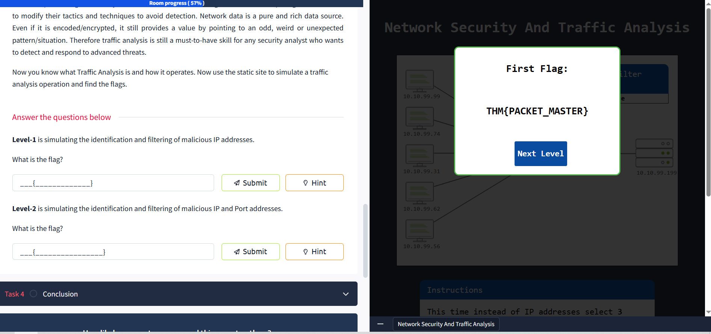

# 🌐 Network Security & Traffic Analysis — TryHackMe Walkthrough

Welcome to my documentation for the **Network Security & Traffic Analysis** room on [TryHackMe](https://tryhackme.com/), where I explored the foundations of network protection, control layers, traffic analysis methods, and packet inspection.

This room provided practical insights into network security operations, traffic analysis, and detection of malicious behavior through simulated scenarios and static analysis labs.

---

## 🔐 Network Security Overview

Network Security is a critical subdomain of cybersecurity focused on ensuring:

- ✅ Accessibility  
- ✅ Integrity  
- ✅ Continuity  
- ✅ Reliability

It revolves around **authentication** and **authorisation**, forming the foundation for protecting connected systems and communications.

---

### 🧱 Control Levels of Network Security

| Control Level     | Description |
|-------------------|-------------|
| 🧍 **Physical**      | Prevents unauthorised physical access to networking hardware (e.g., cables, racks). |
| 💻 **Technical**     | Prevents unauthorised digital access (e.g., tunnels, encryption). |
| 📝 **Administrative** | Governs access through policies, procedures, and user-level permissions. |

---

## 🧩 Main Approaches

### 🔐 Access Control
- **Firewall Protection**
- **NAC (Network Access Control)**
- **IAM (Identity and Access Management)**
- **Load Balancing** *(📊 Data flow management using metrics)*
- **Network Segmentation**
- **VPN (Virtual Private Networks)**
- **Zero Trust Model** — *“Never trust, always verify.”*

### 🛡️ Threat Control
- **IDS/IPS** (Intrusion Detection/Prevention Systems)
- **DLP** (Data Loss Prevention)
- **Endpoint Protection**
- **Cloud Security**
- **SIEM** *(Security Information and Event Management)*
- **SOAR** *(Security Orchestration, Automation, and Response)*  
  *📡 Correlates tools, data sources, and actions across the platform.*
- **Network Traffic Analysis & Network Detection and Response (NDR)**

---

## ⚙️ Typical Network Security Operations

| Deployment | Configuration | Management | Monitoring | Maintenance |
|------------|---------------|------------|------------|-------------|
| Device/software setup | Access rules, VPN, NAT, automation | Policies, mitigation | Logs, traffic, users | Updates, patches, tuning |

---

## 🧠 Managed Security Services (MSS)

When in-house resources are insufficient, companies outsource to MSSPs to handle:

- 🛠️ Network Penetration Testing  
- 🔍 Vulnerability Assessments  
- 🚨 Incident Response  
- 👁️ Behavioural Analysis

---

## 🔎 Traffic Analysis

**Traffic Analysis** is the interception and inspection of network data to detect performance issues, anomalies, and threats.

### 🔄 Techniques

| Flow Analysis | Packet Analysis |
|---------------|-----------------|
| 📊 Summarised, high-level traffic patterns | 🧬 Deep Packet Inspection (DPI) |
| ✅ Easy to process | ✅ Root-cause visibility |
| ⚠️ Lacks granular detail | ⚠️ Requires expertise/time |

---

### 🚀 Why It Still Matters

Even with modern cloud tools and encryption, **network traffic** remains a rich and essential source for identifying:

- Suspicious patterns  
- Advanced persistent threats (APT)  
- Encrypted C2 communications  
- Anomalous user/device behavior

🛡️ Traffic analysis = **Must-have skill** for every SOC analyst!

---

## 🧪 Static Site Lab: Traffic Analysis Simulation

In this lab, I practiced identifying malicious traffic patterns and filtering IPs.

---

### 📍 **Level-1 Challenge**

> Simulates identifying and filtering **malicious IP addresses** from captured traffic.

🎯 **Flag:**  
THM{PACKET_MASTER}