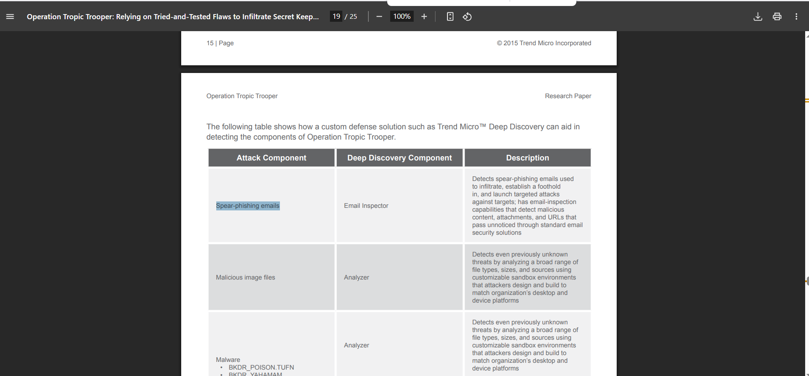
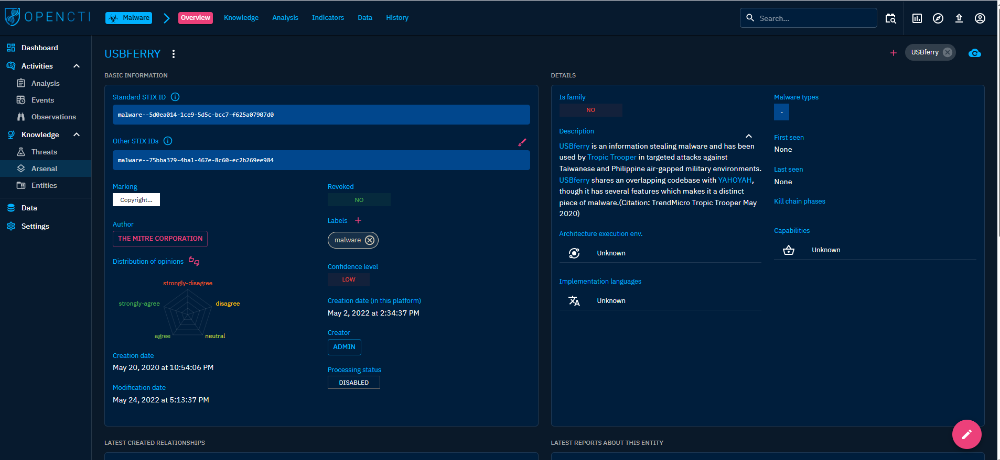
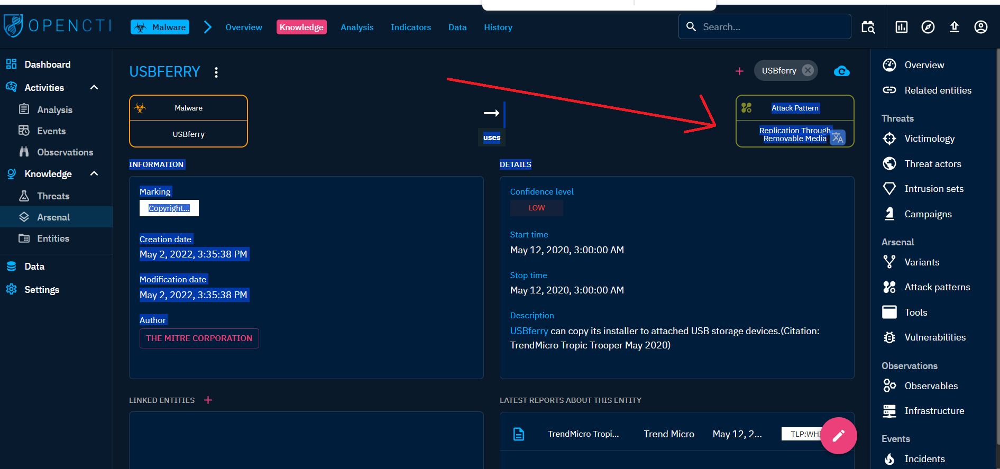
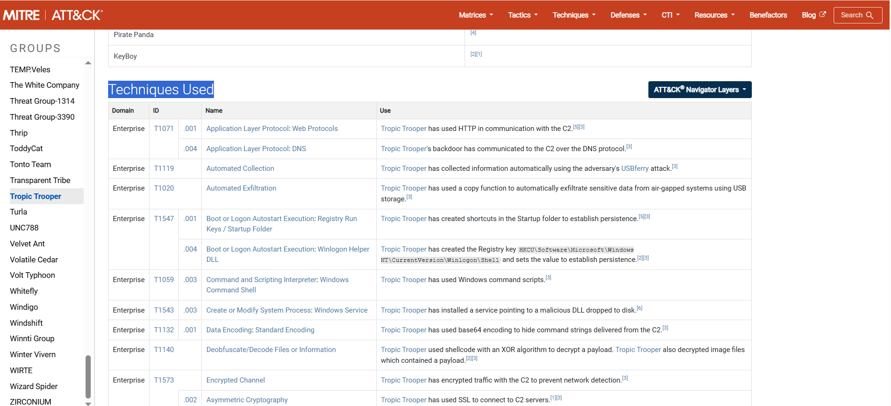
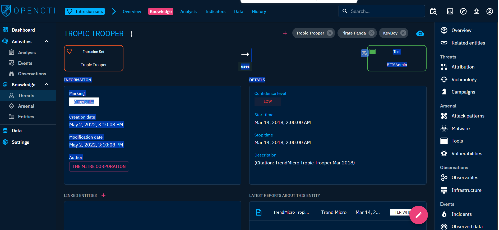
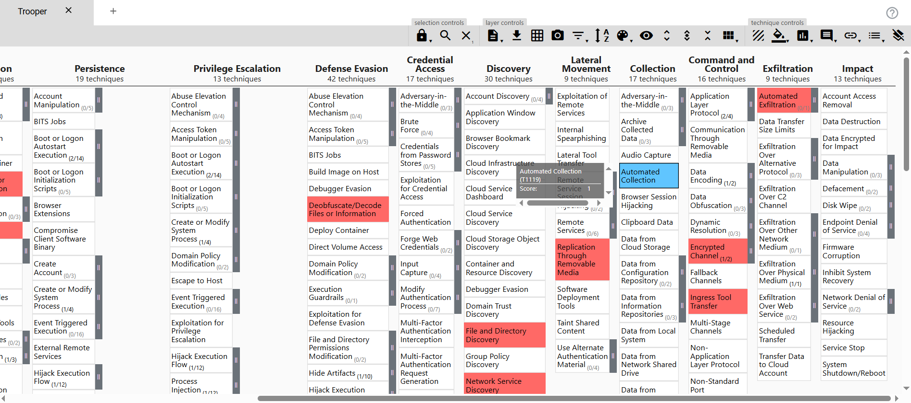

# 🕵️‍♂️ Threat Intelligence Case: APT X Investigation via OpenCTI & MITRE ATT&CK Navigator

This repository documents my analysis and investigation of a **realistic cyber threat emulation lab**, where I acted as a **Cyber Threat Intelligence Analyst (CTI)**. Using the **OpenCTI platform** and the **MITRE ATT&CK Navigator**, I identified the **Tactics, Techniques, and Procedures (TTPs)** used by an advanced persistent threat group targeting a multinational technology company.

> 🎯 Objective: Investigate the identity, tools, malware, and techniques used by the threat actor (APT X), understand their motivations, and document the full attack pattern based on shared CTI reports.

---

## 🧠 Scenario Summary

A multinational tech company has recently experienced several cyber attacks involving:

- 📥 **Phishing campaigns**
- 🧬 **Malware deployment**
- 💽 **Removable media exploitation**
- 📊 **Data collection and exfiltration**

As a CTI analyst, I was tasked to:
- Identify and map TTPs used by the threat group (APT X)
- Explore and analyze indicators within OpenCTI
- Utilize the MITRE ATT&CK Navigator to enrich the investigation

---

## 📌 Findings & Evidence

### 🎣 What kind of phishing campaign does APT X use as part of their TTPs?

> **Answer:** Spear-phishing emails  
> 

---

### 🐛 What is the name of the malware used by APT X?

> **Answer:** USBferry  
> 

---

### 🆔 What is the malware's STIX ID?

> **Answer:**  
> `malware--5d0ea014-1ce9-5d5c-bcc7-f625a07907d0` ✅

---

### 💽 With the use of a USB, what technique did APT X use for initial access?

> **Answer:** Replication through removable media  
> 

---

### 🕵️ Who is the identity of APT X?

> **Answer:** Tropic Trooper  
> 

---

### 🧰 How many Attack Pattern techniques are associated with the APT?

> **Answer:** 39  
> 

---

### ⚙️ What is the name of the tool linked to the APT?

> **Answer:** BITSAdmin  
> 

---

### 🔑 What is the sub-technique used under Valid Accounts?

> **Answer:** Local Accounts  
> 

### 📂 Under what MITRE ATT&CK Tactics does this technique fall?

> **Answer:**  
> - Initial Access  
> - Persistence  
> - Defense Evasion  
> - Privilege Escalation

---

### 📥 What technique is the group known for using under the **Collection** tactic?

> **Answer:** Automated Collection  
> 

---

## 🧩 Tools Used

- 🛰️ [OpenCTI](https://www.opencti.io/en/) – Threat Intelligence Platform  
- 🧭 [MITRE ATT&CK Navigator](https://mitre-attack.github.io/attack-navigator/) – Adversary Behavior Mapping  
- 💻 Virtual Machine & AttackBox (via TryHackMe)

---

## 🚀 Key Takeaways

- APT X (Tropic Trooper) uses a **diverse arsenal** of techniques, including **USB-based malware delivery**, **spear-phishing**, and **automated collection**.
- Their preferred malware, **USBferry**, can spread via removable media and collect sensitive data.
- The group leverages **local accounts** for persistence and privilege escalation.
- Using tools like **OpenCTI** and **ATT&CK Navigator** provides a structured and repeatable process to analyze adversary behavior effectively.

---

