# Unified Kill Chain (UKC)

Understanding the behaviors, objectives, and methodologies of a cyber threat is a vital step in establishing a strong cybersecurity defense (known as a cybersecurity posture).

In this room, you will be introduced to the **Unified Kill Chain (UKC)** framework, which is used to help understand how cyberattacks occur.

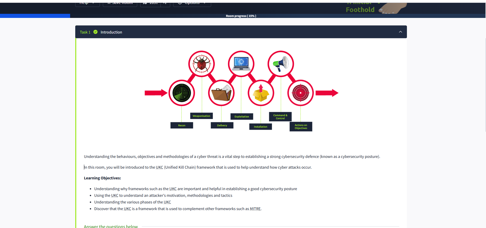

## Learning Objectives

- Understand why frameworks such as the UKC are important and helpful in establishing a good cybersecurity posture.
- Use the UKC to understand an attacker's motivation, methodologies, and tactics.
- Learn about the various phases of the UKC.
- Discover how the UKC complements other frameworks, such as MITRE.

---

## What is a "Kill Chain"?

Originating from the military, a **“Kill Chain”** is a term used to explain the various stages of an attack. In cybersecurity, it describes the methodology or path attackers (e.g., hackers or APTs) use to approach and intrude on a target.

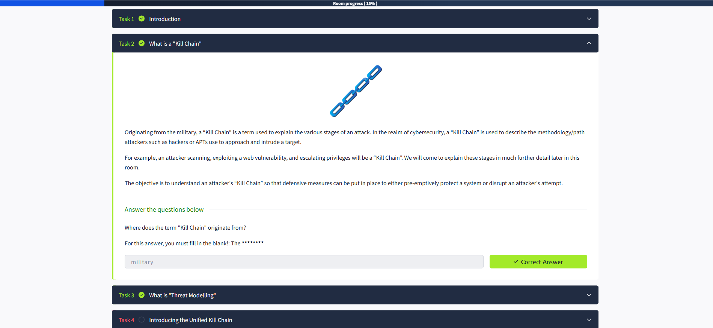

For example, an attacker scanning, exploiting a web vulnerability, and escalating privileges constitutes a **Kill Chain**. We will explore these stages in greater detail later in this room.

The objective is to understand an attacker's **Kill Chain** so that defensive measures can be implemented to either preemptively protect a system or disrupt an attacker's attempt.

### Question: Where does the term "Kill Chain" originate from?

**Answer:** The **military**.

---

## Threat Modeling in Cybersecurity

**Threat modeling** is a series of steps aimed at improving the security of a system. It involves identifying risks and can be summarized as follows:

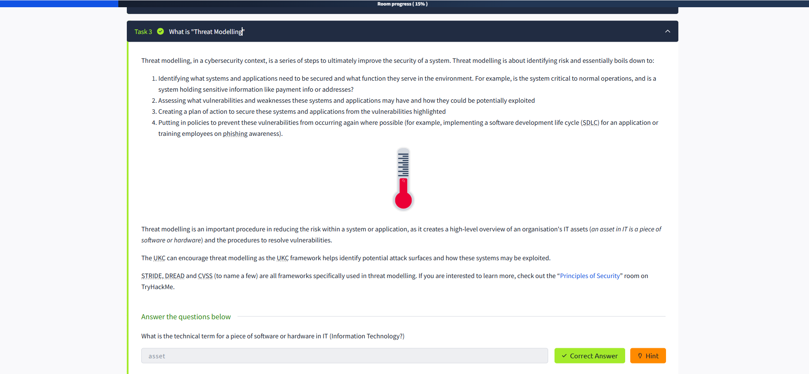

1. **Identify critical systems and applications**: Determine what needs to be secured and its function in the environment. For example, is the system critical to operations, or does it hold sensitive information like payment data or addresses?
2. **Assess vulnerabilities**: Identify weaknesses in these systems and how they could potentially be exploited.
3. **Create a mitigation plan**: Develop a plan to secure these systems and address the identified vulnerabilities.
4. **Implement preventive policies**: Establish measures to prevent vulnerabilities from reoccurring, such as adopting a secure software development life cycle (SDLC) or training employees on phishing awareness.

Threat modeling is crucial for reducing risks within a system or application. It provides a high-level overview of an organization’s IT assets (an **asset** in IT refers to a piece of software or hardware) and outlines procedures to resolve vulnerabilities.

The UKC framework supports threat modeling by identifying potential attack surfaces and how these systems may be exploited.

### Additional Frameworks for Threat Modeling

- **STRIDE**
- **DREAD**
- **CVSS**

If you are interested in learning more, check out the **“Principles of Security”** room on TryHackMe.

### Question: What is the technical term for a piece of software or hardware in IT?

**Answer:** **Asset**

---

## Next Steps

In the next task, we will dive deeper into the **Unified Kill Chain** framework and its phases.

Introducing the Unified Kill Chain
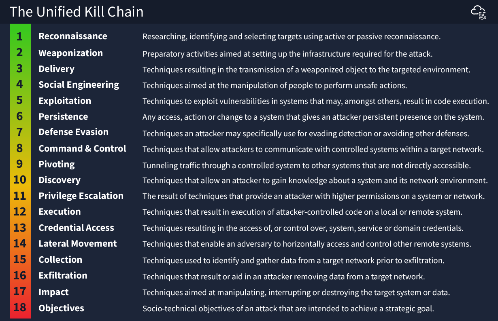

## What I Learned: The Unified Kill Chain (UKC) 🔗🚦

Today I learned about the **Unified Kill Chain (UKC)**, a modern cybersecurity framework created by Paul Pols in 2017. The UKC is designed to work alongside other frameworks like Lockheed Martin’s Kill Chain and MITRE ATT&CK, not to replace them.

### 🆕 Why is the UKC Important?

- **Modern:** Released in 2017 (updated in 2022), so it reflects today’s cyber threats.
- **Very Detailed:** The UKC has **18 phases**—much more than older frameworks.
- **Covers Everything:** It looks at the whole attack, from the first scan to the attacker’s final goals and even their motivation.
- **Realistic:** The UKC shows that attackers often repeat or revisit phases (like doing more reconnaissance after exploiting a system), which is how real attacks happen.

### 📊 UKC vs. Other Frameworks

| UKC Benefit | Other Frameworks |
|-------------|-----------------|
| Modern (2017/2022) | Some are older (e.g., MITRE ATT&CK 2013) |
| 18 detailed phases | Usually fewer phases |
| Covers the full attack lifecycle | Often only part of the attack |
| Allows for repeated phases | Usually linear, not cyclical |

### 🧩 Key Phases in the UKC

- **Defense Evasion:** Techniques attackers use to avoid being detected. 🕵️‍♂️
- **Exfiltration:** How attackers steal data from a network. 📤
- **Objectives:** The final goals or motives of the attacker. 🎯

### 📝 Quick Review

- **Year UKC was released:** 2017
- **Number of phases:** 18
- **Phase for evading detection:** Defense Evasion
- **Phase for stealing data:** Exfiltration
- **Phase for achieving attacker’s goals:** Objectives

---

**Conclusion:**  
Learning about the Unified Kill Chain helped me see how modern cyberattacks are mapped out in detail. The UKC’s 18 phases give a much clearer picture of how attackers operate, making it easier to defend against them. I now understand why it’s important to use up-to-date frameworks that reflect real-world attack patterns! 🚀🛡️

## The "In (Initial Foothold)" Phase of the Unified Kill Chain 🚀🔒

Today I learned about the **"In (Initial Foothold)"** phase of the Unified Kill Chain (UKC) and how attackers try to gain access to a system or network. Here’s a summary of what I discovered:
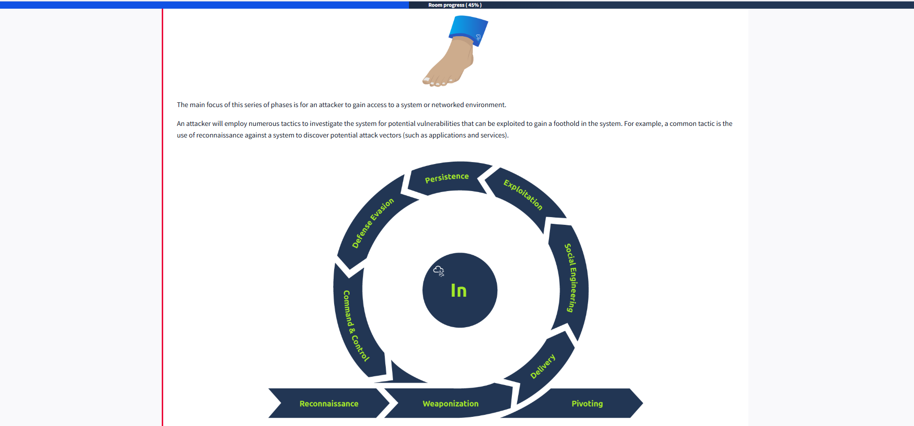
- Attackers use many tactics to find vulnerabilities and get their first access. 🔍
- **Reconnaissance** 🕵️‍♂️: Attackers gather information about the target, like what systems and services are running, employee lists (for phishing or impersonation), credentials, and network topology.
- **Weaponization** 🛠️: Setting up the infrastructure for the attack, such as command & control servers or payload delivery systems.
- **Social Engineering** 🎭: Manipulating people to help the attacker, like getting someone to open a malicious attachment or impersonating an employee to request a password reset.
- **Exploitation** 💥: Taking advantage of vulnerabilities to execute code, like uploading a reverse shell or abusing a web app flaw.
- **Persistence** 🔗: Making sure the attacker can get back in, for example by creating a malicious service or leaving a backdoor.
- **Defense Evasion** 🛡️: Avoiding detection by firewalls, antivirus, or intrusion detection systems.
- **Command & Control** 🖥️: Establishing communication with the compromised system to execute commands, steal data, or pivot further.
- **Pivoting** 🔄: Moving from one compromised system to others in the network that are not directly accessible from the outside.

### Key Takeaways & Quiz Answers 📝

- **Phishing** is a common email tactic to gain a foothold. 📧
- Impersonating an employee for a password reset is **Social Engineering**. 🎭
- Setting up command & control infrastructure is **Weaponization**. 🛠️
- Exploiting a vulnerability is **Exploitation**. 💥
- Moving from one system to another is **Pivoting**. 🔄
- Leaving a malicious service for future access is **Persistence**. 🔗

Learning about these phases helped me understand how attackers operate and how defenders can spot and stop them! 

## The "Through (Network Propagation)" Phase of the Unified Kill Chain 🌐🚀

Continuing from the "In (Initial Foothold)" phase, today I learned about the **"Through (Network Propagation)"** phase of the Unified Kill Chain (UKC). This phase happens after an attacker has already gained initial access to a network. Here’s what I discovered:

- After getting a foothold, attackers try to expand their access and privileges within the network. 🔓
- The attacker sets up a **pivot point**—a compromised system that acts as a base for further attacks and exploration. 🖥️➡️🌐
- From this pivot point, attackers gather more information about the internal network, looking for valuable data and more systems to compromise. 🕵️‍♂️

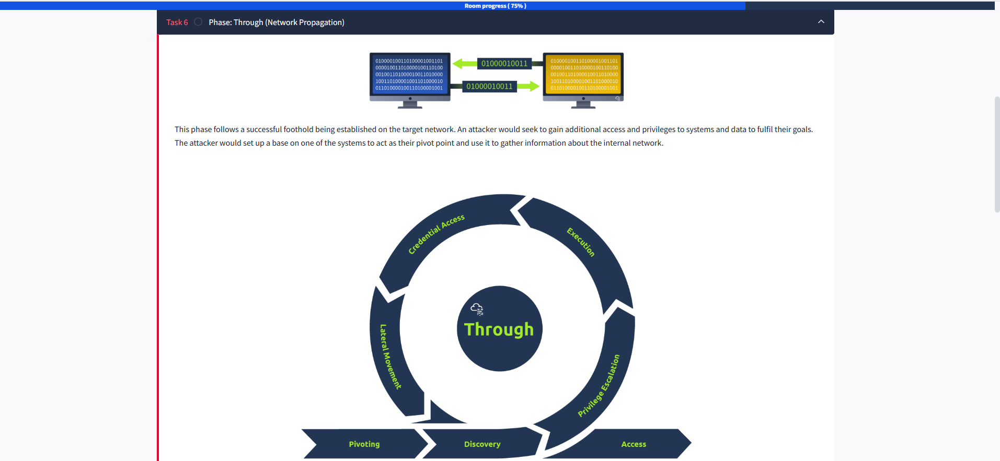

### Pivoting (MITRE Tactic TA0008) 🔄

- **Pivoting** means using the compromised system as a tunnel or bridge between the attacker and the rest of the victim’s network. 🌉
- The attacker can use this system to distribute malware, deploy backdoors, and move laterally to other devices that may not be directly accessible from the outside. 🦠🔗
- This technique helps attackers reach sensitive systems and data that are otherwise protected from external threats.

Learning about the "Through (Network Propagation)" phase helped me understand how attackers move deeper into a network after the initial breach, and why it’s important for defenders to monitor for lateral movement and unusual internal activity! 🛡️👀

## Discovery (MITRE Tactic TA0007) 🔍

Today I learned about the **Discovery** phase in the Unified Kill Chain (UKC), where attackers gather detailed information about the system and network they have accessed. Here’s a summary of what I discovered:

### What Happens in the Discovery Phase?

- **Building a Knowledge Base**: Attackers collect data about:
       - Active user accounts and their permissions. 👤🔑
       - Applications and software installed on the system. 💻📦
       - Web browser activity, including saved credentials and browsing history. 🌐🔎
       - Files, directories, and network shares. 📁🔗
       - System configurations and settings. ⚙️🛠️

### Why Is Discovery Important for Attackers?

- **Preparation for Next Steps**: The information gathered during this phase helps attackers plan their next moves, such as privilege escalation, lateral movement, or data exfiltration.
- **Identifying Valuable Targets**: Attackers use this phase to pinpoint sensitive systems, data, or accounts that can further their objectives.

### Defensive Measures 🛡️

- **Monitor for Unusual Activity**: Look for signs of unauthorized access to files, directories, or network shares.
- **Restrict Permissions**: Limit access to sensitive data and systems based on the principle of least privilege.
- **Audit System Configurations**: Regularly review and secure system settings to prevent exploitation.

Learning about the **Discovery** phase helped me understand how attackers gather critical information to advance their attack and how defenders can spot and mitigate these activities! 🚀👀

## Privilege Escalation (MITRE Tactic TA0004) 🔑📈
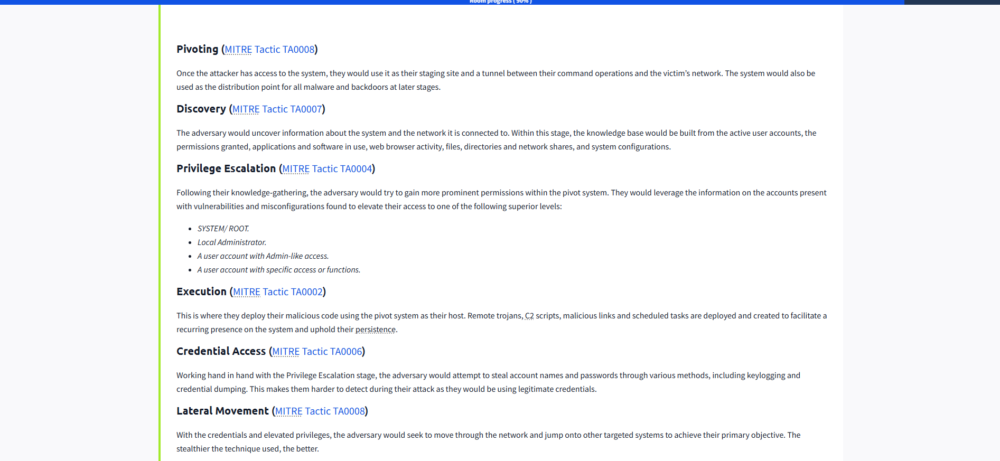
Today I learned about **Privilege Escalation**, a critical phase in the Unified Kill Chain (UKC) where attackers attempt to gain higher-level permissions within a compromised system or network. Here’s what I discovered:
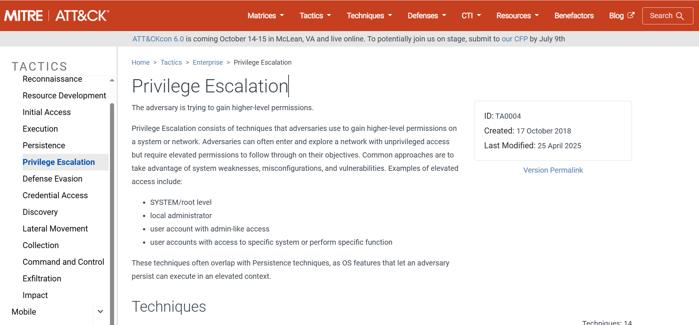
### What Is Privilege Escalation?

Privilege Escalation involves techniques used by attackers to elevate their access from unprivileged accounts to accounts with higher permissions. This step is essential for attackers to achieve their objectives, such as accessing sensitive data or executing advanced operations.

### Common Levels of Elevated Access

Attackers aim to escalate their privileges to one of the following levels:
- **SYSTEM/Root**: Full control over the system. 🖥️🔧
- **Local Administrator**: Permissions to manage the local machine. 🛠️
- **Admin-like User Account**: Accounts with elevated permissions similar to administrators. 👤🔑
- **Specific Function User Account**: Accounts with access to particular systems or functions. ⚙️🔗

### Techniques Used for Privilege Escalation

Attackers often exploit system weaknesses, misconfigurations, and vulnerabilities to escalate their privileges. These techniques frequently overlap with **Persistence** methods, as many OS features that allow persistence also operate in elevated contexts.

### Defensive Measures 🛡️

- **Regularly Audit Permissions**: Ensure accounts have only the permissions they need based on the principle of least privilege.
- **Patch Vulnerabilities**: Address known system weaknesses and misconfigurations promptly.
- **Monitor for Unusual Activity**: Look for signs of privilege escalation attempts, such as changes to account permissions or access to sensitive systems.

Learning about **Privilege Escalation** helped me understand how attackers leverage vulnerabilities to gain elevated access and how defenders can mitigate these risks! 🚀👀

## Execution (MITRE Tactic TA0002) 💻💥
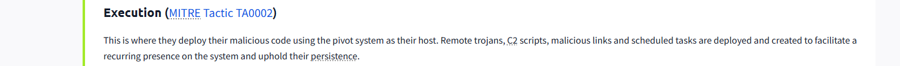
Today I learned about the **Execution** phase in the Unified Kill Chain (UKC). This is the stage where attackers actually run their malicious code on a compromised system, often using the pivot point they established earlier. Here’s what I discovered:

- Attackers use the compromised system to deploy remote trojans, C2 (Command & Control) scripts, malicious links, or scheduled tasks. 🦠🖥️
- The goal is to maintain a recurring presence and ensure persistence on the victim’s network. 🔗
- Execution techniques are often combined with other tactics, like persistence or lateral movement, to help attackers explore the network or steal data. 🔍📤

**Example:**  
An attacker might use a remote access tool to run a PowerShell script that discovers other systems on the network. 🖱️💻

Learning about the **Execution** phase helped me understand how attackers actually run their code and why defenders need to monitor for suspicious 

## Credential Access (MITRE Tactic TA0006) 🗝️🔓
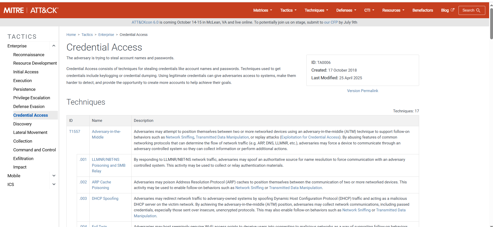
Today I learned about the **Credential Access** phase in the Unified Kill Chain (UKC). This phase is closely linked with Privilege Escalation, as attackers often need to steal usernames and passwords to gain higher-level access and move around undetected. Here’s what I discovered:

- Attackers use various techniques to steal credentials, such as keylogging (recording keystrokes) and credential dumping (extracting passwords from memory or files). ⌨️🕵️‍♂️
- By obtaining real usernames and passwords, attackers can log in as legitimate users, making their actions much harder to spot. This allows them to blend in with normal network activity and avoid detection by security tools. 🕶️
- Stolen credentials can be used to access more systems, escalate privileges, create new accounts, or even exfiltrate sensitive data. This makes credential access a critical step for attackers to achieve their goals. 🚪➡️💻

### Why Is Credential Access Important for Attackers?

- **Stealth:** Using valid credentials helps attackers avoid triggering security alerts, since their actions look like normal user behavior.
- **Flexibility:** With stolen credentials, attackers can move laterally across the network, access sensitive resources, and maintain persistence.
- **Opportunity:** Attackers can create new accounts or change passwords to lock out defenders and keep control of compromised systems.

### Defensive Measures 🛡️

- **Monitor for Unusual Login Activity:** Watch for logins from unexpected locations or at odd times.
- **Use Multi-Factor Authentication (MFA):** Adding extra verification steps makes it harder for attackers to use stolen credentials.
- **Regularly Audit Accounts:** Check for unauthorized account creation or privilege changes.
- **Educate Users:** Teach employees to recognize phishing and avoid entering credentials on suspicious sites.

Learning about the **Credential Access** phase helped me understand how attackers steal and abuse credentials, and why it’s so important to protect account information and monitor for suspicious access! 🚀👀

## Lateral Movement (MITRE Tactic TA0008) 🔄🌐
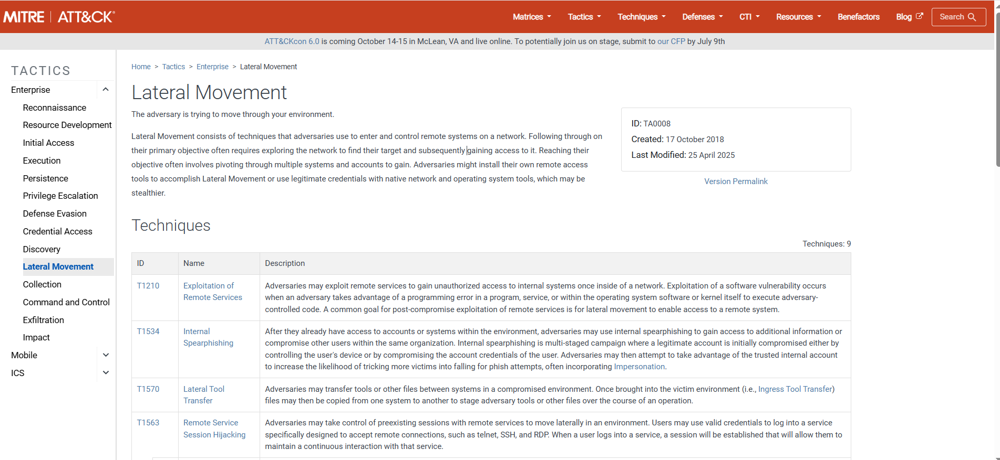
Today I learned about the **Lateral Movement** phase in the Unified Kill Chain (UKC). This is the stage where attackers, after gaining credentials and elevated privileges, try to move through the network to reach their main targets. Here’s what I discovered:

- Attackers use their access to jump from one system to another within the network, looking for valuable data or systems. 🖥️➡️🖥️
- They often use stealthy techniques, like legitimate credentials or built-in tools, to avoid detection and blend in with normal activity. 🕶️
- Lateral Movement can involve installing remote access tools, using remote desktop, or exploiting trust relationships between systems. 🔗

**Example:**  
An attacker might use stolen admin credentials to connect to another server via RDP or use PowerShell to execute commands on multiple machines.

### Why Is Lateral Movement Important?

- It allows attackers to explore the network, find sensitive data, and get closer to their final objective.
- The more quietly they move, the harder it is for defenders to spot them.

Learning about the **Lateral Movement** phase helped me understand how attackers spread through a network and why it’s crucial to monitor for unusual internal activity and privilege use!

## Collection (MITRE Tactic TA0009) 📥🗂️
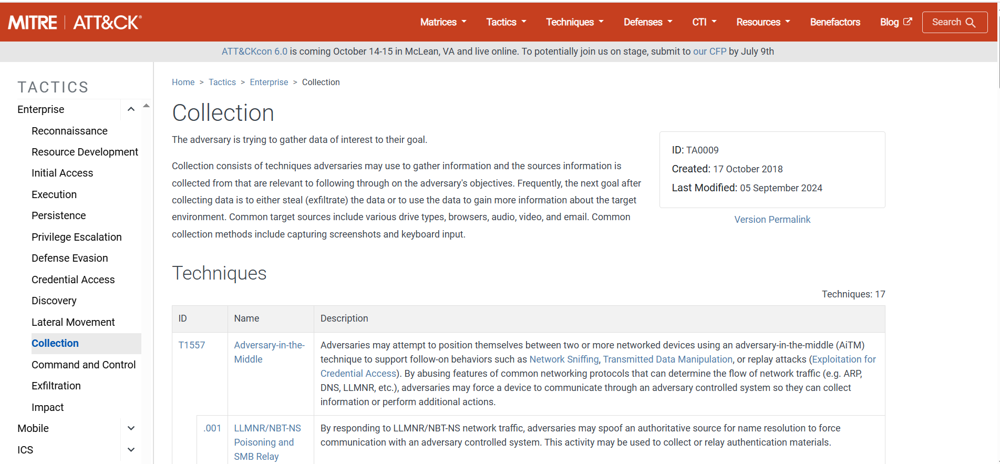
Today I learned about the **Collection** phase in the Unified Kill Chain (UKC). At this stage, attackers have already gained access to critical assets and now focus on gathering valuable data from the environment. Here’s what I discovered:

- Attackers search for and collect sensitive information from various sources, such as hard drives, shared folders, browser data (like saved passwords and cookies), emails, chat logs, screenshots, audio, and video files. 💾📧🎥
- They may use automated scripts or malware to scan for files with specific keywords, file types, or locations that are likely to contain valuable data.
- The **confidentiality** of the organization is at risk, as attackers can now access and prepare to steal private or proprietary information.
- Sometimes, attackers also collect credentials, encryption keys, or configuration files to help with further exploitation or persistence.

Learning about the **Collection** phase helped me understand how attackers systematically gather all the information they need before trying to remove it from the network. It’s important for defenders to monitor for unusual file access or large data aggregations! 🕵️‍♂️

---

## Exfiltration (MITRE Tactic TA0010) 📤🔒
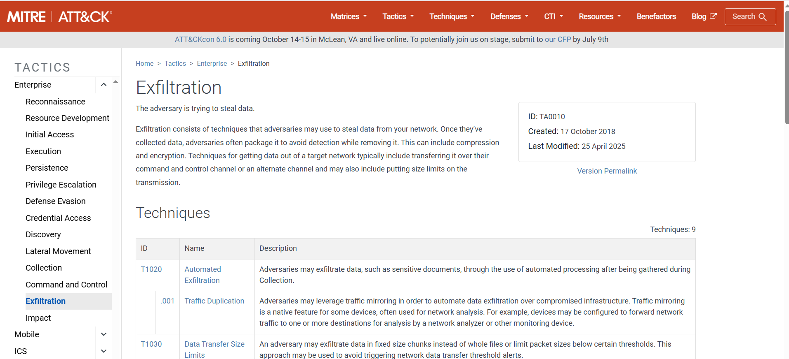
The next step I learned about is **Exfiltration**. This is where attackers try to steal the data they have collected, often using stealthy methods to avoid detection. Here’s what I discovered:

- Attackers package the stolen data, often encrypting or compressing it to hide their actions and avoid triggering security alerts. 📦🔐
- They use previously established C2 (Command & Control) channels, covert tunnels, or even legitimate services (like cloud storage or email) to send the data out of the network. 🌐🛣️
- Exfiltration can happen in small chunks over time (to avoid detection) or in one big transfer if the attacker is in a hurry.
- Attackers may use techniques like steganography (hiding data in images or files) or split the data into multiple parts to make detection even harder.

Learning about the **Exfiltration** phase showed me how attackers actually remove sensitive data from a network and why it’s important to monitor for unusual data transfers, unexpected uploads, or encrypted outbound traffic! 🚨👀

---

## Impact (MITRE Tactic TA0040) 💣⚠️
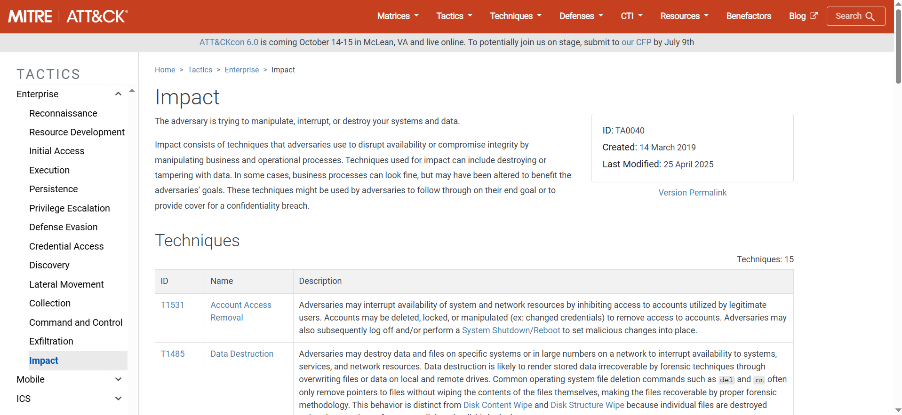
Finally, I learned about the **Impact** phase. This is where attackers try to compromise the **integrity** and **availability** of data and systems, often causing serious damage. Here’s what I discovered:

- Attackers may manipulate, destroy, or disrupt data and systems, using techniques like ransomware (encrypting files and demanding payment), disk wipes (deleting all data), website defacement (changing website content), or denial of service (DoS) attacks to make services unavailable. 🛑🗑️🔒
- They might also remove or lock out user accounts, corrupt backups, or sabotage business operations to maximize the damage.
- The goal is often to disrupt business, cause financial loss, damage reputation, or force victims to pay ransoms.
- Impact can be immediate (like a ransomware attack) or delayed (such as leaking sensitive data to the public after exfiltration).

Learning about the **Impact** phase helped me understand the final goals of an attack and why protecting the integrity and availability of data is just as important as confidentiality. Defenders should have incident response plans and backups ready to recover from these types of attacks! 🛡️🔐

---

### Objectives 🎯

With full access to systems and networks, attackers aim to achieve their main strategic goals. This could mean:

- Making money through ransomware or selling stolen data on the dark web.
- Stealing trade secrets, intellectual property, or confidential business information.
- Damaging a company’s reputation by leaking private data or defacing public websites.
- Disrupting business operations to harm competitors or for political reasons.

Understanding these final phases of the Unified Kill Chain helped me see the complete journey of an attack, from initial access to achieving the attacker’s ultimate objectives. It also showed me why it’s crucial to defend every step along the way and to have strong detection and response strategies in place! 🚀👀