# Warzone 1 — SOC Triage: Malware Command & Control Activity 🚨

Your shift just started and your first network alert comes in.  
**Start Machine — SOC Team**

You work as a Tier 1 Security Analyst L1 for a Managed Security Service Provider (MSSP). Today you're tasked with monitoring network alerts.

A few minutes into your shift, you get your first network case: Potentially Bad Traffic and Malware Command and Control Activity detected. Your race against the clock starts. Inspect the PCAP and retrieve the artifacts to confirm this alert is a true positive.

**Tools:**  
Brim, Network Miner, Wireshark
---

## Questions & Answers ✅

**Q1: What was the alert signature for Malware Command and Control Activity Detected?**  
**Answer:** `ET Malware MirrorBlast CnC Activity M3`  
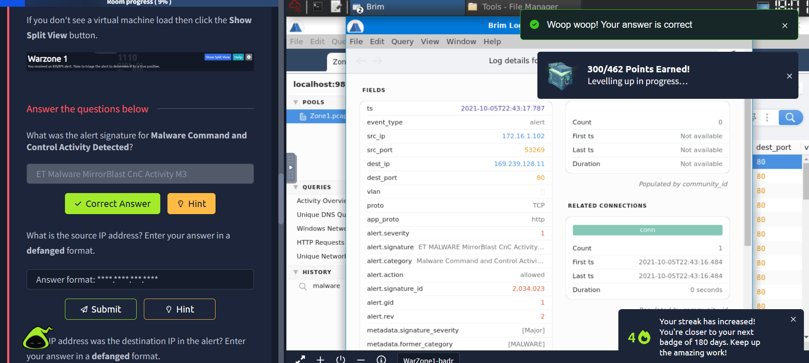

**Q2 (Hint): What is the source IP address? Enter your answer in a defanged format.**  
**Answer:** `172[.]16[.]1[.]102`  
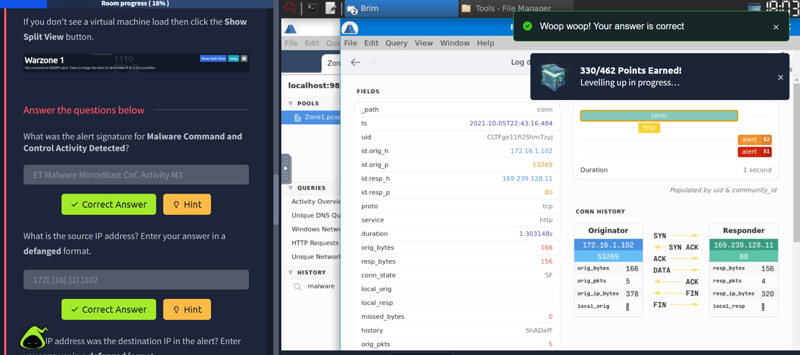

**Q3 (Hint): What IP address was the destination IP in the alert? Enter your answer in a defanged format.**  
**Answer:** `169[.]239[.]128[.]11`  
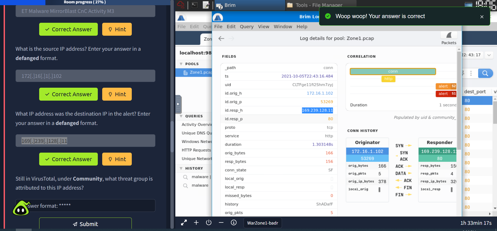

**Q4 (Hint): Still in VirusTotal, under Community, what threat group is attributed to this IP address?**  
**Answer:** `TA505`  
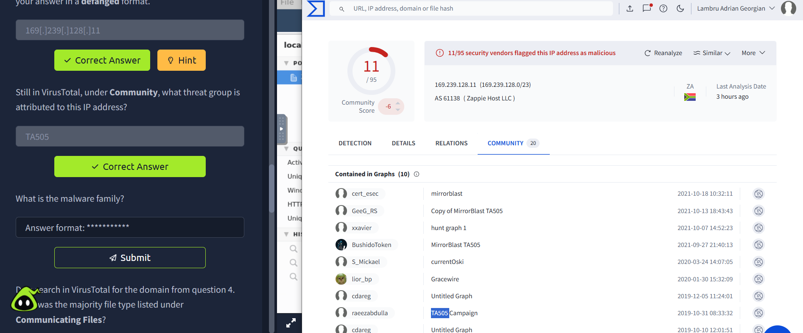

**Q5: What is the malware family?**  
**Answer:** `MirrorBlast`  
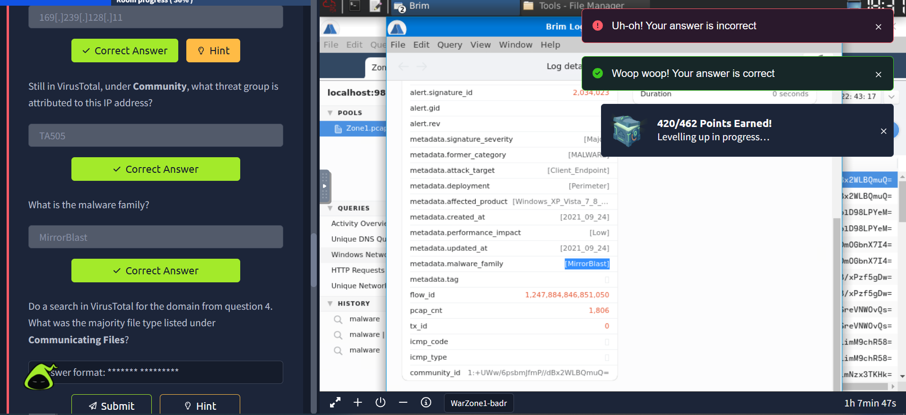

**Q6: Do a search in VirusTotal for the domain from question 4. What was the majority file type listed under Communicating Files?**  
**Answer:** `Windows Installer`  
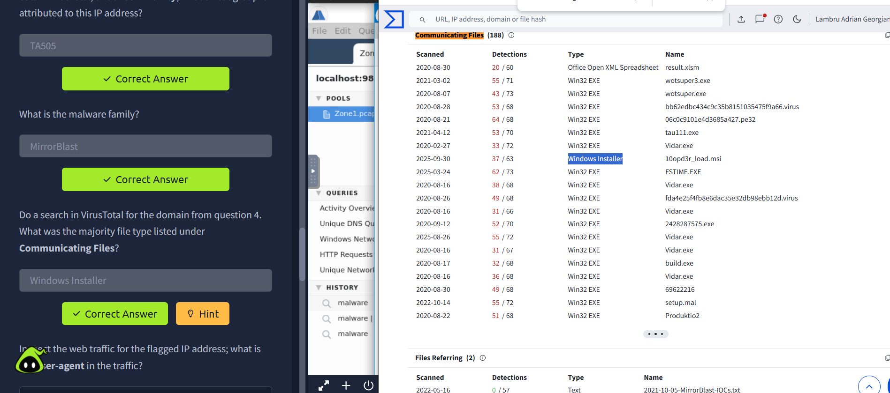

**Q7 (Hint): Inspect the web traffic for the flagged IP address; what is the user-agent in the traffic?**  
**Answer:** `REBOL View 2.7.8.3.1`  
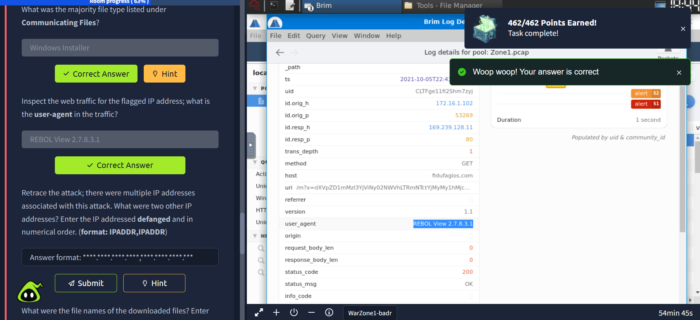

**Q8: Retrace the attack; there were multiple IP addresses associated with this attack. What were two other IP addresses? Enter the IP addressed defanged and in numerical order. (format: IPADDR,IPADDR)**  
**Answer:** `185[.]10[.]68[.]235,192[.]36[.]27[.]92`  
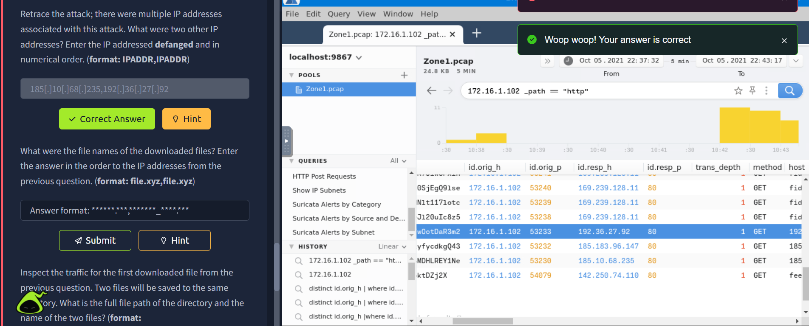

**Q9 (Hint): What were the file names of the downloaded files? Enter the answer in the order to the IP addresses from the previous question. (format: file.xyz,file.xyz)**  
**Answer:** `filter.msi,10opd3r_load.msi`  
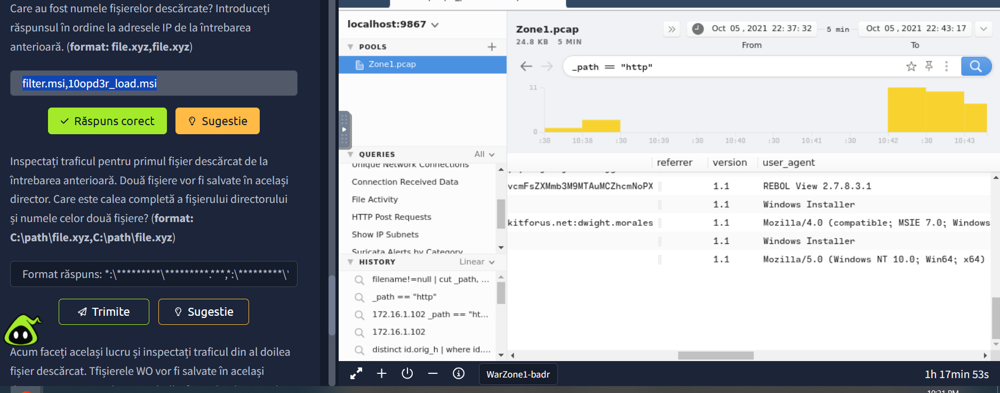

**Q10 (Hint): Inspect the traffic for the first downloaded file from the previous question. Two files will be saved to the same directory. What is the full file path of the directory and the name of the two files? (format: C:\path\file.xyz,C:\path\file.xyz)**  
**Answer:** `C:\ProgramData\001\arab.bin,C:\ProgramData\001\arab.exe`  
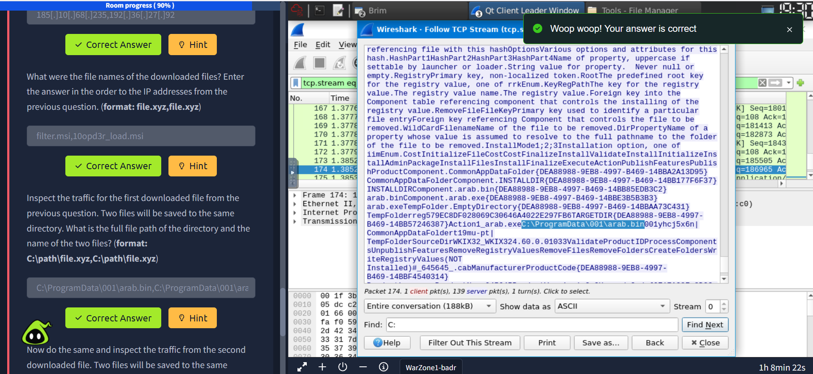

**Q11 (Hint): Now do the same and inspect the traffic from the second downloaded file. Two files will be saved to the same directory. What is the full file path of the directory and the name of the two files? (format: C:\path\file.xyz,C:\path\file.xyz)**  
**Answer:** `C:\ProgramData\Local\Google\rebol-view-278-3-1.exe,C:\ProgramData\Local\Google\exemple.rb`  
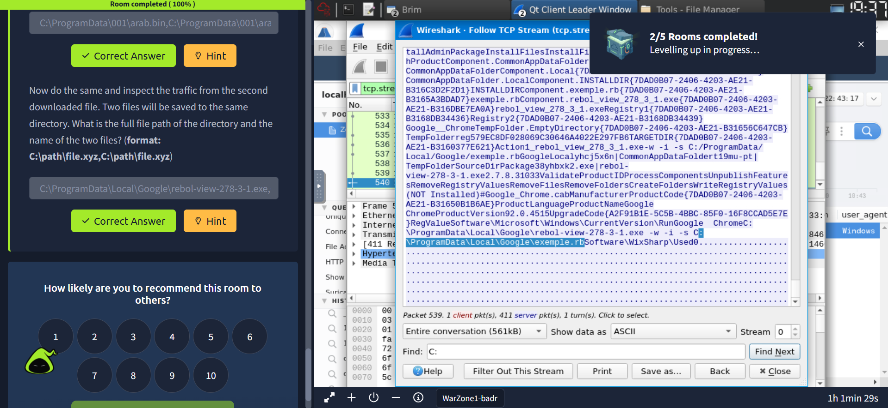

---

## Quick Notes & Lessons Learned 📝

- Alert signatures (IDS/ET rules) give a fast initial triage cue — confirm with traffic analysis.  
- Use VirusTotal Community tab to correlate IPs/domains to threat actors and file types.  
- Inspect HTTP headers (User-Agent, Host, Server) for suspicious or uncommon clients.  
- Extract downloaded files/paths from HTTP/FTP artifacts to build host remediation steps.  
- Multiple IPs/domains often indicate distributed infrastructure — track all of them and check TLS/SSL certs where available.

---