# Warzone 2 — Premium Room: Network Alert Triage 🚨

This exercise focuses on **triaging IDS/IPS alerts** to determine whether they are true positives using packet capture (PCAP) analysis.  
The task emphasizes malware detection, network trojans, and potential corporate privacy violations.  

**Tools used:**  
- 🕵️‍♂️ **Wireshark**  
- 🔍 **Network Miner**  
- 📊 **Brim**

**Scenario Overview:**  
The Security Operations Center (SOC) received alerts for:  
- Misc activity  
- A Network Trojan Was Detected  
- Potential Corporate Privacy Violation  

The analyst’s objective is to inspect the PCAP and retrieve artifacts to confirm whether the alert is a **true positive**.

---

## Questions & Answers ✅

**Q1: What was the alert signature for “A Network Trojan Was Detected”?**  
**Answer:** `ET MALWARE Likely Evil EXE download from MSXMLHTTP non-exe extension M2`  
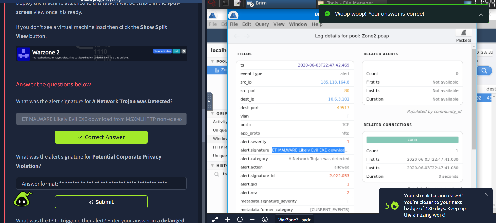

**Q2: What was the alert signature for “Potential Corporate Privacy Violation”?**  
**Answer:** `ET POLICY PE EXE or DLL Windows file download HTTP`  
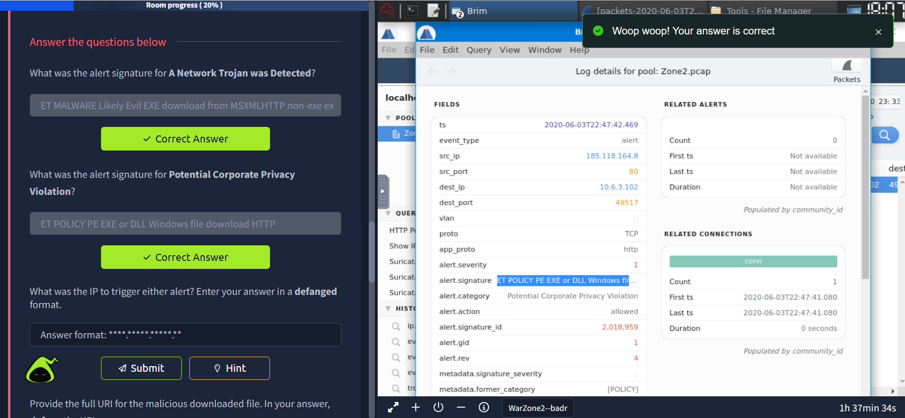

**Q3: What was the IP address that triggered either alert? (Defanged format)**  
**Answer:** `185[.]118[.]164[.]8`  
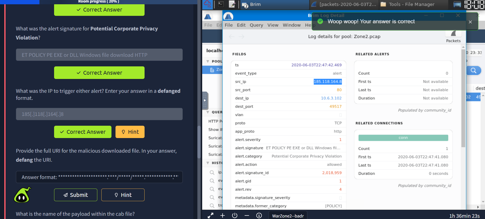  
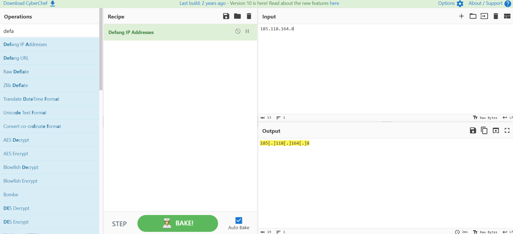

**Q4: Provide the full URI for the malicious downloaded file (defanged).**  
**Answer:** `awh93dhkylps5ulnq-be[.]com/czwih/fxla[.]php?l=gap1[.]cab`  
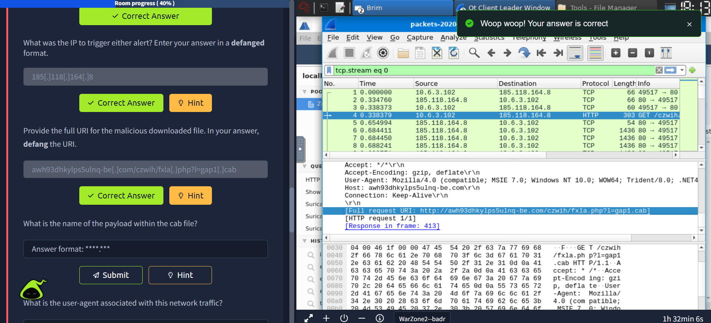

**Q5: What is the name of the payload within the CAB file?**  
**Answer:** `draw.dll`  
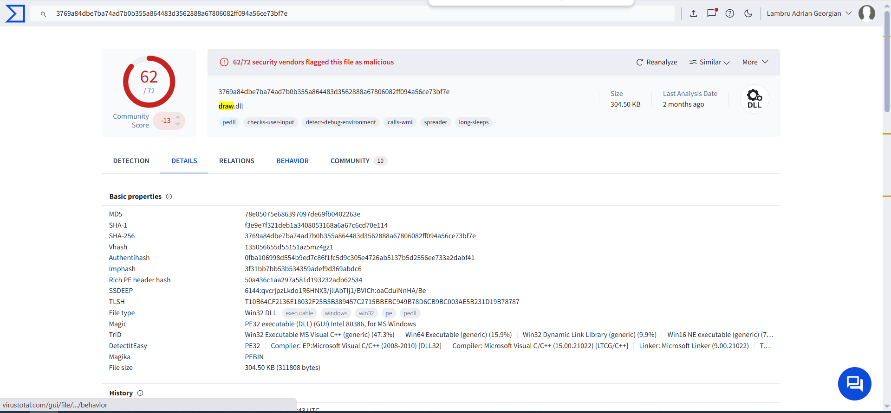

**Q6: What is the User-Agent associated with this network traffic?**  
**Answer:** `Mozilla/4.0 (compatible; MSIE 7.0; Windows NT 10.0; WOW64; Trident/8.0; .NET4.0C; .NET4.0E)`  

**Q7: What other domains are labeled as malicious by VirusTotal? (Alphabetical, defanged)**  
**Answer:** `a-zcorner[.]com,knockoutlights[.]com`  
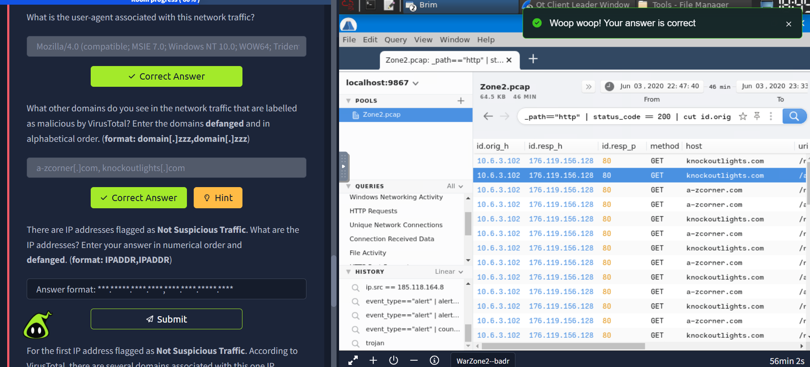

**Q8: There are IPs flagged as Not Suspicious Traffic. Enter them in numerical order, defanged.**  
**Answer:** `64[.]225[.]65[.]166,142[.]93[.]211[.]176`  
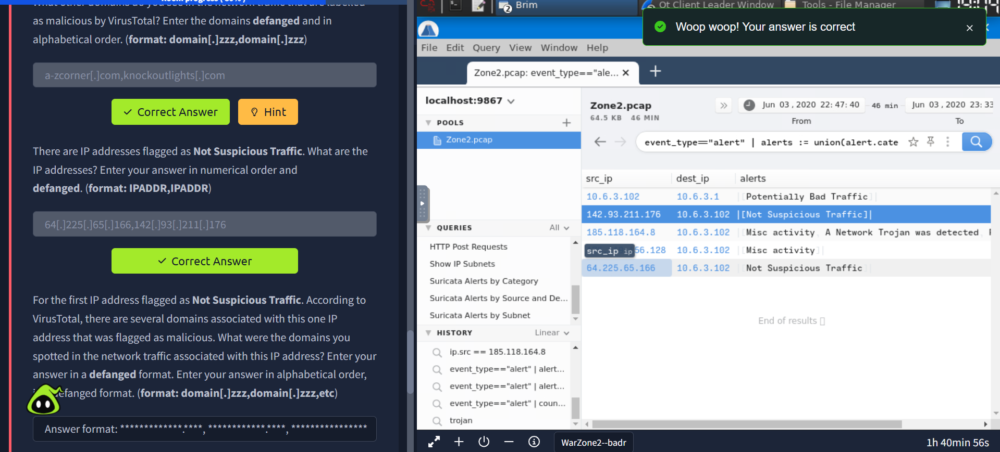

**Q9: For the first Not Suspicious IP, what malicious domains were associated? (Alphabetical, defanged)**  
**Answer:** `safebanktest[.]top, tocsicambar[.]xyz, ulcertification[.]xyz`  
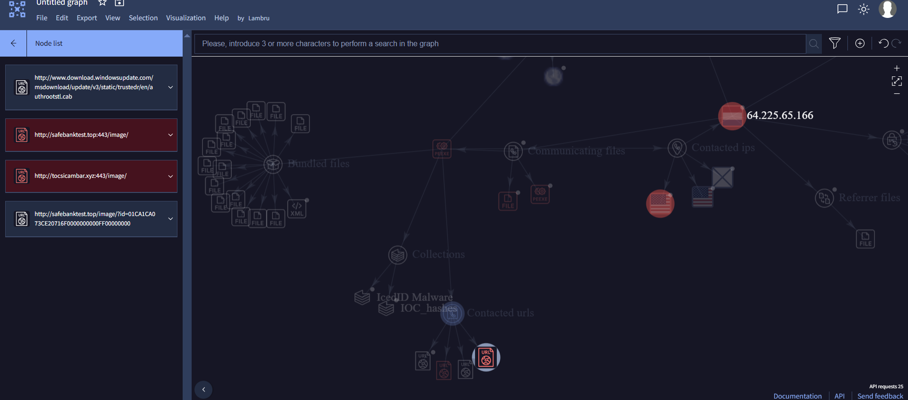  
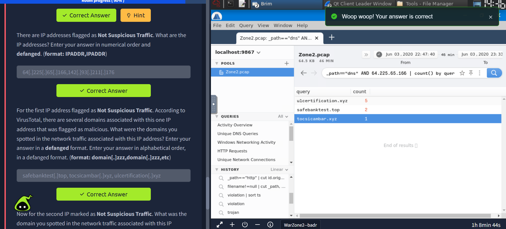

**Q10: For the second Not Suspicious IP, what domain was observed in the network traffic? (Defanged)**  
**Answer:** `2partscow[.]top`  
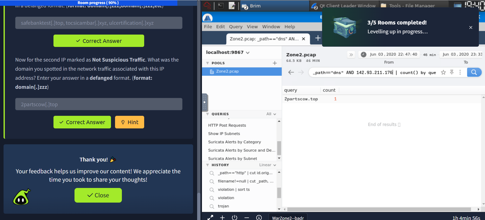

---

## Lessons Learned & Key Takeaways 📝

- 🔑 **Alert Validation:** Always confirm alerts via traffic analysis to identify **true positives**.  
- 🌐 **IP and Domain Analysis:** Defanging IPs/domains ensures safe documentation and reporting.  
- 🗂️ **Payload Investigation:** Inspect downloaded files (CAB/DLL) to determine malware functionality.  
- 🔍 **User-Agent and URI Examination:** Provides insight into **delivery mechanisms** and malware C2 communications.  
- 🧩 **Infrastructure Mapping:** Track both suspicious and non-suspicious IPs/domains to reveal **adjacent malicious activity**.  
- 📈 **Correlation:** Combining IDS alerts with PCAP analysis gives a **complete picture of attack vectors**.
