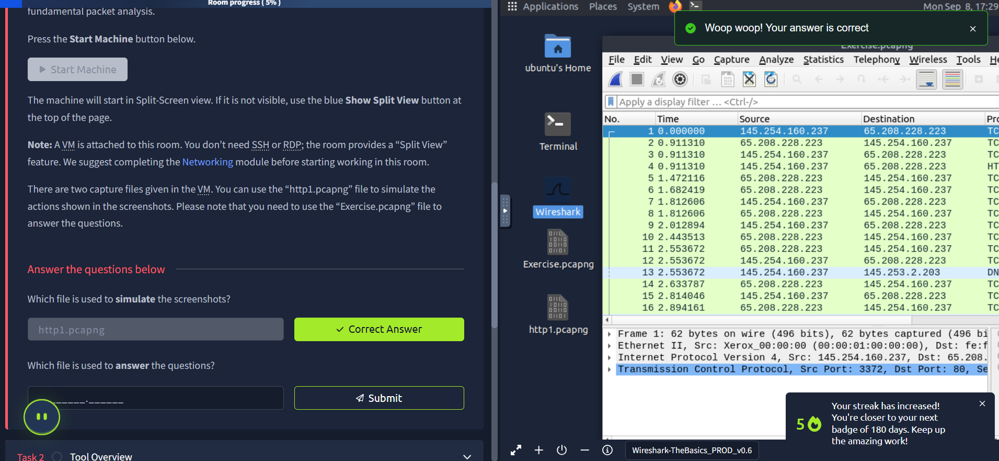
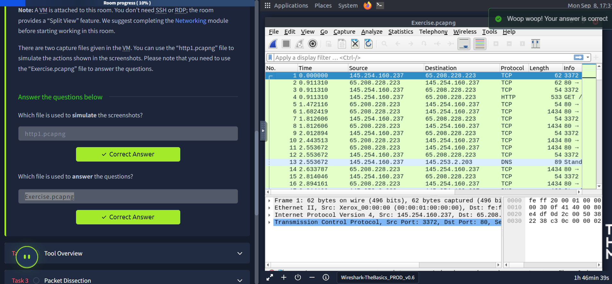
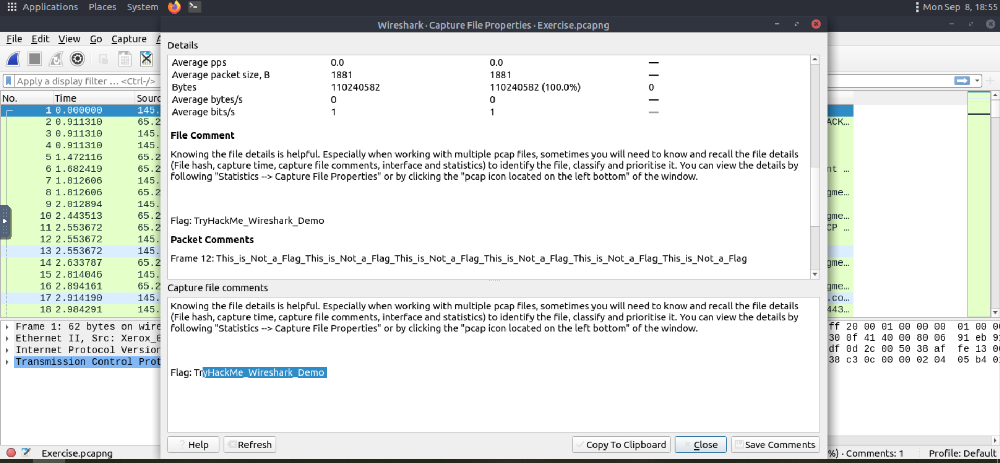
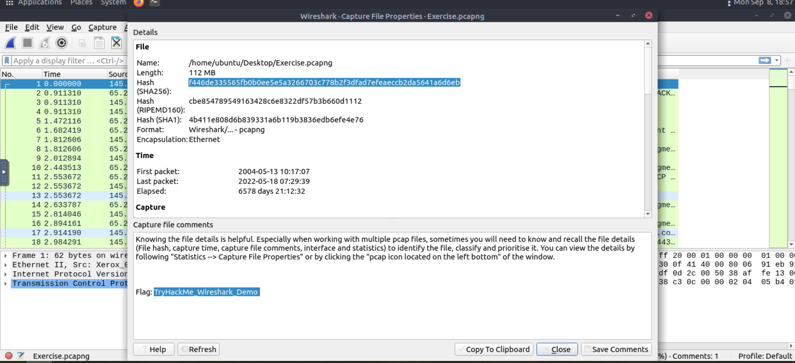

## Wireshark — Traffic Analysis Essentials 🚀

Wireshark is an open‑source, cross‑platform network packet analyzer used to sniff live traffic and inspect packet captures (PCAP). Here’s a concise learning note that reflects what I practiced and understood. 💡

### Getting Started ▶️
- A VM is provided with Split View; no SSH/RDP needed.
- Two captures are available: use `http1.pcapng` to follow the screenshots and `Exercise.pcapng` to answer the questions.

**Files used 📁**
- Screenshots simulated with: `http1.pcapng`

- Questions answered with: `Exercise.pcapng`

### What I learned today 🎯
- Wireshark helps troubleshoot networks, spot security anomalies, and study protocols.
- It doesn’t modify traffic and it’s not an IDS; value comes from the analyst’s investigation skills.

### Wireshark GUI 🖥️
- **Toolbar**: shortcuts for capture, filter, sort, export, merge.
- **Display Filter Bar**: primary place to query/filter packets.
- **Recent Files**: reopen last PCAPs quickly.
- **Capture Filters & Interfaces**: choose network interfaces and set capture filters.
- **Status Bar**: shows profile, capture state, packet counts.

### Loading PCAPs 📦
- Open via File menu, drag‑and‑drop, or double‑click. After loading, Wireshark displays total packets and detailed panes.

### Packet Panes 🔍
- **Packet List**: per‑packet summary (SRC, DST, protocol, info).
- **Packet Details**: hierarchical protocol fields of the selected packet.
- **Packet Bytes**: hex and ASCII; highlights selection from Details.

### Coloring Rules 🎨
- Default coloring highlights protocols and anomalies at a glance. You can toggle and customize via View → Coloring Rules or context menus. Temporary coloring can be applied per conversation.

### Live Capture 🦈
- Start/stop/restart using the shark/red/green buttons. The status bar shows the active interface and packet counters.

### Merge PCAPs 🔗
- File → Merge combines another capture with the one currently open. Remember to save the merged result as a new file before analysis.

### Capture File Properties 📊
- Use Statistics → Capture File Properties (or the PCAP icon bottom‑left) to view file hash, time, comments, interface, and stats.

### Quick Answers from Exercise.pcapng ✅
- **Flag (capture file comments)**: `TryHackMe_Wireshark_Demo`

- **Total number of packets**: `58620`
- **SHA256 of the capture file**: `f446de335565fb0b0ee5e5a3266703c778b2f3dfad7efeaeccb2da5641a6d6eb`

### Notes I’ll apply next time 🧭
- Use display filters and conversation filters to quickly pivot to flows of interest.
- Consider custom coloring rules to spotlight suspicious protocols/ports.
