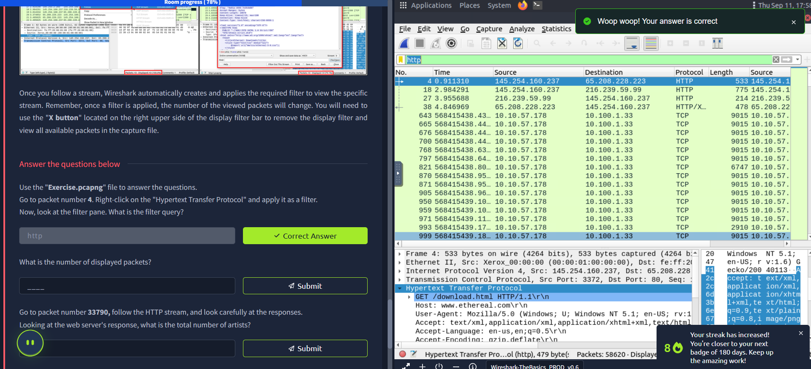
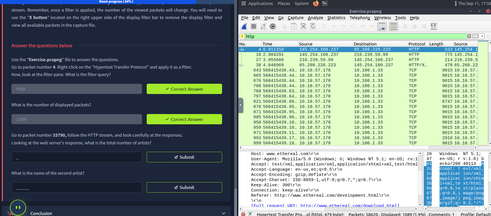
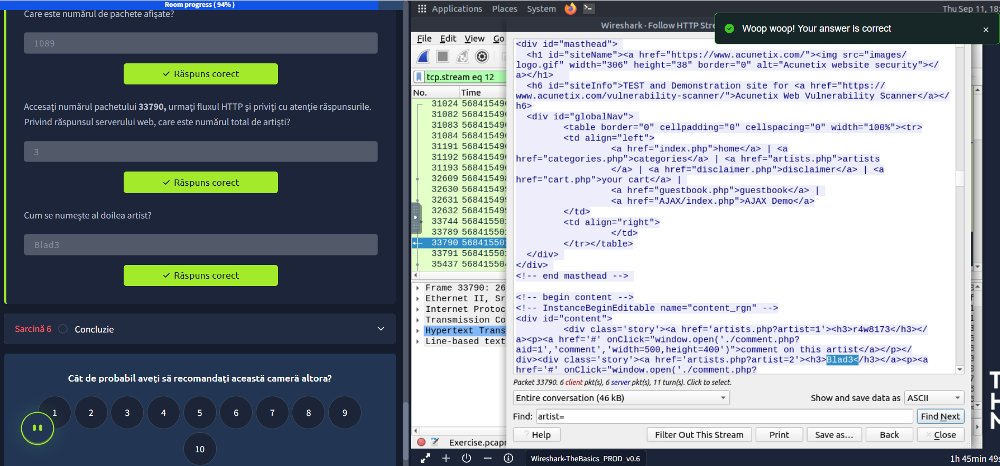

## Wireshark — Traffic Analysis Essentials 🚀

Wireshark is an open‑source, cross‑platform network packet analyzer used to sniff live traffic and inspect packet captures (PCAP). Here’s a concise learning note that reflects what I practiced and understood. 💡

### Getting Started ▶️
- A VM is provided with Split View; no SSH/RDP needed.
- Two captures are available: use `http1.pcapng` to follow the screenshots and `Exercise.pcapng` to answer the questions.

**Files used 📁**
- Screenshots simulated with: `http1.pcapng`

- Questions answered with: `Exercise.pcapng`

### What I learned today 🎯
- Wireshark helps troubleshoot networks, spot security anomalies, and study protocols.
- It doesn’t modify traffic and it’s not an IDS; value comes from the analyst’s investigation skills.

### Wireshark GUI 🖥️
- **Toolbar**: shortcuts for capture, filter, sort, export, merge.
- **Display Filter Bar**: primary place to query/filter packets.
- **Recent Files**: reopen last PCAPs quickly.
- **Capture Filters & Interfaces**: choose network interfaces and set capture filters.
- **Status Bar**: shows profile, capture state, packet counts.

### Loading PCAPs 📦
- Open via File menu, drag‑and‑drop, or double‑click. After loading, Wireshark displays total packets and detailed panes.

### Packet Panes 🔍
- **Packet List**: per‑packet summary (SRC, DST, protocol, info).
- **Packet Details**: hierarchical protocol fields of the selected packet.
- **Packet Bytes**: hex and ASCII; highlights selection from Details.

### Coloring Rules 🎨
- Default coloring highlights protocols and anomalies at a glance. You can toggle and customize via View → Coloring Rules or context menus. Temporary coloring can be applied per conversation.

### Live Capture 🦈
- Start/stop/restart using the shark/red/green buttons. The status bar shows the active interface and packet counters.

### Merge PCAPs 🔗
- File → Merge combines another capture with the one currently open. Remember to save the merged result as a new file before analysis.

### Capture File Properties 📊
- Use Statistics → Capture File Properties (or the PCAP icon bottom‑left) to view file hash, time, comments, interface, and stats.

### Quick Answers from Exercise.pcapng ✅
- **Flag (capture file comments)**: `TryHackMe_Wireshark_Demo`

- **Total number of packets**: `58620`
- **SHA256 of the capture file**: `f446de335565fb0b0ee5e5a3266703c778b2f3dfad7efeaeccb2da5641a6d6eb`

### Notes I’ll apply next time 🧭
- Use display filters and conversation filters to quickly pivot to flows of interest.
- Consider custom coloring rules to spotlight suspicious protocols/ports.

-------------------------------------------------------------------------------------------------

### Task 3 — Packet Dissection 🔬

Packet dissection (protocol dissection) is the process of decoding protocols and their fields to understand what’s happening inside each packet. Wireshark supports many protocol dissectors, and you can even extend it with custom ones.

Note: This section assumes OSI model familiarity and shows how Wireshark maps fields to OSI layers for analysis.

#### Packet Details View 🧩
- Open details by selecting a packet in the list (double‑click opens a new window).
- Packets typically show 5–7 layers aligned to OSI.
- Clicking any field highlights the corresponding bytes in the Bytes pane.

Key layers you’ll see:
- **Frame (L1)**: Physical‑level framing and the packet you’re viewing.
- **Source/Destination MAC (L2)**: Data Link addresses.
- **Source/Destination IP (L3)**: Network layer addressing (IPv4/IPv6).
- **Protocol (L4)**: Transport info (TCP/UDP), ports, segments, reassembly.
- **Protocol Errors (L4 cont.)**: Indications such as TCP reassembly.
- **Application Protocol (L5+)**: HTTP, FTP, SMB, etc.
- **Application Data**: The decoded application payload.

Images:
- Packet details and bytes highlighting
- Layer breakdown examples

#### Questions from Exercise.pcapng ✅
- View packet 38 — markup language used under HTTP: **eXtensible Markup Language**

- Arrival date (MM/DD/YYYY): **05/13/2004**

- TTL value: **47**

- TCP payload size: **424**

- E‑Tag value (example format 82ecb-6321-9e904585): **9a01a-4696-7e354b00**

------------------------------------------------------------------------------------------------
# Task 4 📦
## Packet Navigation 🧭
### Packet Numbers 🔢

Wireshark calculates the number of investigated packets and assigns a unique number for each packet. This helps the analysis process for big captures and makes it easy to go back to a specific point of an event. 

### Go to Packet 🎯

Packet numbers do not only help to count the total number of packets or make it easier to find/investigate specific packets. This feature not only navigates between packets up and down; it also provides in-frame packet tracking and finds the next packet in the particular part of the conversation. You can use the "Go" menu and toolbar to view specific packets.

### Find Packets 🔍

Apart from packet number, Wireshark can find packets by packet content. You can use the "Edit --> Find Packet" menu to make a search inside the packets for a particular event of interest. This helps analysts and administrators to find specific intrusion patterns or failure traces.

There are two crucial points in finding packets. The first is knowing the input type. This functionality accepts four types of inputs (Display filter, Hex, String and Regex). String and regex searches are the most commonly used search types. Searches are case insensitive, but you can set the case sensitivity in your search by clicking the radio button.

The second point is choosing the search field. You can conduct searches in the three panes (packet list, packet details, and packet bytes), and it is important to know the available information in each pane to find the event of interest. For example, if you try to find the information available in the packet details pane and conduct the search in the packet list pane, Wireshark won't find it even if it exists.

### Mark Packets 📌

Marking packets is another helpful functionality for analysts. You can find/point to a specific packet for further investigation by marking it. It helps analysts point to an event of interest or export particular packets from the capture. You can use the "Edit" or the "right-click" menu to mark/unmark packets.

Marked packets will be shown in black regardless of the original colour representing the connection type. Note that marked packet information is renewed every file session, so marked packets will be lost after closing the capture file. 

### Packet Comments 💬

Similar to packet marking, commenting is another helpful feature for analysts. You can add comments for particular packets that will help the further investigation or remind and point out important/suspicious points for other layer analysts. Unlike packet marking, the comments can stay within the capture file until the operator removes them.

### Export Packets 📤

Capture files can contain thousands of packets in a single file. As mentioned earlier, Wireshark is not an IDS, so sometimes, it is necessary to separate specific packages from the file and dig deeper to resolve an incident. This functionality helps analysts share the only suspicious packages (decided scope). Thus redundant information is not included in the analysis process. You can use the "File" menu to export packets.

### Export Objects (Files) 📁

Wireshark can extract files transferred through the wire. For a security analyst, it is vital to discover shared files and save them for further investigation. Exporting objects are available only for selected protocol's streams (DICOM, HTTP, IMF, SMB and TFTP).

### Time Display Format ⏰

Wireshark lists the packets as they are captured, so investigating the default flow is not always the best option. By default, Wireshark shows the time in "Seconds Since Beginning of Capture", the common usage is using the UTC Time Display Format for a better view. You can use the "View --> Time Display Format" menu to change the time display format.

### Expert Info 🧠

Wireshark also detects specific states of protocols to help analysts easily spot possible anomalies and problems. Note that these are only suggestions, and there is always a chance of having false positives/negatives. Expert info can provide a group of categories in three different severities. Details are shown in the table below.

| Severity | Colour | Info |
|----------|--------|------|
| Chat | Blue | Information on usual workflow. |
| Note | Cyan | Notable events like application error codes. |
| Warn | Yellow | Warnings like unusual error codes or problem statements. |
| Error | Red | Problems like malformed packets. |

Frequently encountered information groups are listed in the table below. You can refer to Wireshark's official documentation for more information on the expert information entries.

| Group | Info | Group | Info |
|-------|------|-------|------|
| Checksum | Checksum errors. | Deprecated | Deprecated protocol usage. |
| Comment | Packet comment detection. | Malformed | Malformed packet detection. |

You can use the "lower left bottom section" in the status bar or "Analyse --> Expert Information" menu to view all available information entries via a dialogue box. It will show the packet number, summary, group protocol and total occurrence.

## Answer the questions below 📝
Use the "Exercise.pcapng" file to answer the questions.

**Search the "r4w" string in packet details. What is the name of artist 1?**
- **Answer:** `r4w8173` ✅

**Go to packet 12 and read the packet comments. What is the answer?**
*Note: use md5sum <filename> terminal command to get MD5 hash*
- **Answer:** `911cd574a42865a956ccde2d04495ebf` ✅

**There is a ".txt" file inside the capture file. Find the file and read it; what is the alien's name?**
- **Answer:** `PACKETMASTER` ✅

**Look at the expert info section. What is the number of warnings?**
- **Answer:** `1636` ✅

-------------------------------------------------------------------------------------------------

## Task 5: Packet Filtering 🔍

Wireshark has a powerful filter engine that helps analysts narrow traffic and focus on the event of interest. There are two approaches:
- **Capture filters**: capture only packets that match the filter
- **Display filters**: view only packets that match the filter

Below are the basic, practical ways I used display filters. Remember the golden rule: **"If you can click it, you can filter/copy it."**

### Apply as Filter ✅
This is the most basic way to filter traffic. Click the field you want and use the right‑click menu or Analyse → Apply as Filter. Wireshark generates and applies the query, shows matching packets, and hides the rest. Total vs displayed packet counts are shown on the status bar.

Wireshark - apply as filter

### Conversation Filter 🔗
"Apply as Filter" targets a single entity. To investigate a packet and all related packets (IP addresses and ports), use Conversation Filter via right‑click or Analyse → Conversation Filter. This shows only related packets and hides the rest.

Wireshark - conversation filter

### Colourise Conversation 🎨
Highlights linked packets without applying a display filter or reducing the number of visible packets. Works with Coloring Rules. Use right‑click or View → Colourise Conversation. Undo via View → Colourise Conversation → Reset Colourisation.

Wireshark - colourise conversation

### Prepare as Filter 📝
Creates a display filter via right‑click but does not run it immediately. It adds the query to the filter bar and waits for Enter or logical chaining via ".. and/or ..".

Wireshark - prepare as filter

### Apply as Column 📊
Adds a selected field as a column (right‑click or Analyse → Apply as Column) so you can scan its values across packets. Enable/disable columns from the packet list header.

Wireshark - apply as column

### Follow Stream 📡
Reconstructs protocol streams to view application‑level data. Unencrypted data (e.g., usernames, passwords) may be visible. Use right‑click or Analyse → Follow TCP/UDP/HTTP Stream. In the dialog, server packets are blue, client packets are red. After following, Wireshark applies a filter for that stream; clear it with the "X" on the filter bar to see all packets again.

Wireshark - follow stream

## Questions & Answers 📝
Use the "Exercise.pcapng" file to answer the questions.

Go to packet number 4. Right‑click on the "Hypertext Transfer Protocol" and apply it as a filter.
Now, look at the filter pane. What is the filter query?

- **Answer:** `http` ✅

What is the number of displayed packets?

- **Answer:** `1089` ✅

Go to packet number 33790, follow the HTTP stream, and look carefully at the responses.
Looking at the web server's response, what is the total number of artists?

- **Answer:** `3` ✅

What is the name of the second artist?

- **Answer:** `Blad3` ✅

