## Wireshark — Statistics & Traffic Insights 📊

Today I practiced using Wireshark’s **Statistics menu** to analyze captured traffic and extract useful details for security analysis. 🚀  

---

### What I learned today 🎯
- The **Statistics menu** provides a big-picture view of traffic, protocols, endpoints, and conversations.  
- It helps analysts form hypotheses when investigating suspicious activity.  
- Wireshark is not just for sniffing packets — its statistics tools make it easier to spot anomalies and focus on events of interest.  

---

### Resolved Addresses 🌐
- Shows all IP addresses and DNS names from the capture file.  
- Useful for quickly identifying **accessed resources**.  
- Menu path: `Statistics → Resolved Addresses`  

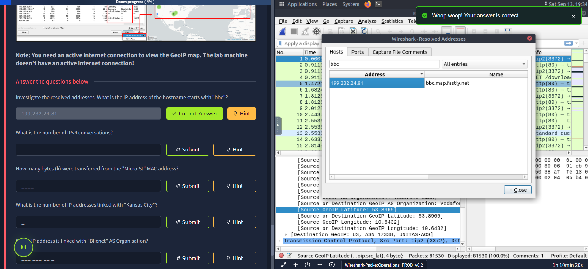

✅ **Question:** What is the IP address of the hostname starting with `bbc`?  
**Answer:** `199.232.24.81`

---

### Protocol Hierarchy 🌲
- Breaks down **all protocols** into a hierarchical view.  
- Displays **counters and percentages**, showing overall usage of services.  
- Analysts can right-click → filter on the protocol of interest.  
- Menu path: `Statistics → Protocol Hierarchy`  

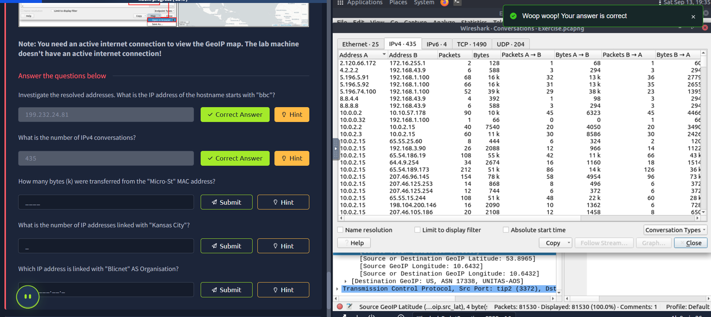

✅ **Question:** What is the number of IPv4 conversations?  
**Answer:** `435`

---

### Conversations 💬
- Represents **traffic flows** between two specific endpoints.  
- Available in five formats: Ethernet, IPv4, IPv6, TCP, UDP.  
- Analysts can identify conversations and pivot to relevant traffic.  
- Menu path: `Statistics → Conversations`  

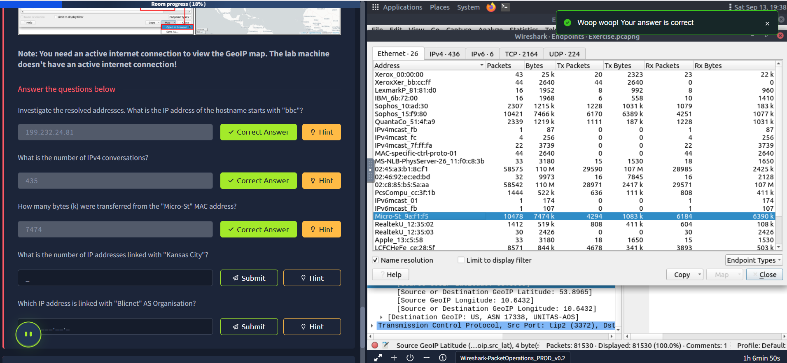

✅ **Question:** How many bytes (k) were transferred from the "Micro-St" MAC address?  
**Answer:** `7474`

---

### Endpoints 🖧
- Similar to Conversations, but focused on **unique endpoints**.  
- Supports Ethernet, IPv4, IPv6, TCP, UDP.  
- Can resolve **MAC addresses** into vendor names.  
- Menu path: `Statistics → Endpoints`  

Additional features:
- **Name Resolution:** Convert IP, MAC, and port numbers into human-readable names.  
- **GeoIP Mapping:** Show geographic info for source/destination IPs (requires MaxMind DB).  

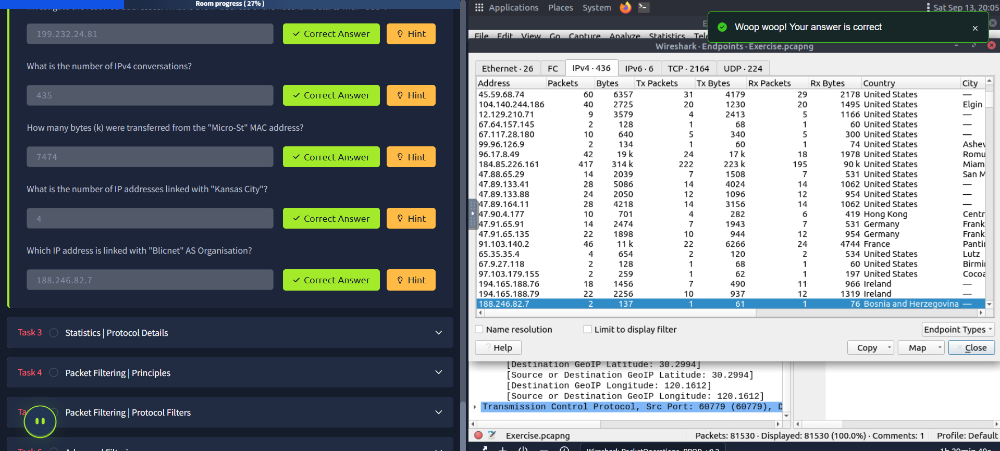

✅ **Question:** What is the number of IP addresses linked with *Kansas City*?  
**Answer:** `4`  

✅ **Question:** Which IP address is linked with *Blicnet* AS Organisation?  
**Answer:** `188.246.82.7`  

---

### Key Takeaways 🧭
- Use **Resolved Addresses** for quick hostname/IP correlation.  
- **Protocol Hierarchy** gives an overview of captured protocols.  
- **Conversations** & **Endpoints** help pivot into specific traffic flows.  
- Enabling **Name Resolution** and **GeoIP** provides richer context.  

-----------------------------------------------------------------------------------------------------------------------------------------
## Wireshark — Protocol Statistics Deep Dive 🔎

In this lesson, I focused on Wireshark’s **protocol-specific statistics** to analyze IPv4/IPv6, DNS, and HTTP traffic. These tools give analysts a structured way to measure protocol activity and spot anomalies. 🚀  

---

### IPv4 & IPv6 Statistics 🌐
- Narrow down statistics by **specific IP version**.  
- Helps list all events linked to either IPv4 or IPv6 in one window.  
- Useful to separate **legacy vs modern traffic** or focus only on the protocol of interest.  
- Menu path: `Statistics → IPvX Statistics`  

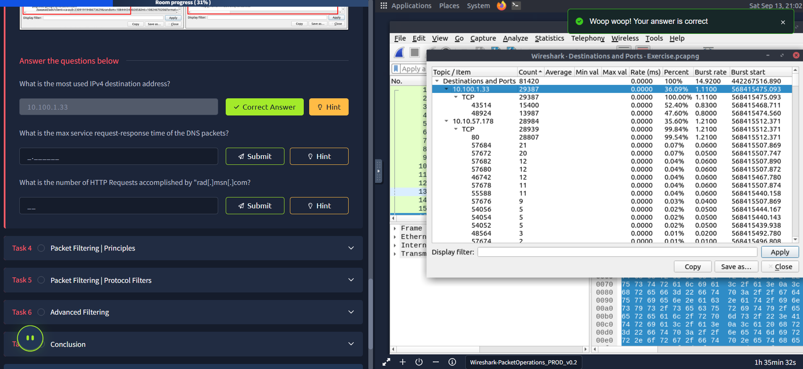

✅ **Question:** What is the most used IPv4 destination address?  
**Answer:** `10.100.1.33`

---

### DNS Statistics 📡
- Breaks down **all DNS packets** in a tree view with counters & percentages.  
- Shows usage by **rcode, opcode, class, query type, service, query stats**.  
- Great for spotting unusual DNS behavior (like failed lookups or odd record types).  
- Menu path: `Statistics → DNS`  

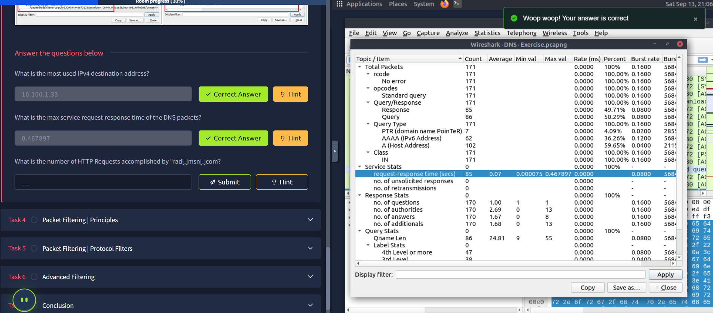

✅ **Question:** What is the max service request–response time of the DNS packets?  
**Answer:** `0.467897`

---

### HTTP Statistics 🌍
- Breaks down **all HTTP packets** in a tree view with counters & percentages.  
- Shows:  
  - Request/Response codes  
  - Original requests  
  - Overall HTTP service usage  
- Menu path: `Statistics → HTTP`  

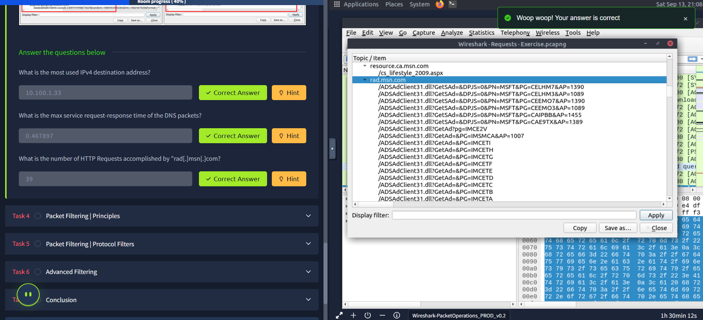

✅ **Question:** What is the number of HTTP requests accomplished by `rad.msn.com`?  
**Answer:** `39`

---

### Key Takeaways 🧭
- **IPvX Stats** let me isolate IPv4 vs IPv6 usage quickly.  
- **DNS Stats** highlight service performance & anomalies in lookups.  
- **HTTP Stats** reveal web traffic activity, request counts, and response codes.  

These protocol-focused views provide a faster way to correlate events with specific services. 🔐  

-----------------------------------------------------------------------------------------------

## Wireshark — Packet Filtering 🎯

In this lesson, I explored **packet filtering** in Wireshark using both **capture filters** and **display filters**. Filtering is one of Wireshark’s most powerful features, allowing analysts to narrow down traffic and focus only on events of interest. 🚀  

---

### Capture Filters 🎥
- Applied **before capturing traffic**.  
- Cannot be changed during capture.  
- Typically used by advanced analysts when they know exactly what traffic to capture.  
- Syntax: uses **scope, direction, protocol**.  

Example:  
(Captures only TCP traffic on port 80).  

Menu path: `Capture → Capture Filters`  

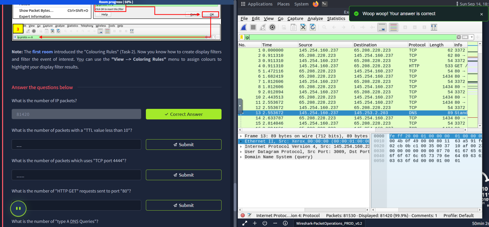

---

### Display Filters 🔍
- Applied **after traffic is captured** (most common usage).  
- Supports **3000+ protocols** and detailed field-level filtering.  
- Can be changed anytime during capture.  
- Syntax: protocol.field operator value.  

Example:  
(Shows all TCP packets with port 80).  

Menu path: `Analyse → Display Filters`  

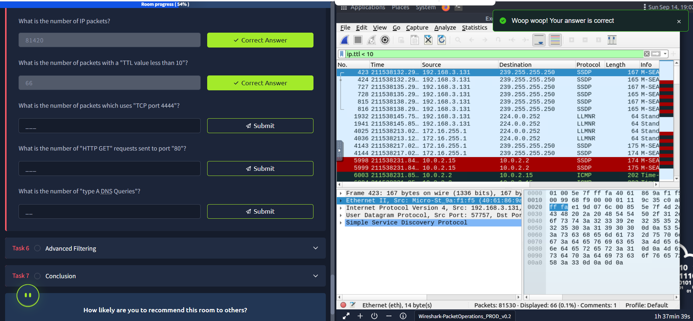

---

### Comparison Operators ⚖️
Wireshark supports both decimal and hexadecimal values.  

- `==` (equal): `ip.src == 10.10.10.100`  
- `!=` (not equal): `ip.src != 10.10.10.100`  
- `>` / `<` (greater / less than): `ip.ttl < 10`  
- `>=` / `<=` (greater/less or equal): `ip.ttl >= 0xFA`  

---

### Logical Expressions 🔗
Filters can be combined with boolean logic:  

- **AND (`&&`)** → `(ip.src == 10.10.10.100) && (ip.dst == 10.10.10.111)`  
- **OR (`||`)** → `(ip.src == 10.10.10.100) || (ip.dst == 10.10.10.111)`  
- **NOT (`!`)** → `!(ip.src == 10.10.10.222)`  

---

### Filter Toolbar 🎨
- **Green** → valid filter.  
- **Red** → invalid filter.  
- **Yellow** → works, but unreliable.  
- Autocomplete helps recall protocol fields.  
- Each protocol field is separated by a **dot**.  

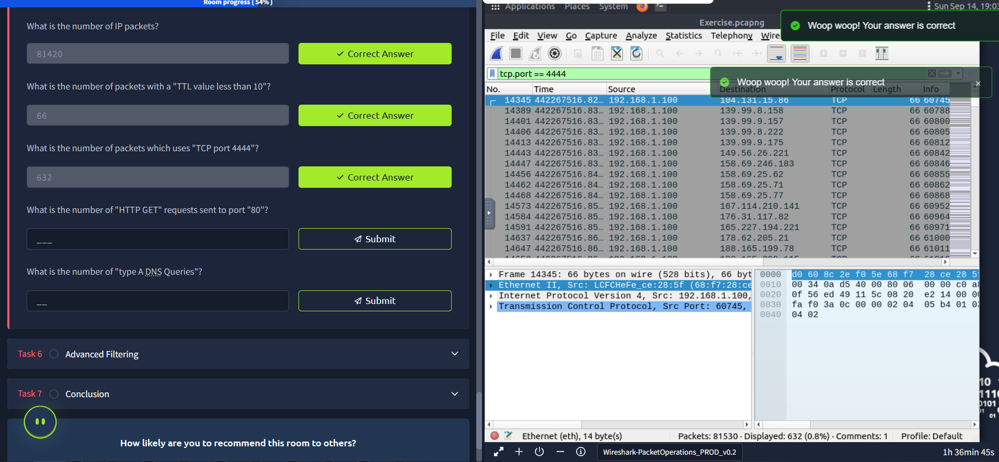

---

### IP Filters 🌐
Common examples:  
- `ip` → all IP packets.  
- `ip.addr == 10.10.10.111` → packets containing this IP.  
- `ip.src == 10.10.10.111` → packets originating from this IP.  
- `ip.dst == 10.10.10.111` → packets sent to this IP.  
- `ip.addr == 10.10.10.0/24` → packets from this subnet.  

---

### TCP & UDP Filters 🔧
- `tcp.port == 80` → all TCP packets on port 80.  
- `udp.port == 53` → all DNS (UDP 53) packets.  
- `tcp.srcport == 1234` → TCP packets from source port 1234.  
- `tcp.dstport == 80` → TCP packets sent to port 80.  

---

### Application Protocol Filters 🌍
- `http` → all HTTP packets.  
- `dns` → all DNS packets.  
- `http.request.method == "GET"` → all HTTP GET requests.  
- `http.response.code == 200` → only successful HTTP responses.  
- `dns.flags.response == 0` → DNS requests.  
- `dns.qry.type == 1` → DNS A records.  

---

### Display Filter Expressions 🧩
- Built-in **filter builder** under `Analyse → Display Filter Expression`.  
- Shows all supported protocols, fields, accepted values, and predefined options.  
- Very useful when you can’t remember exact filter syntax.  

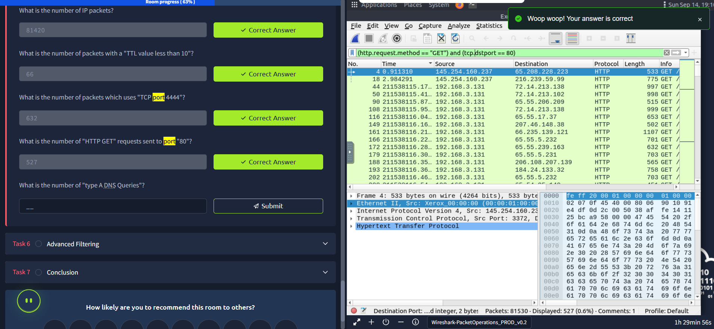

---

### Quick Answers from the Exercise ✅
- **Number of IP packets:** `81420`  

- **Packets with TTL < 10:** `66`  

- **Packets using TCP port 4444:** `632`  

- **HTTP GET requests to port 80:** `527`  

- **DNS "A" record queries:** `51`  
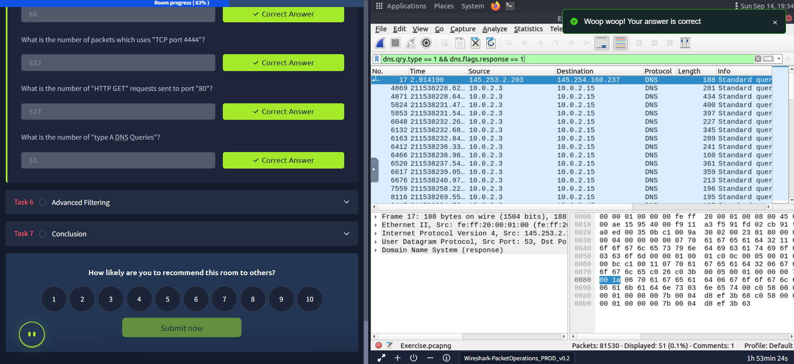

---

### Key Takeaways 🧭
- Use **capture filters** when you want to save only specific traffic.  
- Use **display filters** for flexible packet-level analysis.  
- Combine comparison & logical operators to zoom into events of interest.  
- Leverage **Display Filter Expressions** for building advanced queries.  
- Filtering is the foundation of **efficient Wireshark analysis**.  

---
