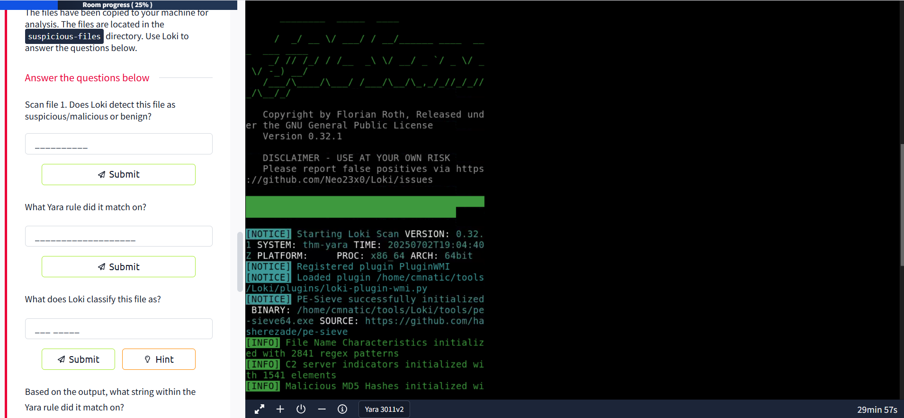
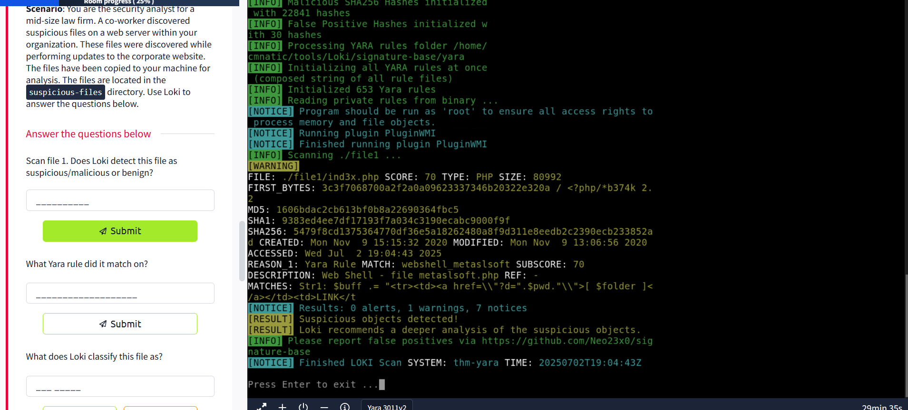
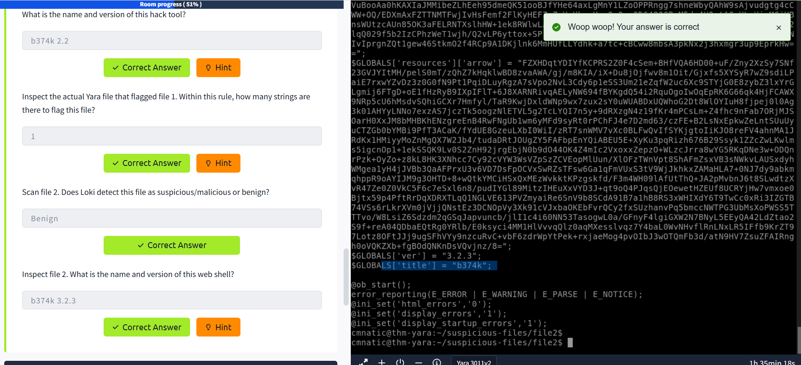
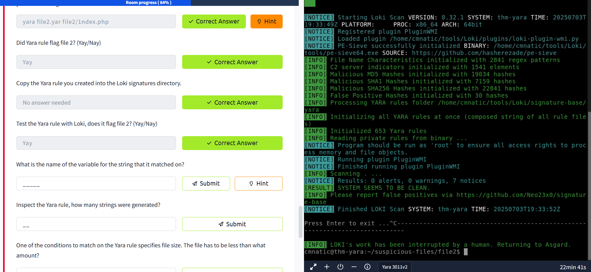

# 🚀 Introduction to Yara

Welcome! In this lesson, you'll build on your basic Linux skills and learn about **Yara**—a powerful tool in information security. This isn't a test, but a hands-on guide to help you experiment and understand how Yara works. 🧑‍💻

> **Fun Fact:** Yara stands for "Yet Another Ridiculous Acronym" and was developed by Victor M. Alvarez (@plusvic) and @VirusTotal.  
> 👉 [Check the GitHub repo here.](https://github.com/VirusTotal/yara)

---

## 🧐 What is Yara?

> "The pattern matching swiss knife for malware researchers (and everyone else)"  
> — Virustotal, 2020

Yara helps you identify information in files using both binary and textual patterns (like hexadecimal values and strings).  
**Yara rules** are used to label these patterns—often to detect if a file is malicious based on its features.

### 💡 Example: Strings in Malware

Just like in programming, malware uses strings to store data. Here are some examples:

| Type        | Data                                 | Description                                 |
|-------------|--------------------------------------|---------------------------------------------|
| Ransomware  | `12t9YDPgwueZ9NyMgw519p7AA8isjr6SMw` | Bitcoin Wallet for ransom payments          |
| Botnet      | `12.34.56.7`                         | IP address of the Command and Control (C&C) |

---

## ❓ Quick Questions

- **What is the name of the base-16 numbering system that Yara can detect?**  
        `hexadecimal` ✅

- **Would the text "Enter your Name" be a string in an application?**  
        `Yay` ✅

---

# 🛠️ Your First Yara Rule


Yara uses its own simple rule language. Every Yara command needs:

1. The rule file you create
2. The file, directory, or process ID to scan

**Example:**  
To use `myrule.yar` on a directory called `somedirectory`:
```bash
yara myrule.yar somedirectory
```
`.yar` is the standard extension for Yara rules.

### ✍️ Let's Create a Basic Rule

1. Create a file:
    ```bash
    touch somefile
    ```
2. Create your first rule file:
    ```bash
    touch myfirstrule.yar
    ```
3. Edit `myfirstrule.yar` and add:
    ```yara
    rule examplerule {
         condition: true
    }
    ```

This rule checks if the file exists. If it does, Yara outputs the rule name.

**Run it:**
```bash
yara myfirstrule.yar somefile
```
If the file exists, you'll see:
```
examplerule somefile
```
If not, you'll get an error.

---

# 🔍 Yara Rule Anatomy

Yara rules have several sections:

| Keyword   | Description                                      |
|-----------|--------------------------------------------------|
| meta      | Descriptive info (doesn't affect the rule logic) |
| strings   | Patterns to search for (text or hex)             |
| condition | The logic that triggers a match                  |

### 📝 Example: Searching for Strings

```yara
rule helloworld_checker {
    strings:
         $hello_world = "Hello World!"
    condition:
         $hello_world
}
```
This matches any file containing "Hello World!".

#### 🔄 Case Variations

To match different cases:
```yara
rule helloworld_checker {
    strings:
         $hello_world = "Hello World!"
         $hello_world_lowercase = "hello world"
         $hello_world_uppercase = "HELLO WORLD"
    condition:
         any of them
}
```
Now, any of those strings will trigger the rule.

---

## ⚙️ Advanced Conditions

You can use operators like `<=`, `>=`, `!=` and combine conditions with `and`, `or`, `not`.

**Example:**
```yara
rule helloworld_checker {
    strings:
         $hello_world = "Hello World!"
    condition:
         #hello_world <= 10
}
```
This matches if "Hello World!" appears 10 times or less.

**Combining Conditions:**
```yara
rule helloworld_checker {
    strings:
         $hello_world = "Hello World!"
    condition:
         $hello_world and filesize < 10KB
}
```
This matches only if the file contains "Hello World!" **and** is smaller than 10KB.

---

## 🧑‍💻 Real-World Yara Usage

Let's see how Yara rules work in practice!  
When you run a rule like the one above, Yara will output the rule name and the file name if there's a match.

```
cmnatic@thm:~$ yara myfirstrule.yar mytextfile.txt
helloworld_textfile_checker mytextfile.txt
```

- The text in the red box is the rule name.
- The text in the green box is the matched file.

---

# 📝 Yara Rule Cheatsheet


Information security researcher **fr0gger_** has created a handy cheatsheet that breaks down and visualizes the elements of a YARA rule (image above, credits to fr0gger_). It's a great reference for getting started!

---

## 🔗 Integrating With Other Libraries

Frameworks like **Cuckoo Sandbox** or Python's **PE Module** can make your Yara rules even more powerful.

### 🐣 Cuckoo Sandbox

Cuckoo is an automated malware analysis environment. It can generate Yara rules based on behaviors it observes, such as runtime strings.

### 🐍 Python PE Module

Python's PE module lets you create Yara rules from the Windows Portable Executable (PE) structure.  
Examining PE files is essential in malware analysis, as you can identify behaviors like cryptography or worming without reverse engineering.

---

## 🛠️ Yara Tools

You don't have to write every rule from scratch! There are many open-source and commercial tools to help you use Yara in threat hunting and incident response.

### 🦸‍♂️ LOKI

LOKI is a free open-source IOC scanner by Florian Roth.  
Detection is based on:

- File Name IOC Check
- Yara Rule Check
- Hash Check
- C2 Back Connect Check

LOKI works on Windows and Linux.  
You can download it [here](https://github.com/Neo23x0/Loki).




### ⚡ THOR Lite

THOR Lite is a multi-platform IOC and YARA scanner, also by Florian Roth.  
It features scan throttling to save CPU resources.  
[Learn more and download here.](https://www.nextron-systems.com/thor-lite/)

### 🐺 FENRIR

FENRIR is a bash script IOC checker by Florian Roth.  
It runs on any system with bash.

### 🤖 YAYA

YAYA (Yet Another Yara Automaton) is an open-source tool by the EFF for managing multiple YARA rule repositories.  
Currently, it runs only on Linux.

---

## 🕵️‍♂️ Using LOKI in Practice

As a security analyst, you may need to gather IOCs from threat intelligence reports and create Yara rules to detect threats.  
LOKI comes with a set of Yara rules to help you scan for threats right away.

Navigate to the Loki directory and run:
```bash
python loki.py -h
```
To update signatures:
```bash
python loki.py --update
```
LOKI's rules are in the `signature-base/yara` directory.

To scan a suspicious file:
```bash
python ../../tools/Loki/loki.py -p .
```

---

## 📝 Scenario: Investigating Suspicious Files

You are a security analyst for a law firm. Suspicious files were found on a web server and copied to your machine for analysis.  
Use LOKI to scan these files and answer the following:

- **Scan file 1. Does LOKI detect it as suspicious/malicious or benign?**  
  🟡 *Suspicious*

- **What Yara rule did it match on?**  
  `webshell_metaslsoft`

- **What does LOKI classify this file as?**  
  🕸️ *Web Shell*

- **What string within the Yara rule did it match on?**  
  `Str1`

- **What is the name and version of this hack tool?**  
  `b374k 2.2`

- **How many strings are in the Yara rule that flagged file 1?**  
  `1`

- **Scan file 2. Does LOKI detect it as suspicious/malicious or benign?**  
  🟢 *Benign*

- **What is the name and version of this web shell?**  
  `b374k 3.2.3`




- **Yara is a powerful pattern-matching tool** used by security professionals to detect malware and suspicious files using custom rules.
- You explored the **structure of a Yara rule**: `meta`, `strings`, and `condition` sections, and how each part contributes to detection.
- You practiced **writing your own basic Yara rules** and running them against files to see how matches are reported.
- You discovered **advanced rule conditions** and how to combine them for more precise detections.
- You learned about **popular tools** that use Yara rules, such as **LOKI**, **THOR Lite**, **FENRIR**, and **YAYA**, and how they fit into real-world threat hunting and incident response workflows.
- You saw how to **scan files with LOKI** and interpret the results, including identifying which rule matched and what string triggered the detection.
- You explored the **challenge of creating Yara rules for new threats** and how tools like **yarGen** can automate rule generation by extracting unique strings from suspicious files.
- You practiced **testing your custom Yara rules** both directly with Yara and through LOKI, ensuring your detection logic works as intended.

---

### 🚦 Key Takeaways

- **Yara rules are essential for malware detection** and can be tailored to your organization's needs.
- **Automation tools** like yarGen save time and help reduce false positives by filtering out common "goodware" strings.
- **Continuous learning and rule refinement** are crucial—always review and improve your rules as you encounter new threats.

---

### 📚 Next Steps

- Try creating your own Yara rules for files you suspect or want to monitor.
- Explore more advanced Yara features, such as modules for PE file analysis or regular expressions.
- Stay updated with the latest threat intelligence and community rule sets to enhance your detection capabilities.

---

Keep experimenting and happy hunting! 🕵️‍♀️🚀

