# Zeek Exercises 🔍

The room invites you a challenge to investigate a series of traffic data and stop malicious activity under different scenarios. Let's start working with Zeek to analyse the captured traffic.

## Prerequisites 📚

We recommend completing the Zeek room first, which will teach you how to use the tool in depth.

A VM is attached to this room. You don't need SSH or RDP; the room provides a "Split View" feature. Exercise files are located in the folder on the desktop. Log cleaner script "clear-logs.sh" is available in each exercise folder.

## Exercise 1: DNS Tunneling Investigation 🕵️‍♀️

An alert triggered: "Anomalous DNS Activity".

The case was assigned to you. Inspect the PCAP and retrieve the artefacts to confirm this alert is a true positive. 

### Answer the questions below 📝

**Investigate the dns-tunneling.pcap file. Investigate the dns.log file. What is the number of DNS records linked to the IPv6 address?**

**Answer:** 320
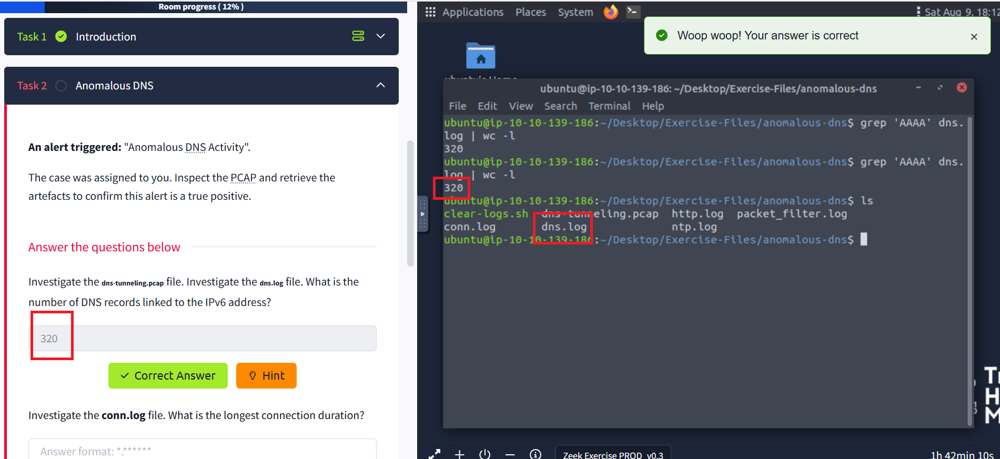
✅ Correct Answer

**Investigate the conn.log file. What is the longest connection duration?**

**Answer:** 9.420791
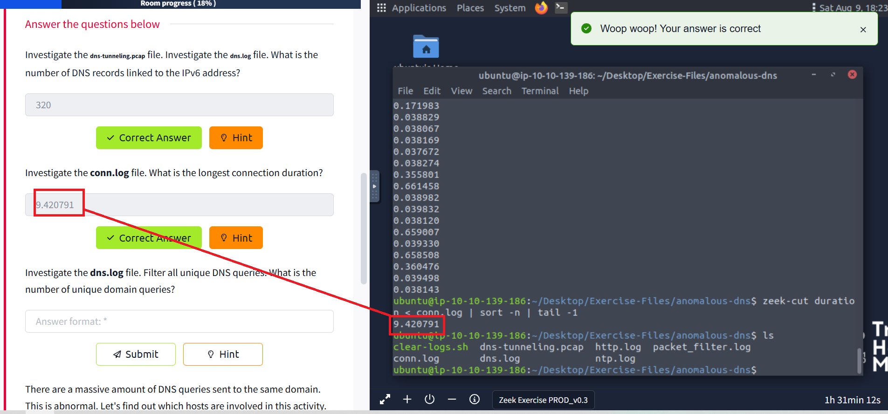
✅ Correct Answer

**Investigate the dns.log file. Filter all unique DNS queries. What is the number of unique domain queries?**

**Answer:** 6
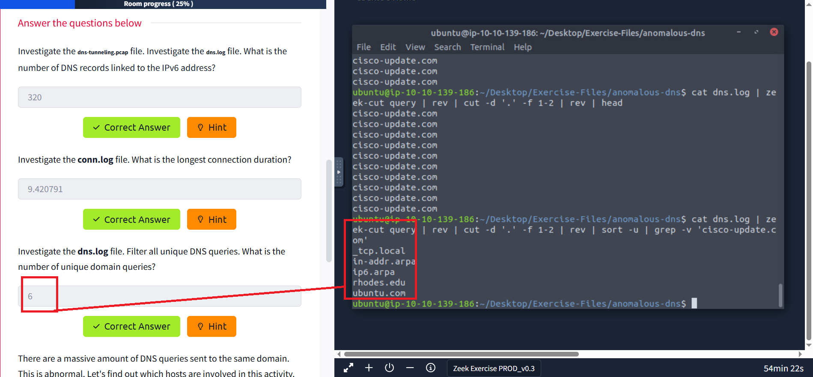
✅ Correct Answer

**There are a massive amount of DNS queries sent to the same domain. This is abnormal. Let's find out which hosts are involved in this activity. Investigate the conn.log file. What is the IP address of the source host?**

**Answer:** 10.20.57.3
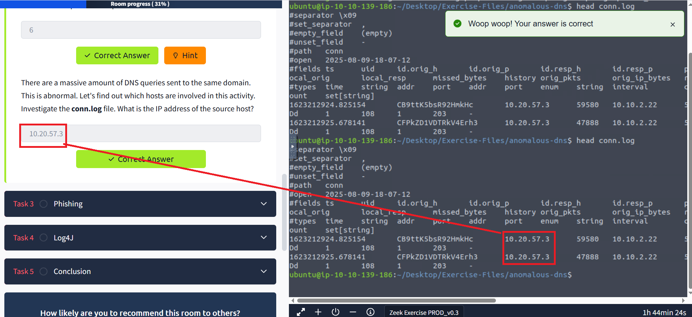
✅ Correct Answer
## Exercise 2: Phishing Investigation 🎣

An alert triggered: "Phishing Attempt".

The case was assigned to you. Inspect the PCAP and retrieve the artefacts to confirm this alert is a true positive. 

### Answer the questions below 📝

**Investigate the logs. What is the suspicious source address? Enter your answer in defanged format.**

**Answer:** 10[.]6[.]27[.]102
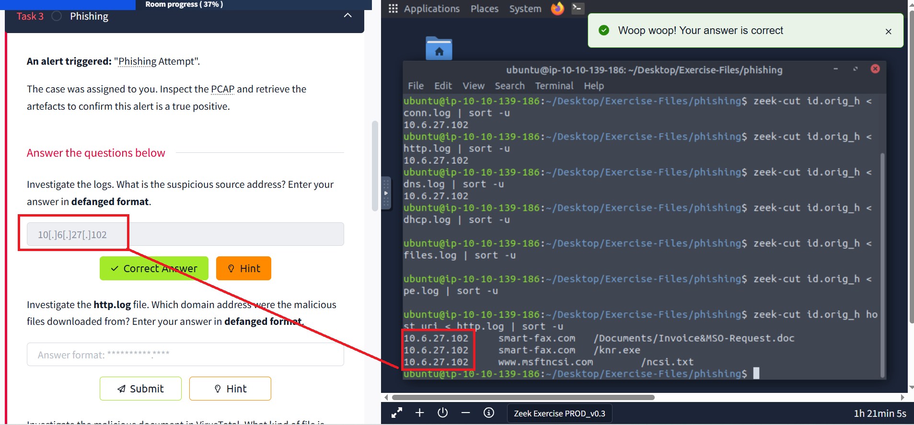
✅ Correct Answer

**Investigate the http.log file. Which domain address were the malicious files downloaded from? Enter your answer in defanged format.**

**Answer:** smart-fax[.]com
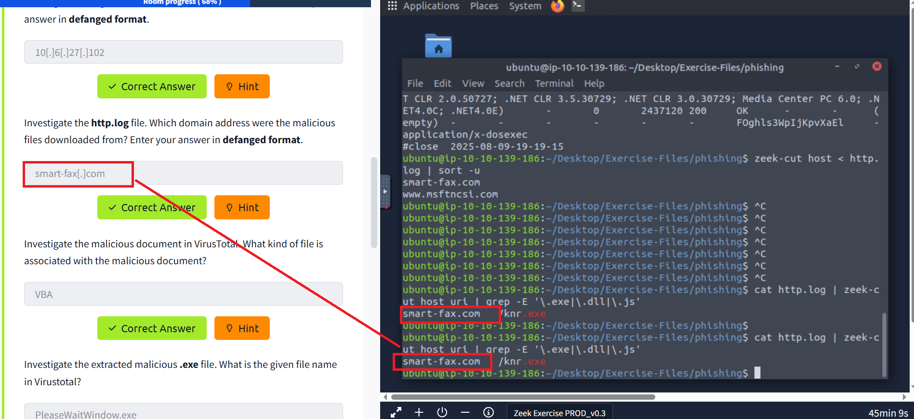
✅ Correct Answer

**Investigate the malicious document in VirusTotal. What kind of file is associated with the malicious document?**

**Answer:** VBA
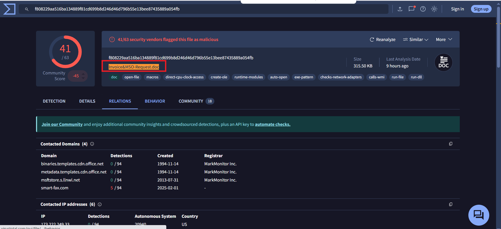
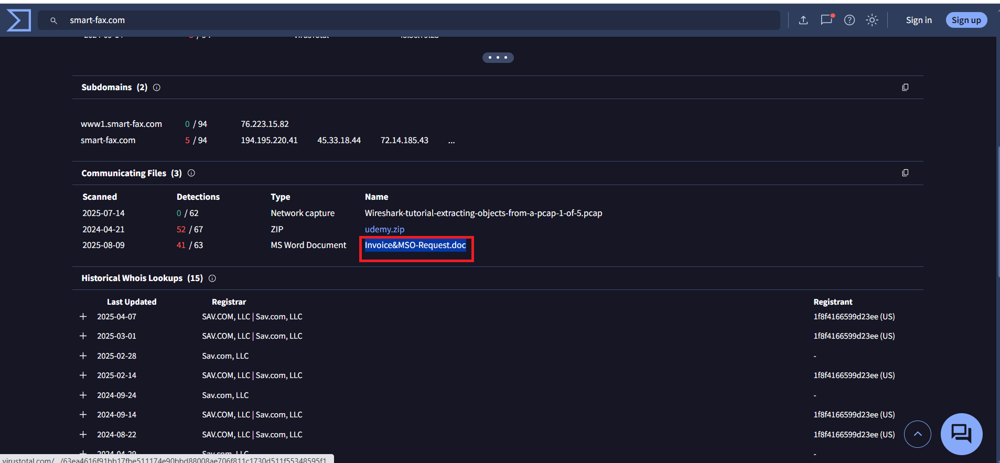
✅ Correct Answer

**Investigate the extracted malicious .exe file. What is the given file name in Virustotal?**

**Answer:** PleaseWaitWindow.exe
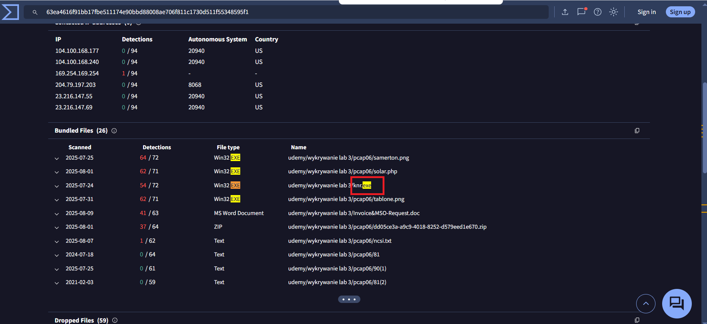
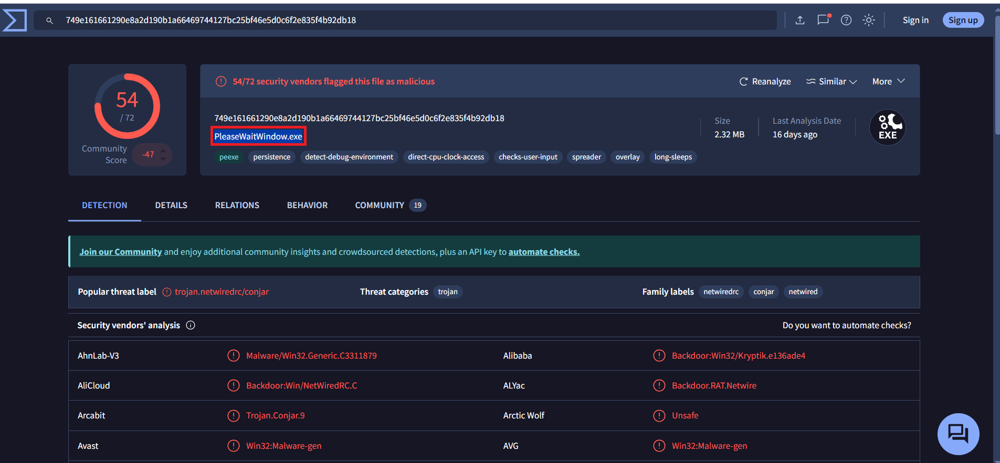
✅ Correct Answer

**Investigate the malicious .exe file in VirusTotal. What is the contacted domain name? Enter your answer in defanged format.**

**Answer:** hopto[.]org
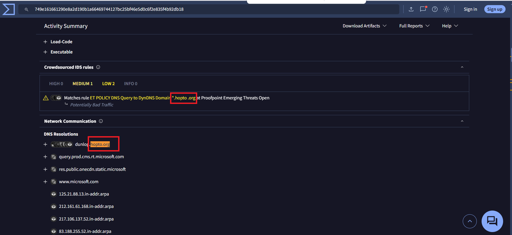
✅ Correct Answer

**Investigate the http.log file. What is the request name of the downloaded malicious .exe file?**

**Answer:** knr.exe
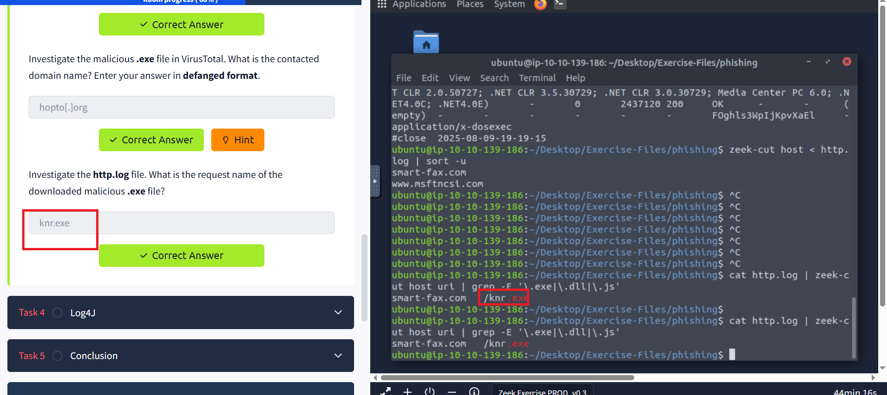
✅ Correct Answer
## Exercise 3: Log4J Exploitation Investigation 🛡️

An alert triggered: "Log4J Exploitation Attempt".

The case was assigned to you. Inspect the PCAP and retrieve the artefacts to confirm this alert is a true positive. 

### Answer the questions below 📝

**Investigate the log4shell.pcapng file with detection-log4j.zeek script. Investigate the signature.log file. What is the number of signature hits?**

**Answer:** 3
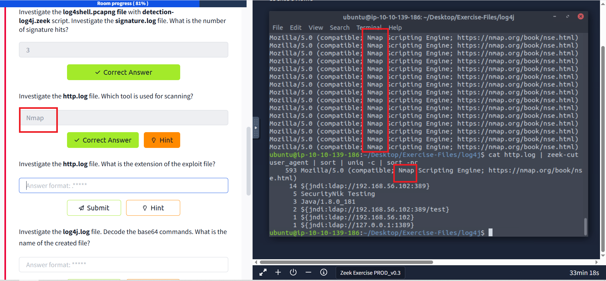
✅ Correct Answer

**Investigate the http.log file. Which tool is used for scanning?**

**Answer:** Nmap

✅ Correct Answer

**Investigate the http.log file. What is the extension of the exploit file?**

**Answer:** .class
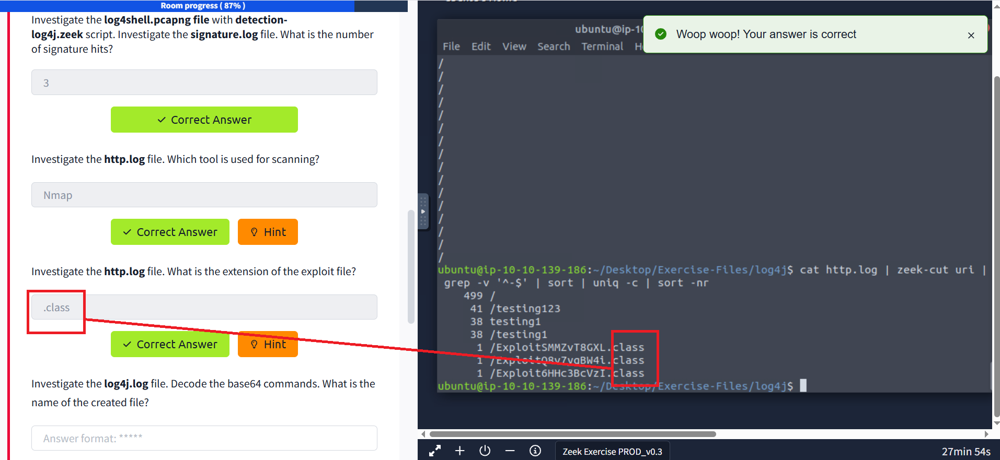
✅ Correct Answer

**Investigate the log4j.log file. Decode the base64 commands. What is the name of the created file?**

**Answer:** pwned
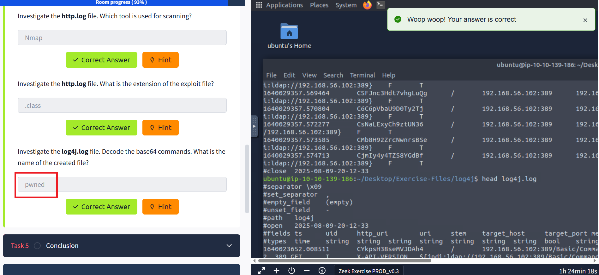
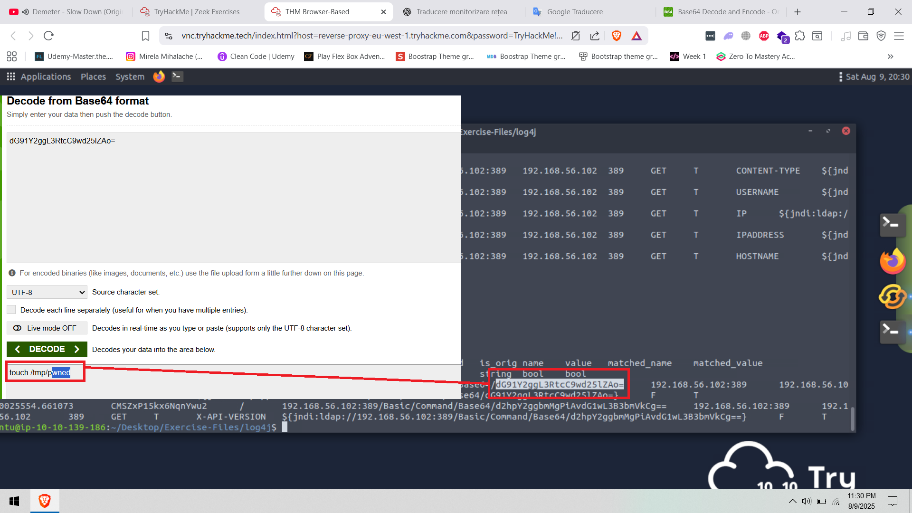
✅ Correct Answer

---

## 🎯 Key Takeaways

Through these exercises, I learned how to:

- **Investigate DNS tunneling attacks** by analyzing connection logs and identifying suspicious patterns
- **Detect phishing attempts** through HTTP log analysis and external threat intelligence tools like VirusTotal
- **Analyze Log4J exploitation attempts** using custom Zeek scripts and signature detection
- **Use Zeek's powerful logging capabilities** to correlate events across multiple log files
- **Apply threat hunting techniques** to confirm true positive alerts and extract IOCs (Indicators of Compromise)

### 🔍 Skills Developed

✅ **Network Forensics**: Analyzing PCAP files with Zeek for security incidents  
✅ **Log Analysis**: Correlating events across dns.log, conn.log, http.log, and signature.log  
✅ **Threat Intelligence**: Using VirusTotal for malware analysis and IOC validation  
✅ **Custom Detection**: Working with specialized Zeek scripts for Log4J detection  
✅ **Incident Response**: Following structured investigation workflows for different attack types

### 🛠️ Tools Mastered

- **Zeek Network Security Monitor**: For comprehensive traffic analysis
- **VirusTotal**: For malware file analysis and threat intelligence
- **Base64 Decoding**: For analyzing obfuscated attack payloads
- **PCAP Analysis**: For investigating captured network traffic

This hands-on experience provided invaluable practice in real-world security incident investigation and response! 🚀
