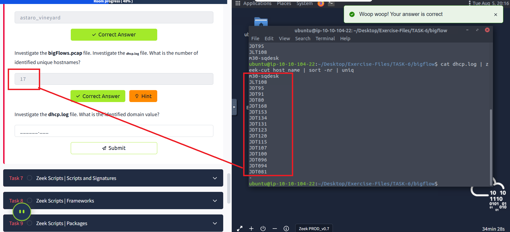

# Zeek 🔍

Zeek (formerly Bro) is an open-source and commercial network monitoring tool (traffic analyser).

## Overview 📋

The official description: "Zeek (formerly Bro) is the world's leading platform for network security monitoring. Flexible, open-source, and powered by defenders." "Zeek is a passive, open-source network traffic analyser. Many operators use Zeek as a network security monitor (NSM) to support suspicious or malicious activity investigations. Zeek also supports a wide range of traffic analysis tasks beyond the security domain, including performance measurement and troubleshooting."

This room aims to provide a general network monitoring overview and work with Zeek to investigate captured traffic. This room will expect you to have basic Linux familiarity and Network fundamentals (ports, protocols and traffic data). We suggest completing the "Network Fundamentals" path before starting working in this room.

A VM is attached to this room. You don't need SSH or RDP; the room provides a "Split View" feature. Exercise files are located in the folder on the desktop. Log cleaner script "clear-logs.sh" is available in each exercise folder.

## Introduction to Network Monitoring Approaches 🌐

Network monitoring is a set of management actions to watch/continuously overview and optionally save the network traffic for further investigation. This action aims to detect and reduce network problems, improve performance, and in some cases, increase overall productivity. It is a main part of the daily IT/SOC operations and differs from Network Security Monitoring (NSM) in its purpose.

### Network Monitoring 🔧

Network monitoring is highly focused on IT assets like uptime (availability), device health and connection quality (performance), and network traffic balance and management (configuration). Monitoring and visualising the network traffic, troubleshooting, and root cause analysis are also part of the Network Monitoring process. This model is helpful for network administrators and usually doesn't cover identifying non-asset in-depth vulnerabilities and significant security concerns like internal threats and zero-day vulnerabilities. Usually, Network Monitoring is not within the SOC scope. It is linked to the enterprise IT/Network management team.

### Network Security Monitoring 🛡️

Network Security Monitoring is focused on network anomalies like rogue hosts, encrypted traffic, suspicious service and port usage, and malicious/suspicious traffic patterns in an intrusion/anomaly detection and response approach. Monitoring and visualising the network traffic and investigating suspicious events is a core part of Network Security Monitoring. This model is helpful for security analysts/incident responders, security engineers and threat hunters and covers identifying threats, vulnerabilities and security issues with a set of rules, signatures and patterns. Network Security Monitoring is part of the SOC, and the actions are separated between tier 1-2-3 analyst levels.

## What is ZEEK? 🤔

Zeek (formerly Bro) is an open-source and commercial passive Network Monitoring tool (traffic analysis framework) developed by Lawrence Berkeley Labs. Today, Zeek is supported by several developers, and Corelight provides an Enterprise-ready fork of Zeek. Therefore this tool is called both open source and commercial. The differences between the open-source version and the commercial version are detailed here.

Zeek differs from known monitoring and IDS/IPS tools by providing a wide range of detailed logs ready to investigate both for forensics and data analysis actions. Currently, Zeek provides 50+ logs in 7 categories.

## Zeek vs Snort ⚖️

While both are called IDS/NIDS, it is good to know the cons and pros of each tool and use them in a specific manner. While there are some overlapping functionalities, they have different purposes for usage.

| Tool | Zeek | Snort |
|------|------|-------|
| **Capabilities** | NSM and IDS framework. It is heavily focused on network analysis. It is more focused on specific threats to trigger alerts. The detection mechanism is focused on events. | An IDS/IPS system. It is heavily focused on signatures to detect vulnerabilities. The detection mechanism is focused on signature patterns and packets. |
| **Cons** | • Hard to use.<br>• The analysis is done out of the Zeek, manually or by automation.<br>• Hard to detect complex threats. | • Easy to read logs.<br>• Easy to write rules.<br>• Cisco supported rules.<br>• Community support. |
| **Pros** | • It provides in-depth traffic visibility.<br>• Useful for threat hunting.<br>• Ability to detect complex threats.<br>• It has a scripting language and supports event correlation. | • Easy to read logs.<br>• Easy to write rules.<br>• Cisco supported rules.<br>• Community support. |
| **Common Use Case** | • Network monitoring.<br>• In-depth traffic investigation.<br>• Intrusion detecting in chained events. | • Intrusion detection and prevention.<br>• Stop known attacks/threats. |

## Zeek Architecture 🏗️

Zeek has two primary layers; "Event Engine" and "Policy Script Interpreter". The Event Engine layer is where the packets are processed; it is called the event core and is responsible for describing the event without focusing on event details. It is where the packages are divided into parts such as source and destination addresses, protocol identification, session analysis and file extraction. The Policy Script Interpreter layer is where the semantic analysis is conducted. It is responsible for describing the event correlations by using Zeek scripts.

## Zeek Frameworks 🔧

Zeek has several frameworks to provide extended functionality in the scripting layer. These frameworks enhance Zeek's flexibility and compatibility with other network components. Each framework focuses on the specific use case and easily runs with Zeek installation. For instance, we will be using the "Logging Framework" for all cases. Having ide on each framework's functionality can help users quickly identify an event of interest.

### Available Frameworks 📚

| Logging | Notice | Input | Configuration | Intelligence |
|---------|--------|-------|---------------|--------------|
| Cluster | Broker Communication | Supervisor | GeoLocation | File Analysis |
| Signature | Summary | NetControl | Packet Analysis | TLS Decryption |

You can read more on frameworks here.

## Zeek Outputs 📊

As mentioned before, Zeek provides 50+ log files under seven different categories, which are helpful in various areas such as traffic monitoring, intrusion detection, threat hunting and web analytics. This section is not intended to discuss the logs in-depth. The logs are covered in TASK 3.

Once you run Zeek, it will automatically start investigating the traffic or the given pcap file and generate logs automatically. Once you process a pcap with Zeek, it will create the logs in the working directory. If you run the Zeek as a service, your logs will be located in the default log path. The default log path is: `/opt/zeek/logs/`

## Working with Zeek ⚙️

There are two operation options for Zeek. The first one is running it as a service, and the second option is running the Zeek against a pcap. Before starting working with Zeek, let's check the version of the Zeek instance with the following command: `zeek -v`

Now we are sure that we have Zeek installed. Let's start the Zeek as a service! To do this, we need to use the "ZeekControl" module, as shown below. The "ZeekControl" module requires superuser permissions to use. You can elevate the session privileges and switch to the superuser account to examine the generated log files with the following command: `sudo su`

Here we can manage the Zeek service and view the status of the service. Primary management of the Zeek service is done with three commands; "status", "start", and "stop".

### ZeekControl Module 🎛️

```
root@ubuntu$ zeekctl
Welcome to ZeekControl 2.X.0
[ZeekControl] > status
Name         Type       Host          Status    Pid    Started
zeek         standalone localhost     stopped
[ZeekControl] > start
starting zeek ...
[ZeekControl] > status
Name         Type       Host          Status    Pid    Started
zeek         standalone localhost     running   2541   13 Mar 18:25:08
[ZeekControl] > stop
stopping zeek ...
[ZeekControl] > status
Name         Type       Host          Status    Pid    Started
zeek         standalone localhost     stopped
```

You can also use the "ZeekControl" mode with the following commands as well;

```
zeekctl status
zeekctl start 
zeekctl stop 
```

The only way to listen to the live network traffic is using Zeek as a service. Apart from using the Zeek as a network monitoring tool, we can also use it as a packet investigator. To do so, we need to process the pcap files with Zeek, as shown below. Once you process a pcap file, Zeek automatically creates log files according to the traffic.

In pcap processing mode, logs are saved in the working directory. You can view the generated logs using the `ls -l` command.

### ZeekControl Module 🎛️

```
root@ubuntu$ zeek -C -r sample.pcap 

root@ubuntu$ ls -l
-rw-r--r-- 1 ubuntu ubuntu  11366 Mar 13 20:45 conn.log
-rw-r--r-- 1 ubuntu ubuntu    763 Mar 13 20:45 dhcp.log
-rw-r--r-- 1 ubuntu ubuntu   2918 Mar 13 20:45 dns.log
-rw-r--r-- 1 ubuntu ubuntu    254 Mar 13 20:45 packet_filter.log 
```

Main Zeek command line parameters are explained below;

| Parameter | Description |
|-----------|-------------|
| `-r` | Reading option, read/process a pcap file. |
| `-C` | Ignoring checksum errors. |
| `-v` | Version information. |
| `zeekctl` | ZeekControl module. |

Investigating the generated logs will require command-line tools (cat, cut, grep sort, and uniq) and additional tools (zeek-cut). We will cover them in the following tasks.

## Answer the questions below 📝

Each exercise has a folder. Ensure you are in the right directory to find the pcap file and accompanying files. Desktop/Exercise-Files/TASK-2

**No answer needed**

**What is the installed Zeek instance version number?**

4.2.1


**What is the version of the ZeekControl module?**

2.4.0


**Hint: Investigate the "sample.pcap" file. What is the number of generated alert files?**

8


## Zeek Logs 📋

Zeek generates log files according to the traffic data. You will have logs for every connection in the wire, including the application level protocols and fields. Zeek is capable of identifying 50+ logs and categorising them into seven categories. Zeek logs are well structured and tab-separated ASCII files, so reading and processing them is easy but requires effort. You should be familiar with networking and protocols to correlate the logs in an investigation, know where to focus, and find a specific piece of evidence.

Each log output consists of multiple fields, and each field holds a different part of the traffic data. Correlation is done through a unique value called "UID". The "UID" represents the unique identifier assigned to each session.

### Zeek logs in a nutshell 📊

| Category | Description | Log Files |
|----------|-------------|-----------|
| **Network** | Network protocol logs. | conn.log, dce_rpc.log, dhcp.log, dnp3.log, dns.log, ftp.log, http.log, irc.log, kerberos.log, modbus.log, modbus_register_change.log, mysql.log, ntlm.log, ntp.log, radius.log, rdp.log, rfb.log, sip.log, smb_cmd.log, smb_files.log, smb_mapping.log, smtp.log, snmp.log, socks.log, ssh.log, ssl.log, syslog.log, tunnel.log. |
| **Files** | File analysis result logs. | files.log, ocsp.log, pe.log, x509.log. |
| **NetControl** | Network control and flow logs. | netcontrol.log, netcontrol_drop.log, netcontrol_shunt.log, netcontrol_catch_release.log, openflow.log. |
| **Detection** | Detection and possible indicator logs. | intel.log, notice.log, notice_alarm.log, signatures.log, traceroute.log. |
| **Network Observations** | Network flow logs. | known_certs.log, known_hosts.log, known_modbus.log, known_services.log, software.log. |
| **Miscellaneous** | Additional logs cover external alerts, inputs and failures. | barnyard2.log, dpd.log, unified2.log, unknown_protocols.log, weird.log, weird_stats.log. |
| **Zeek Diagnostic** | Zeek diagnostic logs cover system messages, actions and some statistics. | broker.log, capture_loss.log, cluster.log, config.log, loaded_scripts.log, packet_filter.log, print.log, prof.log, reporter.log, stats.log, stderr.log, stdout.log. |

Please refer to Zeek's official documentation and Corelight log cheat sheet for more information. Although there are multiple log files, some log files are updated daily, and some are updated in each session. Some of the most commonly used logs are explained in the given table.

| Update Frequency | Log Name | Description |
|------------------|----------|-------------|
| Daily | known_hosts.log | List of hosts that completed TCP handshakes. |
| Daily | known_services.log | List of services used by hosts. |
| Daily | known_certs.log | List of SSL certificates. |
| Daily | software.log | List of software used on the network. |
| Per Session | notice.log | Anomalies detected by Zeek. |
| Per Session | intel.log | Traffic contains malicious patterns/indicators. |
| Per Session | signatures.log | List of triggered signatures. |

This is too much protocol and log information! Yes, it is true; a difficulty of working with Zeek is having the required network knowledge and investigation mindset. Don't worry; you can have both of these and even more knowledge by working through TryHackMe paths. Just keep the streak!

### Brief log usage primer table 📋

| Overall Info | Protocol Based | Detection | Observation |
|--------------|----------------|-----------|-------------|
| conn.log | http.log | notice.log | known_host.log |
| files.log | dns.log | signatures.log | known_services.log |
| intel.log | ftp.log | pe.log | software.log |
| loaded_scripts.log | ssh.log | traceroute.log | weird.log |

You can categorise the logs before starting an investigation. Thus, finding the evidence/anomaly you are looking for will be easier. The given table is a brief example of using multiple log files. You can create your working model or customise the given one. Make sure you read each log description and understand the purpose to know what to expect from the corresponding log file. Note that these are not the only ones to focus on. Investigated logs are highly associated with the investigation case type and hypothesis, so do not just rely only on the logs given in the example table!

The table shows us how to use multiple logs to identify anomalies and run an investigation by correlating across the available logs.

- **Overall Info**: The aim is to review the overall connections, shared files, loaded scripts and indicators at once. This is the first step of the investigation.
- **Protocol Based**: Once you review the overall traffic and find suspicious indicators or want to conduct a more in-depth investigation, you focus on a specific protocol.
- **Detection**: Use the prebuild or custom scripts and signature outcomes to support your findings by having additional indicators or linked actions.
- **Observation**: The summary of the hosts, services, software, and unexpected activity statistics will help you discover possible missing points and conclude the investigation.

Remember, we mention the pros and cons of the Zeek logs at the beginning of this task. Now let's demonstrate the log viewing and identify the differences between them.

**Recall 1**: Zeek logs are well structured and tab-separated ASCII files, so reading and processing them is easy but requires effort.

**Recall 2**: Investigating the generated logs will require command-line tools (cat, cut, grep sort, and uniq) and additional tools (zeek-cut).

### Opening a Zeek log with a text editor and built-in commands 📝


The above image shows that reading the logs with tools is not enough to spot an anomaly quickly. Logs provide a vast amount of data to investigate and correlate. You will need to have technical knowledge and event correlation ability to carry out an investigation. It is possible to use external visualisation and correlation tools such as ELK and Splunk. We will focus on using and processing the logs with a hands-on approach in this room.

In addition to Linux command-line tools, one auxiliary program called zeek-cut reduces the effort of extracting specific columns from log files. Each log file provides "field names" in the beginning. This information will help you while using zeek-cut. Make sure that you use the "fields" and not the "types".

| Tool/Auxiliary Name | Purpose |
|-------------------|---------|
| Zeek-cut | Cut specific columns from zeek logs. |

Let's see the "zeek-cut" in action. Let's extract the uid, protocol, source and destination hosts, and source and destination ports from the conn.log. We will first read the logs with the cat command and then extract the event of interest fields with zeek-cut auxiliary to compare the difference.

### zeek-cut usage example 💻

```
root@ubuntu$ cat conn.log 
...
#fields	ts	uid	id.orig_h	id.orig_p	id.resp_h	id.resp_p	proto	service	duration	orig_bytes	resp_bytes	conn_state	local_orig	local_resp	missed_bytes	history	orig_pkts	orig_ip_bytes	resp_pkts	resp_ip_bytes	tunnel_parents
#types	time	string	addr	port	addr	port	enum	string	interval	count	count	string	bool	bool	count	string	count	count	count	count	set[string]
1488571051.943250	CTMFXm1AcIsSnq2Ric	192.168.121.2	51153	192.168.120.22	53	udp	dns	0.001263	36	106	SF	-	-0	Dd	1	64	1	134	-
1488571038.380901	CLsSsA3HLB2N6uJwW	192.168.121.10	50080	192.168.120.10	514	udp	-	0.000505	234	0	S0	-	-0	D	2	290	0	0	-

root@ubuntu$ cat conn.log | zeek-cut uid proto id.orig_h id.orig_p id.resp_h id.resp_p 
CTMFXm1AcIsSnq2Ric	udp	192.168.121.2	51153	192.168.120.22	53
CLsSsA3HLB2N6uJwW	udp	192.168.121.10	50080	192.168.120.10	514
```

As shown in the above output, the "zeek-cut" auxiliary provides massive help to extract specific fields with minimal effort. Now take time to read log formats, practice the log reading/extracting operations and answer the questions.

## Answer the questions below 📝

Each exercise has a folder. Ensure you are in the right directory to find the pcap file and accompanying files. Desktop/Exercise-Files/TASK-3

**No answer needed**

**Investigate the sample.pcap file. Investigate the dhcp.log file. What is the available hostname?**

Microknoppix


**Investigate the dns.log file. What is the number of unique DNS queries?**

2


**Investigate the conn.log file. What is the longest connection duration?**

332.319364


## CLI Kung-Fu: What I Practiced Today 💻

Today I discovered why **CLI skills are crucial** for network security analysis. While GUIs are helpful for quick tasks, when dealing with massive amounts of network data, command-line tools are much more powerful and stable.

The key insight: **What if there's no GUI button for what you need to find?**

I practiced manipulating data at the command line - an essential skill for any security analyst. When working with packets and logs, you need CLI tools, Berkeley Packet Filters (BPF), and regular expressions to extract the information you're looking for.

### CLI Commands I Mastered Today 📚

**Basic Commands I Used:**
- `history` - View command history
- `!10` - Execute the 10th command in history  
- `!!` - Execute the previous command

**File Reading Skills:**
- `cat sample.txt` - Read entire files
- `head sample.txt` - Read first 10 lines
- `tail sample.txt` - Read last 10 lines

**Data Filtering & Processing:**
- `cat test.txt | cut -f 1` - Extract specific fields
- `cat test.txt | grep 'keywords'` - Filter by keywords
- `cat test.txt | sort` - Sort alphabetically
- `cat test.txt | sort -n` - Sort numerically
- `cat test.txt | uniq` - Remove duplicates
- `cat test.txt | wc -l` - Count lines
- `cat test.txt | nl` - Show line numbers

**Advanced Text Processing:**
- `cat test.txt | sed -n '11p'` - Print specific lines
- `cat test.txt | awk 'NR == 11 {print $0}'` - Advanced line selection
- `cat signatures.log | zeek-cut uid src_addr dst_addr` - Extract Zeek log fields

**Useful Combinations I Learned:**
- `sort | uniq` - Remove duplicate values
- `sort | uniq -c` - Count occurrences
- `sort -nr` - Sort numerically in reverse
- `grep -v 'test'` - Exclude matching lines
- `grep -rin Testvalue1 * | column -t | less -S` - Search and format output

## Zeek Signatures: My Hands-On Experience 🛡️

I learned that **Zeek signatures** are powerful rules for detecting network anomalies. Unlike Snort rules, Zeek signatures aren't the primary detection method - they work alongside Zeek's scripting language to chain multiple events and find interesting activities.

### Signature Structure I Understood 📋

Every Zeek signature has three parts:
- **Signature ID**: Unique name for the rule
- **Conditions**: 
  - **Header**: Filter by IP addresses, ports, protocols
  - **Content**: Filter by packet payload patterns
- **Action**: Create logs and trigger scripts when matches occur

### Signature Components I Worked With 🔍

**Header Filters:**
- `src-ip` and `dst-ip` - Source and destination IPs
- `src-port` and `dst-port` - Port numbers
- `ip-proto` - Protocol (TCP, UDP, ICMP, etc.)

**Content Filters:**
- `payload` - Raw packet data
- `http-request` - HTTP requests
- `http-request-header` - HTTP headers
- `ftp` - FTP command inputs

**Comparison Operators:** `==`, `!=`, `<`, `<=`, `>`, `>=`

### Running Zeek with Signatures ⚙️

I practiced the command:
```bash
ubuntu@ubuntu$ zeek -C -r sample.pcap -s sample.sig
```

Where:
- `-C` ignores checksum errors
- `-r` reads the PCAP file
- `-s` uses the signature file

## Practical Exercises I Completed ✅

### Exercise 1: HTTP Password Detection 🔐

I created a signature to detect **cleartext passwords** in HTTP traffic using regex patterns. The rule matched when "password" was found in packet payloads.

**What I did:**
```bash
ubuntu@ubuntu$ zeek -C -r http.pcap -s http-password.sig 
ubuntu@ubuntu$ ls
clear-logs.sh  conn.log  files.log  http-password.sig  http.log  http.pcap  notice.log  packet_filter.log  signatures.log

ubuntu@ubuntu$ cat notice.log  | zeek-cut id.orig_h id.resp_h msg 
10.10.57.178	44.228.249.3	10.10.57.178: Cleartext Password Found!
10.10.57.178	44.228.249.3	10.10.57.178: Cleartext Password Found!

ubuntu@ubuntu$ cat signatures.log | zeek-cut src_addr dest_addr sig_id event_msg 
10.10.57.178		http-password	10.10.57.178: Cleartext Password Found!
10.10.57.178		http-password	10.10.57.178: Cleartext Password Found!
```

**What I discovered:** Both `signatures.log` and `notice.log` provided details about the password detection, including application banners showing where the match occurred.

### Exercise 2: FTP Brute-Force Detection 🚪

I created signatures to detect **FTP brute-force attempts** by monitoring login failures and admin account usage.

**What I found:**
```bash
ubuntu@ubuntu$ zeek -C -r ftp.pcap -s ftp-admin.sig
ubuntu@ubuntu$ cat signatures.log | zeek-cut src_addr dst_addr event_msg sub_msg | sort -r| uniq
10.234.125.254	10.121.70.151	10.234.125.254: FTP Admin Login Attempt!	USER administrator
10.234.125.254	10.121.70.151	10.234.125.254: FTP Admin Login Attempt!	USER admin 
```

**Key insight:** I learned that case-specific signatures (like detecting "admin" accounts) are useful but global signatures (detecting all FTP 530 login failures) are more practical for real-world threat detection.

### Exercise 3: Advanced Signature Analysis 📊

I practiced creating multiple signatures in one file and correlating events:

```bash
ubuntu@ubuntu$ zeek -C -r ftp.pcap -s ftp-admin.sig
ubuntu@ubuntu$ cat notice.log | zeek-cut uid id.orig_h id.resp_h msg sub | sort -r| nl | uniq | sed -n '1001,1004p'
  1001	CeMYiaHA6AkfhSnd	10.234.125.254	10.121.70.151	10.234.125.254: FTP Username Input Found!	USER admin
  1002	CeMYiaHA6AkfhSnd	10.234.125.254	10.121.70.151	10.121.70.151: FTP Brute-force Attempt!	530 Login incorrect.
  1003	CeDTDZ2erDNF5w7dyf	10.234.125.254	10.121.70.151	10.234.125.254: FTP Username Input Found!	USER administrator
  1004	CeDTDZ2erDNF5w7dyf	10.234.125.254	10.121.70.151	10.121.70.151: FTP Brute-force Attempt!	530 Login incorrect.
```

This showed me how to correlate different types of alerts and understand attack patterns.

## Snort vs Zeek: What I Learned 🤔

I discovered that while Zeek was originally called "Bro" and supported Snort rules through a `snort2bro` script, this compatibility is no longer supported after the rebranding to Zeek. The workflows between the two platforms have evolved separately.

## My Practical Assessment Results 📝

**Exercise Location:** Desktop/Exercise-Files/TASK-5

**Question 1:** What is the source IP of the first event?
**My Answer:** 10.10.57.178


**Question 2:** What is the source port of the second event?
**My Answer:** 38712


**Question 3:** What is the total number of sent and received packets from source port 38706?
**My Answer:** 20


**Question 4:** Create the global rule shown in the task and investigate the ftp.pcap file.
Investigate the notice.log. What is the number of unique events?
**My Answer:** 1413


--------------------------------------------------

📄 Zeek Scripting Fundamentals
Zeek uses a powerful event-driven scripting language that helps with automation and correlation of network events.

Zeek script file extension:
.zeek

Default script directories:
  /opt/zeek/share/zeek/base        -> DO NOT MODIFY
  /opt/zeek/share/zeek/site        -> USER SCRIPTS
  /opt/zeek/share/zeek/policy      -> POLICY SCRIPTS

Zeek configuration file path:
  /opt/zeek/share/zeek/site/local.zeek

Example of loading a script in local.zeek:
@load @/script/path

Example of running a Zeek script with a signature:
zeek -C -r sample.pcap -s sample.sig

--------------------------------------------------

📡 TASK-6: DHCP - Hostnames & Domains
Extracting hostname and domain data from DHCP traffic using a Zeek script.

zeek -C -r smallFlows.pcap dhcp-hostname.zeek
cat dhcp.log | grep vinlap01
cat dhcp.log | zeek-cut domain
cat dhcp.log | zeek-cut domain | sort | uniq
cat dhcp.log | zeek-cut domain | sort | uniq | wc -l
cat dhcp.log | zeek-cut host_name | sort | uniq | wc -l

✅ Answers from Investigation:

Domain value for vinlap01: astaro_vineyard


Unique hostnames in bigFlows.pcap: 17


Identified domain: jaalam.net


--------------------------------------------------


